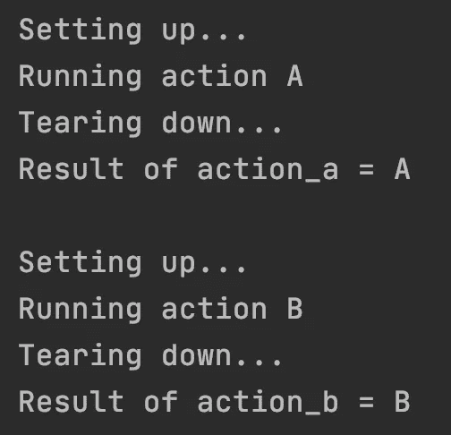
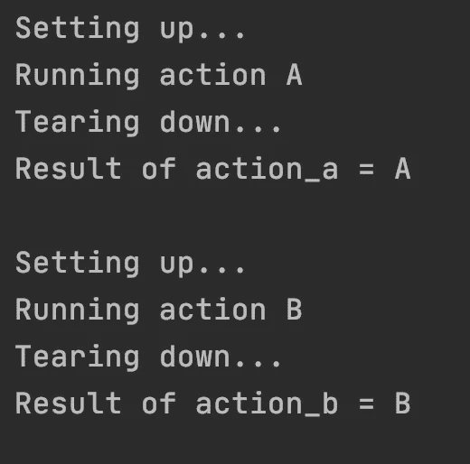

# Python 中的模板方法模式

> 原文：<https://betterprogramming.pub/the-template-method-pattern-in-python-72b7d6e95c96>

## 一种复用软件的简单技术，非常适合 Python 的半功能设计范式

图片来源:[克里斯里德](https://unsplash.com/@cdr6934)来自 [Unsplash](https://unsplash.com/photos/ieic5Tq8YMk)

你是不是一个 Python 开发人员，发现自己一遍又一遍地复制粘贴相同的代码，然后稍微修改一下就得到不同的函数？

在他的开创性著作《[干净的代码](https://www.amazon.com/Clean-Code-Handbook-Software-Craftsmanship/dp/0132350882)》，[鲍伯·马丁](https://twitter.com/unclebobmartin)认为代码重复对任何应用程序来说都是非常不健康的，开发者应该尽一切努力避免代码重复。我将要向您介绍的模式是在面对仅在细节上不同的多个方法实现时可以做到这一点的方式之一。

尽管这种技术在面向对象的社区中是众所周知的，但是像 Java 这样的语言的面向对象特性要求函数接口和 lambda 表达式形式的非平凡的样板代码开销来使模式工作。这通常会阻碍开发人员将模式投入使用，即使底层条件要求这样做。

另一方面，Python 对函数式编程范式的本地支持使得模板方法模式的实现非常顺利，因此，当一个人有机会不使用它时，粉碎了所有可能的借口。

# 你将如何从这篇文章中受益？

完成本文后，您将了解何时以及如何在 Python 中实现模板方法模式，以及如何为基于 Python 的应用程序编写更简洁、更易维护的代码。

# 何时使用模板方法模式

这种技术非常适合有几个函数的情况，每个函数都有一个小的自定义部分(即特定于该函数的代码)和一个相当大的公共部分(即所有函数共享的代码)。

例如，假设您正在构建一个机器学习应用程序，它从数据库中提取数据，然后根据已经训练好的不同模型计算预测。在这种情况下，每个函数将代表一个不同的模型，类似于`predict_logistic_regression()`、`predict_knn()`和`predict_svm()`。

常见的部分可能是从数据库中提取数据，清理数据，从数据中构造一个特征集，一旦做出预测，就将这些数据存储回数据库。定制部分将是实际的结果预测代码，类似于:

`y = model.predict(X)`

`model` 这里的会因方法不同而不同。当函数的数量很大(3、4、5……)，公共部分很重要，而定制部分很小时，这种模式特别有效。

# 简单的例子

遵循编程社区的最佳实践，让我们从一句“Hello，World！”用例。

## 以前

简单来说，我们有两个方法，每个方法都有两行公共部分和一行自定义部分。

在使用模板方法之前

运行代码将产生:

脚本前输出

在成功地识别了两个函数的非平凡的公共部分之后，让我们看看如何将这个共享逻辑提取到一个模板方法中，以在保留原始功能的同时减少整个程序中的代码重复。

## 在...之后

这就是 Python 对函数式编程的支持发挥作用的地方。很酷的一点是，在 Python 中，函数可以像任何其他 ole 对象一样作为参数传递，没有任何额外的样板文件开销。

因此，我们的模板方法将只是公共逻辑——在中间，我们运行作为参数传递的定制部分。

在使用模板方法之后

运行代码验证结果是否与之前相同:

脚本前输出

看看`action_a`和`action_b`的实现有多简单。如果您打算在将来添加更多的动作，您将能够专注于它们的定制部分，而不用担心，例如，关闭一个 DB 连接。

事实证明，这是一个巨大的好处，尤其是在建设大型项目时。其实还有很多其他的好处，让我们仔细看看。

# 为什么要使用模板方法模式

出于我们分析的目的，让我们假设您的程序需要 *N* 个不同的函数，每个函数都有一个自定义部分的 *X* 行和一个公共部分的 *Y* 行代码。

通过实现该模式，除了让您感觉像个专家之外，您的应用程序还将从以下三个实实在在的好处中获益:

## 需要编写的代码更少

假设你有五个函数，都有十行的通用部分和十行的自定义部分。你的程序有多少行？

`N * (X + Y) = 5 * (10 + 10) = 100`

另一方面，如果您将公共部分提取到模板方法中，那么您的程序将具有:

`N * X + Y = 5*10 + 10 = 60`

这是一个显著的进步。当方法实现 *(N)* 的数量增加时，节省的代码行数量变得更加明显。根据我的经验，这种情况经常发生。

## 需要维护的代码更少

在软件工程中，需求不断变化。想象一下，一个新的业务特性请求迫使您更改公共实现部分的五行代码。假设与上一段中的设置相同，如果这发生在您迁移到模板方法实现之前，您必须更改 25 行代码——5 行代码位于 5 个不同的位置。

使用模板方法，您只需修改一次代码，也就是说，您只需在一个地方修改五行代码。这一点非常重要，因为每当你触摸某个正常工作的东西时，你就冒着它停止工作的风险。通常，在部署快速修复和新特性时，您希望最小化干预点。

另外，请记住，当您接触 *N* 不同的方法时，在理想世界中，您还应该为每一个 *N* 方法添加适当的单元测试覆盖率。这不仅令人讨厌，而且你会创建更多的重复代码([Bob 叔叔](https://twitter.com/unclebobmartin)会不高兴的！).使用模板方法，您只需为公共部分编写一次单元测试。

## 需要记忆的代码更少

例如，让我们假设一旦完成计算，每个 *N* 方法都需要关闭一个数据库连接。这意味着，您需要在每个实现的末尾包含`connection.close()`行。

如果你曾经写过一个相当大的软件项目，你就会知道忘记包含这样一行代码是多么容易。您还知道，像这样的无意遗漏可能会导致幽灵般的错误，这些错误会在您最意想不到的时候悄悄出现，迫使您在将来花很长时间来查找和修复问题。

在 template method 模式中，template 方法用于封装来自自定义逻辑的样板文件，因此，它将您从枯燥的公共部分中解放出来。您只需在模板方法的末尾编写一次`connection.close()`，您就可以完全忘记这一行，专注于自定义实现，这是大部分值所在的地方。

# 现实世界的例子

为了展示该模式在实践中的好处，让我们看一下我最近添加到我的交易引擎项目中的一个类。该类的目的是封装对外部交易 API 的调用，用于下单和取消订单等操作。

每种方法都有一个重要的共同点。然后，这个复杂的逻辑被提取到一个`__run_with_log(api_name, api_call)`模板方法中，这个逻辑包括登录到一个控制台，将日志存储到一个数据库中，以及在特定服务器响应的情况下处理重试。

然后，在每个 API 包装函数中，人们只关注准备特定的请求。实际的调用被委托给模板方法，这确保了枯燥但重要的样板代码得到执行。

真实世界的例子

注意模板方法`__run_with_log(api_name, api_call)`有多冗长。每当我添加一个新的 API 调用时，都必须复制并粘贴它，这有多烦人？我希望这能为该模式的有用性提供一个有说服力的案例。

# 结论

恭喜你！到目前为止，您已经准备好使用模板方法模式使您的 Python 代码更加整洁。如果您很乐意将新知识付诸实践，这里有一些示例用例供您探索:

*   **单元测试:**测试环境初始化和模拟实例化进入模板方法
*   **数据库访问:**数据库连接的初始化和关闭进入模板
*   **详细日志记录:**日志语句前后进入模板

感谢您阅读我的文章。黑客快乐！

# 资源

*   [GitHub](https://github.com/TomasDavidYe/design-patterns-python/tree/master/template_method) 本文
*   亚马逊上的[【干净代码](https://www.amazon.com/Clean-Code-Handbook-Software-Craftsmanship/dp/0132350882)
*   [罗伯特·c·马丁(鲍勃大叔)在推特上](https://twitter.com/unclebobmartin)