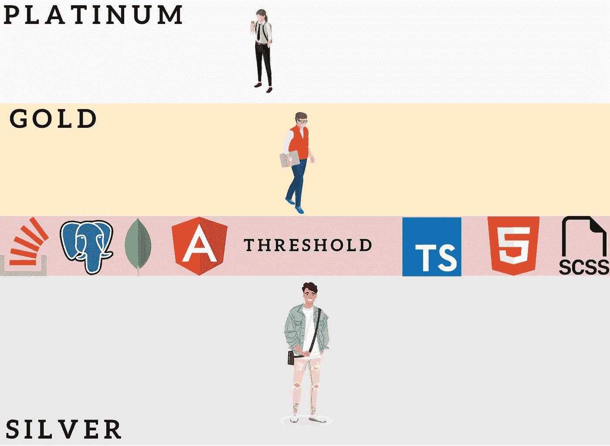

# 术语“初级”和“高级”开发人员需要彻底检查——这里有一个更好的模型

> 原文：<https://betterprogramming.pub/the-terms-junior-and-senior-developer-needs-an-overhaul-heres-a-better-model-a6e9c0ae49cf>

## 一个通过表现来表彰每一个开发者的提议


想一想你可能认识的几乎不能独立工作的高级开发人员。他们连一张票都解决不了，还得一直得到(初级)同事的帮助。

前辈是一个声望头衔，一旦获得，就不会重新评价。

这导致了一个事实，公司经常错误地分配术语——初级和高级。或许你也是。

当根据年龄和经验而不是性能对开发人员进行分组时，这些词就变得空洞了。

不要误解我，我喜欢我获得的高级徽章和将开发人员分成不同类别或阶层的好处。毕竟，潜在的概念是帮助公司以更小的风险获得更高的软件质量。

为了获得一个人技能的安全评估，可以通过将它分成银、金和白金开发者来应用一个更好的模型。

如果你的公司仍然使用初级和高级型号，不用担心。你可以随时将本文中的模型应用到你自己或你的团队中，并建立对符合技术世界最新要求的技能组合的认识。

最终，这也会让你在求职面试时信心大增。任何一个面试伙伴通常都会说经典的“啊，是的，你只有一年的工作经验。那么，我们不能付给你更多。”

# 简短的历史课——它从何而来？


## 起源

初级和高级这两个术语意味着根据年龄和经验的划分。

这个概念在管理咨询领域是众所周知的。毕业生普遍经验不多。他们通常是初级顾问。当他们获得经验后，他们就成为高级顾问。

这在这个领域可能行得通，但不适合技术世界。

## 不正确的应用

在软件开发中，几乎每周都会发生变化。

一旦任何人获得了高级开发人员的地位，他们通常会在以后的生活中保持这一地位。新技术、新平台、新框架不断涌现。这种情况导致在最新的项目中不断移动知识障碍。

结果往往是，一个高年级学生不再符合基线，因为他们在特定领域存在短缺。

现实打击更大。

不仅大部分高级人员不符合知识基线，而且公司经常使用这些开发人员类别作为一种认可形式。主要通过*降低/提高*的薪水。

# 我个人的问题，也是你的问题

这种划分是模范的，应该保留，但必须改变。

细分不应该是对年长同事的认可，也不应该是软件开发中的一种地位或一种薪酬模式。

相反，它应该奖励那些满足必备技术基线的开发者。

这就是为什么我认为这种细分只是剥夺，通常是不透明的，因此对软件质量没有太大意义。

# 为什么行业会把初级和高级分开？

初级开发人员是危险的，高级开发人员是资产。

## 一个例子是解释这种差异的最佳方式:

想象两个开发人员在一个项目上工作。初级开发人员和高级开发人员。

初级开发人员对这份工作来说相对较新，可能刚从学校/大学毕业。

如果初级开发人员现在在应用程序中实现功能，这当然是可行的。但没那么容易:

*   由于缺乏经验，时间会更长
*   他们可能还需要更有经验的同事的帮助
*   应用程序中的功能很可能没有被可持续地实现(由于缺乏软件设计和软件架构的知识)

上述三个复杂因素导致代码不可重用、不可交换、不可进化。

另一方面，高级开发人员已经拥有多年的专业经验。他们甚至在同一家公司呆了几年，这发展了他们工具和领域的知识。此外，他们还熟悉软件设计和软件架构领域。

如果这个开发者在项目中实现了一个特性:

*   他们很可能会快速实现它
*   它们还将使功能可维护
*   它们还将使函数进一步可展
*   他们也将使功能可修改

换句话说:一个高级开发人员倾向于可持续地实现一个特性/功能。

但事实总是如此吗？

# 等等…不要把所有人都放在一起

你的想法浮现在我的脑海里:“我是一名大三学生，但我远没有成为项目的危险，相反，我丰富了它。”

我见过一些初级开发人员实现了高级开发人员基于技能的决心。连我也是其中之一。当我在我以前的公司里换了一个职位，我正式成为一名初级开发人员(大约被雇佣了 2 年)，但是因为我在 web 开发方面更好，我指导我的新团队(由三名高级开发人员组成)一些他们不知道的事情。

也许你知道高级开发人员很难独自工作。他们连一张票都解决不了，还得一直得到(初级)同事的帮助。我过去也经历过这种情况。

你会把一个 50 岁的高级开发人员“降级”为初级开发人员吗？

我知道这样的情况。然而，这并不是因为这种阶级制度本身，而是因为它在大多数公司被滥用。这里有一个正确的例子:

我要做一份自由职业者的工作。虽然我有将近八年的工作经验，但我的项目合作伙伴是否将我视为资深员工？不，他们没有，我也没有。在 Rust 的世界里，我是个该死的小三。我只研究了 Rust 的官方书籍，并做了一些书中告诉我的示例应用。

那是什么意思？每一个被重新归类为低年级学生的高年级学生都有可能更快地越过某些门槛。

这就是更好方法的关键词:阈值！

# 如何用门槛做得更好

## 重新定义答案

是什么让一个初级开发者成为高级开发者？


我相信开发人员需要的工具箱，因此开发人员必须掌握什么来提高项目的质量。

这正是任何开发人员必须跨越的边界。

知识和经验低于这个基线的开发人员是初级开发人员。超过基线意味着成为一名高级开发人员。

值得注意的是，这个基线是灵活的。可以随时在基线中添加或删除单个点。


假设一个或多个高级开发人员在基线被调整后不再满足基线。在这种情况下，他们必须被重新归类为初级开发人员。否则，无法保证继续安全地进行项目。

# 一个有用且适用的提议

如果积极调整，坚持以项目为基础的划分是好的。

引入三个类别来评估任何开发人员的工作:

*   银
*   金色的
*   铂

这种重新命名乍一看似乎没有意义，也很花哨，但它让一件事情变得简单得多，也更不剥夺:

它脱离了年龄和经历的层面。

毕竟新入门的开发者(20 岁的开发者)可能因为私人项目或者实践学习已经是金牌开发者了。这些私人项目是我所有工作面试的重要部分——甚至是我给三个高级开发人员讲授 web 开发的那次。

## 门槛是你衡量开发者素质的工具

它必须是可调的。

例如，当项目增长，使用更多技术时，进入门槛更高，因此门槛必须移动。因此，有必要将你的开发人员分为有风险的、可持续的和无风险的。



可能会发生这样的情况，大量金牌开发者突然降级为银牌开发者，仅仅是因为基线已经改变。这没关系。他们在行业中的年龄或时间与这种划分无关。

> 你认为有人会因为做某件事时间够长就自动变好吗？想想你认识的开车技术不好的人。现在，想想他们做了多久？你看到了吗？即使几十年也不能保证你擅长某事。

从软件质量的角度来看，最重要的是透明性。即使这一个也清楚地向你展示了谁能够向项目交付质量。

## 团队领导/公司目标


任何团队或公司都应该在项目团队中拥有尽可能多的金牌开发人员。

对于白金级开发人员，您可以实现一定的规律性——例如，每半年——所有团队成员指定一个或多个最近取得显著成就的开发人员。

例如，他们在一个项目中表现突出，对团队来说特别有利可图，或者其他一些原因。

这些白金级开发人员将在一段时间内保留其身份，并可在此期间享受某些优惠:

*   奖金支付
*   会议出席率
*   无工作日
*   更多远程工作
*   无论你想给他们什么好处

# 结论

我认为现在的大三大四划分申请是错误的。

它没有代表它应该代表的东西。

与开发人员正在从事的项目相比，它与开发人员的基本体验是脱节的。学长是一个不用刷新的威望头衔。将开发人员分成不同的类别仍然是在提高软件质量的同时降低项目风险的好方法。但是你必须通过使用的技术来衡量它。

关键的区别是不要根据年龄和经验而不是性能对开发人员进行分组。

尽管这些毫无疑问是必不可少和值得称赞的方面，但这并不适用于软件质量。

银级、金级和白金级开发人员基于透明基线的方法实现了一个可见且可触及的前进障碍。

最后但并非最不重要的是，它让年轻和有才华的开发人员留在他们应该在的地方，从而更加公平。

```
[Get 8 long-lasting golden rules for successful developers that are your guidance through learning to code and climb the cooperate ladder.](https://arnoldcodeacademy.ck.page/8rulesforsuccessfuldevelopers)
```