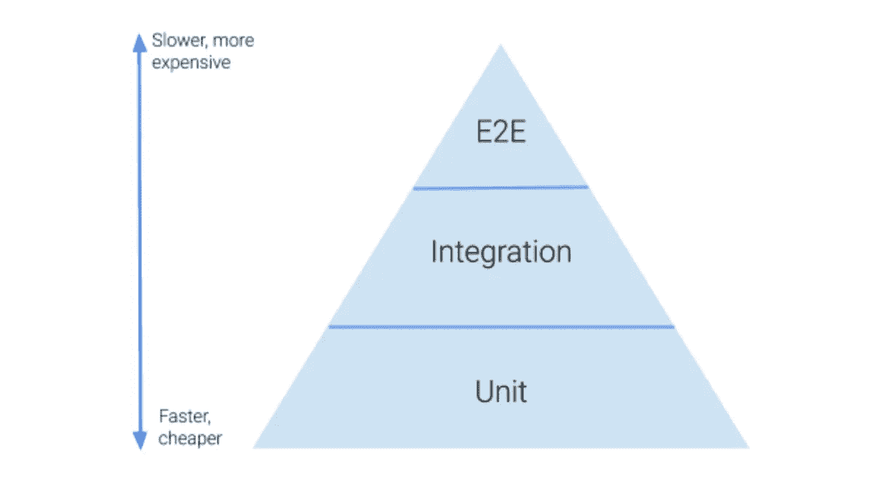
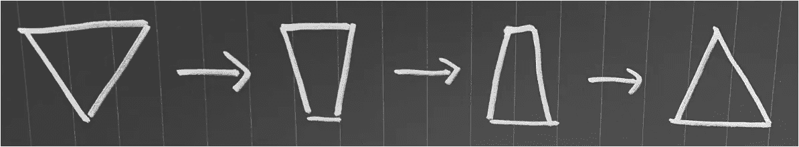

# 测试金字塔

> 原文：<https://betterprogramming.pub/the-test-pyramid-80d77535573>

## 关于测试金字塔、端到端测试和从无到有实现高测试覆盖率的思考。

测试金字塔的概念被认为对开发者和 QA 社区都非常重要。传统的软件测试是高度手工的，这意味着测试应用程序需要付出巨大的努力。自动化测试是这个行业的重大变革，为了指导你完成这个过程，Mike Cohn 在《敏捷的成功之路》中提出了测试金字塔的概念。

测试金字塔是软件行业中广泛使用的标准，涉及不同类型的测试，以及每种类型有多少个测试。它类似于一个测试组合。它已经存在很长时间了，特别是马丁·福勒在 2012 年写了一篇关于它的[文章](https://martinfowler.com/bliki/TestPyramid.html)。阅读更多关于[实践测试金字塔](https://martinfowler.com/articles/practical-test-pyramid.html)的信息。

测试金字塔

# 理想情况下，套件中应该有多少个端到端(e2e)测试？

在回答这个问题之前，我们必须了解什么是用户之旅。用户旅程是用户与应用程序交互的步骤。

例如，一个典型的在线服装店客户用户旅程可能如下:

*   转到主页，导航到一个服装类别
*   将“项目 1”添加到购物车
*   将“项目 2”添加到购物车
*   查看购物车
*   增加“项目 1”的数量
*   从购物车中移除“项目 2”
*   去检查购物车
*   创建一个帐户以便结帐
*   输入送货和帐单地址以及付款细节
*   下订单
*   转到管理您的订单
*   等等。

端到端(e2e)测试用于模拟用户旅程。所以这个问题的答案是另一个问题— *在您的应用程序中有多少用户旅程*？

剧透:没有神奇的正确数字。理想情况下，这个数字应该*越小越好*。事实上，鉴于 e2e 测试是基于你的用户旅程，这应该高度依赖于你拥有的用户角色数量。基于上面的购物网站示例，您可能有一个客户用户旅程测试(按照上面示例中的步骤)和一个管理员用户旅程测试。管理员用户旅程测试可能包含客户无权执行的步骤，可能如下所示:

*   转到主页
*   以管理员身份登录
*   转到管理查询
*   选择一个查询并提交回复
*   转到管理项目
*   添加项目
*   等等。

相比之下，有一个测试只测试*结账*功能，另一个测试用于*创建账户*，另一个测试用于*管理订单*。这种测试设置是不可取的，因为这意味着我们有一个 e2e 测试的数量增加，正如测试金字塔指出的，它们是昂贵的。

# 现有的代码库呢？

您加入了一个新项目，作为设置的一部分，您克隆了存储库并开始探索代码库。突然，你意识到几乎没有测试！可能对你们中的一些人(实际上对我自己)来说很惊讶，这是我不止一次发现自己的情况，这就是为什么我现在写下它。

在这种情况下，测试“金字塔”根本不是金字塔——它甚至不是一个形状。作为团队*中致力于交付高质量软件*的一员，你的下一步是什么(不管你是技术负责人、QA、分析师还是开发人员)？

嗯，一个首席 QA 曾经告诉我(在声明这个场景是一个绝对的灾难之后),人们应该首先关注创建用户旅程 e2e 测试。这很重要，原因有二。

首先，因为在没有好的测试套件的情况下，团队通常对他们的交付非常没有信心。手动测试成本高昂，难以重复，而且速度很慢。一旦创建了快乐路径 e2e 测试，就可以确信应用程序可以在快乐的情况下工作，而无需每次都进行手动测试。

第二，重构需要一个好的测试套件。没有任何测试，当开发人员重构时，我们永远无法确定我们是否破坏了任何东西。添加一些 e2e 测试将在重构时给我们信心，没有什么是坏的。这就是我们如何改进我们的代码，使它更干净！有反馈总比没有反馈好。

你可能会问:*为什么不从编写单元测试开始呢？*在这些情况下，作为一名开发人员，很难去改进单元测试，尤其是当代码没有考虑到可测试性时。因此，要编写测试，您可能需要重构代码以使其可测试。这产生了一个潜在的风险:没有测试就重构代码意味着功能*的行为可能*改变，即使它是一个小的重构。作为代码库的新手，甚至很难手动*验证预期的行为。*

另一方面，端到端测试是关于用户旅程的——你应该能够从一开始就通过运行现有的用户旅程来编写测试。它们可以在不深入和重构代码的情况下编写。

这是我过去遇到遗留应用程序时犯的一个错误。编写单元测试被证明是困难和麻烦的，因为代码首先不容易测试(在这种情况下，没有使用依赖注入来实现整个应用程序的可测试性)。因此，我们开始重构代码，以使其单元可测试。只有经过思考，我们才明白 e2e 测试是更好的方法，因为我们已经从探索性测试中知道了那些测试是什么样子的。

使用这种方法，通常你在开始看到的是一个倒置的金字塔，严重依赖于 e2e 测试。这叫做“冰淇淋蛋卷”

在这一点上，我们不能忽视集成和单元测试。由于 e2e 测试的运行成本仍然很高，而且在许多情况下都不可靠，因此构建这些测试仍然是当务之急。

我喜欢遵循鲍勃叔叔的“童子军规则”，也就是说，总是让代码保持比你发现它时更好的状态。遵循这条规则，当开发人员创建新的特性和功能时，这些代码应该在正确的级别进行适当的和必要的测试。这既适用于新代码，也适用于旧代码。

> *童子军有一条规则:“永远要让露营地比你发现它的时候干净。”如果你发现地上有脏东西，你就清理干净，不管是谁弄的。你有意为下一批营员改善环境。*
> 
> *——罗伯特·c·马丁(鲍勃大叔)*

随着时间的推移，新的特性或 BAU 任务的出现，越来越多的测试出现在较低的层次上(尤其是单元测试)。

除此之外，覆盖已经在较低级别测试中测试过的场景的 e2e 测试也可以逐渐移除。一个很好的例子是，如果你有 e2e 测试覆盖验证规则(例如，空字段，无效字段)。这些案例可以在较低的层次上被覆盖，比如在单元测试中，从而消除了在 e2e 层次上对这些测试案例的需求。

这个概念延伸到集成测试(与单元测试相比，集成测试的成本更高)。*如果*有可以在单元测试层次*充分覆盖的测试用例*，那么我们可以将测试用例从集成层次转移到单元层次。

对你的测试金字塔的进化的观想

使用这种方法，我们有一个策略来将一个很少测试的代码库转换成一个具有良好测试覆盖率的代码库。冰淇淋蛋卷*经过仔细考虑、严谨和策略*，将变成标志性的测试金字塔。

感谢阅读！我很想知道是否有人见过相似或不同的方法。请在评论里告诉我！