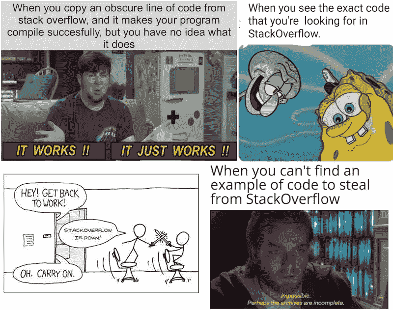

# 我成为高级软件工程师所学到的东西

> 原文：<https://betterprogramming.pub/the-things-i-learned-to-become-a-senior-software-engineer-1083686d70cd>

## 2018 年，我开始在彭博工作。从那以后，事情发生了很大的变化


本杰明·沃罗斯在 [Unsplash](https://unsplash.com?utm_source=medium&utm_medium=referral) 上的照片

2018 年，我开始在彭博工作。从那以后，事情发生了很大的变化。我不再是公司里资历最浅的成员了，我已经指导了不少新工程师，这太棒了。它帮助我观察别人与我的不同之处，吸收他们的最佳实践，并找出我不知不觉中做得相当好的事情。

年度工作回顾是总结我所学到的经验教训的好方法。它们对模式匹配也很有价值。只有当我缩小时，某些图案才变得可见。然后我可以开始[有意识地跟踪这些模式。](https://neilkakkar.com/the-human-log.html)今年的主题是缩小视野，挑战极限。这也是对去年的部分进行放大和添加细微差别。如果你先阅读了去年的回顾，那就更有趣了。

这一切都始于一个问题:我如何进一步成长？

```
**Table of Contents**[Growing Using Different Ladders of Abstraction](#6bcc)
[Learning What People Around Me Are Doing](#015a)
[Learning Good Habits of Mind](#c9f0)
[Thinking Well](#2cf1)
[Strategies for Making Day-to-Day More Effective](#3881)
[Acquiring New Tools for Thought & Mental Models](#fe02)
[Protect Your Slack](#6dfb)
[Ask Questions](#7b00)
[Noticing Confusion](#b1cd)
[Force Multipliers](#d46c)
[On Ownership](#3c28)
[Embrace Fear](#89ea)
[Adding Nuance](#f70f)
[Writing Code](#3503)
[Testing](#6940)
[Design](#5a7c)
[Gathering Requirements](#4d56)
[Some Hacks That Have Worked Very Well for Me](#db4e)
[Super Powers](#111c)
[Some Gotchas With Growing](#2b79)
[Sometimes, I Feel I Need to Know the Answer to Everything](#a3c0)
[Sometimes, I Lose My Cool](#900d)
[Neophilia](#568f)
[Questions](#51f7)
```

# 使用不同的抽象阶梯成长

进入第二年，我已经具备了所有的基本条件。我已经摘完了所有容易摘到的水果，我的生长速度也慢了下来。不太好。我心中最大的问题是“我如何进一步成长？”

要提高我的编码技能，我只能做这么多。大多数博客支持写更干净的代码的技术，重复你自己，不重复你自己，等等。都是微优化。几乎没有一个能让我立刻产生影响力。

不过，我确实发现了一些有见地的东西。我在软件开发生命周期中工作，但是这个生命周期是更大的生命周期的一部分:产品和基础设施开发生命周期。我决定走得更宽而不是更深。令人惊讶的是，这种广度为我所知道的提供了更多的深度。

我从三个大的方向缩小:了解我周围的人在做什么，学习良好的思维习惯，获得新的思维工具。

# 了解我周围的人在做什么

因为我们不在一个封闭的系统中，所以更好地理解产品经理、销售人员和分析师的工作是有意义的。归根结底，这是一个通过产品赚钱的行业。目标不是写代码，而是成为一项有利可图的业务。

大多数大公司不是只做一件事，这意味着同一家公司有不同的赚钱途径。每个人都至少在一条路上，如果不是这样，他们就不会在这里。⁴追踪这些路径，我现在走的这条路非常有价值。它让我明白了我的重要性，以及我可以利用什么样的杠杆来变得更加有效。有时候，这是为了让销售工作变得更容易，这样他们就能卖出更多。其他时候，它是关于为客户建立一个新的功能。还有一些时候，它是关于改进一个不断损坏的特性。

产品经理是这方面的最佳来源。他们知道生意如何赚钱，谁是客户，客户需要什么。一年来，我和路上的每个人都安排了几次会面。这给我的第二个好处是他人工作的背景。它帮助我更好地交流。以正确的方式框定事物是强大的。

例如，一次谈话帮助我理解了为什么销售部门的 Sarah 想要一个批量更新工具。一些公司有很多员工，逐个更新他们是一件痛苦的事情。我写的代码可以减轻莎拉的痛苦。

# 学习良好的思维习惯

软件工程需要好好思考并做出正确的决定。编程就是执行这些决策。思维习惯是你的大脑定期做的事情。这可能是每当你看到 Y 发生时就想到 X，或者将思维工具 X 应用于问题 Y。简而言之，思维习惯有助于更好地思考。我怀疑如果我学会了一般的技能，我应该能够更好地将它应用到软件工程中。

# 好好思考

软件工程是一个很好的练习思考的领域。反馈循环更短，并且测量正确性不需要太长时间。我投身于认知科学研究。这是一项值得探索的永久技能，无论我最终做什么，它都是一种力量倍增器，并在我的一生中带来回报。一个成果是批判性思维的框架。这是复利，复利是强大的。

这件事带来了很多好处，我稍后会谈到。他们值得拥有自己的部分。

# 提高日常工作效率的策略

硬币的另一面是让你思考得更好的习惯。它始于注意到白天的小烦恼，会议中的低效率，然后找出避免它们的策略。这些战略性的改进被低估了。

你决定做什么，然后让它自动运行，释放大脑去想更多有趣的事情。当然，习惯也是如此。我注意到了一些好习惯:

*   不要在没有做出决定/没有下一步行动的情况下离开会议
*   决定由谁来完成这件事。没有主人的事情很难做成。
*   记录项目期间做出的设计决策

这种模式在评估期间变得明显，所以我渴望在明年关注并收集更多的策略。有一个优秀的 scrum 大师让我负责，帮助我更好地遵循这些策略。

# 获取新的思维工具和心智模型

思考的新工具与良好思考有关，但更具体地说是与软件工程有关。思维工具帮助我更好地思考具体的工程问题。

对此，我采取了一种及时的方法。只有当我被困在某件事情上，或者当我发现我的抽象和设计决策不能很好地工作时，我才会寻找新的工具。

例如，我最近在一个有很多复杂业务逻辑的领域中苦苦挣扎。边缘情况是常态，我们希望设计一个系统来干净利落地处理这种情况。那时我读到了域驱动的 Design⁵.我可以立即付诸实践，并产生很大的影响。随后，我更好地掌握了这些概念。我获得了如何创建企业软件的新的思维模式。

我不断学习和获取新心智模型的第二种方式是通过阅读黑客新闻。这些都是有趣的想法，其中一些我已经付诸实践，但这比上面的方法效果差得多。我仍然这样做的唯一原因是[绘制区域图](https://neilkakkar.com/rationality.html#map-and-the-territory)，它让我了解现有的技术，所以当我面临问题时，我知道有一种方法可能会有帮助。

我获得更好心智模型的最后一个方法是学习新的不同语言。分集位很重要。学习 lisp 的另一种方言比学习 C++03(一种函数式编程语言、动态类型语言和 lisp)的好处要少得多。今天， [J 看起来很有趣](https://www.hillelwayne.com/post/j-notation/)，也是我可能会考虑学习的一个。这是我以前没有用过的思维模式。

我从这样做中获得了很多价值。每种语言都有自己的词汇和语法，词汇是一个元心理模型。这是一个新的视角来看待如何做事。

当内存管理在您的控制之下时，您就会理解指针和分配器是如何工作的。当 Python 抽象出这一点时，您会发现复杂性降低了。当函数式语言中的地图和过滤器出现时，您会体会到 Python 的 for 循环是如何改进的。事实上，这就是列表理解。然后你会注意到，使用面向对象编程，有些事情变得更加容易。没有一种神奇的工具能适用于所有情况。然后你就明白了，尽管如此，你也没必要换工具。您可以将最佳实践从一个应用到另一个来解决您的问题:比如编写函数式 javascript。原则比表达方式更重要。

大体上，这就是我今年所做的一切。以下是由于缩小而产生的见解。

# 保护你的懈怠

我说的 slack，不是指公司，是形容词。让我获得高产出和高生产率的一件事是“放慢速度”想要完成更多工作吗？慢点。警告适用，但我的意思是:

我注意到人们急于解决问题。可以是他们以前做过的事情，也可以是我们有模板的事情。砸东西的感觉真好。我以前也做过。然而，在非常特殊的情况下，这是有意义的。⁶

每当我从事新的工作时，我都会花时间去了解我所从事的系统，以及与之密切相关的事物。如果太大，我会尽可能地优化学习。每次我重新审视这个系统，我的目的是了解更多。

当[有懈怠](https://www.lesswrong.com/posts/yLLkWMDbC9ZNKbjDG/slack)的时候，你就有机会去实验、学习和思考事情。这意味着你有足够的时间来完成工作。当没有懈怠的时候，截止日期很紧，你所有的注意力都集中在完成任务上。保护你的懈怠意味着不要让截止日期紧紧缠住你。通常，这和交流一样简单(或困难)。⁷

懈怠可能对“懒鬼”有负面的含义，但是保护懈怠是一种超能力。这是以短期效率为代价的长期投资。当我快速发布故事时，我也很难修复错误。我没有花时间为系统创建合适的心智模型，这意味着我的假设与代码不匹配，而这种不匹配正是大多数错误所在。我保护我的懈怠，所以我可以抽出时间来优先学习事情而不是做事。⁸

我最喜欢的 slack 用例之一是实验。有时候，我会发现一个对我来说毫无意义的 bug。我注意到我很困惑，找到一个关于堆栈溢出的答案，然后继续。然而，这一直困扰着我，直到我明白这个错误。Stack Overflow 回答了一下，但是没有说明我的理解有什么问题。为了建立我的理解，我需要实验。

如果我没有懈怠，我就没有时间去实验，这意味着我必须忘记这个 bug。当有懈怠的时候，我可以进行实验来找出我的理解到底缺失了什么。我喜欢这样的时刻；当我发现这个系统的新东西时。这让我下次更有效率。

# 提问

我们通常不善于提问。要么我们担心他们会让我们看起来很笨，所以我们根本不去问他们，要么我们用冗长的开场白问他们，更多的是关于我们如何不笨，而不是学习更多的东西。

问题是，在你找到答案之前，你不能认为一个问题是愚蠢的。我解决这个问题的方法是声明我会问很多问题。这让我可以从底层开始，修补我理解中的漏洞。积极的团队文化也有帮助。

例如，这是我学习打包软件的旅程:

*   **问**:什么是套餐？
    **答**:是打包在一起的代码，可以安装在系统上。
*   问:为什么我需要包？
    **答**:它们提供了一种一致的方式，让你把所有需要的文件都放在正确的位置。没有他们，事情很容易搞砸。您需要确保每个文件都在它应该在的地方，系统路径都设置好了，并且相关的包都可用。
*   问:软件包与我可以在系统上安装的应用程序有什么不同？答:这是一个非常相似的想法。Windows installer 就像一个帮助安装应用程序的包管理器。同样，`DPKG`和`rpm`包就像是`.exe`，你可以在`apt`和`yum`包管理器的帮助下安装在 Linux 系统上，它们就像是 Windows 的安装程序。
*   我明白了。那么，python 中的这个`setup.py`不知怎么就转换成了一个`dpkg`？这是怎么回事？
    **A** :我们有一个`python-debhelper`运行`setup.py`进行转换。
*   问:哦，真有趣！你怎么知道的？
    **A**:`debian/rules`文件包含如何创建`dpkg`的说明。我看着它想弄明白这一点。

然后我知道我该看文档了。我有足够的片段来理解大纲。事实证明，这并不像我想的那么简单，这也不是一个愚蠢的问题。

这是我养成的思维习惯，你可以随时问一些好问题。大多数问题都与上下文相关，但我确实有一个最喜欢的一般性问题。这叫玩元:你是怎么查出 X 的？

当我问别人一些事情，他们回答了，我接下来要问的是他们是怎么想出来的？这有助于我下次自己做。我在上面这样做了，这让我了解了`debian/rules`文件及其工作原理。

另一个好问题是问什么让你困惑。⁹

# 注意到困惑

一个晴朗的日子，我正在用 Python 处理日期时间。这些是我们的搜索引擎将索引的日期，我们希望它们采用 UTC 格式。因此，我修改了我们的管道，在摄取之前将日期转换为 UTC。这需要使这些日期具有时区意识。

我创建了一个这样的`datetime`:

```
import datetime
from pytz import timezoneindexed_date **=** datetime.datetime(2019, 11, 20, 12, 2, 0, tzinfo**=**timezone('Asia/Kolkata'))
```

在我的测试中，这种转换延迟了 23 分钟。我当时没有注意到，但是看到这个我就很困惑。因此，我将测试偏移修改为-23 分钟，这样测试就能通过。这是一种非常糟糕的思维方式。一旦我注意到这一点，我不能不看到它。有时我仍然会想起我让这件事过去了。当然，有人在公关上评论说“这看起来不对”，这让我摆脱了默认的思维，去找出哪里出了问题。

这是一个相当大的 bug。Pytz 一直拥有时区信息。在 1942 年之前，亚洲/加尔各答的时区是+5:53:20。(是的，甚至城市名称也不同)。当 pytz 时区被传递到一个新日期时，没有参考日期将时区与年份匹配。因此，它默认为第一个可用时区，这是错误的。[医生也提到了这一点。](https://stackoverflow.com/questions/6410971/python-datetime-object-show-wrong-timezone-offset)正确的方法是使用`tzinfo.localize()`，它将日期匹配到适当的时区，因为现在是 pytz 在进行转换。

```
import datetime
from pytz import timezonetz**=**timezone('Asia/Kolkata')
indexed_date **=** tz.localize(datetime.datetime(2019, 11, 20, 12, 2, 0))
```

如果那篇公关评论没有触发我，我是不会发现这件事的。它暴露了这种可怕的思维模式，我把困惑藏在地毯下。从那以后我就一直很警惕。

为了防止这种情况再次发生，我已经开始训练我的“注意肌肉”这叫做注意混乱。不仅仅是在写代码的时候，任何事情都有解释混乱的倾向，把它隐藏起来。每当你听到一些听起来很奇怪的事情，你急于解释为什么它一定是真的，你是在掩盖困惑。

一旦你开始注意到困惑，你可以问是什么让你困惑。在前一节中，这可能听起来很老套，但我希望本文有所帮助。棘手的是注意到什么让你困惑。

# 力量倍增器

在一次精彩的冲刺中，我意外地感受到了原力的力量。

> “原力赋予绝地武士力量。这是所有生物创造的能量场。它围绕着我们，渗透着我们；它将整个星系结合在一起。”
> ――欧比万·克诺比，《星球大战》

我认为欧比万·克诺比发现了一些东西，尽管是在错误的领域。这是我在软件工程中可以利用的东西:成为一个力量倍增器。

那次冲刺我自己也没完成多少。我写了非常有限的代码。相反，我协调何时应该进行哪些更改(这是一个复杂的冲刺)，测试它们是否工作良好，做大量的代码审查，提出替代的设计建议，并尽可能地进行结对编程以使事情不被卡住。我们完成了所有工作，在这种情况下，缩小有助于更容易地为 PRs 做出决策。这是我们最高速度的冲刺之一。

> “原力赋予了工程师力量。是万物创造的能量场。它围绕着我们，渗透着我们；它将代码绑定在一起。”
> —尼尔·卡卡

好吧，我就不做进一步的类比了。

对我来说，弄清楚如何成为一个力量倍增器听起来比 10 个开发者更有价值。在实践中，一个好的力量倍增器(或分割器)是团队文化。正如我可以创造思维习惯来增加我的产出一样，整个团队也可以。这发生在团队文化中。回顾、回顾和实验是团队为塑造文化所做的一切。文化总是在不断变化，团队成员来来去去，加入了他们的个人风格。

赋予权力的文化是力量的倍增器。我之所以能够做到以上这些，是因为我们的文化允许。我们的团队文化着眼于团队在冲刺阶段的产出，而不是个人的产出。这让我可以为团队做更多的事情而优化，而不是只关注我自己。团队塑造文化，文化塑造团队。这个想法甚至延伸到城市和国家:

> “一个不断受到军事威胁的社会将有一种颂扬尚武美德的文化，一个以合作经济为特征的社会将强烈谴责懒惰，一个平等主义的社会将把专横视为一种主要的人格缺陷，一个工作时间表高度严格的工业社会将重视守时，等等。”— [为什么文化会赢](https://www.sciphijournal.org/index.php/2017/11/12/why-the-culture-wins-an-appreciation-of-iain-m-banks/)

# 论所有权

我们在 BNEF 有三个团队，我们共享一个用于自动化测试的 Jenkins 设置。有一个大的詹金斯维护任务即将到来，我选择拥有它。这意味着弄清楚如何做事，安排会议讨论改进和替代方案，最后，协调实施。只是，当我选择拥有它的时候，我不知道我会做这些。我只是觉得这会很有趣。

我在我们的群聊上发消息，谈论我想到的替代方案。谈话很快就结束了，可能是因为每个人都在忙着什么。我注意到了“我不知道我现在应该在这里做什么”的感觉。所以我决定继续我的其他冲刺任务。

我的直觉告诉我“好吧，我尽力了。总有一天会有人回复，然后我们可以继续对话。”我扮演了主人的角色，但没有成为主人。当我注意到这一点时，我很惊讶。这是一种糟糕透顶的管理方式。每个人都在做某件事，那是他们在想的事，不是我的事。所以，我有责任让他们注意到这一点。

在第一次聊天的两天后(这是我反思并发现我错了的时间)，我再次发消息解释了我的决定，以及哪些工作将会移交给哪个团队。这是我第二次感到惊讶:每个人都同意。并不是他们不在乎，只是第一次聊天之后他们就没什么可补充的了。

我非常珍惜这段经历。它教会了我一些重要的习惯:永远跟进，如果你有一项任务，你就有责任推进它。不要停留在扮演角色上，实际上完成任务:通过委派或者自己做。

这也强化了一个元习惯:珍惜惊喜。惊喜是衡量你预测的和实际发生的不匹配程度。这是改变你想法的绝佳机会。

# 拥抱恐惧

好吧，最后一个故事。去年，我在[做了一个失败的兼职项目](https://neilkakkar.com/quickreps.html)。在这个项目中，我学习了一门新语言，一种新的做事方式，并测试了一个产品假设。坚持这个项目出人意料地困难，每当我想起它，我就感到恐惧。

这是一个巨大的感情球，我不能忽视。这让我注意到了同样感觉的微妙痛苦，尤其是在工作中。每当有一项艰巨的任务摆在我面前，而我还不知道如何去做的时候，这种感觉就会悄悄回来。“唉，这怎么可能呢？我还不知道。”

我已经学会拥抱这种感觉。这让我兴奋。是关于我要学什么的信息。我已经走得很远，以至于我开始在[我的人类日志](https://neilkakkar.com/the-human-log.html)“这一周我感到恐惧了吗？”如果答案是没有连续太多周，我已经太舒服了。⁰害怕的是信息。

这种观察大脑活动的元技能是一种强大的监测和诊断工具。就像定期检查系统健康状况的 cron 作业一样，审查检查并改善您的健康状况:精神健康和身体健康。这也正是这篇文章的目的:这是我的年度工作回顾。

# 添加细微差别

如果不对[去年的部分做细微的改动，这篇评论就不完整。](https://neilkakkar.com/things-I-learnt-from-a-senior-dev.html)

# 编写代码



[*来源*](https://programmercave0.github.io/blog/2019/11/28/Memes-on-copy-pasting-code-from-Stackoverflow)

软件工程中有一个有趣的迷因，它将事情简化为从堆栈溢出中复制。当新工程师开始相信迷因时，这是一种危险的模式。发生了很多事情，当我们说“从 SO 复制”时，其中的细微差别就消失了

下面是一个从 SO 复制的例子。假设我试图列出一个生成器的所有排列。然后:

1.  这不是一次编码面试，所以我可以寻找为我做这件事的库。我还不知道用什么。
2.  我谷歌了一下，发现我可以用`itertools.permutations([1,2,3,4])`来生成一个列表的排列。
3.  好的，金色的！所以现在我把生成器转换成一个列表，复制这段代码，然后传入这个列表。我不干了。

现在，假设产品需求是按照字典顺序对这些进行排序。所以我写了一个排序函数来处理列表。除了，它不工作。我发现`permutations`返回一个元组列表，所以我返回到我的排序函数，并将其转换为元组列表。过了一会儿，产品带着新的需求回来了:这些排列太长了，我们想让事情变得更快。不管列表有多大，我们只需要长度为 4 的排列。

呃。好吧。因为我已经有了一个生成所有排列的函数，所以我从每个排列元组中取出前四个元素。我意识到这会导致重复，所以我将这些元组放在一个集合中，然后应用排序函数使它们按正确的顺序排列。现在我完成了。唷，这是一项艰苦的工作，但是嘿，每个人都有点高兴！对于长列表来说，置换函数仍然很慢，所以我在 backlog 中添加了一个条目，以便在某个时候使用它。

如果我花时间去检查一下`itertools.permutations`的文档，去理解它是做什么的，我会注意到:它有一个你想要返回的排列长度的参数。它返回一个元组列表。并且，它以排序的顺序返回它们。此外，输入参数不是一个列表，而是一个 iterable，所以我可以传入生成器。尽管会将[转换成一个元组，所以这无关紧要。](https://docs.python.org/3.7/library/itertools.html#itertools.permutations)

这个例子可能看起来微不足道，但其背后的思维机制却并非如此。我已经注意到，对于足够复杂的 API 和错误命名，这种情况几乎发生在我身上。简而言之，我的原则是“我不写我不懂的代码。”就像“从 SO 复制”模因一样，这条规则也有在翻译中丢失的隐性知识。比如理解代码是什么意思？

至少有三个不同层次的理解:你可能确切地理解`itertools.permutations`会产生什么，你可能理解它是如何做到的，或者在更深的层次上，你可能理解它为什么做出那些实现决策。

第一级是理解函数或 API 做什么。
第二级是理解它是如何做到的(代码)。
第三级是理解为什么它会这样做。

对于设计良好的 API，以及你不想深入学习的东西，1 级就可以了。然而，1 级是最低要求。0 级是我们在上面的例子中看到的，它是有问题的。另一个例子是第一次复制现有的团队模板，这介于 0 和 1 级理解之间。

是的，有一个交换。0 级超级快，而到 3 级要花很多时间。当我不复制粘贴已有的模板时，我会减慢速度。但是当我有足够的懈怠的时候，我选择在我写代码之前获得 1 级的理解。这通常意味着我第一次很慢，但随着时间的推移，我会变得更快。我每次都会加深一点理解，这有助于我快速解决 bug。比起完成任务，我更重视学习。

是的，我有时会违反规则。有些情况需要快速简单的破解。

有时候，开源文档很糟糕。当这种情况发生时，你需要一个 2 级的理解来给你 1 级的理解:你去读源代码。每当我不得不这样做时，我都记得为未来的我保留背景。理解别人的代码是一件很困难的事情，尤其是当它是用你不熟悉的语言写的时候。为不必一次又一次地做这项艰苦的工作而优化。当你发现一些重要的事情时，把它写下来，这就是评论的作用。另外，你的团队会为此感谢你的。这是建立力量倍增器的简单方法。

这很像“保存”信息包。它们是你已经完成的工作单元，所以下次你不用再做了。理解的层次也适用于你的团队所拥有的代码，而不仅仅是你复制粘贴的，或者从其他人那里“继承”的代码。理想情况下，你应该对你团队的代码有 2 级的理解，对你自己的代码有 3 级的理解。这种理解正在建立一个代码如何工作的心智模型。

我注意到代码评审在构建这个心智模型时帮助很大。我尽可能多地做评审:这让我了解我的团队正在做什么。这里面还有一个非常有趣的反馈机制。我可以通过我的评论判断我对代码的理解程度。我对代码库越不熟悉，我的评论就越琐碎。随着我的思维模式的改善，我开始把这个系统看作一个整体，以及这个新的部分将如何与其他一切相互作用。我能发现不一致的地方，并指出什么时候会出问题。当我开始做出这样的评论时，我知道我正在向 2-3 级的理解迈进。因为代码总是在进化，所以这是一个持续的过程:你的理解会随着你的脱离程度而上下波动。

获得 2-3 级理解的另一个原因是寻求灵感。当你理解了一个新系统的代码，你就知道他们做了什么决定，以及为什么。这增加了你的工作技能。这是我一头扎进 Unix 的一个重要原因，并且[写了它是如何工作的](https://neilkakkar.com/unix.html)。这也是理解你所使用的工具的一个很好的理由，这也是为什么[我了解了 Git 是如何工作的](https://neilkakkar.com/How-not-to-be-afraid-of-GIT-anymore.html)

总结一下:

1.  不要写你不懂的代码
2.  尽可能优先考虑学习
3.  为未来的你保留背景
4.  目标是对你的团队拥有的代码有 2-3 级的理解
5.  代码评审有助于保持你的心智模型是最新的

# 测试

假设你建立了一个新系统，测试表明它太慢了。你设计它时考虑了每个组件需要多长时间，但是看起来你的一些假设让你失望了。你接下来要做什么？

我会衡量每个组成部分需要多长时间，以确定我可以在哪些方面产生最大的影响。有些事情确实超出了您的控制范围，比如请求延迟。你可能不会为了让你的代码更快而发射卫星。衡量时机并找出你可以改进的地方是至关重要的。

我尝试过全力以赴，优化我认为不太理想的东西，比如把字典转换成集合，但是最终的解决方案通常不会这么明显。字典可能不是你的请求多花一秒钟的原因。⁴测量而不是假设。

在去年的评论中，我写道:

> “如果测试机器和部署机器之间的环境不匹配，你就有麻烦了。这就是部署环境的用武之地。[……]这个想法是试图捕捉单元和系统测试不会发现的错误。例如，请求和响应系统之间的 API 不匹配。”

我不太喜欢干净的测试环境，直到它咬了我一口。所谓干净，我的意思是它完全复制了您的生产环境。它允许您测试 prod 中会发生什么。当然，你不需要一台物理机器，docker 在这里工作得很好。

我发现 docker 是测试中最有效的工具之一。它让我能够创造新的环境，在本地进行测试，并减少摩擦。这个快速反馈循环让我发展得更快。当我不得不等待五到十分钟来检查我是否部署好了，触发一个测试，检查输出等等时，这是令人沮丧的。Docker 就是我机器上的所有东西。

我学到的最后一件事是优化零误报。很容易编写通过测试的测试，而不测试您想要测试的内容。例如，遍历数据库游标并检查值？如果迭代器没有返回任何东西，那么你的测试已经通过，没有检查任何东西。

这些都是假阳性，它们会给你一种错误的自信感。我如何修理这些？好吧，我从在代码审查时格外小心开始。第二种，确定无疑的测试方法是让你的测试失败。我把一个等于换成了一个不等于。如果测试仍然通过，我就有问题了。这是我最近开始做的事情，有一次我看到了我的第一个假阳性。

总而言之:

1.  对于最优化问题，测量而不是假设。
2.  拥有一个干净的准备环境。集装箱化很酷。
3.  优化为 0 假阳性。

# 设计

几乎每一个系统设计都是关于权衡的。优秀的工程师会明确这些权衡。这些权衡产生于对我们和我们想要的产品的约束。说起来，要求和约束是不一样的。约束是现实世界的限制。例如，我们还不能在一毫秒内将信息从纽约发送到澳大利亚。还有产品限制，比如我们不希望用户在任何时候看到三个以上的弹出窗口。

另一方面，需求是灵活的。它们是我们想要发生的事情，但是很多时候我们不知道我们想要什么。问自己“我到底想做什么？”有助于从需求中发现约束。通常，人们会过快地进入需求，这只是从约束出发的许多可能路径中的一个。因此，每当我觉得需求没有意义时，我就会回到约束中，推理出可供选择的需求。我从我的总理那里学会了这样做，他很棒，也从推特上学会了这样做。⁵没有永远有效的圣杯设计。

在设计系统时，我注意到了两个广泛的主题。首先，我们发明的组件数量有限:队列、缓存、数据库和连接器(或使它们协同工作的代码)。每种可能的设计都是这些组件的组合，每种组件都有自己的权衡。有些更快，有些更易维护，有些更易扩展，这取决于您的用例。考虑到你的限制，一种安排会比另一种更好。你的目标是找到这样的安排。有时候，你可以用一些绝妙的技巧来降低复杂性，或者让事情变得更快。然而，基本的基础设施没有改变。

第二，每个人都有一些快乐的主题，他们在过去已经看到过很好的效果。这些是观察这个系统的不同角度。设计就是找出哪些排列符合这个镜头。例如，我喜欢简化状态，让事情变得简单。减少状态帮助我更好地推理系统，并帮助我编写更好的测试。保持事情简单也是一样。两者都会导致更少的错误。当然不能太简单:不能违反约束。

就像我去年说的，考虑速度以及本地开发和测试是值得的。如果两个设计是等价的，但是其中一个更容易在本地设置和编写测试，我几乎总是选择更容易编写测试的那个。我喜欢揣摩别人的镜头，尽量采用自己没有的镜头。这是我阅读科技博客的另一个原因。

在设计时，保留上下文也是值得的，就像编写代码一样。很多时候，我看到自己回到非常旧的代码，忘记了我们当时的假设，并思考“我们为什么要这样做？”明确我们的约束和权衡有助于保持客观，并有助于判断您是否做出了正确的决定。

最后，在设计替换现有系统的系统时，我发现讨论迁移路径非常重要:我们如何设法从旧系统迁移到新系统？如果您曾经注意到一个系统有一半的东西运行在新代码上，另一半运行在旧代码上，这是一个有缺陷的迁移路径。不考虑迁移路径会导致技术债务不断增加:您现在必须管理和维护新旧系统。有时，这是因为优先顺序的转换，你被留在了中间。无论是哪种情况，这些异常都不会老化。

好的迁移路径可能需要比 sprint 更长的时间，它考虑了它们离开系统时的状态。如果优先级变了，我们会不会陷入什么都做不了的状态？或者说，我们的迁移是渐进式的，能够适应不断变化的优先级？当然，增量迁移并不总是正确的解决方案。有时候，彻底分手要容易得多。重要的部分是良好的沟通:我们无法应对这种迁移的优先级变化。

总而言之:

1.  每一个系统设计都是关于权衡的。
2.  每个设计都有有限的技术成分。
3.  人们有明确的视角来看待设计，就像心智模型一样。
4.  设计时保留背景:写下你的限制和权衡。
5.  更换旧系统时，要有清晰的迁移路径。

# 收集要求

按照上面的主题，收集需求实际上就是收集约束。就像我们上面看到的，需求有时是约束到技术需求的转换，这并不总是前进的方向。在我的团队文化中，对团队和项目经理都有足够的信任，我们可以自由地在这个问题上挑战对方。问这个问题就够了。问题清单在这里很有用。

这最后一部分深入到几个陷阱，一些我做错的事情，以及对所有正确的事情的总结。

# 一些对我非常有效的技巧

*   尽可能多地进行代码审查。你错过的越多，你对代码的心理模型就变得越错误，你就需要花更多的时间来弄清楚如何设计新的东西。
*   发挥元:要问的第二个重要问题是“你是如何找到 X 的”，其中 X 是你第一个问题的答案。
*   第一个审核我的 PRs 的人是我。一直都是。我很喜欢这样做。这是我从写作中学到的东西:第一个阶段是写出内容，第二个阶段是编辑流动。代码也差不多。代码审查是编辑阶段，在我的代码上这样做使我更擅长写代码，注意不一致的地方，并弄清楚其他人将如何进行审查。

# 超级大国

就像在电子游戏中一样，你可以获得一些能量。这些帮助你在现实世界中获得力量。就像在电子游戏中一样，你需要通过任务来获得它们。

这里是我发现的一些，以及可能的任务来完成它们。

1.  当文档还不够时进入源代码
    探索:阅读开源代码。
2.  快速为你正在看的代码建立一个心智模型
    Quest:阅读开源代码。
3.  拥抱恐惧
    任务:建造一个辅助项目。
4.  自信地表达无知
    探索:用成长克服第一个陷阱。
5.  定义我的术语。让人们确切地知道我在说什么。
    任务:？？？

# 成长中的一些问题

正如工程师们喜欢包含常见问题的文档一样，我认为人们也喜欢阅读那些我发现自己犯了越来越多的错误并改正了的常见问题。

# 有时候，我觉得我需要知道所有事情的答案

随着我发现更多的事情，更多的人向我提出问题。这感觉棒极了。然而，肯定会有我不知道答案的问题。在这种情况下，追逐感觉，假装聪明是一个陷阱。阻止我学习的陷阱。如果我说我不知道，人们会不再来找我吗？大概不会。此外，他们无论如何都会找到答案，因为他们也有能力和智慧。不沉浸在这些知识中会有多傻？

表达无知的自信是一种超能力。我磨练这种技能的一个好方法是，当我没什么可补充的时候说“没什么可补充的”，而不是重复别人说过的话。对我来说感觉很强大。这是查理·芒格给我的。

# 有时候，我会失去冷静

有时候我会进入恐慌和沮丧的状态。我不再理性地思考问题，而是尽我所能写些垃圾来解决问题。添加一个调用，添加一个括号，打印随机的东西，只是让事情以某种方式运行。这通常始于我花了比预期更长的时间来修复某个东西。

这里有一个具体的例子。我正在为我们构建的新队列系统进行测试，我想模拟饥饿和竞争的队列消费者。因此，我决定在测试中生成几个线程，所有线程都运行消费者，这将运行五秒钟，竞争队列中的一条消息。我希望他们中只有一个人得到消息(这是我们实现的队列语义)。我不希望他们中的任何一个崩溃。

在测试中，我使用了五秒钟的超时时间来处理线程。这些测试似乎不起作用。我尝试手动模拟事情，一切都会像预期的那样工作。但是对于线程，有时测试会失败。我想不通。我尝试了所有我能尝试的方法。在绝望的时刻，我重新安排了测试。这样做感觉很有趣，这怎么可能有帮助呢？结果是，第一个测试又通过了，而另一个之前通过的测试开始失败。

这时，我意识到自己失去了冷静，尝试了一些毫无意义的事情。我冷静下来，开始调查线程中发生了什么。结果，`join`只是等待，即使超时也不终止进程，`terminate()`才是终止进程的原因。如果我花时间认真阅读文件，我就不会感到如此沮丧。

线程没有被终止，这些孤儿会扰乱下面的测试。通常，这发生在我很匆忙的时候，当我没有保护好我的懈怠时，结果，我没有把学习放在首位。其他时候，这是因为它是一段很难的代码，没有容易解决的问题。

注意到我这样做通常足以让我振作起来。我从临时的 bug 修复转移到战略性的 bug 修复。

# 喜欢新奇

优化学习比做得太多容易。例如，为尝试一项新技术而做出错误的设计决策。多亏了我们的团队文化，我能控制住自己。我们质疑彼此的决定，并意识到当我们没有好的理由来解释它时，就有一种潜在的欲望，然后我们把它表达出来。

我这样做的一个具体方法是:当计算出一个设计的利弊时，我明确地提到“学习这个会很酷”，所以这种欲望不再藏在站不住脚的理由后面。出于正确的原因做决定，而不是尝试新事物。

将新技术添加到团队堆栈中是一个重大决策，不能掉以轻心。

# 问题

为了扩展去年的列表，有几个问题我还没有答案。⁶:今年我想更多地考虑这些问题。

1.  你如何建立一种促进 X，Y，Z 的文化？
2.  你如何判断文化契合度？当事物由下而上构建时，很难进行自上而下的预测。
3.  我怀疑用词精确是另一种超能力。是有效的沟通+沟通正确的事情。我能做什么来磨练这一点？
4.  软件工程中有哪些开放性问题？

还有一些去年的问题，我仍然想思考一下

1.  如何处理代码和工作流的文档？
2.  进一步探索去风险化。消除项目风险的所有策略有哪些？
3.  如何降低系统退化的速度？

我的第一年就是尽我所能吸收知识。我知道的不够多，看不到系统，只能看到部分。今年，我从上帝的角度审视了这个系统。我找出了我不理想的地方，并努力改进。我观察了系统的其他部分，吸收了他们的最佳实践，并对不适合我的实践保持警惕。随着时间的推移，我开始向内寻找我做得对的事情，在我知道之前，其他人开始把我视为一名高级软件工程师。⁷

该死，我爱工程。

[1]:另外，我今年学到的第一件事可能是使用“learned”(不是“learned”)的美式拼写，因为大多数读者来自美国，他们中的一些人[在看到“learned”时被 HN 和 Reddit](https://news.ycombinator.com/item?id=20796159) 吓坏了有趣。

[2]我并没有停止学习这些，我只是采取了不同的方法。获取新的思考工具。

[3]我的解释，不代表我的雇主。整篇文章都一样。

[4]除了少数系统效率低下的情况。

[5]附属链接

[6]就像你确切地知道自己在做什么，而且以前已经做过几次。

[7]在某些团队文化中，仅仅交流可能是不够的。我还没有参与过这样的活动，所以我不知道该如何帮助他们。

[8]还是要注意。例如，有懈怠不是去修复让你恼火的该死的错误的借口，那是一个合适的故事/KTLO 项目。有好的和坏的方法来耗尽你的懈怠。我更喜欢使用 slack 来理解当前问题、新技术等的深度。

[9]阅读更多:朱莉娅·埃文斯谈[问好问题。](https://jvns.ca/wizard-zine.pdf)

[10]对付这种情况的一个办法是开始害怕最小的事情，但是我从来都无法控制我害怕什么，所以我想我在这里是安全的。

[11]阅读:我能保护我的懈怠

[12]思考的工具！

[13]不夸张地说，我很想收到你的来信！

[14]总之，通常不会。

[15]你应该去跟踪史瑞亚斯！

[16]毕竟问题比答案更重要。

[17]不，我还没有书名。