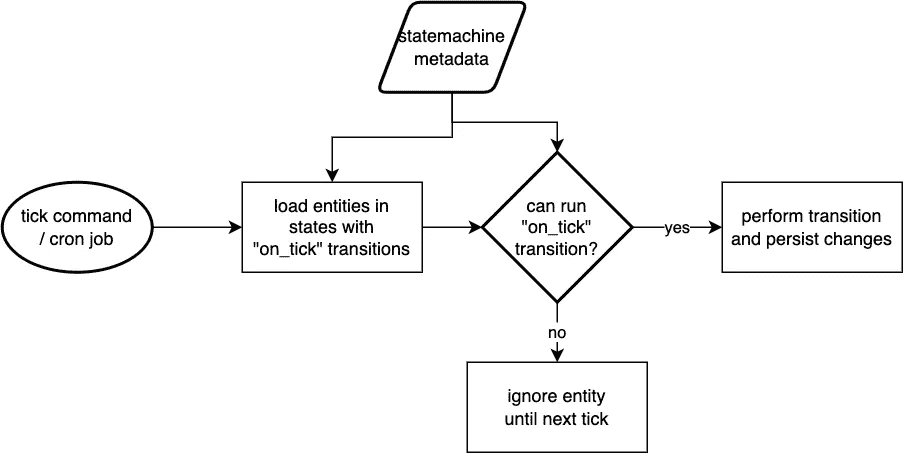

# “滴答”模式——状态机中时间问题的解决方案

> 原文：<https://betterprogramming.pub/the-tick-pattern-a-solution-for-temporal-problems-in-state-machines-b78600772e8c>

## 如何自动执行等待外部和时间条件的工作流，而不增加复杂性


[活动发起人](https://unsplash.com/@campaign_creators?utm_source=medium&utm_medium=referral)在 [Unsplash](https://unsplash.com?utm_source=medium&utm_medium=referral) 上的照片

所以你必须编写这样的程序:

*   一天后发送提醒电子邮件
*   在到达交货日期后处理订单
*   基于外部服务的状态将文档标记为已签名

这些过程需要某种形式的组织，因为你不能仅仅用一个小时来继续一项工作。这就是滴答模式的由来。

# 滴答模式

你可能已经知道术语“滴答”[维基百科描述得很好](https://en.wikipedia.org/wiki/Netcode#Tickrate):

> 一个游戏模拟的单次更新被称为滴答[…]

我们通常不在 Symfony 中编程游戏，但是我们仍然可以借用这个概念，使用这个吸引人的名字。

# 计划是什么？

我建议构建一个执行“滴答”的命令/任务/工作

“滴答”只是定期检查状态机转换是否可能。这允许您用简单的代码定义各种条件(日期、库存、用户确认),而不必在条件满足时寻找执行逻辑的方法。



执行滴答的粗略过程

以下是您可能希望处理此类任务的原因列表:

*   一个入口点:与每个异步任务都需要一个 cron 作业相比，您只需要一个 cron 作业。
*   更简单的工具:您只需要围绕一个异步任务构建监控和日志记录
*   鲁棒性。如果失败了，它会在下一次运行。想想不可用的 API 或 SMTP 服务器。在这种模式下，它只会重试。
*   可更改:直接在数据库中更改交付日期或在新版本中更改延迟。所有这些变化都会立即反映出来，无需迁移或特殊的代码路径

但是，这种模式存在一些问题:

*   缩放:实体越多，分笔成交点花费的时间就越长。
*   浪费:某些州的每个实体都将在每个时钟周期被检查。

# 在元数据中定义刻度

我现在将具体介绍一下 [symfony 工作流组件](https://symfony.com/doc/5.4/components/workflow.html)，但是您也可以将其应用于其他状态机。

您希望能够轻松地阅读应用程序中的行为。状态机定义已经有所帮助，但是您知道您可以[向 symfony 工作流定义](https://symfony.com/doc/5.4/workflow.html#storing-metadata)添加任意元数据吗？

```
transitions:
  deliver:
    from: new
    to: delivering
    guard: subject.checkPreconditions()
    metadata:
      on_tick: true
```

它实际上只是任意的数据，但这意味着我们可以在以后描述新的使用行为。在这种情况下，我将定义`on_tick`，它只是一个我们希望稍后检查的标志。

我还使用了`guard`属性来定义状态何时被允许改变的条件。这可读性很好，但是相当有限，您应该使用[保护事件](https://symfony.com/doc/current/workflow.html#guard-events)来代替。

# 构建 Tick 服务

您会想要轻松地执行 tick，所以让我们构建一个小的`Service`来完成它。代码如下:

有了这个简单的服务，您可以运行`$service->tick($order)`来运行挂起的转换。这对于在创建实体后立即启动流程非常有用。或者没有，如果有一个条件目前阻止它。

在这项服务中也有意义的事情:

*   一个类似`simulate`的试运行方法，这样你就可以不用实际去做就可以检查是否有什么事情在等待
*   一种返回所有转换阻止程序的方法，这样您就可以解释订单停滞的原因

# 构建 Cron 命令

我们现在需要一个命令来触发程序世界之外的 ticks，通常是一个 cron 作业。但是您还希望能够手动触发单个分笔成交点，所以 CLI 应该有点花哨。

该命令必须特定于底层数据库，因此我为我的示例`Order`创建了 tick 命令，但是您可以根据自己的喜好调整它，甚至让它运行于多个实体类型。以下是更多代码:

使用这个命令，您现在可以运行`order:tick`，所有标记为`on_tick: true`的转换将被执行，如果它们没有被其他条件阻塞的话。

我在这里使用的一个小技巧是使用带参数`$orderStateMachine`的命名自动连接直接注入状态机，以显式地注入名为`order`的状态机。您通常从`Registry`服务中获得状态机，但是如果没有对象，就无法访问状态机。在这里，我们希望状态机首先创建一个状态列表，它有一个`on_tick`转换。

这个命令也接受一个 id 列表作为参数。这样，您就可以对特定订单进行报价。这对测试真的很有用。

你可能想要提高自己的事情:

*   特定实体的优先级排序(例如，首先处理旧订单)
*   批量加载实体/订单以提高吞吐量
*   您可以尝试使用多个进程遍历 id 列表。要么自己生成进程，要么通过`echo [id list] |xargs -P4 -n100 php bin/console order:tick`发送所有 id。

# 现在轮到你了

我错过什么了吗？我帮到你了吗？在评论里告诉我。