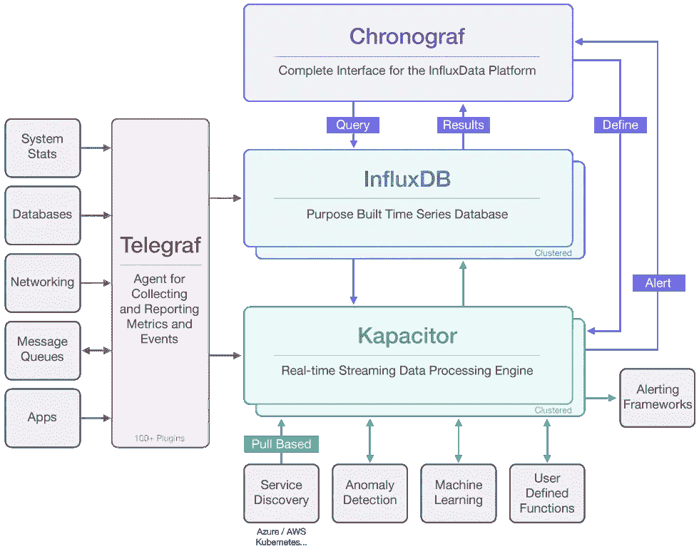
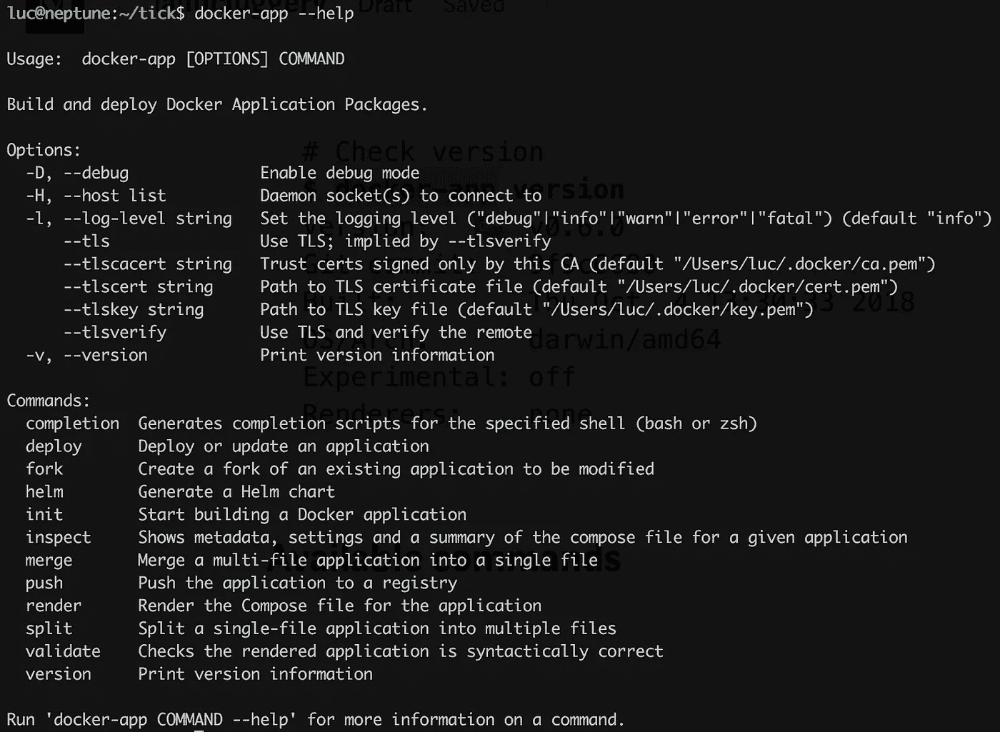
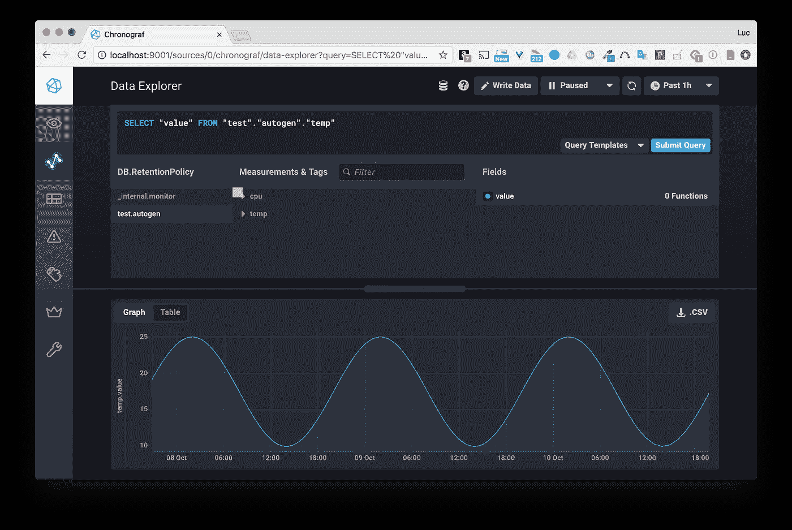
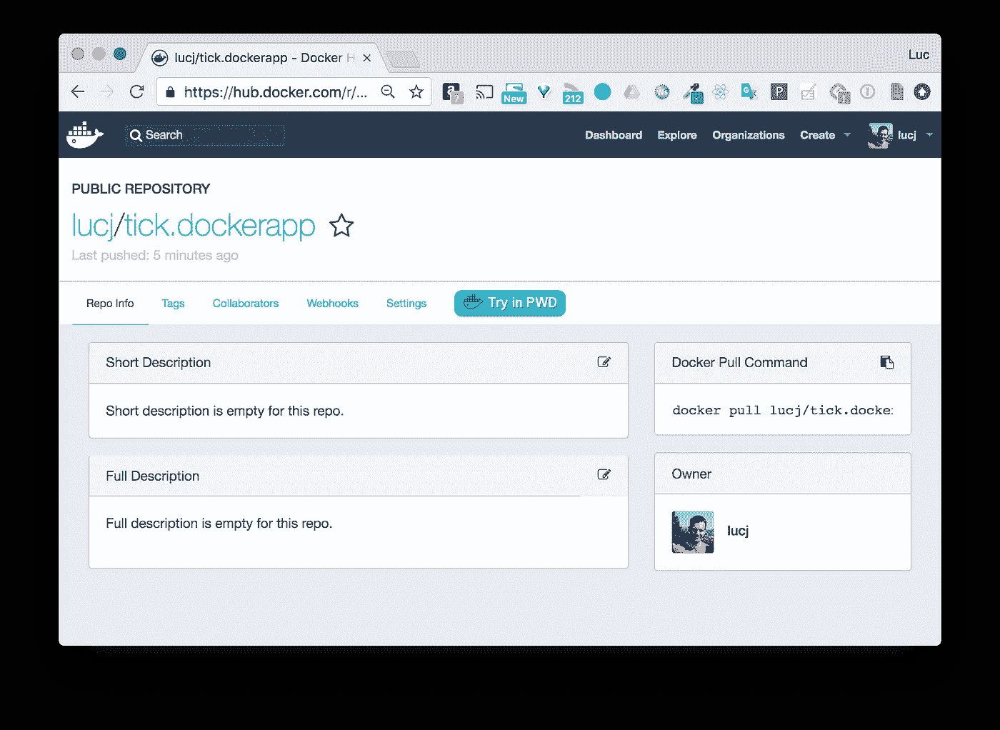
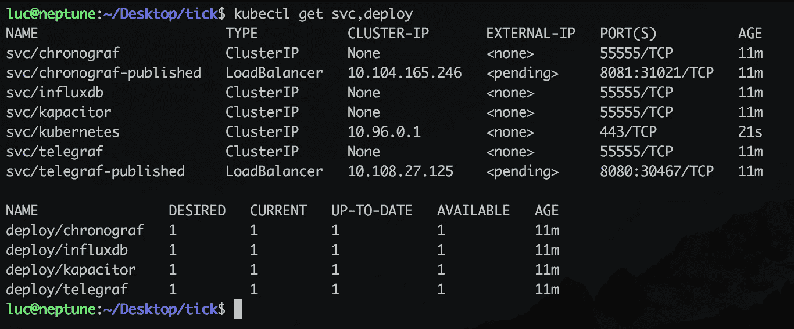

# 作为 Docker 应用程序包的 TICK 堆栈

> 原文：<https://betterprogramming.pub/the-tick-stack-as-a-docker-application-package-1d0d6b869211>

## TL；速度三角形定位法(dead reckoning)


照片由 [Tirza van Dijk](https://unsplash.com/@tirzavandijk?utm_source=unsplash&utm_medium=referral&utm_content=creditCopyText) 在 [Unsplash](https://unsplash.com/search/photos/application?utm_source=unsplash&utm_medium=referral&utm_content=creditCopyText) 上拍摄

[Docker](https://www.docker.com/) 应用包是 DockerCon SF 2018 上展示的实用程序。它简化了 Docker 合成应用程序的打包和分发。TICK stack 是一个很好的例子来说明这实际上是如何工作的。

## 关于 TICK 堆栈

这个应用程序堆栈主要用于处理时序数据。这使得它成为物联网项目的绝佳选择，在物联网项目中，设备会发送数据(温度、天气指标、水位等。)定期。

它的名字 TICK 来自于它的组成部分:

*   Telegraf
*   InfluxDB
*   Chronograf
*   Kapacitor

下面的模式说明了整体架构，并概述了每个组件的角色。



基本上，数据被发送到 Telegraph，然后存储在 InfluxDB 数据库中。Chronograf 允许通过一个漂亮的网络界面查询数据库。Kapacitor 可以根据数据进行处理、监控和发出警报。

## 合成文件中的简单定义

下面的`tick.yml`文件定义了堆栈的四个组件以及它们相互通信的方式。

TK 不认为我们有媒体格式的问题了吗？注意:如果您复制/粘贴该文件的内容，您必须将'—'更改为常规的连字符'-'。(此处为中等格式问题)。

TK 留下了要点和灰线代码——请告知哪个是正确的。Telegraf 的配置是通过 Docker Config 对象提供的，该对象是由下面的`telegraf.conf` 文件创建的。

```
[agent]
  interval = "5s"
  round_interval = true
  metric_batch_size = 1000
  metric_buffer_limit = 10000
  collection_jitter = "0s"
  flush_interval = "5s"
  flush_jitter = "0s"
  precision = ""
  debug = false
  quiet = false
  logfile = ""
  hostname = "$HOSTNAME"
  omit_hostname = false[[outputs.influxdb]]
  urls = ["http://influxdb:8086"]
  database = "test"
  username = ""
  password = ""
  retention_policy = ""
  write_consistency = "any"
  timeout = "5s"[[inputs.http_listener]]
  service_address = ":8186"[cpu]
  # Whether to report per-cpu stats or not
  percpu = true
  # Whether to report total system cpu stats or not
  totalcpu = true
```

我不会太深入这个文件的细节，但基本上它:

*   定义定期收集主机 CPU 指标的代理。
*   定义一个附加的输入方法，允许 Telegraf 通过 HTTP 端点接收数据。
*   指定收集/接收的数据应该存储在名为`test` *的数据库中。*

# Docker 应用程序包

## **安装(在 MacOS 上)**

以下命令允许您安装 Docker 应用程序包的最新版本(`docker-app` Go 二进制文件)

```
# Install release 0.6.0 (published on October 4th)
VERSION="v0.6.0"
wget --no-check-certificate https://github.com/docker/app/releases/download/$VERSION/docker-app-darwin.tar.gz
tar xf docker-app-darwin.tar.gz
cp docker-app-darwin /usr/local/bin/docker-app
```

然后我们检查一切正常。

```
# Check version
**$ docker-app version**
Version:      v0.6.0
Git commit:   9f9c6680
Built:        Thu Oct  4 13:30:33 2018
OS/Arch:      darwin/amd64
Experimental: off
Renderers:    none
```

## 可用命令

仅供参考，下面的截图列出了`docker-app` CLI 提供的所有命令。我们将在本文的后面举例说明其中的一些。



## **为 TICK 堆栈创建 Docker 应用程序包**

让我们从一个只包含上面定义的`Compose`和`configuration`文件的文件夹开始。

```
$ tree .
.
├── telegraf.conf
└── tick.yml
```

我们现在可以使用以下命令创建名为“tick”的 Docker 应用程序:

```
$ docker-app init -c tick.yml tick
```

这创建了文件夹`tick.dockerapp`，和三个附加文件。

```
$ tree .
.
├── telegraf.conf
├── **tick.dockerapp** │ ├── **docker-compose.yml**
│ ├── **metadata.yml**
│ └── **settings.yml**
└── tick.yml
```

*   `docker-compose.yml`是`tick.yml`文件的副本
*   `metadata.yml`定义了额外的参数，如下所示。我刚刚更改了名称空间，以匹配发布应用程序时将使用的 Docker Hub 帐户。

```
$ cat tick.dockerapp/metadata.yml
# Version of the application
version: 0.1.0
# Name of the application
name: tick
# A short description of the application
description:
# Namespace to use when pushing to a registry. This is typically your Hub username.
namespace: lucj
# List of application maintainers with name and email for each
maintainers:
 — name: luc
   email:
```

*   `settings.yml`定义应用程序使用的默认参数(稍后会详细介绍)。默认情况下，该文件为空。

注意:初始化 Docker 应用程序时，可以使用`-s`标志。这将导致创建一个包含上述三个文件内容的文件，而不是文件夹/文件层次结构。

**定义开发和生产环境的设置**

正如我们上面所说的，`settings.yml`文件的目的是为应用程序提供一些默认值。但是，等等…哪些参数的默认值，因为我们没有指定任何参数？这实际上是 Docker 应用程序包的主要功能之一——可以针对不同的环境使用不同的设置。

让我们考虑一个 dev 和一个 prod 环境，并假设这两个环境只有在应用程序向外界公开端口时有所不同:

*   Telegraf 在 dev 中监听端口 8000，在 prod 中监听端口 9000。
*   Chronograf 监听 dev 中的端口 8001 和 prod 中的端口 9001。

**注意**:当然，在现实世界的应用程序中，dev 和 prod 之间的差异不仅限于端口号。目前的例子过于简化，所以更容易掌握主要概念。

为此，我们将首先为每个环境创建一个设置文件，然后我们将修改`docker-compose.yml`文件以添加一些占位符。

`settings.yml`文件用于为 Telegraf 和 Chronograf 服务定义一些默认端口。

```
// settings.yml
ports:
  telegraf: 8186
  chronograf: 8888
```

我们还定义了`dev.yml`来为开发环境指定不同的值，

```
// dev.yml
ports:
  telegraf: 8000
  chronograf: 8001
```

和`prod.yml`，用于生产环境。

```
// prod.yml
ports:
  telegraf: 9000
  chronograf: 9001
```

现在让我们修改`docker-compose.yml`文件，并更改 Telegraf 和 Chronograf 的已发布端口，以便它们使用上述文件中定义的变量。

```
$ cat tick.dockerapp/docker-compose.yml
version: "3.6"
services:
  telegraf:
    image: telegraf
    configs:
    — source: telegraf-conf
      target: /etc/telegraf/telegraf.conf
    ports:
    — **${ports.telegraf}**:8186
  influxdb:
    image: influxdb
  chronograf:
    image: chronograf
    ports:
    — **${ports.chronograf}**:8888
    command: ["chronograf", "--influxdb-url=http://influxdb:8086"]
  kapacitor:
    image: kapacitor
    environment:
    — KAPACITOR_INFLUXDB_0_URLS_0=http://influxdb:8086
configs:
  telegraf-conf:
    file: ./telegraf.conf
```

正如我们在上面的更改中看到的，访问 Telegraf 端口号的方法是使用`ports.telegraf`符号。Chronograf 港也是如此。

`render`命令允许生成 Docker 合成文件，用指定的设置文件内容替换变量`${ports.XXX}`。如果没有指定，则使用默认的`settings.yml`。正如我们在下面看到的，Telegraf 端口现在是 8186，Chronograf 端口是 8888。

```
$ docker-app render
version: "3.6"
services:
  chronograf:
    command:
    — chronograf
    — --influxdb-url=http://influxdb:8086
    image: chronograf
    ports:
    — mode: ingress
      target: 8888
      published: **8888**
      protocol: tcp
  influxdb:
    image: influxdb
  kapacitor:
    environment:
      KAPACITOR_INFLUXDB_0_URLS_0: http://influxdb:8086
    image: kapacitor
  telegraf:
    configs:
    — source: telegraf-conf
      target: /etc/telegraf/telegraf.conf
    image: telegraf
    ports:
    — mode: ingress
      target: 8186
      published: **8186**
      protocol: tcp
configs:
  telegraf-conf:
    file: telegraf.conf
```

如果我们在`render`命令中指定一个设置文件，则使用该文件中的值。正如我们在下面的例子中看到的，如果我们在渲染过程中使用`dev.yml`，Telegraf 在端口 8000 上发布，Chronograf 在端口 8001 上发布。

```
$ docker-app render -f dev.yml
version: "3.6"
services:
  chronograf:
    command:
    — chronograf
    —-influxdb-url=http://influxdb:8086
    image: chronograf
    ports:
    — mode: ingress
      target: 8888
      published: **8001**
      protocol: tcp
  influxdb:
    image: influxdb
  kapacitor:
    environment:
      KAPACITOR_INFLUXDB_0_URLS_0: http://influxdb:8086
    image: kapacitor
  telegraf:
    configs:
    — source: telegraf-conf
      target: /etc/telegraf/telegraf.conf
    image: telegraf
    ports:
    — mode: ingress
      target: 8186
      published: **8000**
      protocol: tcp
configs:
  telegraf-conf:
    file: telegraf.conf
```

## 检查应用程序

正如我们在下面看到的，`inspect`命令提供了与应用程序相关的所有信息:

*   它的元数据。
*   涉及的服务(包括定义的副本数量、公开的端口和使用的映像)。
*   使用的设置。
*   附件。(在`docker-compose.yml`上使用的所有文件)

```
$ docker-app inspect
tick 0.1.0Maintained by: lucServices (4) Replicas Ports Image
 — — — — — — — — — — — — — — — -
influxdb 1 influxdb
chronograf 1 8888 chronograf
kapacitor 1 kapacitor
telegraf 1 8186 telegrafSettings (2) Value
 — — — — — — — — -
ports.chronograf 8888
ports.telegraf 8186Attachments (4) Size
 — — — — — — — — — — 
dev.yml 43B
prod.yml 43B
telegraf.conf 668B
```

**在集群上部署应用**

由于堆栈使用基于`telegraf.conf`文件的 Docker 配置，我们需要将该文件复制到`tick.dockerapp`文件夹中。Docker 应用包从 0.6 版本开始就允许嵌入配置文件)。文件夹结构如下所示:

```
$ tree .
.
├── telegraf.conf
├── tick.dockerapp
│   ├── dev.yml
│   ├── docker-compose.yml
│   ├── metadata.yml
│   ├── prod.yml
│   ├── settings.yml
│   └── telegraf.conf
└── tick.yml
```

使用下面的命令，我们通过 Docker 栈在 Swarm 上部署应用程序。

```
$ docker-app deploy -f prod.yml
Creating network tick_default
Creating config tick_telegraf-conf
Creating service tick_influxdb
Creating service tick_chronograf
Creating service tick_kapacitor
Creating service tick_telegraf
```

列出所创建的服务，我们可以看到来自`prod.yml`设置文件的值已被考虑在内(因为 Telegraf 和 Chronograf 的公开端口分别是 9000 和 9001)。

注意:目前在 0.6.0 中有一个小问题，因为`deploy`命令并不总是从包中提取附件，而是在某些情况下使用当前文件夹中的附件。此处的[解决了此问题](https://github.com/docker/app/pull/406)，并将在 0.6.1 版本中修复。

## 在非群集主机上部署应用程序

出于开发目的，我们可以使用以下命令将应用程序部署在非 Swarm Docker 主机上:

```
$ docker-app render -f dev.yml | docker-compose -f — up
```

该命令可以分为两部分:

*   使用`dev.yml`设置文件进行渲染，生成最终的 Docker 合成文件。
*   这个生成的合成文件通过管道传递给第二个命令，该命令从标准输入中读取文件并运行合成应用程序。

注意:这只是为了记录，因为在这里部署带有 Docker Compose 的应用程序没有实际意义。事实上，Compose 不会考虑 config 原语，因为它是一个群体专有的东西。

# 试验

当我们使用与生产环境(`prod.yml`)相关的设置文件部署应用程序时，我们将数据发送到端口 9000(tele graf 发布的端口)，并检查端口 9001(chrono graf 发布的端口)上的结果。

让我们发送一些虚拟数据。为此，我们使用图像`lucj/genx`,这是一个简单的 Go 应用程序，可以生成遵循线性或余弦分布的数据(将来会得到增强)。

```
$ docker run lucj/genx
Usage of /genx:
 -duration string
      duration of the generation (default “1d”)
 -first float
      first value for linear type
 -last float
      last value for linear type (default 1)
 -max float
       max value for cos type (default 25)
 -min float
       min value for cos type (default 10)
 -period string
       period for cos type (default “1d”)
 -step string
       step / sampling period (default “1h”)
 -type string
       type of curve (default “cos”)
```

在本例中，我们模拟了一条余弦曲线。让我们生成三天的数据，以一天为周期，最小值/最大值为 10/25，采样步长为一小时。显然不是真实世界的温度模型，但足以进行测试。)

```
$ docker run lucj/genx:0.1 -type cos -duration 3d -min 10 -max 25 -step 1h > /tmp/data
```

然后，我们用几个 shell 命令将这些数据发送到 Telegraf 端点:

```
PORT=9000
endpoint="http://localhost:$PORT/write"
cat /tmp/data | while read line; do
  ts="$(echo $line | cut -d' ' -f1)000000000"
  value=$(echo $line | cut -d' ' -f2)
  curl -i -XPOST $endpoint --data-binary "temp value=${value} ${ts}"
done
```

从 Chronograf 用户界面，我们可以看到数据被正确接收。



**将应用程序推送到 Docker Hub**

一旦应用程序运行良好，就可以通过简单的推送通过 Docker Hub 进行分发。

```
$ docker-app push
sha256:bb16877acb67...3462d4ac81a1cf440
```

然后，我们可以看到它在那里，旁边是我的 Docker Hub 帐户的“常规”Docker 图像。



该应用程序现在可供任何人使用。如果你想修改这个应用程序，只需使用`fork`命令并指定(可选)一个文件夹，应用程序的所有资源都将被下载到这个文件夹中。下面是一个使用`fork`命令的例子。

```
$ docker-app fork lucj/tick.dockerapp:0.1.0 myuser/tick --path /tmp/mytickapp
```

**生成舵图**

我们在上面看到了在集群上部署应用程序是多么容易。让它准备好部署在 Kubernetes 集群上并不难。这是通过创建一个 HELM 图表来实现的(HELM 是 Kubernetes 包管理器)。以下命令创建图表:

```
$ docker-app helm
$ tree .
.
├── telegraf.conf
**├── tick.chart
│   ├── Chart.yaml
│   ├── templates
│   │   └── stack.yaml
│   └── values.yaml**
├── tick.dockerapp
│   ├── dev.yml
│   ├── docker-compose.yml
│   ├── metadata.yml
│   ├── prod.yml
│   ├── settings.yml
│   └── telegraf.conf
└── tick.yml
```

正如我们所看到的，在这个过程中生成了一个文件夹和几个文件:

*   `Charts.yaml`包含项目元数据。

```
description: ""
keywords: []
maintainers:
- name: luc <>
name: tick
version: 0.1.0
```

*   `templates/stack.yaml`包含应用程序的 Kubernetes 清单。这里使用了一个特殊的堆栈资源。

```
**kind: Stack** apiVersion: compose.docker.com/v1beta2
metadata:
  name: tick
  generatename: ""
  namespace: ""
  selflink: ""
  uid: ""
  resourceversion: ""
  generation: 0
  creationtimestamp: "0001–01–01T00:00:00Z"
  deletiontimestamp: null
  deletiongraceperiodseconds: null
  labels: {}
  annotations: {}
  ownerreferences: []
  initializers: null
  finalizers: []
  clustername: 
spec:
  services:
  — name: chronograf
    command:
    — chronograf
    — --influxdb-url=http://influxdb:8086
    image: chronograf
    ports:
    — mode: ingress
      target: {{.Values.ports.chronograf}}
      published: 8888
      protocol: tcp
  — name: influxdb
    image: influxdb
  — name: kapacitor
    environment:
      KAPACITOR_INFLUXDB_0_URLS_0: http://influxdb:8086
    image: kapacitor
  — name: telegraf
    configs:
    — source: telegraf-conf
      target: /etc/telegraf/telegraf.conf
    image: telegraf
    ports:
    — mode: ingress
      target: {{.Values.ports.telegraf}}
      published: 8186
      protocol: tcp
  configs:
    telegraf-conf:
      file: telegraf.conf
```

*   `values.yaml`包含将在上述占位符中使用的默认值。由于我们在生成舵图时没有指定任何设置文件，因此使用`settings.yml`中的值。

```
ports:
  chronograf: 8081
  telegraf: 8080
```

一旦生成了 helm 图表，就可以使用我们在上面使用的相同的 deploy 命令在 Kube 上部署应用程序，但是使用额外的 `-o kubernetes`标志来指示要使用的 orchestrator(默认为 Swarm)。

```
$ docker-app deploy -o kubernetes
Waiting for the stack to be stable and running…
chronograf: Ready [pod status: 1/1 ready, 0/1 pending, 0/1 failed]
influxdb: Ready [pod status: 1/1 ready, 0/1 pending, 0/1 failed]
kapacitor: Ready [pod status: 1/1 ready, 0/1 pending, 0/1 failed]
telegraf: Ready [pod status: 1/1 ready, 0/1 pending, 0/1 failed]Stack tick is stable and running
```

由于我们使用默认设置，Telegraf 的公布端口为 8080，Chronograf 的公布端口为 8081*(值在`values.yaml`中定义)*

**

*注意:Kubernetes 上的部署只能在 Docker Desktop 或 Docker Enterprise Edition 上运行，它们运行处理**栈**资源所需的服务器端组件。*

# *摘要*

*我希望这篇文章能对 Docker 应用程序包提供一些见解。该项目还很年轻——在撰写本文时才几个月——所以在它达到 1.0.0 之前可能会发生重大变化。尽管如此，它看起来确实很有前途，我将在以后的文章中跟踪它的发展。*

*感谢[Gareth rush grove](https://medium.com/u/271f3deb4b07?source=post_page-----1d0d6b869211--------------------------------)&Christ Crone 的评论，并指出额外的资源。*