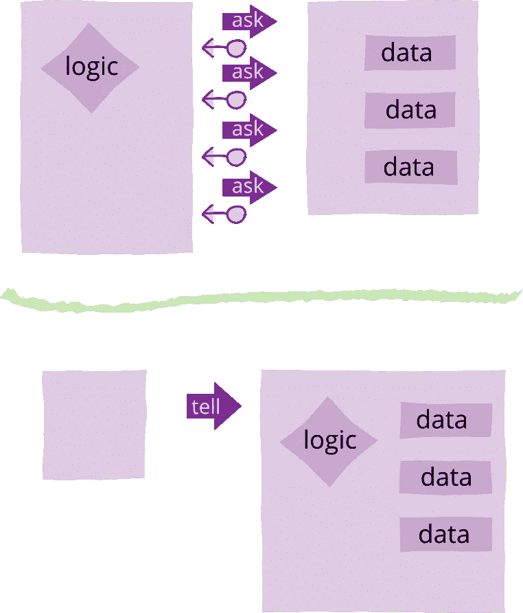
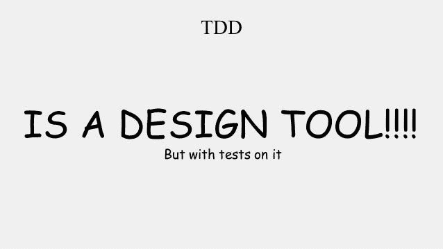

# 每个程序员都应该避免的 10 大设计错误

> 原文：<https://betterprogramming.pub/the-top-10-design-mistakes-every-programmer-should-avoid-3b00f534b328>

## 6.“告诉-不要问”

照片由 [LUM3N](https://unsplash.com/@lum3n?utm_source=medium&utm_medium=referral) 在 [Unsplash](https://unsplash.com?utm_source=medium&utm_medium=referral) 拍摄

“任何傻瓜都能写出计算机能理解的代码。优秀的程序员会写出人类能理解的代码。”—马丁·福勒

软件开发中涉及最多的主题之一是如何创建干净的代码，或者如 Martin Fowler 所说，创建人类可以理解的代码。

尽管有大量的文献涉及这个主题，但是几乎没有一个代码库没有某种代码味道。

事实上，在为多个项目写了 10 年代码之后，我还没有看到一个代码库没有一些最基本的设计错误。

糟糕的编码实践导致意想不到的复杂性，使理解代码的任务变得更加困难。这种理解代码意图的挑战产生了更多的错误倾向，并增加了代码维护的成本。

以下是每个程序员应该立即避免的设计错误。

# 1.在你的信息中使用好的命名惯例

没有什么比用难听的名字更让人觉得缺乏关爱了。几乎所有的开发人员都理解好的命名的重要性，然而，当我们谈到消息命名约定时，他们似乎完全忘记了这一点。命令的形式应该是 <verb><subject>。通常是命令式现在时的动词。</subject></verb>

Events 表示过去发生的事情，所以我们用过去式动词来表示，再加上主语 <subject><verb>: WineServed。</verb></subject>

使用这些简单的规则，你的信息永远不会缺乏意图。

# 2.避免用不属于该领域的“技术细节”来修饰名称

一个用来保存订单数据的类的好名字是 PlaceOrder。一个不好的名字是`OrderRequestMessage`。似乎开发人员倾向于强调他们正在学习的“技术细节”:学习 OO 的开发人员倾向于用“class”(`OrderClass`)来修饰类名。使用集合建模实体的新手倾向于用集合(`OrderAggregate`)等来固定集合根类。

请记住，名称应该表达业务意图，不含糊，清晰，尽可能简洁。

# 3.小心你的界面设计

任何 API，从公共 HTTP API 到内部代码库，都应该公开一个定义良好的接口。接口的一部分是:接受的参数、返回的类型、预期的错误、允许的操作。通过查看 API 的公共接口，API 客户端应该能够理解从 API 中期望得到什么。

避免使用通用的字段包作为输入参数。一个接受任何东西作为输入参数的方法对消费者来说是一个挑战，让他们弄清楚每种情况下应该传递什么。不要忘记将预期的返回错误包含在 API 中。

不要让你的 API 客户端需要阅读你的整个代码库来判断如何向请求传递参数。

# 4.使用细粒度参数

另一个常见的错误是将“超级对象”而不是更具体的参数传递给某些方法。有时我们有一个“超级对象”或“上下文对象”,很容易把它传来传去。

当开始一个编码任务时，这样做是很方便的，因为所有的数据都在手边。这似乎是一个方便的捷径，但它造成了表达意图的问题，因为我们混淆了真正需要的参数。当嘲笑许多不需要的东西并寻找一个方法的内部实现时，这种味道在单元测试中变得很明显。

# 5.使用封装

保持隐私。缺乏封装会泄漏内部细节，从而造成意想不到的复杂性。这发生在许多层次上，从类到系统或平台层次。

当类公开私有成员或服务公开不必要的细节时，就会发生这种情况。封装允许有序和组织，使系统可组合和增长。它防止复杂性扩散到整个系统。

一些架构模式，如分层架构，有助于指导软件设计在适当的层中包含某些职责。在这样的体系结构中，每一层的复杂性都得到控制，各层之间的依赖类型也得到控制。

# 6.“告诉-不要问”

面向对象就是将数据和操作这些数据的函数捆绑在一起。它提醒我们，我们应该告诉对象做什么，而不是向对象请求数据并对数据进行操作。

如果我们围绕业务概念创建对象，我们不仅有有意义的对象，还有在同一级别代表业务的有意义的操作。这样做可以让使用该对象的代码(例如应用层)变得更有表现力，因为它只是向业务对象传递有意义的消息的一种媒介。克服领域模型中的贫血。

# 7.控制消息隐私

认为发布给代理的所有事件都是公开的是错误的。无论使用何种传输方式，例如消息代理，事件都可以有不同的隐私级别。

因为它是一个事件，这并不意味着它应该可以被不同的层或系统访问。可以为事件分配不同的范围，这取决于应该使用它的组件的级别。

事件可以是实体级的(只有作为实体结构一部分的对象才知道)；域事件，用于同一服务的不同子域之间的通信；集成事件，旨在用于集成不同的服务或平台。

# 8.微服务不一定意味着缺乏凝聚力

当采用微服务架构时，可能会产生对服务规模的过度强调(所有服务都需要是微的)。而不是考虑另一个标准来定义像内聚力这样的边界。

部分之间缺乏内聚性的系统，最终会产生几个小的分布式代码片段，它们强烈地依赖于彼此来运行。当新的需求到来时，它产生了必须改变许多不同服务的负担，并且为了理解单个业务过程而查看几个代码存储库。

一起变化的代码应该放在一起。也许一个更好的选择是把一起改变的代码放在同一个服务中。这是应用的旧的虱子耦合/高内聚规则。抱歉，如果它打破了你对微服务的定义。

# 9.不要把优化放在设计之前

不要误解我的意思，代码需要具有可执行性才能有用。但是工程师倾向于将事情复杂化，有时他们过于关注优化，在应该避免的情况下使解决方案复杂化。

让一个浏览器应用程序向服务器发出太多的 web 请求来获取数据是不好的。但是不惜一切代价创建臃肿的 API 来避免往返可能是最糟糕的。

哪个选项更好？a)优化一个设计良好、易于理解和推理的系统，还是 b)维持一个充满复杂性和每次变化都会带来不可预见的后果的系统？

最终，越简单的系统越容易优化。

# 10.不要把测试作为设计工具

单元测试(以及其他类型的测试)是确保代码质量的一个很好的工具。它允许测试场景，检测重大变更，并提供一些度量标准，如代码覆盖率。

在充满复杂因素的系统中，变更会导致不可预测的副作用，用测试覆盖代码会给做出变更带来信心。我见过许多混乱的代码库，它们至少有很大的测试覆盖率，这给了我一些信心，对吗？

不对！单元测试最重要的方面是它如何在开发时提供关于代码设计的即时反馈！TDD 的主要思想是使用测试来指导应用程序的设计。让自动化测试证明假设只是一个可怕的副作用，但它不是主要目标。首要目标始终是设计。

如果设计没有被检查，对代码进行多少次测试都没用。这个系统仍然很难维护。它将充满不可预测的副作用，测试最终将成为一个额外的负担，因为它们将非常难以编写，再加上太多的内容，成为一场噩梦。

归根结底，重要的是代码的质量，测试只是帮助你达到目的的工具。

就是这样。

感谢阅读。

现在去和同事们分享吧。