# 2022 年的 12 大 IntelliJ 插件

> 原文：<https://betterprogramming.pub/the-top-12-intellij-plugins-for-2021-55b1815e0eb8>

## IDE 具有训练器、关键推动者 X、人工智能代码完成、代码共享等功能

由 [Unsplash](https://unsplash.com?utm_source=medium&utm_medium=referral) 上的 [La-Rel Easter](https://unsplash.com/@lastnameeaster?utm_source=medium&utm_medium=referral) 拍摄的照片。

# 1.IDE 功能训练器

让我们从 JetBrains 的这个[官方插件开始吧。刚出测试版，现已向公众开放。这个插件将引导你通过一个交互式的课程，向你展示 IntelliJ 的许多特殊功能。特别是对于学习快捷方式，这个插件帮助极大。我敢打赌，即使是 IntelliJ 大师在第一次看到它的一些特性时也会张大嘴巴。](https://plugins.jetbrains.com/plugin/8554-ide-features-trainer)

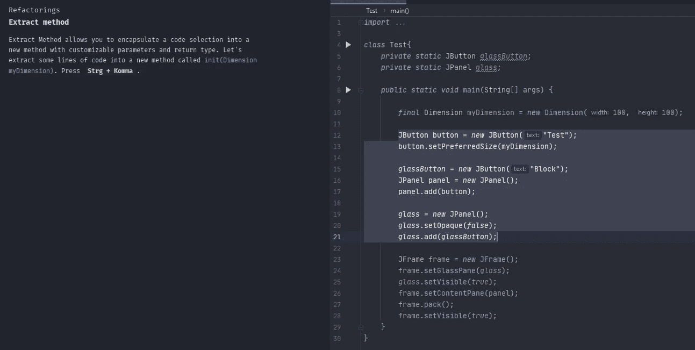

IDE 功能训练器交互指南的屏幕截图。

# 2.材料主题用户界面

[素材主题 UI](https://plugins.jetbrains.com/plugin/8006-material-theme-ui) 可以和任何主题一起使用。它允许您构建 JetBrains 产品的菜单，并增强 IDE 的清晰度。

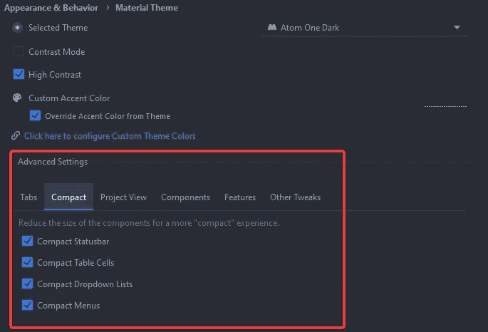

材质主题 UI 高级设置截图。

材质主题 UI 可以做的许多事情之一是使下拉菜单更加紧凑:

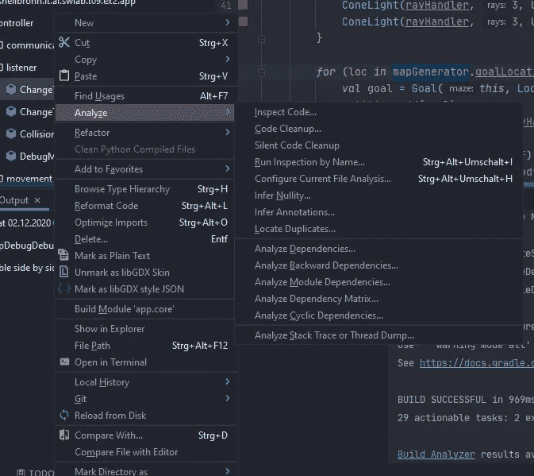

使用材质主题 UI 的紧凑下拉菜单的屏幕截图。

# 3.Codota

当然，必备清单中还包含了[codata](https://plugins.jetbrains.com/plugin/7638-codota-ai-autocomplete-for-java-and-javascript)。Codota 扫描数百万个公共 GitHub 知识库，用人工智能分析它们的源代码。这些信息被用来创建一个超级智能的自动完成功能，它会给你一些非常好的建议。最好是你自己看。

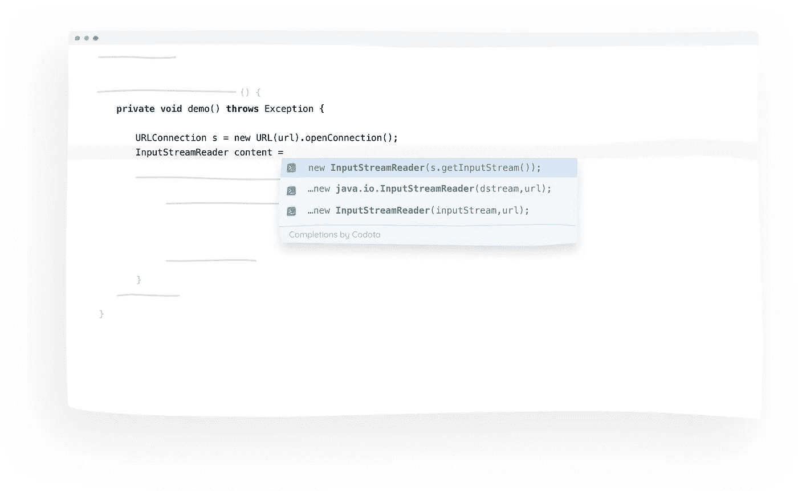

在 [Codota 网站](https://www.codota.com/)上找到的示例。

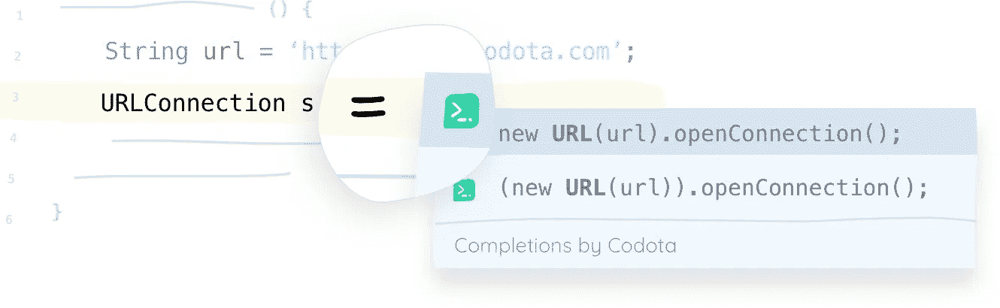

在 [Codota 网站](https://www.codota.com/)上找到的示例。

# 4.注释荧光笔

这个插件足以让你的日常生活变得更简单。它允许您和您的同事根据上下文用颜色突出显示注释。这对于指出重要的注释非常有用，这样就没有人会错过它们了！

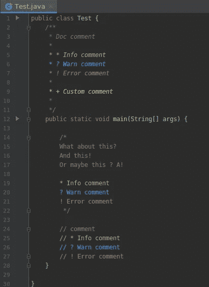

在 [JetBrains Marketplace](https://plugins.jetbrains.com/plugin/12895-comments-highlighter) 上找到的评论高亮插件使用示例。

# 5.返回荧光笔

这个插件有一个非常具体的用例。然而，当查看外部代码时，它非常有用。它将所有 return 语句标记在相关行的旁边。足够谨慎不会让人讨厌，但又足够引人注目，当你寻找它的时候就能找到它。

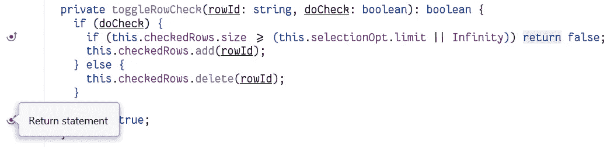

来自 [JetBrains Marketplace](https://plugins.jetbrains.com/plugin/13303-return-highlighter) 的示例截图。

# 6.GitHub 操作

[这个插件](https://plugins.jetbrains.com/plugin/13793-github-actions)直接在你的 IDE 中显示 GitHub 上的 CI 系统是否出现故障！所以你不用看 GitHub 本身就知道是否所有的测试都通过了。你可以呆在你的编辑器里，更好地集中注意力。

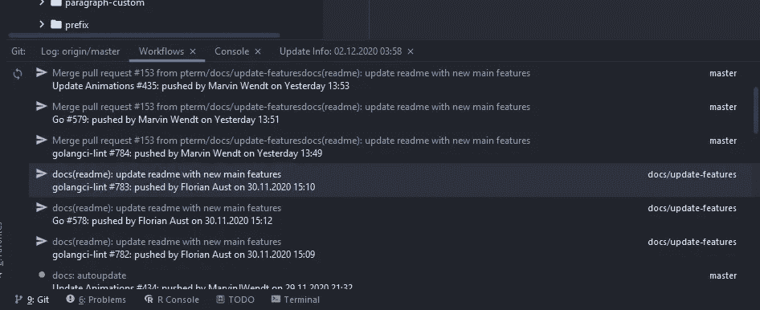

GitHub 操作插件的示例截图。

# 7.关键启动子 X

每当你用鼠标点击的时候，[这个插件](https://plugins.jetbrains.com/plugin/9792-key-promoter-x)会显示你应该按哪个快捷键。这有助于你记住快捷方式和学习新的。如果你不用经常使用鼠标，你可以更快地编码！

该插件还会显示你按下按钮的频率。这有助于你了解在哪里学习捷径更有效。例如，我已经按下运行按钮超过 4000 次，而不是用 Shift+F10 做同样的事情。

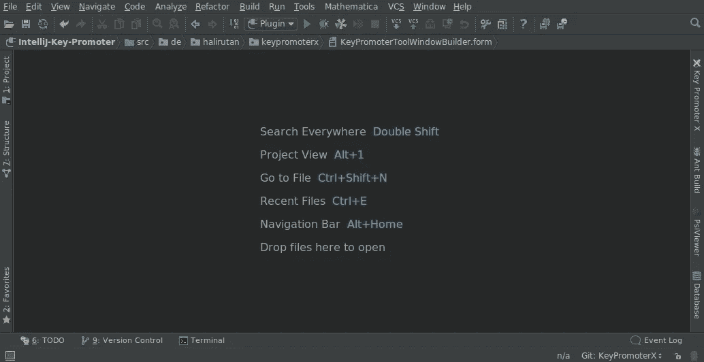

来自 [JetBrains Marketplace](https://plugins.jetbrains.com/plugin/9792-key-promoter-x) 的 GIF 示例。

# 8.字处理

有了[这个插件](https://plugins.jetbrains.com/plugin/2162-string-manipulation)，你可以轻松编辑字符串。例如，您可以将它们转换为`camelCase`、`kebab-lowercase`、`KEBAB-UPPERCASE`、`snake_case`、`SCREAMING_SNAKE_CASE`或`dot.case`。您还可以对行进行排序、递增地更改数字、格式化表格等等。

来自 [JetBrains Marketplace](https://plugins.jetbrains.com/plugin/2162-string-manipulation) 的 GIF 示例。

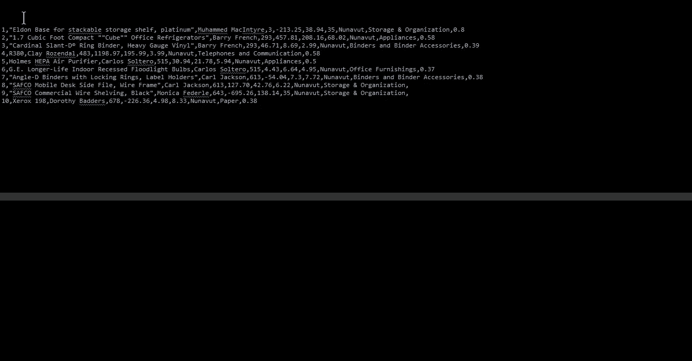

来自 [JetBrains Marketplace](https://plugins.jetbrains.com/plugin/2162-string-manipulation) 的 GIF 示例。

# 9.原子材料图标

这个插件没有给你的 IDE 增加任何新功能，但是它让文件的图标更加美观。当您在一个项目中处理许多不同的文件时，这尤其有用，因为您可以更快地找到某些文件。

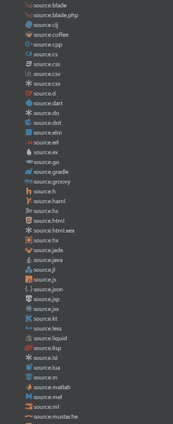

来自 [JetBrains Marketplace](https://plugins.jetbrains.com/plugin/10044-atom-material-icons) 的示例截图。

# 10.。忽视

这个插件增加了对大多数`.ignore`文件的支持。您还可以使用它从不同的开发环境中轻松创建`.gitignore`文件。这里是支持的`.ignore`文件列表，你可以在插件描述中找到:

> ".ignore 是的一个插件。gitignore (Git)，。hgignore (Mercurial)。npmignore (NPM)。dockerrignore(Docker)。chefignore(厨师)。cvsignore (CVS)。bzrignore(集市)。boringignore (Darcs)。mtn-ignore(单调)，ignore-glob(化石)，。jshintnignore(JSHint)，。tfignore (Team Foundation)，. p4ignore (Perforce)，。prettierignore(更漂亮)。弗洛伊格诺尔(弗洛伊特)。eslintingnore(ESLint)。cfignore(云代工厂)。jpmignore(喷气背包)。stylelintnignore(StyleLint)，。stylintignore (Stylint)，。Swagger-Codegen-ignore(Swagger Codegen)，。helmignore (Kubernetes Helm)。upignore(向上)。prettierignore(更漂亮)。ebignore (ElasticBeanstalk)。gcloudnignore(Google Cloud)文件。

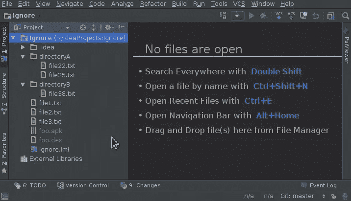

来自 [JetBrains Marketplace](https://plugins.jetbrains.com/plugin/7495--ignore) 的 GIF。

# 11.和我一起编码

这是 JetBrains 的另一个[官方插件。它允许您创建会话，在会话中您可以同时与您的朋友和同事一起处理项目。通过一个许可系统，你甚至可以允许其他人使用你的终端，这样即使没有安装所有必要工具的人也可以测试产品。](https://plugins.jetbrains.com/plugin/14896-code-with-me)

当你想向人们展示或解释一些东西时，这个插件特别有用。

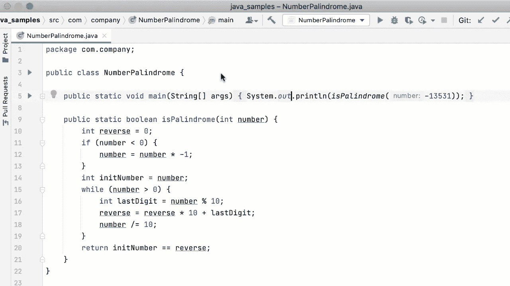

来自 [JetBrains Marketplace](https://plugins.jetbrains.com/plugin/14896-code-with-me) 的 GIF 示例。

# 12.又一个表情符号支持

[这个插件](https://plugins.jetbrains.com/plugin/12512-yet-another-emoji-support)可以让你直接在编辑器里写表情符号。你可以用它在 GitHub 上创建[好看的 READMEs](https://github.com/pterm/pterm#-pterm--pretty-terminal-printer) 或者个性化你的提交信息。如果你使用 [gitmoji](https://gitmoji.carloscuesta.me/) 的话特别有用。

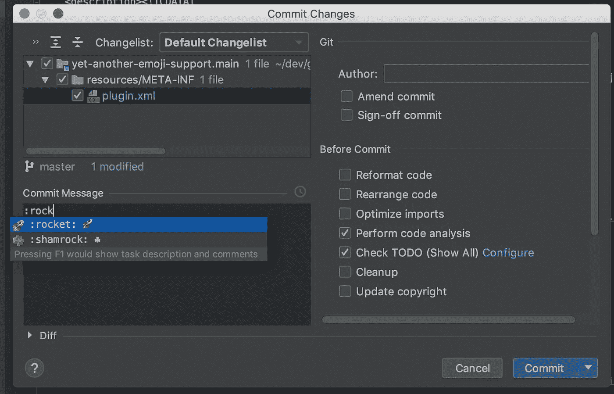

来自 [JetBrains Marketplace](https://plugins.jetbrains.com/plugin/12512-yet-another-emoji-support) 的示例截图。

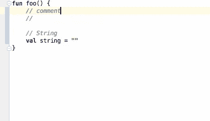

来自 [JetBrains Marketplace](https://plugins.jetbrains.com/plugin/12512-yet-another-emoji-support) 的 GIF 示例。

# 结论

如果你知道其他对某些人有用的插件，欢迎在评论中提出来。

再见，祝你愉快！