# 2020 年学习编程排名前 16 的网站

> 原文：<https://betterprogramming.pub/the-top-16-websites-to-learn-programming-in-2020-8f63f16a62de>

## 让您立即开始编码之旅的资源

克里斯蒂娜@ wocintechchat.com 在 [Unsplash](https://unsplash.com?utm_source=medium&utm_medium=referral) 上的照片

所以，你已经选择了要学习的编程语言，并决定开始浏览整个互联网，寻找一门能满足你要求的课程。这就是你可能会遇到问题的地方，因为网上有大量的资源可以帮助新手从零开始学习编码。问题是:选哪个？

我整理了 16 个我认为最适合新手的网站。首先，我建议快速浏览一下图表，了解每个平台的定价和其他有用信息。

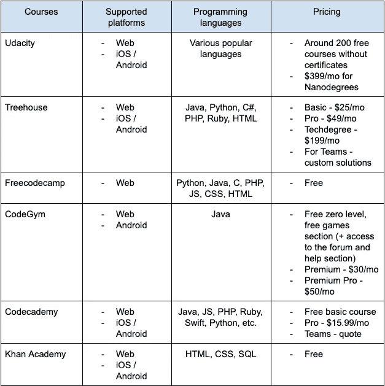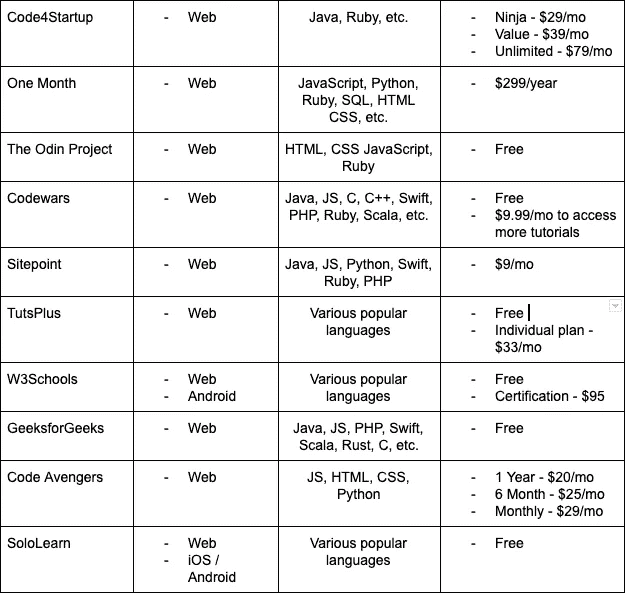

# 1.乌达城

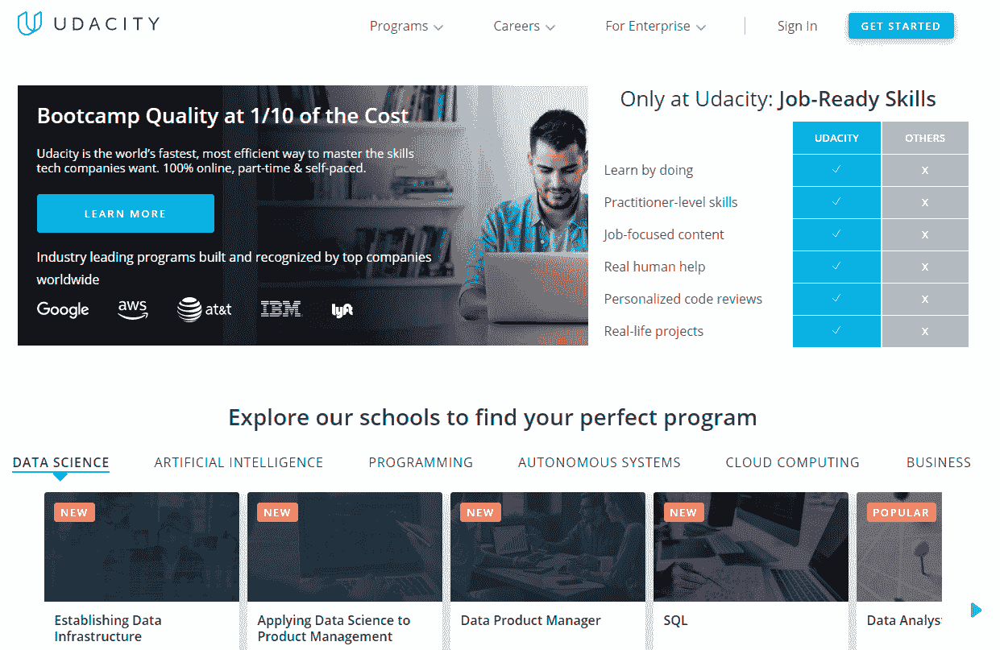

[Udacity](https://www.udacity.com) 对于那些渴望自学编程但不知道如何学习编程且预算紧张的人来说是一个合适的解决方案。幸运的是，许多免费的单独课程——包括视频讲座、练习、测验和其他面向有志用户的任务——将让你从计算机编程的基础开始。如果任务完成中出现任何问题，请随时向论坛中的开发人员寻求帮助。

除了免费课程，Udacity 还提供纳米学位培训，专注于教授你特定的技能，这样你就可以在机器学习、数据科学、Android 和 iOS 开发等行业找到工作。

Nanodegree 培训与许多行业领导者一起制定，确保专业教练的支持，以确保您获得必要的技能。

# 2.树屋

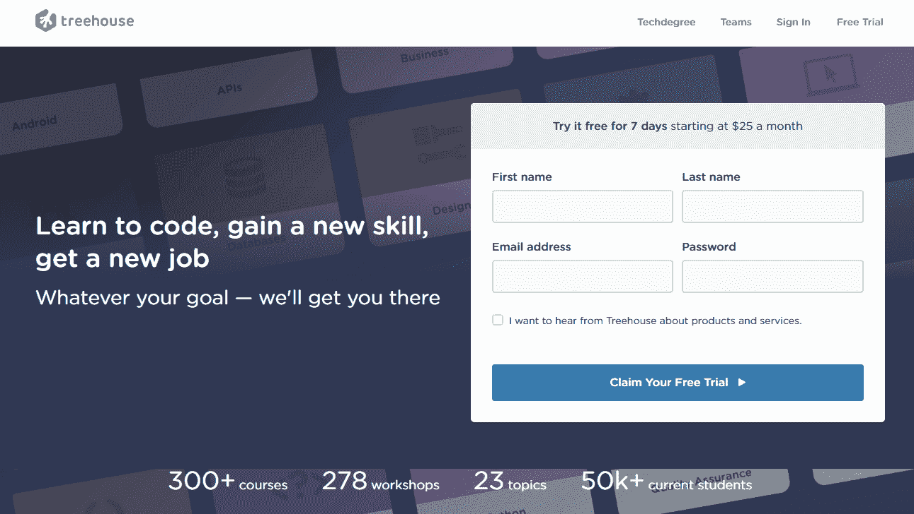

像许多其他学习网站一样， [Treehouse](https://teamtreehouse.com) 致力于教你实现各种设计所需的技能，从应用程序到 WP 博客。在一千多个视频中呈现的培训材料都很简短且以实践为导向，因此学习过程不会花费您太多时间。为了突出材料的重点，学生们要完成测验和其他代码挑战。

每完成一门课程，未来的程序员都会收到一个徽章，展示他们的水平，平台上的每个人都可以看到。这是寻找专家加入他们项目的公司看到的一个机会。

# 3.自由代码营

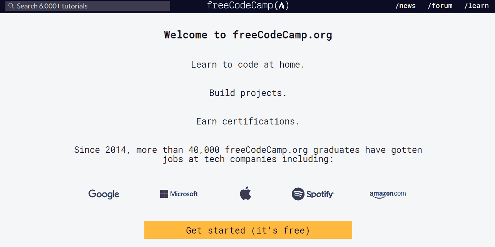

我发现 [freeCodeCamp](https://www.freecodecamp.org) 与众不同。在一个有大量指南的大型社区旁边，该资源拥有一个无与伦比的博客，在类似平台中可能没有类似的博客。然而，我不会向不精通编程理论的初学者推荐它——在这里，你可能很难处理实际的和基于项目的任务。

# 4.CodeGym

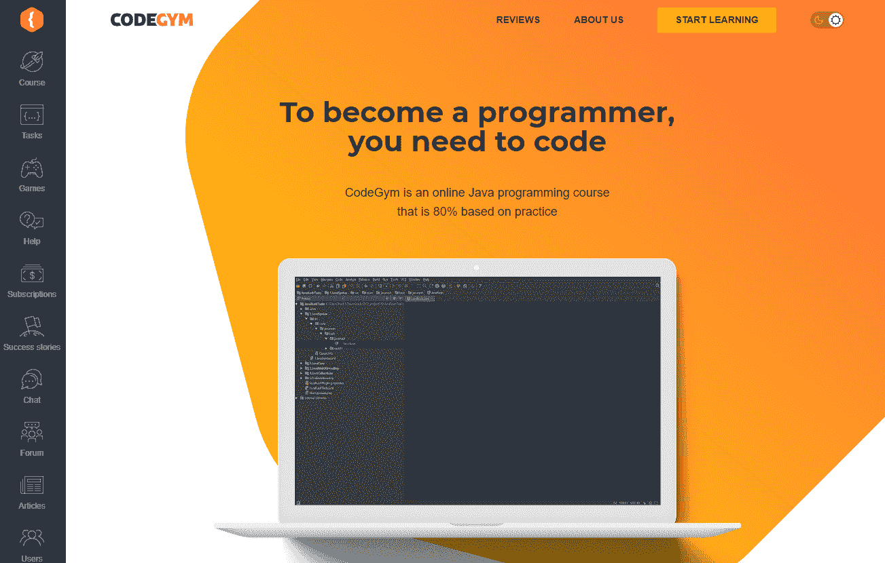

[CodeGym](https://codegym.cc) 的格言听起来像是，“每个人都可以成为程序员！这都归结于正确的学习方法，”他们似乎发现这是正确的方法。CodeGym 是一个致力于学习 Java 编码语言的在线平台。它的编程课程包括 80%的实践，提供超过 1200 个任务，你应该完成这些任务来提升你的技能。

你也可以加入论坛，让自己融入一个友好的大社区。学生们分享他们学习 Java 的成果，回答彼此的问题，并讨论他们在学习过程中遇到的复杂问题。

除此之外，该公司利用游戏化技术使教育过程变得令人兴奋。你和一个角色一起训练，这个角色需要升级才能打开下一关并保持下去。通过基于游戏的方法学习 Java 是一个相当有趣的过程，所以你不可能想放弃它。

# 5.代码集

可能没有人没听说过[代码学院](https://www.codecademy.com/?utm_source=rakuten&utm_medium=affiliate&utm_campaign=adgoal.net&utm_content=10-1&ranMID=44188&ranEAID=a1LgFw09t88&ranSiteID=a1LgFw09t88-r56TGShBCALuUd_lgQXDNQ)至少一次。这是一种受欢迎的教育资源，提供多种课程和任务，旨在让您达到更高的水平。当选择这个项目时，您可以访问超过 300 小时的有用的代码相关内容，这些内容可供受过不同水平培训的人使用。此外，一个结构良好的计划将让你根据你的工作量制定一个教育计划，并遵循它。

# 6.可汗学院

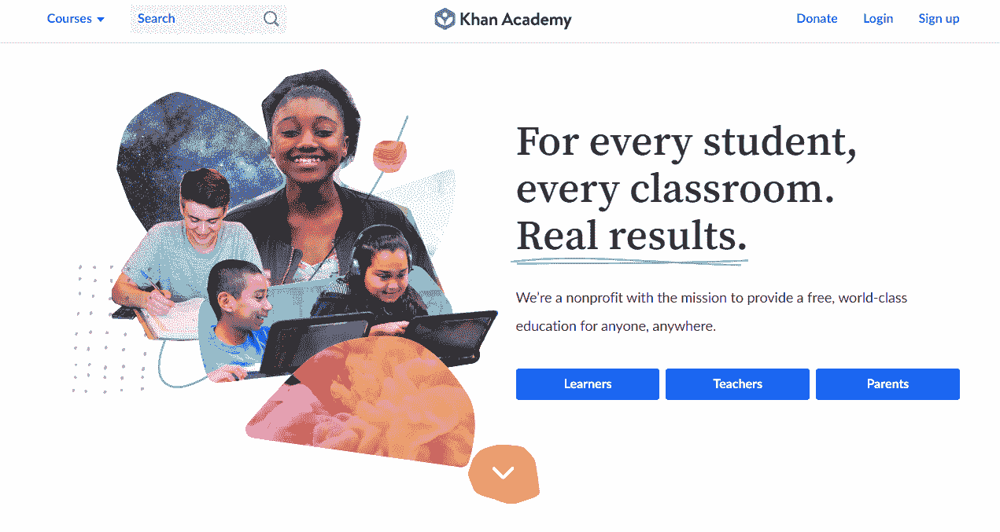

汗学院将自己定位为一个非商业平台，旨在让每个人都能接受教育。它可能不会给你很多实用技能，但你会带着对计算机科学基础的理解离开。在发现如何在计算机中组织数据，掌握面向对象的编程概念，并开始像程序员一样思考之后，你可以去 [CodeGym](https://codegym.cc/) 或 [freeCodeCamp](https://www.freecodecamp.org/) 进行更多的练习。

# 7.代码 4 启动

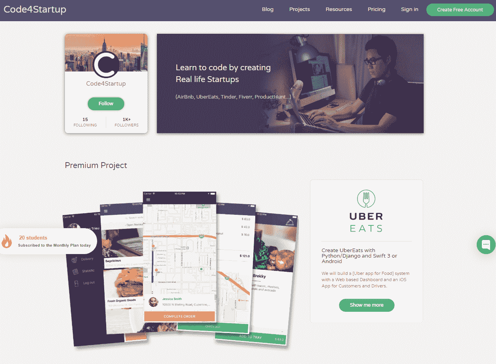

如果你已经掌握了编程，并努力写出你的第一行代码，考虑一下 [Code4Startup](https://code4startup.com) 。这个项目确保了新手程序员和初创公司的双赢伙伴关系。你为现有的企业写代码，而所有者可以节省猎头费用。此外，以这种方式掌握你的技能可以建立一个有前途的投资组合，并进行求职。

伴随实践课程的是许多免费的理论课程，如 Wistia API、Heroku、Learn Ruby on Rails 等。

# 8.一个月

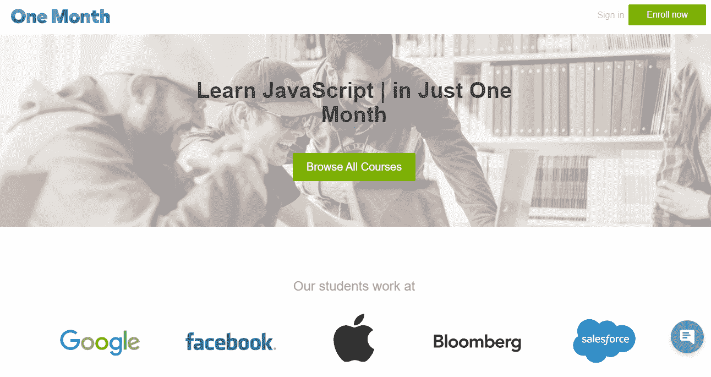

你想挑战自己并快速掌握 JS、Python 和 Ruby 的基础知识吗？然后[一个月](https://onemonth.com)就好走了。这是一个强化课程，学习速度很快——课程持续 30 天，让你继续前进，建立辉煌的职业生涯。

大多数课程都是收费的，但也有一些是免费的，包括博客文章和播客，让你不用花一分钱就能了解最新的编码相关新闻。

# 9.奥丁计划

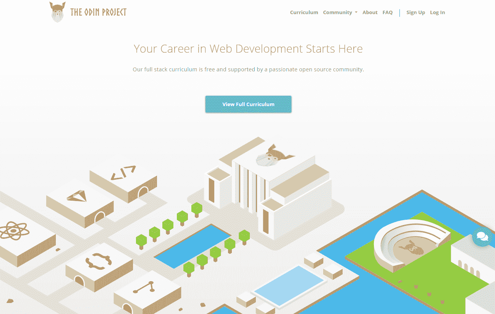

[奥丁项目](https://www.theodinproject.com)，一个面向初学者的课程，在你完成一个程序后，它永远不会离开你。其基于项目的课程让你在培训期间开始为你的投资组合构建项目，并更好地了解你可以利用你所获得的技能做什么。此外，该平台围绕自身建立了一个强大的社区，因此学生可以依靠其他专家来帮助他们完成这一过程。

# 10.代码战争

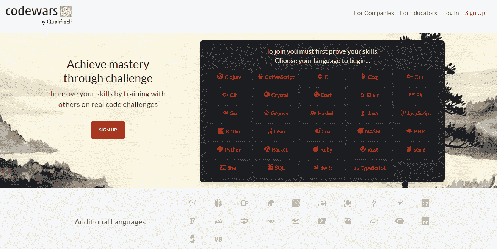

让我们面对现实吧，编程有时很枯燥，也不总是那么简单。你们中的许多人可能已经失去了动力，甚至至少放弃了一次训练。我们都在同一条船上；实话实说吧。但是 [Codewars](https://www.codewars.com) 是一个旨在证明编程也可以很有趣的项目。它包含许多有趣的任务，让你在与同事竞争的同时测试你的开发技能。

Codewars 项目也因其坚固的社区而闻名。如果你有问题，请随时向开发人员寻求帮助——他们会给出全面的答复，这更有可能影响你的进一步发展。

# 11.站点点

Sitepoint 是一个庞大的关于框架、语言和项目的图书馆，并附有专门的 web 开发指南。如果您想找到某些问题的答案，请使用主页上的搜索栏。输入查询后，您将获得大量相关的教育材料。有了一个方便的过滤器，你就可以根据你要找的内容，按类别或作者对文章进行分类。

# 12.TutsPlus

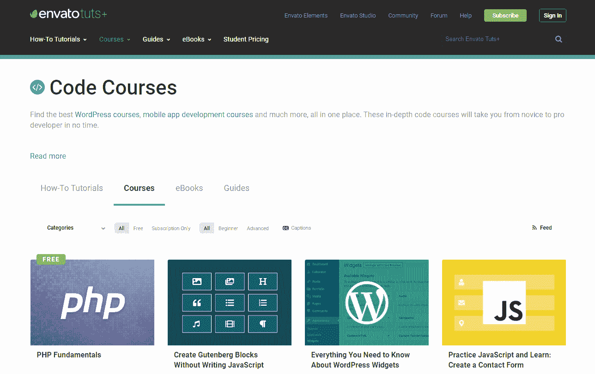

TutsPlus ，提供深入的培训材料，将帮助你很快从新手提升到专业程序员。大量的文章、视频和教程涵盖了网页设计和编程，你可以从头开始学习编码。大量的免费指南会让你以一个舒适的速度从基础到高级。

如果在完成免费课程后，您想继续使用 TutsPlus 学习，请申请一个高级计划。有许多付费课程、电子书和其他优质内容值得投资。

# 13.w3 学校

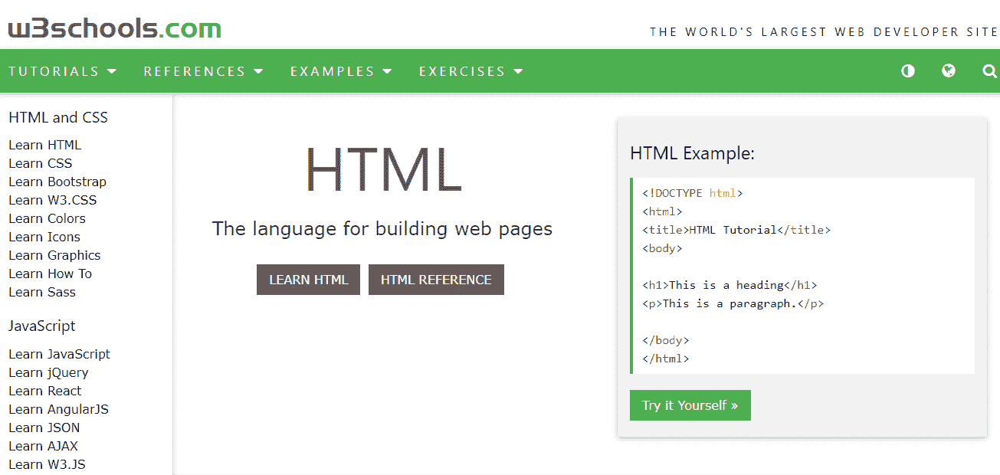

[W3Schools](https://www.w3schools.com) 对新手和开发专家来说都很方便。这是一个使用率很高的参考平台，有大量关于最流行的编码语言的培训辅助工具。该项目力求简单明了，提供了如何使用代码的详细说明。要开始使用该平台，您可以通过一个简短的测试，该测试将显示您的知识水平，并帮助您选择最合适的程序。

# 14.极客论坛

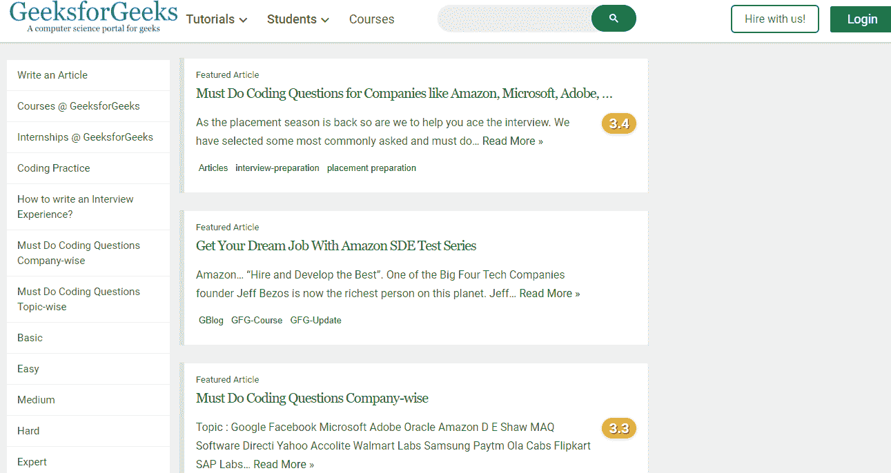

对于那些寻找关于编程语言的有用文章的人来说， [GeeksforGeeks](https://www.geeksforgeeks.org) 网站是又一个全心全意的推荐。该平台将为您提供各种培训材料，从基础课程到高级课程，从编程问题到实践到入学考试等。我希望你会像我一样喜欢这个平台，因为它展示了一种包容每个技术概念的方法和解决编程问题的不同方法，让你选择最合适的解决方案。

# 15.代码复仇者联盟

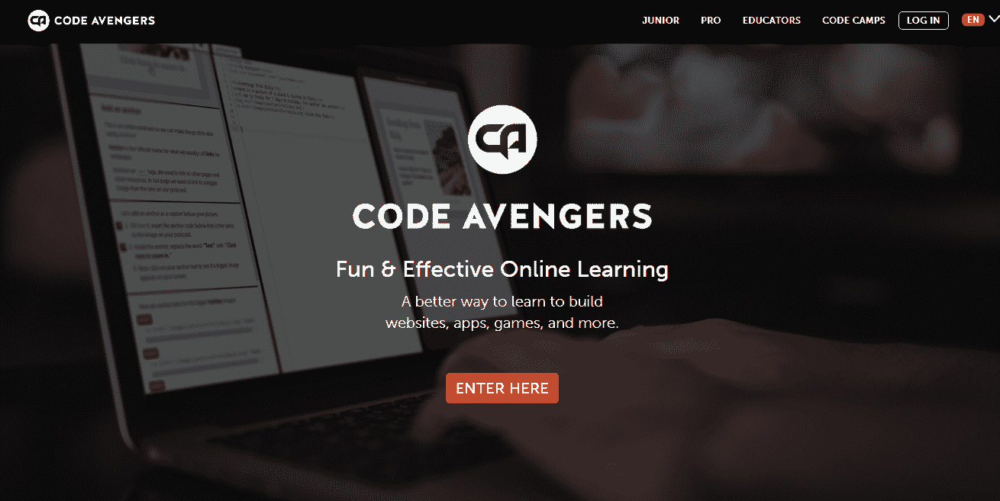

[代码复仇者联盟](https://www.codeavengers.com)将适合入门级用户，而不是有经验的开发者。该课程保留了 1K 多个关于 JS、Python、HTML 和 CSS 的引人入胜的测验，这将确保更多的实践，并让学生了解如何使用所获得的技能。你将从学习如何创建极简主义网站和应用程序开始，并逐步建立成熟的网页设计，可以展示给潜在的雇主。

# 16.SoloLearn

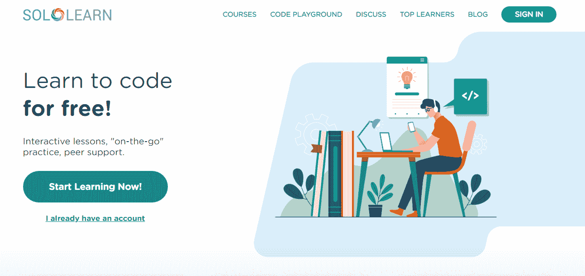

SoloLearn 是每个经常出差的人的完美解决方案。该资源有移动应用程序，让您无论身在何处都可以学习编码。给定一个任务，你可以进行 web 开发，学习 HTML、CSS、JS、jQuery、PHP 和 SQL，或者选择用 Python、Ruby、Java、Swift、C++或 C#进行后端和软件开发。

SoloLearn 不仅是一个在线学习平台；它也是一个强大的专家网络，可以在整个培训过程中为您提供帮助。

# 包裹

一个全面的教育平台概述应该使寻找学习编程的最佳方法变得更加容易。根据你的目标，你可以从一个理论计划中选择，随着你基础知识的增加，你可以继续学习更实际的课程。所以，如果你已经准备好获得 web 开发的新技能，那就马上开始吧。