# 前 20 名 Android Studio 插件

> 原文：<https://betterprogramming.pub/the-top-20-android-studio-plugins-4331f5cdeb80>

## 让 Android 开发变得更加容易

照片由[法比安·伊尔萨拉](https://unsplash.com/@firsara?utm_source=medium&utm_medium=referral)在 [Unsplash](https://unsplash.com?utm_source=medium&utm_medium=referral) 拍摄

Android Studio 是一个由 JetBrains 构建的全功能开发环境，拥有构建出色的 Android 应用程序所需的一切。基于 IntelliJ IDEA 的 IDE 具有强大的功能，随之而来的是无尽的插件列表。

正确的插件可以让你的工作更高效、更智能、更快速。但是不断增长的插件列表令人应接不暇。牢记这一点，我创建了一个顶级 Android Studio 插件列表，以减轻选择的头痛。对于使用 WebStorm 等其他 ide 的开发人员来说，这个集合应该也很有用。

我们开始吧！

# 1.共瞥

类似于 Sublime 或 Xcode，这个插件在你的编辑器中嵌入了一个代码小地图。滚动条也变大了一点。Codeglance 预览文件的代码模式，让您快速导航到所需的部分。

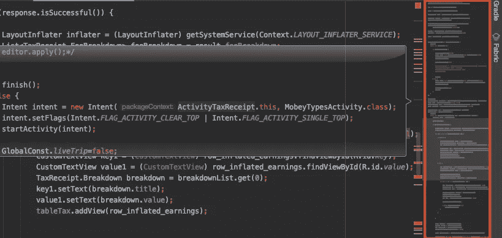

# 2.彩虹括号

嵌套的括号和圆括号对程序员来说是一种痛苦，尤其是当某些东西丢失的时候。在代码评审中，它们真的很令人头疼。这个插件为你的代码添加了可爱的彩虹色，包括圆形、方形和花括号。对于刚刚起步的开发人员，或者那些发现自己被困在大量代码中的人来说，这是一个救星。

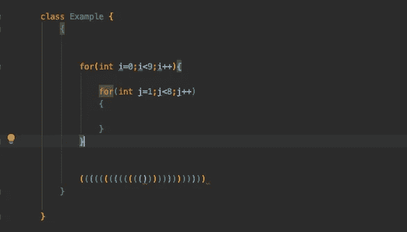

除了 Java 和 Kotlin，这个插件还支持十几种其他语言——Objective-C、Scala、Python、HTML、SQL 等等。

# 3.SQLDelight

是一个众所周知的 Kotlin 多平台数据库库。它从 SQL 生成 Kotlin APIs，负责从模式本身创建数据库。

它由 Square 构建，也有一个 IntelliJ 和 Android Studio 插件，用于语法突出显示、代码完成和通过 SQL 查询导航。

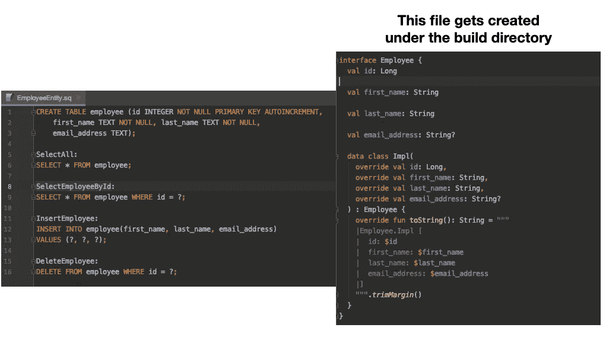

# 4.亚行理念

这里有一个 Android Studio 和 Intellij IDEA 的插件，可以加速你的日常 Android 开发。ADB Idea 为启动、卸载、终止应用程序、撤销权限和清除应用程序数据提供了单击快捷命令。

要调用这个插件，你可以去`Tools->Android->ADB Idea menu`或者简单地从 Find Actions 中搜索命令。

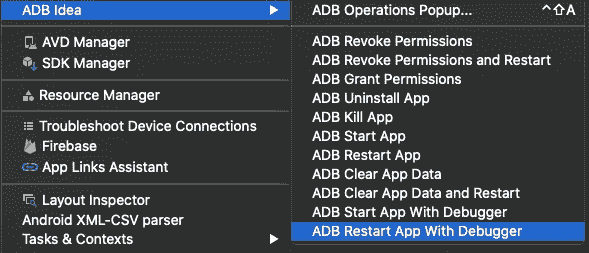

还有一个 adb 增强的插件，可以让你切换移动数据和电池保护

# 5.亚行 Wifi

与他们的 iOS 同事不同，Android 开发人员通常必须确保在设备上调试时 USB 从未断开。虽然有一组 ADB shell 命令可以通过 WIFI 建立连接，但使用 GUI 快捷方式要快得多。只需安装 ADB Wifi 插件，确保您的主机和手机连接在同一个网络上，然后前往`Tools → android → ADB WIFI → ADB USB to WIFI`开始连接——现在您无需 USB 连接即可运行应用程序。

# 6.材质 UI 主题

Android Studio 为黑暗模式爱好者提供了一个可爱的吸血鬼主题。但是有时候，改变并不是坏事，物质的 UI 主题就是为了改变。这个插件有一个令人印象深刻的主题调色板，提供美丽的配色方案，支持绝大多数语言，以及材料图标，填充和一堆定制。

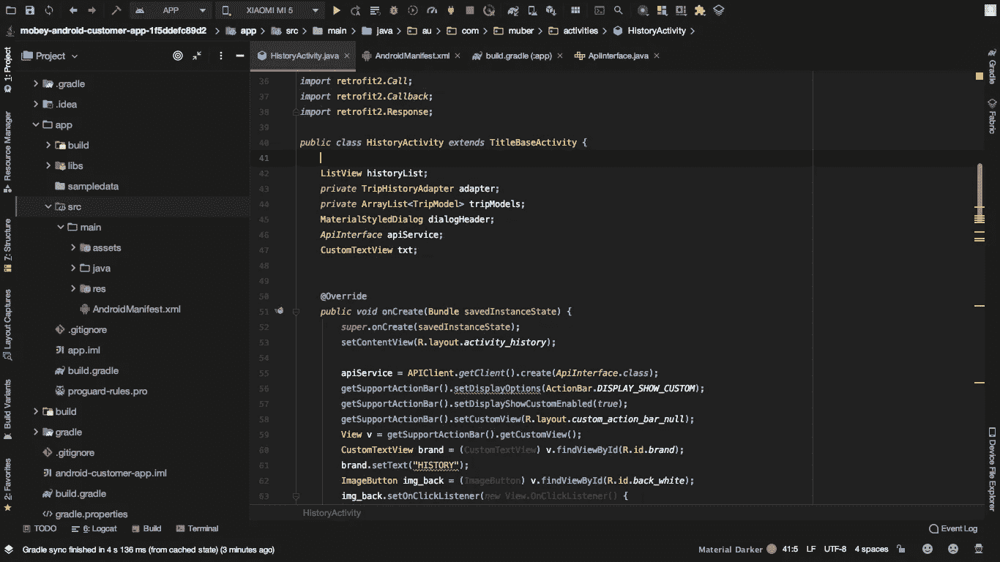

# 7.JSON 到 Kotlin 类

用这个插件将 JSON 字符串转换成 Kotlin 数据类要快得多。此外，它还支持:

*   一系列 JSON 库注释——Gson、Jackson、Fastjson、Moshi、LoganSquare 等等
*   用默认值初始化属性并允许它们为空。
*   将属性名重命名为`camelCase`样式，并将类生成为内部或单独的类。
*   如果 JSON 字符串有效，则从本地文件/Http URL 加载 JSON。

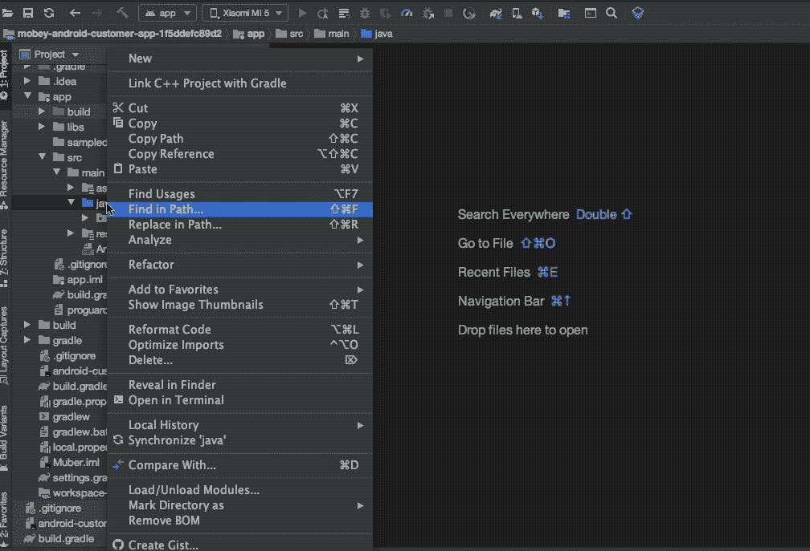

# 8.矢量可绘制缩略图

为了预览一个矢量可绘制的 XML 文件，我们通常需要重建项目。有了矢量绘图缩略图，我们可以在一次单击中预览所有矢量绘图。

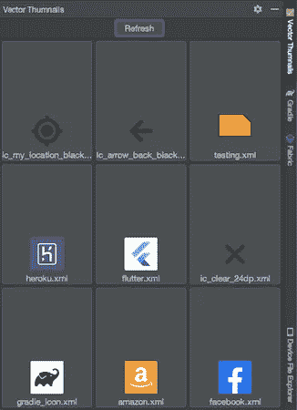

# 9.Codota

Codota 是一个基于人工智能的代码完成插件，它使用机器学习从数百万个代码片段(Java、Javascript、Python 等)中建议代码完成。)根据你的语境。它还允许您直接嵌入常见的代码片段，以提高您的开发技能并减少出错的机会。

正如您在下面看到的，它显示了自动完成建议列表中每个代码完成的概率，最有可能的代码已经在您的编辑器中突出显示(只需按右箭头)。

# 10.说出那种颜色

如果你觉得在你的 Android 代码库中命名颜色很头疼，不要担心，你并不孤单！虽然编码通常被称为一门艺术，但并不是所有的开发人员都擅长命名颜色，尤其是不同的色调。在这种情况下，神秘的名字如`red1`、`blue_lighter`或`red2`进入你的代码库。

幸运的是，我们有一个很棒的插件可以帮你取名字。你所要做的就是将十六进制代码粘贴到你的颜色资源文件中，它会为你建议最接近的创意或材料调色板名称。

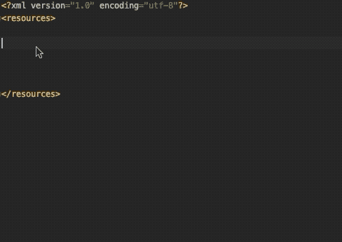

# 11.字处理

接下来，我们有一个插件提供了各种字符串操作。从切换大小写到在 camel、snake、kebab 大小写之间切换，再到递增副本、排序、转义/取消转义 HTML、Java、SQL、PHP、XML 字符串以及执行 grep 等过滤操作，字符串操作无所不在。

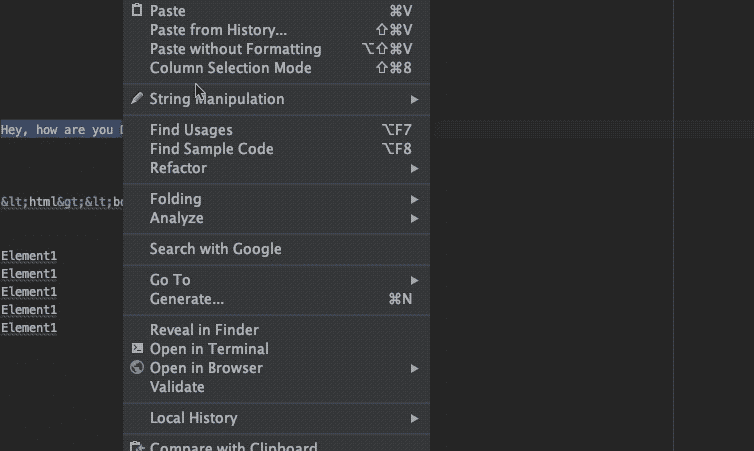

# 12.格拉德·黑仔

通常你会后悔开始一个 Gradle 构建，或者只是希望立即关闭它。你可以运行`ps`命令或者在任务管理器中寻找 Java.exe，但是那会很麻烦。现在，让各地开发者高兴的是，我们有了一个插件，可以在你的 Android 工作室的运行菜单上添加一个杀死 Gradle 的图标。要收回你的内存，你只需点击它！

# 13.科特林填充类

通常需要快速创建一个具有默认属性的 Kotlin 类。这个 IntelliJ 插件就是为了这个。它为空的构造函数和函数提供意图动作，让你快速初始化你的参数。

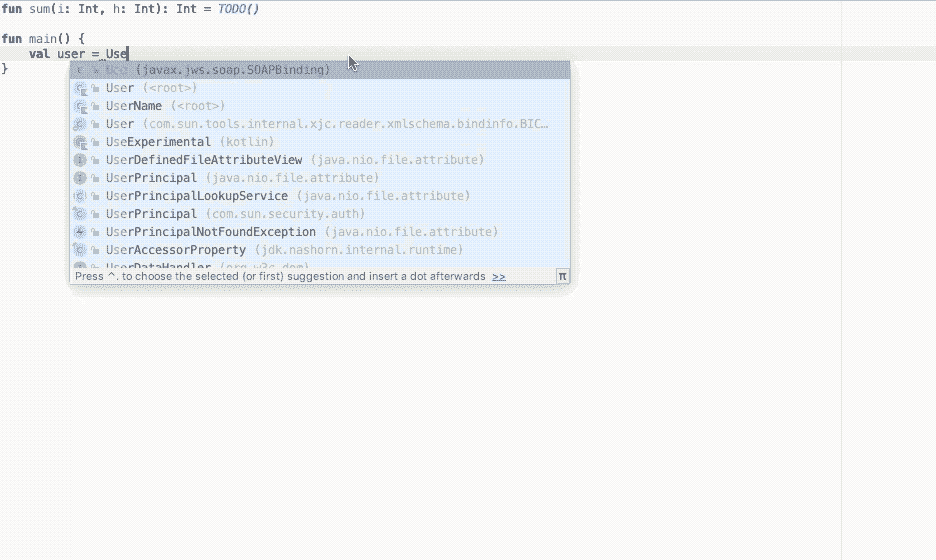

# 14.泰伯宁

这里有一个自动完成插件，它利用深度学习来建议智能完成，让你写得更快。

它支持 20 种编程语言，并在 GitHub 的大约 200 万个文件上进行了训练。为了预测下一个“记号”,它寻找在训练数据集中找到的模式。这使得`TabNine`在惯用编程中特别有用。

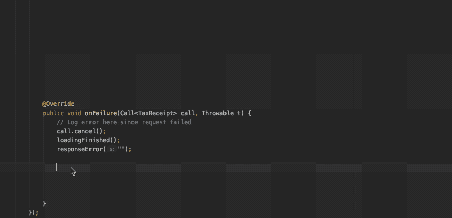

# 15.关键启动子 X

这是一个 IntelliJ IDE 插件，帮助你在工作时学习基本的快捷键。当您在 ide 中的按钮上使用鼠标时，按键提示器 X 会提示您应该使用的键盘快捷键。

它还在侧窗格中显示以前使用的鼠标操作及其对应的键盘快捷键的列表。对于没有快捷方式的按钮，按键提示器 X 会提示您直接创建一个快捷方式。

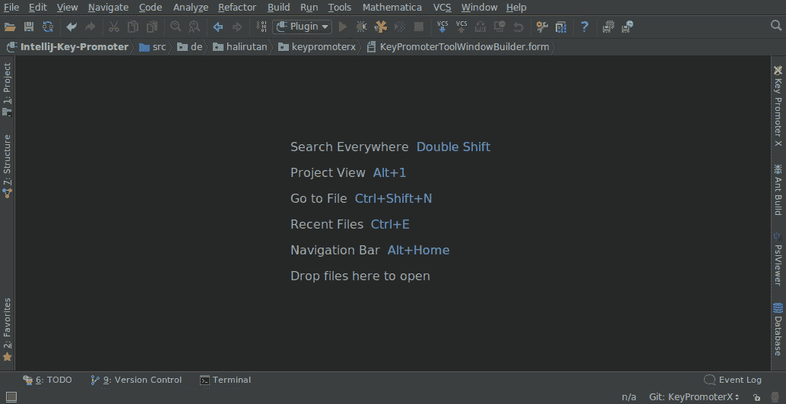

[来源链接](https://plugins.jetbrains.com/plugin/9792-key-promoter-x)

# 16.清除缓存插件

通常，当开发人员需要移除缓存时，他们必须遍历`.gradle`目录。那很费时间。你可以创建一个 Gradle 脚本来加速这个过程，但是为什么要重新发明轮子呢？

通过使用清除缓存插件，我们可以检索所有带有给定前缀的包，并删除那些不再需要的包。这里有一个演示:

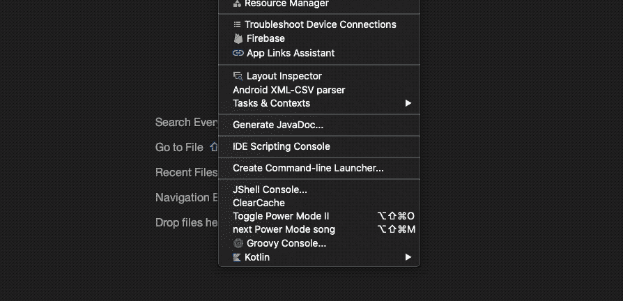

# 17.FCM 推送发送器

通过设置 Firebase 注册 ID，我们可以使用该插件直接从 Android studio 发送推送通知。该插件还能够使用 Stetho `dumpapp`插件自动搜索应用程序内共享首选项的 Firebase 注册 ID 令牌。

最突出的是能够向多个可调试设备发送通知。我们可以选择发送数据消息或完整消息，如下所示:

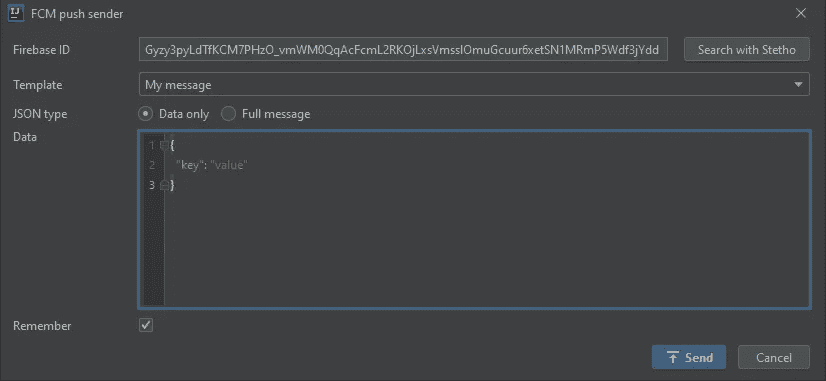

[来源链接](https://plugins.jetbrains.com/plugin/12104-fcm-push-sender)

# 18.SQLScout

这是对 Android Studio 和 IntelliJ IDEA 的一流 SQLite 支持，可以让您实时管理数据库。这使得在调试应用程序时，可以轻松地执行 SQL 查询来更新表。

它还支持房间持久性库——从现有的数据库模式中自动生成房间类`Entity`、`DAO`、`Migration`和`Database`。数据库图表、带有语法高亮的 SQL 编辑器、将模式导出为不同格式(如 Excel)——使用 SQLScout 插件，一切皆有可能。

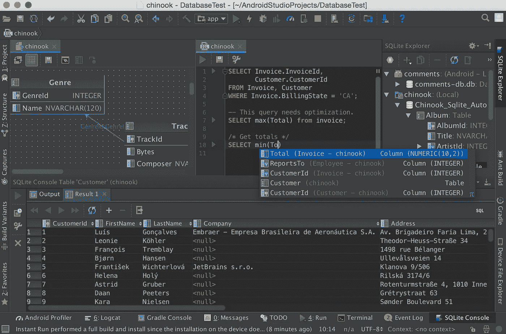

# 19.材料设计图标生成器

这个插件帮助你在你的 android 应用程序中添加材质设计图标。导入资产、指定颜色、大小和密度非常简单。

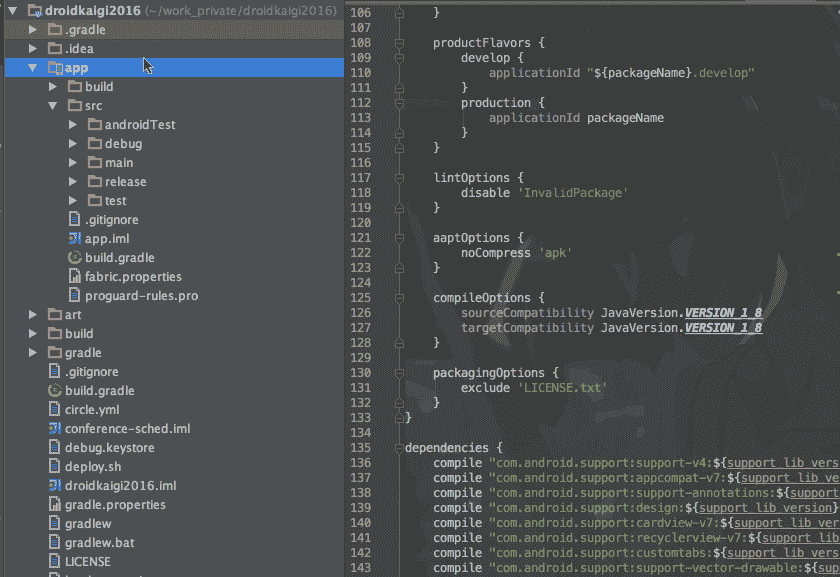

# 20.NyanProgress

最后但并非最不重要的是，我们有一个漂亮的进度条，让你在 Gradle 构建和重建公司。无尽的等待时间会让任何开发人员感到沮丧。幸运的是，NyanProgress 将我们最喜欢的 NyanCat 带到了彩色的进度条上，让等待变得更有趣。不用再想格雷尔的建造是否已经冻结了！

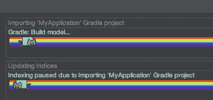

# 结束语

记住，在你的 IDE 中添加过多的插件并不会真正加速你的工作流程。相反，它可能会大大降低您的 Android Studio 的性能。作为结束语，我建议挑选一些插件，并尝试将它们融入到您的日常工作中。

在我们刚刚浏览的 20 个插件中，我最喜欢的三个是:Name That Color、SQLDelight 和 CodeGlance。一定要让我知道你的！

那是一个包裹。我希望你喜欢它——感谢阅读。如果你喜欢这个故事，这里还有一个你可能会喜欢的:

 [## 20 个 Android Studio 快捷方式加速您的工作流程

### 多光标、代码生成、高效搜索等等

medium.com](https://medium.com/better-programming/20-android-studio-shortcuts-to-accelerate-your-workflow-4642cb335a96)