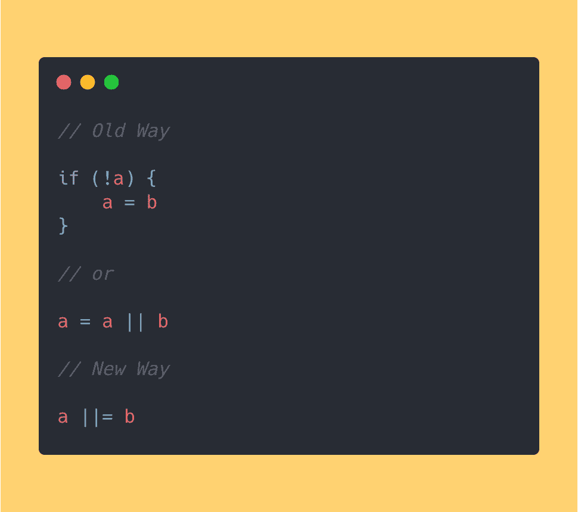
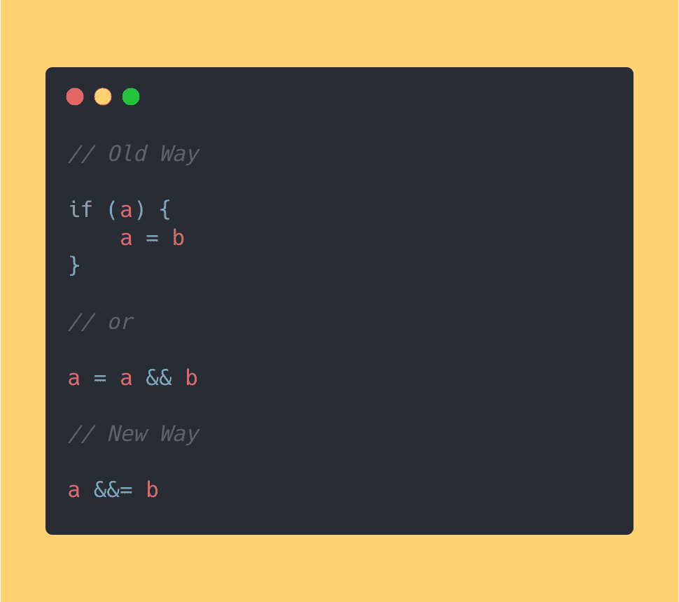
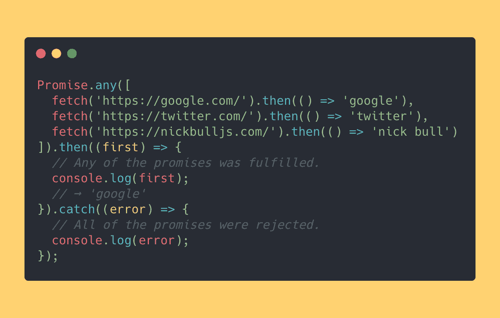
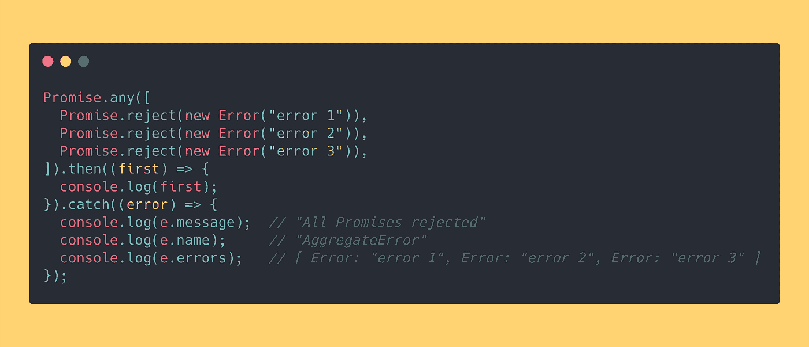
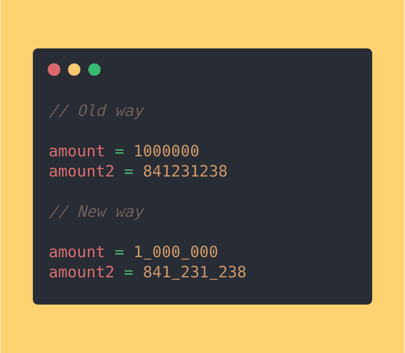

# 我对 JavaScript ES 2021 (ES 12)的三大新特性感到兴奋

> 原文：<https://betterprogramming.pub/the-top-3-new-javascript-es-2021-es-12-features-im-excited-about-a3ac129efbb2>

## 逻辑赋值运算符、Promise.any 和数字分隔符

照片由[沙哈达特·拉赫曼](https://unsplash.com/@hishahadat?utm_source=medium&utm_medium=referral)在 [Unsplash](https://unsplash.com?utm_source=medium&utm_medium=referral) 上拍摄。

多亏了 Babel，我已经使用 ECMAScript 2021 的新特性一年多了。几乎所有的特性都很有用，但是其中三个非常突出，为我节省了大量时间，并且使我的代码更具可读性。

让我们检查一下。

# 1.逻辑赋值运算符

逻辑赋值运算符将逻辑运算(如`??`、`&&`或`||`)与赋值(如`=`)结合起来。

这里有一些例子。

如果`a`为真，则`a ||= b`返回`a`，如果`a`为假，则返回`b`。

如果`a`为真，则`a &&= b`返回`b`，如果`a`为假，则`a`返回。

`a ??= b`如果`a`为`null`或`undefined`则返回`b`，如果`a`为真则返回`a`。

起初，在代码审查期间立即理解这些操作员做什么有点棘手，但是几个星期后，团队中的每个人都掌握了窍门。

# 2.承诺。任何

`Promise.any`接受一系列承诺，并在任何提供的承诺得到解决后立即解决。

这听起来很难，所以这里有一个例子:

我们同时提出三个请求。当其中一个请求解析后，`Promise.any`也会解析并在控制台中记录第一个解析的请求(在我们的例子中，是 Google)。

如果所有的承诺都被拒绝，`Promise.any`抛出一种新的错误:`AggregateError`。

它的新特点是`AggregateError`对象表示一个错误，其中几个错误被包装在一个错误中。

这是它的样子:

`e.errors`是`errors`对象的数组。

# 3.数字分隔符

数字分隔符使我们能够在数字文本中用下划线(`_`)分隔千位。

怎么有用？这使得我们的代码更加丰富，可读性更强。

这里有一个例子:

# 结论

感谢阅读！

如果您现在想尝试 ES2021 的这三个新功能，您可以使用这些 Babel 插件:

*   [逻辑赋值运算符](https://babeljs.io/docs/en/babel-plugin-proposal-logical-assignment-operators)
*   [数字分隔符](https://babeljs.io/docs/en/babel-plugin-proposal-numeric-separator)

干杯，

–[刻痕](https://twitter.com/nickbulljs)

如果你喜欢这篇文章，你需要知道，每周一，我都会给 4000 多名 web 开发人员发一封信，里面有 3 篇来自技术世界的精选文章、2 篇 Web 开发指南和 1 篇本周最佳 Tweet

***“你的通迅真是混账牛逼*** *，真是尼克。这给了我一周的良好开端，让我学到了很多重要的知识。”*

在这里 **加入免费获得短小精悍知识信的聪明开发者 [**。**](https://nickbulljs.com/3-2-1/)**