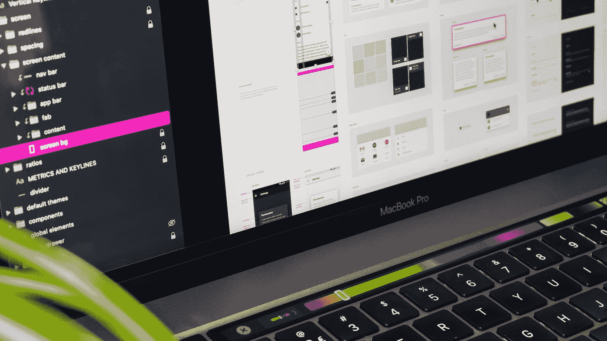

# 面向初学者的 3 大 React UI 库

> 原文：<https://betterprogramming.pub/the-top-3-react-ui-libraries-for-beginners-6987f7b62c78>

## 我最喜欢的 React UI 库的优缺点



蒂尔萨·范·迪克在 [Unsplash](https://unsplash.com?utm_source=medium&utm_medium=referral) 拍摄的照片。

今年年初，我决定将我的 JavaScript 技能提升到一个新的水平。厌倦了 [jQuery](https://jquery.com/) ，我开始寻找更快、更现代、更可靠的。

我选择了 [React](https://reactjs.org/) ，它在 [Stack Overflow](https://stackoverflow.com/) 的 [2020 开发者调查](https://insights.stackoverflow.com/survey/2020)中被参与的 65K 开发者票选为最受喜爱和最想要的 JavaScript 框架。

关于 React，我学到(也喜欢)的第一件事是，由于它的流行，你不需要重新发明轮子。有无数的 UI 套件为你准备好了。毫不奇怪，许多开发人员构建了 React 库，提供了几个组件来帮助您改进应用程序的 UI。

在本文中，我将向您展示三个 React UI 库，根据我的经验，我会建议任何人从这三个库开始。

# 反应引导

`[react-bootstrap](https://www.npmjs.com/package/react-bootstrap)`提供用世界上最流行的 CSS 框架构建的 React 组件: [Bootstrap](https://getbootstrap.com/) 。

> [“React-Bootstrap](https://react-bootstrap.github.io/)替换 Bootstrap JavaScript。每个组件都是作为真正的 React 组件从头开始构建的，没有像 jQuery 这样不必要的依赖。作为最古老的 React 库之一，React-Bootstrap 已经随着 React 一起发展壮大，成为您 UI 基础的绝佳选择。”— [反应引导](https://react-bootstrap.github.io/)

## 装置

要[安装 React 引导程序](https://react-bootstrap.github.io/getting-started/introduction/)，运行以下命令:

```
npm i react-bootstrap
```

## 例子


## 开源代码库

[](https://github.com/react-bootstrap/react-bootstrap) [## 反应自举/反应自举

### 用 React 构建的 Bootstrap 4 组件。请参阅带有实时可编辑示例和 API 文档的文档。至…

github.com](https://github.com/react-bootstrap/react-bootstrap) 

## 赞成的意见

*   提供容器、行和列来布局和对齐内容，就像在 [Bootstrap 的网格系统](https://react-bootstrap.github.io/layout/grid/)中一样。
*   完全响应。
*   居然[请战](https://react-bootstrap.github.io/getting-started/introduction/)。
*   原生支持 Bootstrap 4 主题。

## 骗局

*   仅仅几十个[组件](https://react-bootstrap.github.io/components/alerts/)。
*   属性太少。

## 定论

对于以前从未使用过 React 但知道 Bootstrap 如何工作的人来说，这可能是一个不错的选择。不过我只会在处理 [Bootstrap 的网格系统](https://getbootstrap.com/docs/4.0/layout/grid/)的时候推荐。

# 反应套件

是一套基于合理 UI 设计的 React 组件。

> “React Suite 是 React 组件库，专为中间平台和后端产品而设计。致力于创造贴心的交互设计，同时为开发者提供友好的开发体验。”— [反应套件](https://rsuitejs.com/guide/introduction)

## 装置

要[安装 React Suite](https://github.com/rsuite/rsuite#installation) ，运行以下命令:

```
npm i rsuite --save
```

## 例子


## 开源代码库

[](https://github.com/rsuite/rsuite) [## rsuite/rsuite

### English | 中文版 React Suite is a set of react component libraries for enterprise system products. It is a…

github.com](https://github.com/rsuite/rsuite) 

## 赞成的意见

*   一大堆组件。
*   [可定制主题](https://rsuitejs.com/guide/themes/)。
*   [阿拉伯语和希伯来语原生支持](https://rsuitejs.com/guide/rtl/)。

## 骗局

*   记录不全。

## 定论

我认为 React Suite 是我迄今为止尝试过的最好的 React UI 库之一，但由于缺乏文档(尤其是如果你不是以中文为母语的人)，我不能推荐它作为初学者的首选。

# 蚂蚁设计

`[antd](https://www.npmjs.com/package/antd)`是一个 React UI 库，包含几个按照 [Ant 设计规范](https://ant.design/docs/spec/introduce)设计的高质量组件。

> “Ant Design 是一种企业级 UI 设计语言和 React UI 库，具有一组高质量的 React 组件，是企业最佳的 React UI 库之一。”— [蚂蚁设计](https://ant.design/)

## 装置

要[安装 Ant Design](https://ant.design/docs/react/introduce) ，运行以下命令:

```
npm install antd
```

## 例子


## 开源代码库

[](https://github.com/ant-design/ant-design) [## 蚂蚁设计

### English | Português | 简体中文 🌈 Enterprise-class UI designed for web applications. 📦 A set of high-quality React…

github.com](https://github.com/ant-design/ant-design) 

## 赞成的意见

*   [大量组件](https://ant.design/components/overview/)。
*   官方文档中有很多例子。
*   被许多公司使用(完整的列表可以在[文档](https://ant.design/docs/react/getting-started)中找到)。

## 骗局

*   [几乎无法定制](https://ant.design/docs/react/customize-theme)。

## 定论

Ant Design 是迄今为止我首选的 React UI 库。它有几十个组件，每个组件都有许多不同的属性。官方文档写得很好，很完整，并且充满了工作示例。根据我的经验，我认为`antd`是初学者的最佳选择。

# 额外的

如果您是 React 的初学者，您可能也会对以下文章感兴趣:

[](https://codeburst.io/a-complete-guide-to-props-children-in-react-c315fab74e7c) [## 反应中的道具.儿童完全指南

### 掌握 React 组件组成

codeburst.io](https://codeburst.io/a-complete-guide-to-props-children-in-react-c315fab74e7c) [](https://codeburst.io/deploying-and-hosting-a-react-app-on-an-apache-server-b7121dffb07a) [## 在 Apache 服务器上部署和托管 React 应用程序

### 你甚至可以在共享主机上运行 React 应用程序！

codeburst.io](https://codeburst.io/deploying-and-hosting-a-react-app-on-an-apache-server-b7121dffb07a) [](/how-to-correctly-build-a-multi-environment-react-app-6ba4878e98ba) [## 如何正确构建多环境 React App

### 为每个环境保留一个专用的构建文件夹

better 编程. pub](/how-to-correctly-build-a-multi-environment-react-app-6ba4878e98ba) 

# 结论

尽管您可以在项目中使用多个 React UI 组件库，但坚持使用一个可能是更好的方法。掌握一个 React UI 库意味着能够超级快速地构建优秀的界面。有许多不同的选择，但是根据我的经验，我给出的三个是最好的选择。

感谢阅读！我希望这篇文章对你有所帮助。如有任何意见或建议，请随时联系我。