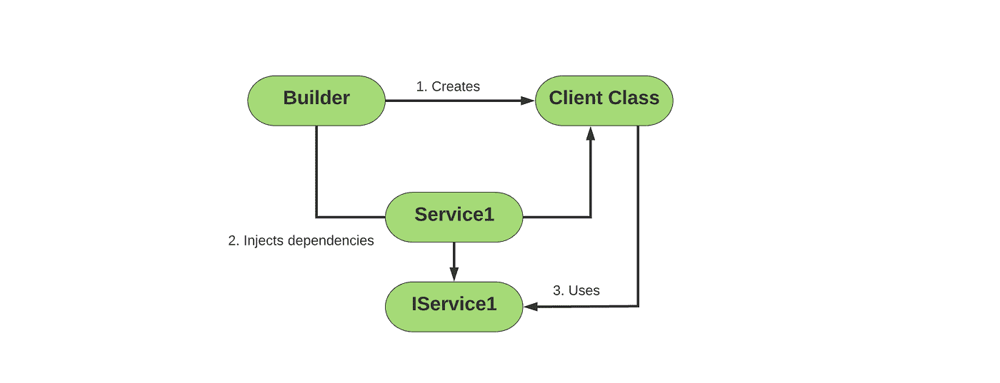
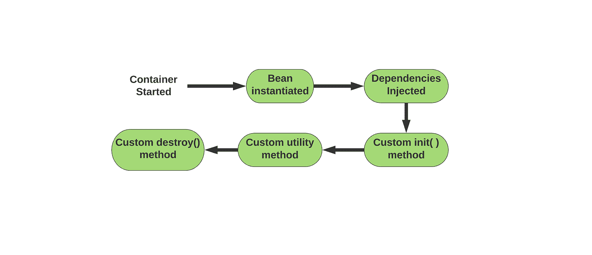
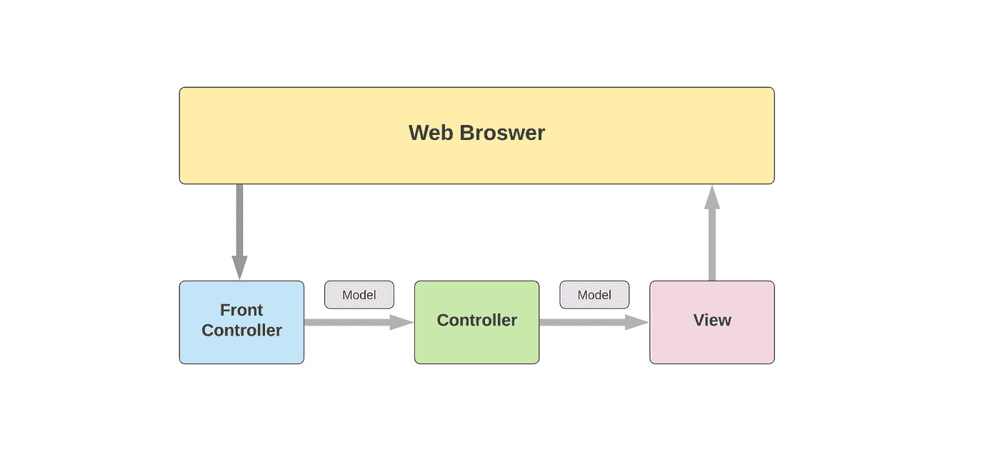
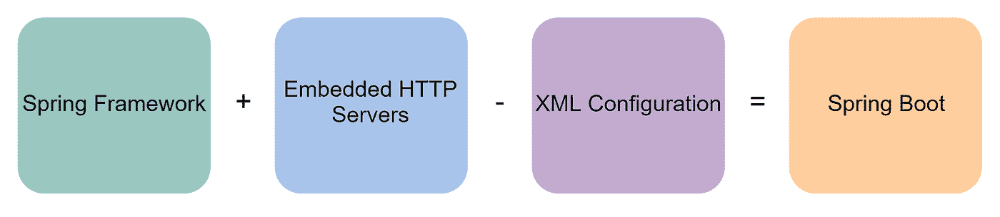
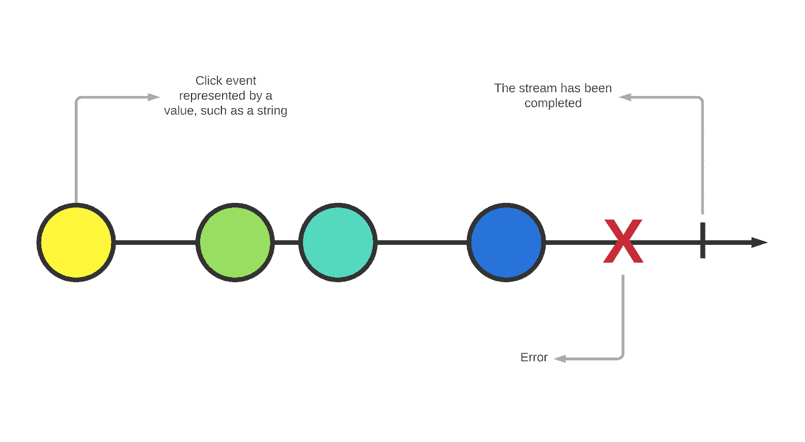
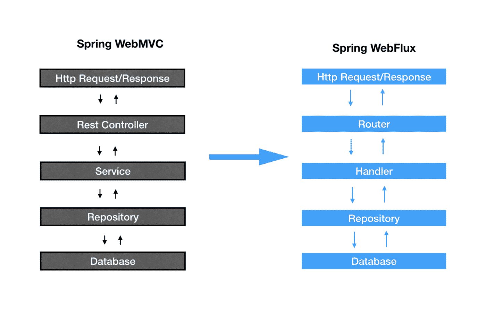

# Spring Boot 访谈的前 40 个问题

> 原文：<https://betterprogramming.pub/the-top-40-questions-from-spring-boot-interviews-50660eaf74a>

## 为你的下一次 Spring Boot 面试做好准备


图片来源:作者

Spring 框架使 J2EE (Java 2 平台企业版)开发变得更加容易，并被用来创建可测试的、高性能的、可重用的代码。由于其模块化和依赖注入特性，Spring 通常应用于信息技术和金融领域。

对于希望在麻省理工学院、埃森哲或 Visa 等公司工作的开发人员来说，金融技术是一个令人兴奋的不断发展的领域，这些公司更喜欢 Spring 而不是 Java EE。这些公司正在寻找像您这样有 Spring 框架经验的开发人员来帮助数字化他们的企业需求。

*但是，你怎么知道你是否准备好了面试呢？你是如何准备的？*

今天，我们将浏览 40 个春季面试问题的学习指南，以确保你准备好赢得春季框架面试。

**下面是我们今天要讲的内容:**

*   什么是 Spring 框架？
*   从 Spring 框架面试中可以期待什么
*   Spring 框架的 40 大问题
*   总结和接下来要学习的内容


# 什么是 Spring 框架？

Spring 框架是一个用 Java 编写的开源应用框架和反转控制容器。它旨在通过自动处理低级功能来简化应用程序设计。这使得开发人员可以专注于业务逻辑。Spring 也非常适合许多扩展模块，这些模块增加了框架的功能。

虽然 Spring 并没有强加一个特定的编程模型，但是作为对**企业 JavaBeans 模型(EJB)** 的补充，它已经在 Java 社区中获得了广泛的流行。这部分是由于 Spring 独特的功能选择，比如控制反转和**面向方面编程(AOP)** ，这些都非常适合与 beans 一起工作。

由于其速度、安全性和易于构建的交易系统，该框架特别适合于企业和金融应用。与 Java EE 或其他基于 Java 的框架相比，Spring 框架提供了许多优势，例如:

*   Spring 使你能够用 POJOs 开发企业级应用，所以你不需要另一个 EJB 容器产品。
*   Spring 为本地事务和全局事务提供了一致的、可伸缩的事务管理接口。
*   Spring 是以模块化的方式组织的。它的 web 框架是一个轻量级的 web MVC 框架。
*   Spring 创新性地使用了现有的技术，比如 ORM 框架、JEE 和 JDK 定时器。
*   在春天测试一个应用程序是很容易的。
*   Spring 提供了一个优秀的 API，所以很容易处理特定于技术的异常。

# 从 Spring 框架面试中可以期待什么

大多数寻找 Spring 框架专业知识的公司都是金融公司，比如银行和投资公司。春季求职者的一些顶级雇主是花旗银行、易贝、维萨和摩根大通。

这些公司对使用 Spring 来保护和优化他们的会计和销售堆栈很感兴趣。因此，大多数面试问题会测试你对这些特性的了解，比如依赖注入、面向方面编程和 MVC T2。

还会有一些一般性的问题，以确保你完全理解 Spring 的每个部分，比如命名 web 应用程序开发或数据库连接中使用的模块。

最后，你肯定会被问到一些重要的问题，比如为什么使用 Spring，它提供了什么好处。为了帮助你做好准备，我们收集了 40 个顶级面试问题来更新你对这些类别的知识。

*我们开始吧！*

# Spring 框架的 40 大问题:

## 1.春天有什么好处？

*   **轻量级:** Spring 在资源使用上是轻量级的，基本的 Spring 框架只需要 2MB 的存储。
*   可扩展: Spring 的事务管理接口可以扩展到单个数据库上的本地事务，也可以扩展到使用 JTA 模块的全局事务
*   **异常处理:**由于每个模块中有大量的 API 资源用于处理异常，所以异常处理很容易。
*   **分层架构:**允许你使用程序中你需要的部分，丢弃其余部分。
*   **POJO Enabled:** 普通的旧式 Java 对象编程允许您进行持续的可测试性和集成。
*   **开源:**对所有人免费，没有厂商限制。
*   **控制反转(IOC):** 通过 IOC 实现松散耦合，允许对象依赖其他对象，而不是没有依赖对象。
*   **面向方面(AOP):** Spring 支持面向方面编程，这是一种将应用程序业务逻辑从系统服务中分离出来的范例。

## 2.Spring 的配置文件是什么？

Spring 的配置文件是一个包含项目类信息的`XML`文件。它们描述了每个类的配置，如何将它们介绍给其他类，以及整个程序的依赖性。

## 3.Spring 框架有哪些不同的模块？

总共有大约 20 个模块，分为核心容器、数据访问/集成、Web、AOP(面向方面编程)、工具和测试层。

**核心容器:**Spring 框架的核心包含四个模块。

*   弹簧芯
*   春豆
*   Spring 表达式语言
*   春天语境

**数据访问/集成:**支持五个模块的数据库交互。

*   JDBC (Java 数据库连接)
*   对象关系映射
*   OXM(对象 XML 映射器)
*   Java 消息服务
*   交易

**Web:** 增加了使用 4 个模块创建 Web 应用程序的支持。

*   网
*   Web — MVC
*   网络套接字
*   web-Portlet

**面向方面编程:**这一层允许你使用通知和切入点函数来解耦代码。

**插装:**这一层增加了对类插装和类加载器实现的支持。

**Test:** 增加了对使用 Junit 和 TestNG 进行测试的支持。

**其他:**这些层类别之外还有两个模块。

*   **方面:**允许 Spring 与方面集成。
*   **消息传递:**增加了对 STOMP 的支持，这是一个注释编程模型，并允许您从 WebSocket 客户端路由 STOMP 消息。

## 4.Spring 应用程序的不同组件是什么？

Spring 应用程序包含五个组件:

*   **接口:**定义程序功能。
*   **Bean 类:**包含属性、访问 Bean 的 setter 和 getter 方法、特定函数等。
*   **Spring Aspect-Oriented Programming(AOP):**包括横切关注点功能，这在面向对象编程中是不支持的。
*   **Bean 配置文件:**包含类的信息，如何配置，定义了它们的关系。
*   **用户程序:**调用程序中的函数

## 5.什么是依赖注入？

依赖注入(DI)是一个定义多个类应该如何连接的概念。这是控制反转的一个例子。使用依赖注入时，不需要在代码中显式地连接服务和组件。相反，您在一个`XML`配置文件中描述每个组件所需的服务，并允许 IOC 容器自动连接它们。



## 6.什么是 Spring IoC 容器？

IoC 容器创建、配置和连接对象，同时管理它们的生命周期。容器从用户给出的配置元数据中获取这些方面的指令。

## 7.国际奥委会有哪些类型？

*   BeanFactory 容器:这个工厂类包含一个预打包的 beanss 集合，当被客户端调用时，这些 bean 被实例化。这是支持 DI 的最基本的容器。
*   **ApplicationContext 容器:**该容器构建在 BeanFactory 容器之上，提供了额外的企业级功能。例如，ApplicationContext 容器授予解析文本消息和发布应用程序事件的能力。

## 8.什么是面向方面编程(AOP)？

AOP 是一种编程技术，它允许程序员模块化行为，这种行为在面向对象编程中的典型职责划分中使用。方面的核心 AOP 结构是跨类适用的行为。将这些行为从单个 beans 提取到方面，可以很容易地重用它们。

## 9.春豆是什么？

Beans 是在将配置元数据传递给 IOC 容器时从配置元数据创建的对象。它们构成了所有 Spring 程序的基础。IOC 容器实例化、配置、连接和管理每个 bean。

## 10.ApplicationContext 的常见实现有哪些？

三种最受欢迎的容器是:

*   **file systemxmlaplicationcontext:**使构造函数从 XML 配置文件中加载 bean 定义。必须用完整的文件路径指向。
*   这个容器做的和上面一样，但是不需要完整的文件路径。相反，您设置了`CLASSPATH`属性，并允许容器在那个`CLASSPATH`处找到`XML`。
*   **webxmlaplicationcontext:**将所有 bean 定义从`XML`文件加载到 web 应用程序。

## 11.BeanFactory 和 ApplicationContext 有什么区别？

BeanFactory 是一个基本的、节省空间的容器，功能有限。它最适合用于简单的任务或使用资源较少的机器。

ApplicationContext 是一个高级的、更密集的容器，具有扩展的接口和 AOP 之类的附加功能。当您需要比 BeanFactory 更多的功能，并且机器上有足够的可用资源时，最好使用这个容器。

## 12.如何在 Spring 应用程序中添加 bean？

我们必须注释一个方法:`@Bean`注释。当 JavaConfig 遇到该方法时，它将执行该方法并将返回值注册为 BeanFactory 中的 bean。

```
package io.educative;

  public class User {

     private String name;
     private String address;

     public String getName() {
        return name;
     }
     public void setName(String name) {
        this.name = name;
     }
     public String getAddress() {
        return address;
     }
     public void setAddress(String address) {
        this.address = address;
     }
  }
```

## 13.Spring 支持哪些 bean 作用域？

Spring 支持五种 beans 作用域:

*   **Singleton:** 将 bean 定义限制为每个 Spring IoC 容器的一个实例
*   **Prototype:** 限定单个 bean 的范围，以支持任意数量的实例。
*   **请求:**将 bean 定义的范围限定为 ApplicationContext 中的单个 HTTP 请求
*   **会话:**将 bean 定义的范围限定为 ApplicationContext 中的 HTTP 会话
*   **全局会话:**将 bean 定义的范围限定为全局 HTTP

## 14.Bean 生命周期的步骤是什么？



Bean 生命周期有七个步骤:

1.  **实例化:**Spring 容器使用在`XML`配置文件中找到的 bean 定义实例化 bean。
2.  **填充属性:** Spring 使用依赖注入从`XML`文件中填充所有已定义的属性。
3.  **设置 bean 名称:**如果 bean 使用`BeanNameAware`接口，Spring 会将 Bean 的标识符传递给`setBeanName()`方法。
4.  **设置 bean 工厂:**如果 Bean 被配置为使用`BeanFactoryAware`接口，Spring 会将`beanfactory`传递给`setBeanFactory()`方法。
5.  **预初始化:** Spring 使用`postProcessorBeforeInitialization()`方法调用任何与 bean 相关联的`BeanPostProcessors`。
6.  **初始化:**然后对 bean 进行初始化。遵循`init-method`中规定的任何特殊初始化过程。
7.  **Post 初始化:**调用所有定义的`postProcessAfterInitialization()`方法。现在 bean 完成了。实现`DisposableBean`的 Beans 将在它们的任务完成后使用`destroy()`删除。

## 15.春季讲解内豆

内部 bean 被用作另一个 bean 的属性。内部 beans 可以在配置文件`XML`中的`<property>`或`<constructor-arg>`元素下定义。所有内部 beans 的作用域总是为`prototype`，并且没有标识符。

## 16.什么是 bean 自动布线？

这是一个 Spring 功能，允许 Spring 容器通过查看 BeanFactory 来自动设置协作 beans 之间的依赖关系。可以将自动连接设置为使用 beans 的名称或类型甚至类构造函数来定义这些关系。

## 17.如何在 Spring 中注入一个 Java 集合？

Java 集合可以通过四种不同的方式注入:

*   `**<list>**` **:** 帮助您连接列表等值集，同时允许重复。
*   `**<set>**` **:** 帮助您连接一组值，同时避免重复。
*   `**<map>**` **:** 允许你注入任意数据类型的键值对集合。
*   `**<props>**` **:** 允许你注入一个键-值对的集合，这个集合既有键又有类型`String`的值。

## 18.什么是连接点？

连接点代表程序中采取行动的任何一点。连接点的例子包括处理异常或执行方法的时候。当使用 AOP 时，只有方法执行是连接点。

## 19.春天的忠告是什么？

通知是在给定连接点采取的动作。在方法执行完成之前，AOP 使用通知作为拦截器。

## 20.对 Spring 框架的建议有哪些类型？

*   **Before:** 这些是在连接点方法之前执行的通知。它们用`@Before`注释标记。
*   **返回后:**这些在连接点的方法没有问题地执行完之后执行。它们用`@AfterReturning`注释标记。
*   **抛出后:**只有当连接点方法因抛出异常而结束时，这些才会执行。它们用`@AfterThrowing`注释标记。
*   **After:** 这些在连接点方法之后执行，不管它如何完成。它们用`@After`注释标记。
*   **Around:** 这些在连接点前后执行，并用`@Around`注释标记。

## 21.什么是编织？

Spring 中的编织是将元素链接到其他应用程序类型或对象以创建建议对象的过程。这是在运行时完成的。

## 22.描述弹簧刀支持

数据访问对象(DAO)支持是一组工具，它们使得使用数据访问技术(如 Hibernate 和 JDO)更加容易，并提高了一致性。它还自动捕捉特定于技术的错误。这些使得 Dao 更容易使用，并允许您在持久性技术之间正确地切换。

## 23.什么是 JDBC？Spring JDBC API 中有哪些类？

JDBC 代表 Java 数据库连接。它是 Java 中的一个应用程序编程接口，用于定义程序如何访问数据库。JDBC API 包含:

*   `JdbcTemplate`
*   `NamedParameterJdbcTemplate`
*   `SimpleJdbcCall`
*   `SimpleJdbcInsert`
*   `SimpleJdbcTemplate`

## 24.什么是 Spring 模型-视图-控制器(MVC)框架？

Spring MVC 框架提供了模型-视图-控制器架构和预制组件，用于开发松散耦合的 web 应用程序。使用 MVC，您可以分离程序的不同方面，如业务、输入和 UI 逻辑，同时仍然保持它们之间的松散耦合。这为您的 web 应用程序提供了更大的灵活性。



## 25.Spring MVC 框架由哪些部分组成？

MVC 的三个主要部分是:

*   **dispatcher servlet:**MVC 的这一部分管理所有与程序交互的 HTTP 请求和响应。`DispatcherServlet`首先从配置文件中接收相关的处理程序映射，然后将请求传递给控制器。`DispatcherServlet`是 Spring Web MVC 框架中最重要的部分。
*   **WebApplicationContext:** 这是普通 ApplicationContext 的扩展，具有 web 应用程序所需的额外特性。它可以唯一地解析主题，并自动决定与哪个 servlet 相关联。
*   **控制器:**这些是`DispatcherServlet`中的 beans，充当用户输入和应用程序响应之间的过滤器。控制器接受用户输入，决定是否应该将其转换为视图或模型，最后将转换后的输入返回给视图解析器进行检查。

## 26.DispatcherServlet 有哪些不同的部分？

1.  **处理程序映射:**定义处理程序和请求对象之间映射的接口。可用于创建自定义映射策略。
2.  **控制器:**根据输入请求的预期结果对其进行排序，从而决定应用程序对用户输入的响应。输入要么立即随视图返回，要么在传递给视图解析器之前转换成模型。
3.  **视图解析器:**通过视图名称和实际视图之间的映射，从控制器获取并渲染模型。

## 27.春天怎么开启标注接线？

为了允许注释连接，在您的`XML`配置文件中包含`<context:annotation-config/>`:

```
<beans
    //...
    xmlns:context="http://www.springframework.org/schema/context"
    //...
    http://www.springframework.org/schema/context
    http://www.springframework.org/schema/context/spring-context-2.5.xsd">
    //...

    <context:annotation-config /> //annotation wiring enabled here
    //...
</beans>
```

## 28.什么是 Spring Boot？

Spring Boot 是一个用于创建微服务的开源 Java 框架。这是一个构建在 Spring 之上的项目，旨在简化部署 Java 应用程序的任务。它的两个主要组件是 Spring 框架和嵌入式 HTTP 服务器。Spring Boot 习惯于:

*   简化开发生产就绪的 Spring 应用程序的过程
*   避免在春季配置`XML`
*   通过减少所需导入语句的数量来缩短开发时间
*   提供自以为是的开发方法

这些通常用于让 Spring 应用程序快速运行。



## 29.什么是反应式编程？

反应式编程是一种编程范式，它依赖于事件触发的编程动作，而不是基于代码的时间顺序。反应式程序可以有效地利用计算机资源，并且只需要几个线程就可以很好地扩展。它的非顺序形式允许您避免堆栈阻塞并保持响应。



## 30.什么是 Spring Webflux？

Webflux 是一个反应式 web 框架，是 MVC 的替代方案。Webflux 提供了更好的可伸缩性，防止了堆栈阻塞。



*资料来源:Prabu Subra on Medium*

## 31.WebClient 和 Webtestclient 有什么区别？

`WebClient`是 Web Reactive framework 的一个组件，它使构建反应式和非阻塞的 Web 应用程序变得更加容易。

`Webtestclient`是该客户端的一个版本，具有所有相同的功能，但与真实环境断开连接。测试客户机不需要 HTTP 服务器活动环境就能工作，这使它成为新应用程序的良好测试环境。它可以通过 HTTP 连接连接到任何服务器，或者直接与 WebFlux 同步，以应用模拟 HTTP 请求并生成响应对象。

## 32.Spring Boot 能允许在同一个应用程序中使用 Spring MVC 或 Spring WebFlux 吗？

Boot 允许两者在同一个应用程序中运行，但一次只能运行一个。WebFlux 是一个非阻塞框架，而 MVC 是一个阻塞框架，这使得它们不兼容。

## 33.Spring 5 能和 Jdk9 模块化集成吗？

是的，Spring 5 可以和 Jdk9 集成。你可以这样做:

**创建一个新类**

```
package com.hello;
public class HelloWorld {
    public String sayHello(){
        return "HelloWorld";
    }
}
```

**创建新模块**

```
module com.hello {
    export com.hello;
}
```

**创建一个新的 Java 项目**

```
module com.hello.client {
    requires com.hello;
}
```

**测试新模块**

```
public class HelloWorldClient {
    public static void main(String[] args){
        HelloWorld helloWorld = new HelloWorld();
        log.info(helloWorld.sayHello());
    }
}
```

## 34.春天的代理是什么？

代理是在将建议应用到目标对象后创建的对象。代理用于执行元编程操作，如拦截对象调用或改变对象的属性。

## 35.什么时候目标对象和代理对象是一样的？

这是一个“陷阱”问题，用于测试您是否知道不同的对象类型如何交互。当处理客户端对象时，目标和代理对象是相同的。

## 36.如何将配置元数据提供给 Spring 容器？

**基于 XML 的配置:**这种类型的配置将程序的所有 bean 定义和依赖项存储在一个`XML`文件中。这些文件是通过提供完整的文件路径导入的，如下面的第 1 行。

```
<bean id="bean1" class="io.Educative.firstSpring.Bean1">
 <property name="name" value="Educative"></property>
</bean>
```

**基于注释的配置:**您可以在 bean 中的类、方法或字段上创建注释，以将其放置在组件类中。

```
<beans>
<context:annotation-config/>
<!-- bean definitions go here -->
</beans>
```

**基于 Java 的配置:**这种类型的配置允许您跳过`<bean>`语法，而是使用`@Bean`标签来实现同样的事情。您还可以创建带有`@Configuration`标签的配置类，允许您通过调用其他`@Bean`类来创建 beans 之间的依赖关系。

```
@Configuration
public class BeanConfig
{ 
@Bean
public Bean1 myBean() 
{ return new Bean1(); }
}
```

## 37.Spring DAO 类可能抛出的异常有哪些？

*   `DataAccessResourceFailureException`
*   `CleanUpFailureDataAccessException`
*   `InvalidDataAccessApiUsageException`
*   `InvalidDataAccessResourceUsageException`
*   `UncategorizedDataAccessException`
*   `DataIntegrityViolationException`
*   `DeadLockLoserDatAccessException`
*   `OptimisticLockingFailureEexception`
*   `IncorrectUpdateSemanticsDataAccessException`
*   `TypeMismatchDataAccessException`
*   `ObjectRetrievalFailureException`
*   `DataRetrievalFailureException`

## 38.使用 Spring 可以通过哪些方式访问 Hibernate？

Hibernate ORM 是一个面向 Java 的对象关系映射框架。它与 Spring 一起使用，将面向对象的领域模型映射到关系数据库。在 Spring 中，可以通过以下两种方式访问 Hibernate:

1.  首先，扩展`HibernateDAOSupport`，然后应用一个 AOP 拦截器节点
2.  对 Hibernate 模板和回调结构使用控制反转

## 39.指出 Spring AOP 中关注点和横切关注点的区别？

一个关注点是我们试图在应用程序的一个特定的模块中实现的目标功能。

横切关注点是在整个应用程序中使用的关注点，而不仅仅是在特定的模块中。

数据记录是横切关注点的一个很好的例子，因为不管它在哪个模块中，记录都是有用的和需要的。

## 40.Spring 中可用的事务管理类型有哪些？

**声明式事务管理:**这种类型使用注释或`XML`配置来管理事务，将事务管理从程序的业务代码中分离出来。虽然易于维护，但这种风格在功能上受到更多限制。

**程序化交易管理:**这种类型通过专门制定的程序来管理交易。这些程序的定制允许更灵活的管理，但是在过程中引入了更大的误差空间。

# 总结和接下来要学习的内容

恭喜你完成这 40 个春季框架面试问题。与任何面试一样，春季面试的成功取决于你的准备、各种面试问题的练习、春季项目的经验以及对行为面试技巧的熟悉。

在深入学习 Spring 之前，一定要刷新自己的 Java 知识。

即使你第一次没有得到工作机会，经验和曝光会帮助你在再次申请时脱颖而出。最重要的是保持自信，相信你值得这份工作！您可以探索一些项目，将您的 Spring 知识付诸实践:

*   敏捷快递
*   春暖花开
*   图都列表
*   Spring 富客户端
*   Java 小型企业平台

*快乐学习！*