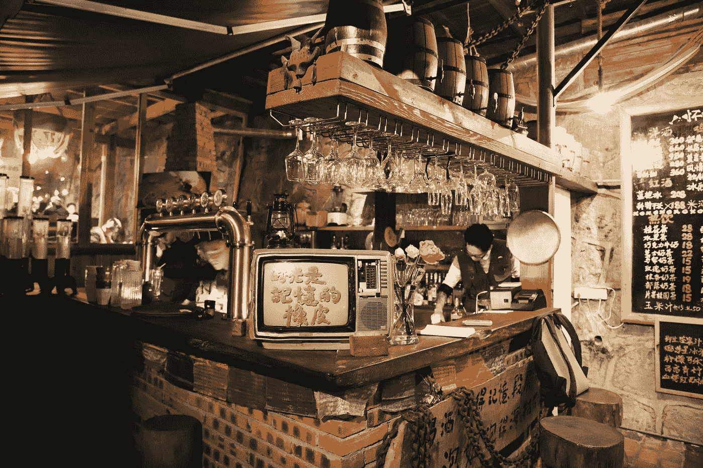
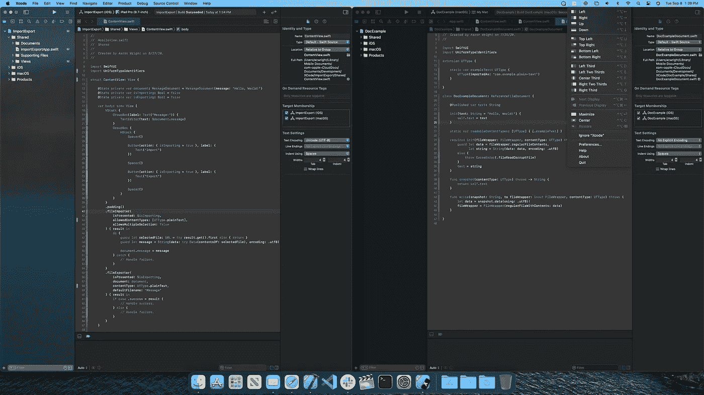
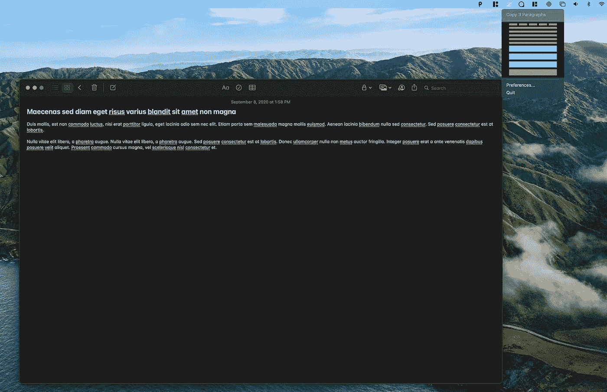
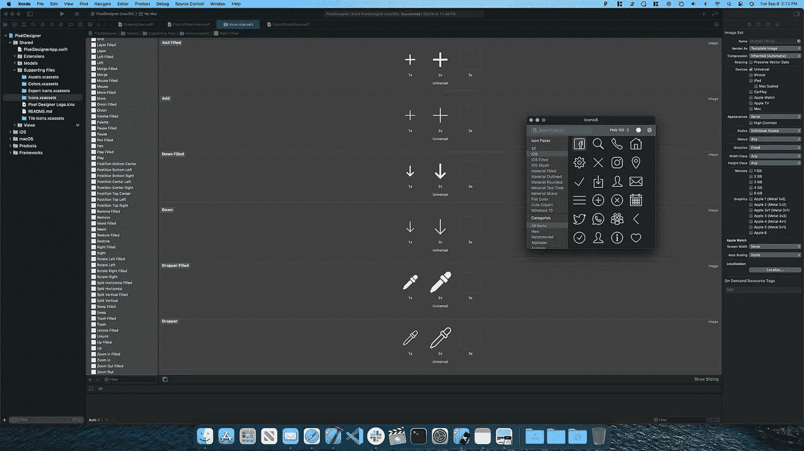
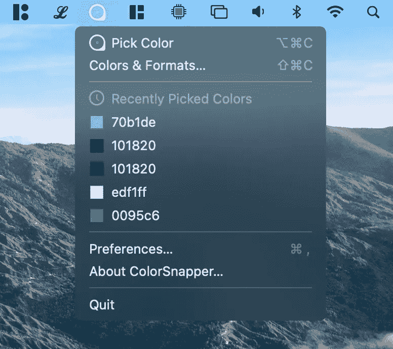
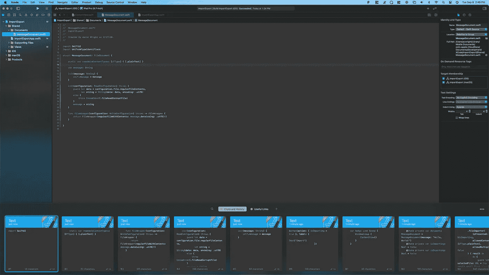

# 面向 macOS 开发者的 5 大菜单栏应用

> 原文：<https://betterprogramming.pub/the-top-5-menu-bar-apps-for-developers-on-macos-6e61c7b6a2a3>

## 利用菜单栏的力量来加速开发

[雷灿](https://unsplash.com/@wx1993?utm_source=medium&utm_medium=referral)在 [Unsplash](https://unsplash.com?utm_source=medium&utm_medium=referral) 上拍照。

在开发过程中，我经常发现我的屏幕空间非常珍贵。通常，我会在 iMac 上打开不止一个窗口，而且经常是全屏显示。菜单栏应用程序在开发过程中可以节省大量的时间。它们可以在您的主应用程序上快速弹出，并提供对简单任务的快速访问，而不会中断您的工作流程。

以下是发现菜单栏应用程序的绝佳资源:

 [## MacMenuBar.com | 450 多个 Mac 菜单栏应用的精选目录

### 190 多个 Mac 菜单栏应用程序的精选目录。

macmenubar.com](https://macmenubar.com) 

如果你对在 SwiftUI 中创建自己的菜单栏应用感兴趣，我已经[写了一个关于这个主题的教程](https://medium.com/@acwrightdesign/creating-a-macos-menu-bar-application-using-swiftui-54572a5d5f87)。

事不宜迟，让我们来探讨一下每个开发人员都应该知道的菜单栏应用程序的前五名。

# 磁铁

用磁铁把两个窗户钉在一起。

作为一名开发人员，我经常需要将不同的应用程序窗口固定在一起。 [Magnet](https://medium.com/@acwrightdesign/creating-a-macos-menu-bar-application-using-swiftui-54572a5d5f87) 是 macOS 中对齐窗口的“杀手级应用”。虽然 macOS 提供了该应用程序提供的一些免费功能，但 Magnet 扩展了内置的窗口排列。如果你想把窗户分成三等份、三等份或四等份，Magnet 可以满足你。

# 小 Ipsum

从菜单栏中抓取 lorem ipsum 的片段。

当我开发一个新的 UI 时，一个经常出现的常见任务是在我的设计中添加占位符文本。 [LittleIpsum](https://apps.apple.com/us/app/littleipsum/id405772121?mt=12) 提供快速访问功能，可将 [lorem ipsum](https://en.wikipedia.org/wiki/Lorem_ipsum) 中的几个单词、句子或段落复制到剪贴板，其菜单栏界面既有创意又简单明了。不需要在网上搜寻占位符文本片段。只要从菜单栏快速抓取，继续工作！

# Icons8 Lite

使用 Icons8 Lite 将图标拖入 Xcode 非常简单。

我在开发新 UI 时的另一个常见障碍是需要高质量的按钮图标或其他 UI 元素。我曾经把我购买的图标文件夹放在我电脑的某个地方。每当我需要为一个用户界面寻找一个图标时，我就不得不在文件夹中搜寻。从 [Icons8 Lite](https://apps.apple.com/us/app/icons8-lite/id786188363?mt=12) 菜单栏应用程序中拖动我需要的图标的能力对我来说是一个改变！Icons8 Lite 提供了大量不同大小和格式的高质量图标，我可以从菜单栏快速访问这些图标。

# 彩色快照 2

ColorSnapper 2 会记住用户界面所需的颜色。

UI 设计的色彩管理可能是一件痛苦的事情。那种颜色所需的十六进制代码或 RGB 值是什么？[鲷鱼 2](https://apps.apple.com/us/app/colorsnapper-2/id969418666?mt=12) 可以帮你记忆。从屏幕上的任何地方选取一种颜色，ColorSnapper 2 会保留您最近选取的颜色，以便您可以从菜单栏快速将它们复制到剪贴板。对于整个操作系统来说，这是一个非常实用的工具，当你需要它的时候，你可以从菜单栏中找到它！

# 粘贴

满满一托盘使用粘贴的代码片段。

我对 macOS 剪贴板最大的抱怨之一是它缺乏对复制、检查和检索多个项目的支持。当我编码时，我通常需要一个比上次复制的东西更深的剪贴板堆栈！我想让剪贴板记住我复制的所有代码片段，以选择我要粘贴的代码片段。[贴](https://apps.apple.com/us/app/paste-clipboard-manager/id967805235?mt=12) app 解决了这些问题。它提供了一个托盘，您可以在其中检查所有已复制到剪贴板的项目，并快速检索和管理它们。

# 结论

菜单栏应用程序是在不中断工作流程的情况下快速完成任务的好方法。立即获取一些菜单栏应用程序，提高您的工作效率！

编码快乐！