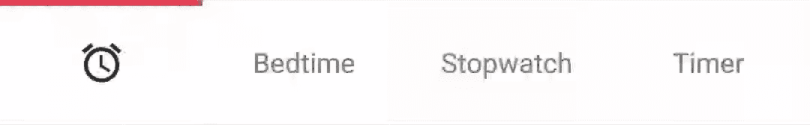
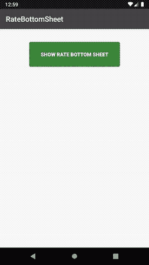
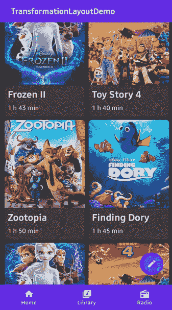
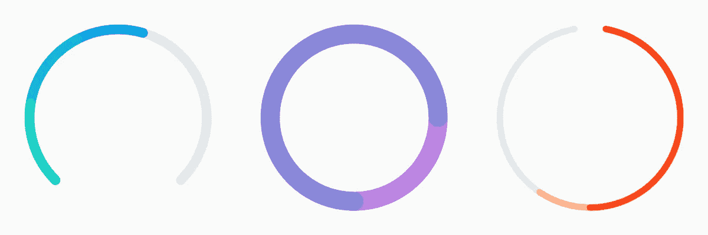
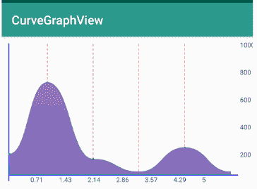

# 2020 年 Q1 前五大热门安卓库

> 原文：<https://betterprogramming.pub/the-top-5-trending-android-libraries-from-q1-2020-45deda73af0f>

## ANDROID 开发

## 新年的新热点


乔纳森·肯珀在 Unsplash[拍摄的照片](https://unsplash.com?utm_source=medium&utm_medium=referral)

我们即将迎来 2020 年第一季度末，Android 社区发生了很多事情。Android 11 开发者预览版已经发布，有很多新功能——但这不是本文的重点。

在[11 月](https://medium.com/better-programming/the-top-5-trending-android-libraries-in-november-cc0832aae4ce)和[12 月](https://medium.com/better-programming/5-android-libraries-to-inspire-the-designer-in-you-bbe000286cb9)版本之后，是时候看看 2020 年初发布的一些新的 Android 库了。吵吵闹闹的图书馆。

# 1.动画按钮栏

首先，我们有一个[动画底部工具栏库](https://github.com/Droppers/AnimatedBottomBar)。这允许您以编程方式以及通过 XML 添加和移除选项卡。

它还允许我们轻松地从`BottomBar`中截取标签。当限制访问应用导航中的高级区域时，拦截标签很有用。圆滑的动画提供了许多定制选项，从动画插值器到设置波纹效果。



```
<nl.joery.animatedbottombar.AnimatedBottomBar
    android:id="@+id/bottom_bar"
    android:background="#FFF"
    android:layout_width="match_parent"
    android:layout_height="wrap_content"
    app:abb_selectedTabType="text"
    app:abb_indicatorAppearance="round"
    app:abb_indicatorMargin="16dp"
    app:abb_indicatorHeight="4dp"
    app:abb_tabs="@menu/tabs"
    app:abb_selectedIndex="1" />
```

# 2.RateBottomSheet 工作表

让用户评价你的应用是在 Play store 和其他地方推广它的经典方式之一。这个库没有使用传统的警告对话框，这有时会打扰用户，[而是使用一个底部表单](https://github.com/lopspower/RateBottomSheet)来提示用户进行评级。底部表单极大地改善了应用程序的用户体验，因为它位于“拇指区”



```
RateBottomSheetManager(this)
    .setInstallDays(1) // 3 by default
    .setLaunchTimes(2) // 5 by default
    .setRemindInterval(1) // 2 by default
    .setShowAskBottomSheet(false) // True by default
    .setShowLaterButton(false) // True by default
    .setShowCloseButtonIcon(false) // True by default
    .monitor()

RateBottomSheet.showRateBottomSheetIfMeetsConditions(this)
```

# 3.转型布局

这里有一个[漂亮的库](https://github.com/skydoves/TransformationLayout)，用于设置活动、片段和视图之间的转换。它使用 [Material Design 的运动系统](https://material.io/design/motion/the-motion-system.html#)过渡模式来创建变形动画。

该库提供了用于绑定目标视图、设置渐变和路径运动方向的属性，以及许多其他定制选项。



# 4.油炸圈饼

这里有一个类似于[甜甜圈的图形视图库](https://github.com/futuredapp/donut)，能够用可分配的颜色显示多个数据集。凭借精细的粒度控制、间隙功能、动画选项和按比例缩放其值的能力，该库应该能够进入您的应用程序，显示统计数据，如每日目标等。



# 5.曲线图形视图

最后但同样重要的是，我们有一个[库来呈现一个曲线图形](https://github.com/swapnil1104/CurveGraphView)。除了统计数据之外，在基于投资的应用程序中，折线图还广泛用于显示股票价格。除了具有高性能和许多样式选项之外，这个库还支持单个平面内的多个线图。

多线图对于比较不同股票、共同基金、加密货币等的价格非常有用。



```
curveGraphView.configure(
        new CurveGraphConfig.Builder(this)
                .setAxisColor(R.color.Blue)                                             
                .setIntervalDisplayCount(7)                                             
                .setGuidelineCount(2)                                                   
                .setGuidelineColor(R.color.GreenYellow)                                 
                .setNoDataMsg("No Data")                                              
                .setxAxisScaleTextColor(R.color.Black)                                  
                .setyAxisScaleTextColor(R.color.Black)                                  
                .build()
        );
```

# 结论

我们已经看到了一系列最近发布的 Android 库，并讨论了它们可能的应用。

我希望这些能激发你想出自己的图书馆。

这一篇就到此为止——感谢阅读。