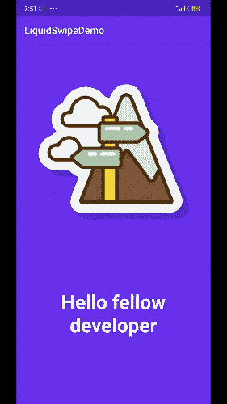
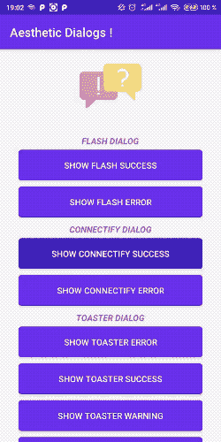
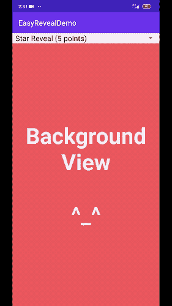

# 11 月的五大热门 Android 库

> 原文：<https://betterprogramming.pub/the-top-5-trending-android-libraries-in-november-cc0832aae4ce>

## 为您的 Android 应用程序带来最新的精华


由 [Rami Al-zayat](https://unsplash.com/@rami_alzayat?utm_source=medium&utm_medium=referral) 在 [Unsplash](https://unsplash.com?utm_source=medium&utm_medium=referral) 拍摄的照片

在我的[9 月](https://medium.com/better-programming/top-10-trending-android-and-ios-libraries-in-september-b2db51e94f6c)和[10 月](https://medium.com/better-programming/top-10-trending-android-and-ios-libraries-in-october-e7dd18f8b75b)版，涵盖了十大趋势 Android 和 iOS 库之后，这里是 Android 的 11 月版——带有一些很酷的动画和基于实用程序的库。

# 1.液体擦拭

这里有一个很棒的 [ViewPager 库](https://github.com/Chrisvin/LiquidSwipe)，当在 ViewPager 的不同片段之间导航时，它会显示波浪式的滑动动画。这个库的 USP 是它是触摸交互的。这意味着当在视图上显示类似液体的显示转变时，触摸事件被考虑在内。

要在您的应用程序中使用它，只需导入下面的 Gradle 依赖项并添加`LiquidSwipeLayout`作为包含片段布局的容器的根布局:

```
implementation 'com.github.Chrisvin:LiquidSwipe:1.3'
```



# 2.挥舞

这个[库](https://github.com/skydoves/Flourish)通过为视图和布局容器提供包装类，提供了一种显示/隐藏布局的酷方法。有了这些类，我们可以定制动画(正常、加速、弹跳)或者为布局方向设置我们自己的起始点(左上、右下等)。

这里有一个 Kotlin 丰富你的布局的例子:

```
val myFlourish = createFlourish(parentLayout) {
  setFlourishLayout(R.layout.layout_flourish_main)
  setFlourishAnimation(FlourishAnimation.ACCELERATE)
  setFlourishOrientation(FlourishOrientation.TOP_RIGHT)
  setIsShowedOnStart(true)
  setFlourishListener {  }
}
```


# 3.美学对话

这是一个漂亮时尚的[提醒对话框库](https://github.com/gabriel-TheCode/AestheticDialogs)，它目前支持六种不同的对话框用例，从连接到吐司横幅到临时 flash 和表情符号。

以下是显示连接对话框的示例:

```
AestheticDialog.showConnectify(this,"Message goes here", AestheticDialog.SUCCESS);
```



# 4.EasyReveal

另一个 [Chrisvin 的 Android 库](https://github.com/Chrisvin/EasyReveal)在这个月制造了一些噪音。这个提供了不同形状和大小的动画，并且能够从屏幕的不同部分定制动画的开始和结束。



# 5.Android ColorX

这个库以 Kotlin 扩展的形式提供了重要的颜色工具助手函数。它通过提供不同颜色格式(RGB、HSV、CYMK 等)之间的转换功能，使生活变得更加轻松。该库的 USP 是能够提供:

*   一种颜色的不同深浅和色调。
*   深色和浅色。
*   颜色的补色和类似版本。

```
val color = Color.parseColor("#e91e63")

val shades: List<Int> = color.shades()
val tints: List<Int> = color.tints()
val complimentary: Int = color.complimentary()
```


这件作品到此为止。我希望你喜欢阅读。

# 11 月 iOS 版

[](https://medium.com/better-programming/top-5-trending-ios-libraries-in-november-fbff6cf18c59) [## 11 月的五大热门 iOS 库

### 了解 2019 年 11 月期间是什么制造了噪音

medium.com](https://medium.com/better-programming/top-5-trending-ios-libraries-in-november-fbff6cf18c59)