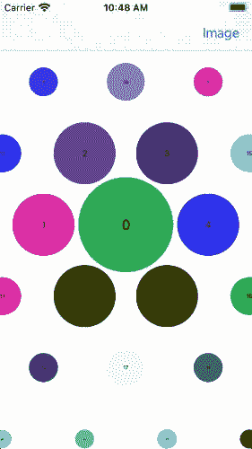
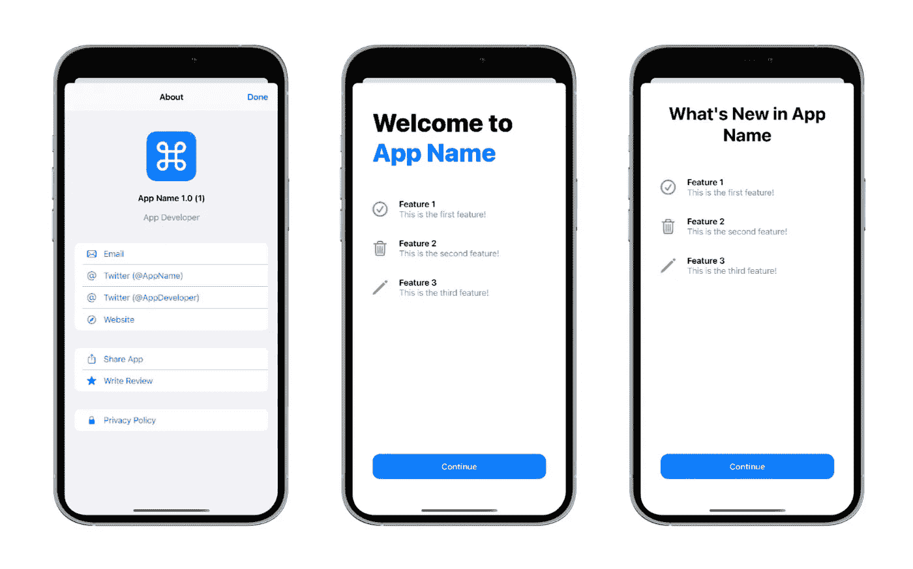
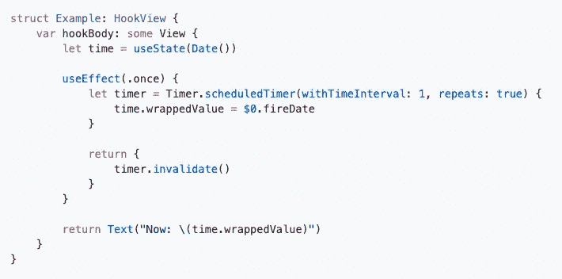

# 2021 年 2 月前五大热门 iOS 库

> 原文：<https://betterprogramming.pub/the-top-5-trending-ios-libraries-in-february-2021-43511141d046>

## SwiftUI 社区的一些很酷的产品


照片由 [Frederik Lipfert](https://unsplash.com/@frederikli?utm_source=medium&utm_medium=referral) 在 [Unsplash](https://unsplash.com?utm_source=medium&utm_medium=referral) 拍摄

在报道了从 2020 年开始的 [SwiftUI 年度回顾之后，是时候看看在一年中最短的一个月中发布的一些新的 iOS 库了。](/10-swiftui-libraries-to-use-in-2021-d21c0384e619)

2 月份推出了大量有趣的开源 Swift 包，下面的列表更倾向于 Swift ui——Swift ui 正在基于生产的 iOS 应用程序中迅速发展。

# 1.警报发布

首先，我们有一个纯粹的 SwiftUI 库，让您可以用一个更直观的弹出菜单替换传统的 SwiftUI `Alert`。

[AlertToast](https://github.com/elai950/AlertToast) 是一个开源的 GitHub 库，当您不需要用户操作或在对话框上显式关闭时，可以在 SwiftUI 视图生成器上使用它。例如，可以显示“没有网络连接”的提示或不确定的加载进度条。

默认情况下，您可以将警告放置在屏幕中央或从顶部下拉。


[来源](https://github.com/elai950/AlertToast)

要安装 Swift 包，可以通过在 Podfile `pod 'AlertToast'`中添加这个命令来使用 Cocoapods。或者您可以利用 Swift 软件包管理器。

```
.toast(isPresenting: $showToast){
            AlertToast(type: .regular, title: "Congrats!")
}
```

在`toast`中，你可以选择指定`duration`和一个`tapToDismiss`布尔参数。AlertToast 允许五种不同的类型:`regular`、`complete`、`systemImage`、`image`和`loading`。

# 2.手表布局

花哨的 UICollectionView 布局总是受到开发人员和用户的喜爱。因此，接下来我们有一个`[WatchLayout](https://github.com/HocTran/WatchLayout/blob/main/Screenshots/scrolling.gif)` Swift 库，它为 UICollectionView 单元格复制了一个类似气泡的布局。



[来源](https://github.com/HocTran/WatchLayout)

要安装这个库，请在 Podfile 中指定`pod ‘WatchLayout’`。然后，您可以通过以下方式自定义布局:

```
let layout = WatchLayout()
layout.itemSize = 200
layout.spacing = -40
layout.nextItemScale = 0.2
```

`nextItemScale`基本上是根据离中心的距离来设置相邻单元格的大小。

# 3.关于工具包

如今，入职培训是任何应用的重要组成部分。它有助于给用户一些关于应用程序的上下文和信息。此外，它也是一个很好的工具来描述和请求应用程序流程中可能用到的相关权限。

`[AboutKit](https://github.com/AdamFootDev/AboutKit)`并不是一个全面的入职库。然而，它在快速添加当前应用程序、其开发者和主要功能的细节方面做得很好。



[来源](https://github.com/AdamFootDev/AboutKit)

AboutKit Swift 包包含四个主要的内置视图:`AKApp`、`AKOtherApp`、`AKDeveloper`、`AKFeatureItem`。`FeaturesView`是一个视图包装器，让您传递一个列表`AKFeatureItem`，而`WelcomeView`接受`AKApp`和`AKFeatureItem`。

```
FeaturesView(title: "What's New in App", featureItems: featureItems{
    print("Continue button clicked")
}
```

# 4.雨燕钩

除了是一个声明式框架，SwiftUI 的一个亮点是它与 React 惊人的相似。这使得苹果最新的 UI 框架对于那些寻求进入 iOS 开发的网络开发者来说是一个很好的选择。

然而，感受原生 SwiftUI 视图和控件并不容易。很高兴，我们有了一个名为 [SwiftUI Hooks](https://github.com/ra1028/SwiftUI-Hooks) 的新库，它将 React Hooks 实现引入到您的 SwiftUI 接口中，从而帮助 React 开发人员无缝地迁移到 SwiftUI。

通过使用 SwiftUI 中的 Hooks API，可以快速构建定制的钩子来重用状态逻辑，而无需依赖任何属性包装器。

下面是 SwiftUI 中`useEffect` hook 的一个例子:



[来源](https://github.com/ra1028/SwiftUI-Hooks)

# 5.v 组件

`[VComponents](https://github.com/VakhoKontridze/VComponents)`是一个库，它利用 SwiftUI 框架，通过最大限度地减少视图修饰符和状态的使用，用更少的样板代码定制 40 多个 UI 组件。

VComponents 没有使用 SwiftUI 的标准 DSL 语法，而是引入了创建模型来设置各种视图状态的思想。例如，`VComponents`不喜欢使用下面的 SwiftUI 代码来定制按钮:

```
var body: some View {
    VSecondaryButton(
        action: {},
        title: "Lorem ipsum"
    ).foregroundColor(.black)
}
```

可以为视图状态建立一个模型，并去掉视图修饰符:

```
let model: VSecondaryButtonModel = {
    var model: VSecondaryButtonModel = .init()

    model.colors.textContent = .init(
        enabled: .black,
        pressed: .gray,
        disabled: .gray
    )

    return model
}()var body: some View {
    VSecondaryButton(
        model: model,
        action: {},
        title: "Lorem ipsum"
    )
}
```

对于像上面这样的小例子，`VComponents`可能看起来没有太大的区别，但是一旦你开始添加更多的定制并为多个视图设置相似的样式，`VComponents`将有助于使你的视图更加灵活和可重用，并且它将比标准的 SwiftUI 视图修饰符提高代码的可读性。

# 结论

这是二月份的总结。感谢阅读。