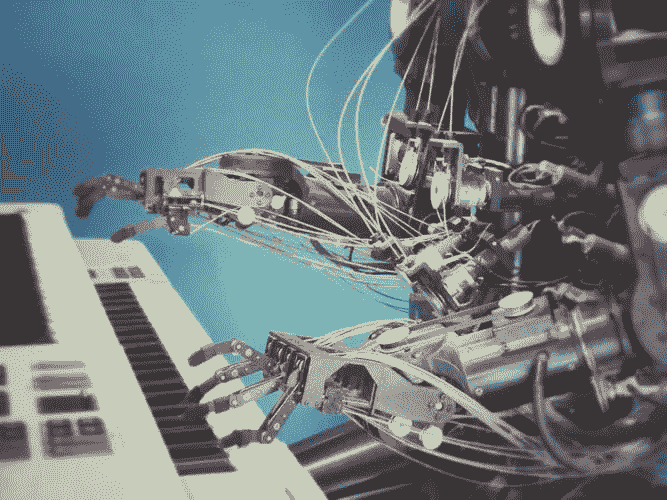
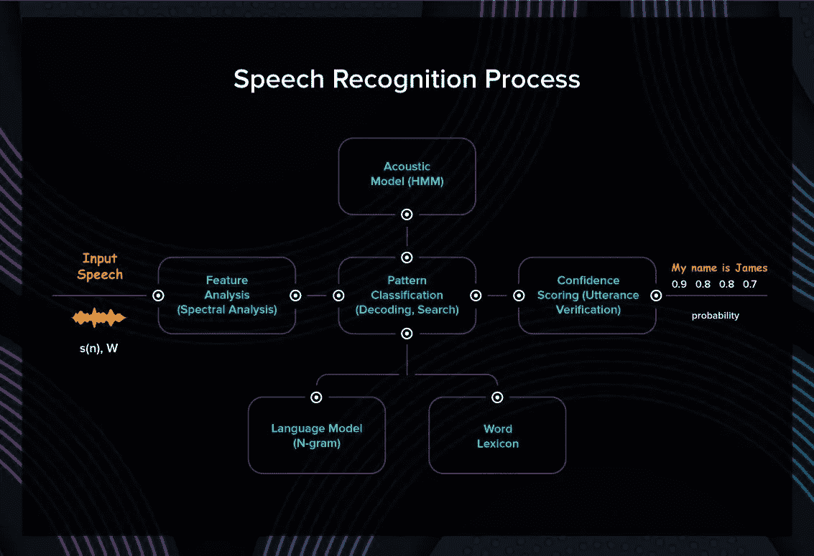
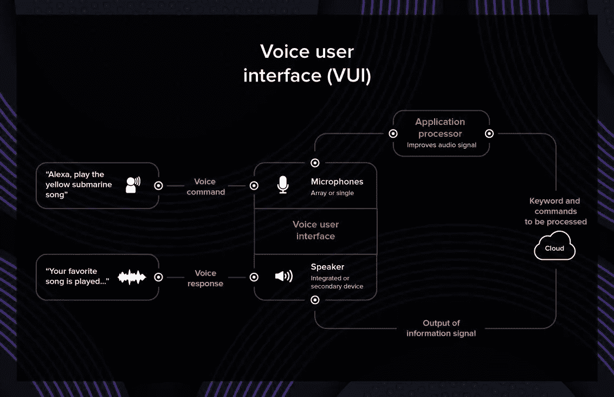
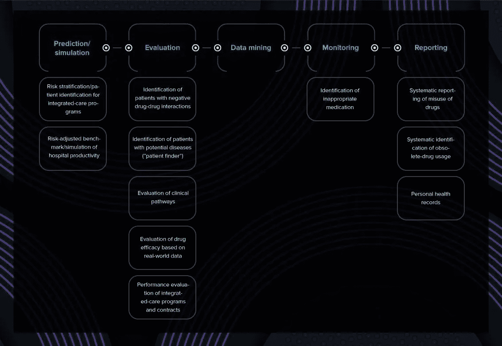
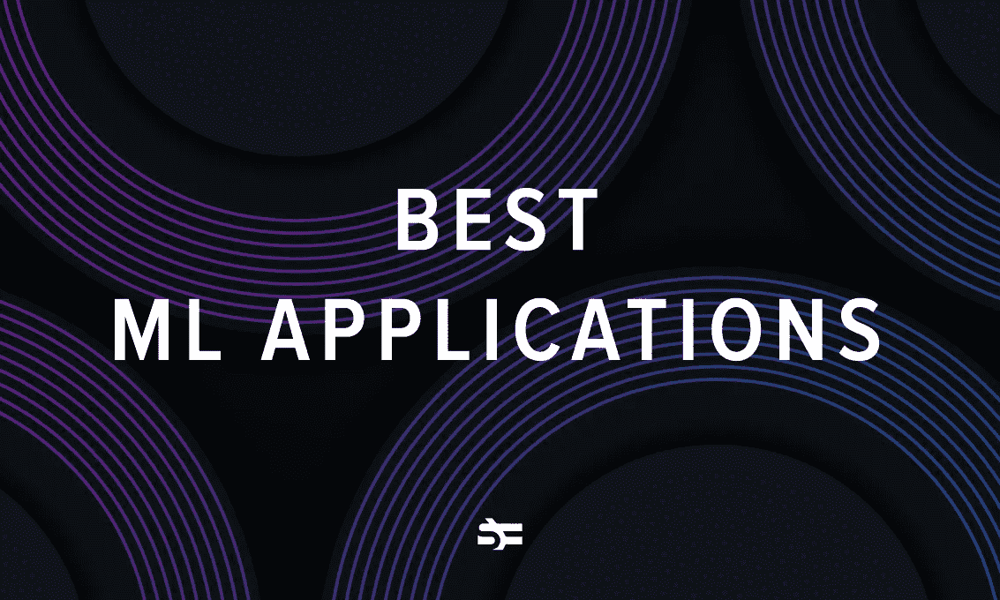
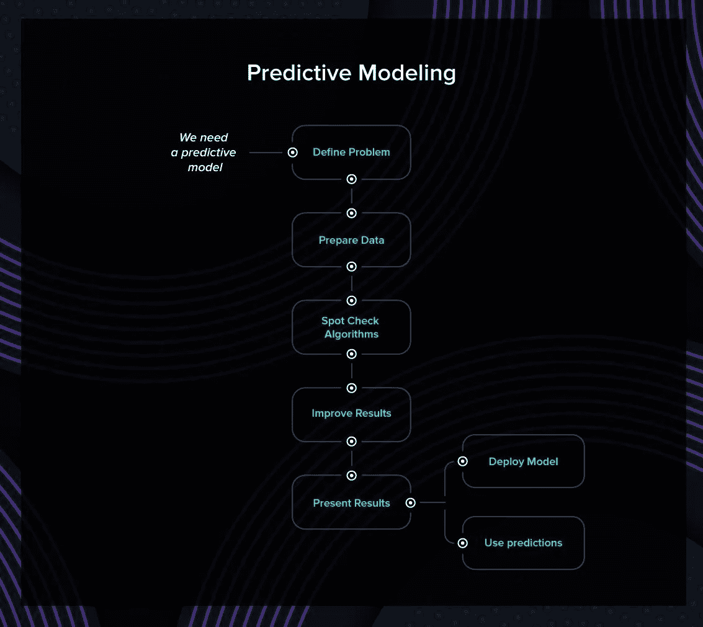

# 2020 年机器学习的主要领域

> 原文：<https://betterprogramming.pub/the-top-areas-for-machine-learning-in-2020-4c880bf5e288>

## 从计算机视觉到语音识别等等

在 [Unsplash](http://unsplash.com) 上由 [Franck V.](https://unsplash.com/photos/U3sOwViXhkY) 拍摄的照片

机器学习软件可以显著扩展我们的能力。它帮助我们做出更明智的决策，更快地处理信息。在这篇文章中，我收集了一些 2020 年顶级机器学习领域的例子。

# 机器学习的实际商业用途

## 计算机视觉

计算机视觉是机器学习的一个跨学科领域，它教会机器处理、分析和识别视觉信息。

用于构建计算机视觉系统的最常见技术是人工神经网络和深度学习。其他机器学习算法，如 [SVM、KNN 和朴素贝叶斯](https://serokell.io/blog/machine-learning-algorithm-classification-overview)在计算机视觉中也至关重要。

计算机视觉用于各种任务:物体识别、场景重建、身份识别、图像检索、运动分析等等。

## 人脸检测

计算机视觉可用于安全系统中的人脸识别。一个特殊的程序可以识别员工的脸，让他们进入大楼。它还可以自动检查他们的名字在出席登记册。这种解决方案比传统的钥匙和身份证更方便，也更安全，因为这些物品很容易丢失或被盗。

ML 人脸识别技术用于在机场、会议中心和其他活动的参观者中识别人群中的恐怖分子。

## 手写识别

手动数字化档案、试卷和文档是一个耗时且不准确的过程。机器学习允许在几分钟内扫描和数字化文档。该解决方案可用于大学、考试中心、博物馆、警察和其他必须处理手写文档的组织。

## 计算机视觉的商业应用

*   [FacePRO](https://www.security.us.panasonic.com/technologies/facepro) 是一个具有深度学习能力的面部识别系统，由松下创建。FacePRO 使用松下 i-PRO 相机的直播或录制视频进行面部匹配，并执行通知和提醒。
*   Waymo 正在研究可以在高速公路和城市道路上完全自主行驶的汽车。他们的目标是让更多的人开车更安全、更方便。Waymo 的任务是防止道路上因人为因素造成的撞车和受伤。你可以在他们的[官网](https://waymo.com/)了解更多。

# 语音识别

语音识别是将口语单词转换成文本。它也被称为“自动语音识别”(ASR)或“语音到文本”(STT)。

这项技术允许计算机识别音素或单词(取决于系统)。语音识别为用户和机器之间的直接交流提供了一种手段。

语音识别在日常生活中被广泛用于创建语音界面和语音助手。STT 应用于车载系统、医疗文档的医疗保健和军事领域。这不仅方便，而且还提高了可访问性。

有助于建立语音识别系统的 ML 技术是矢量量化、动态时间弯曲和人工神经网络。

## 语音接口

语音识别软件允许您在不接触设备的情况下在设备上执行操作。当您驾驶或进行其他需要非接触式界面的活动时，使用 VUI(语音用户界面)代替按键非常方便。

## 语音助手

语音助手和聊天机器人通常用于简化零售和电信领域的客户服务。它可以减少执行日常任务所需的人员数量。此外，研究人员报告称，如果节省时间，许多顾客[更喜欢与聊天机器人](https://www.zdnet.com/article/over-half-of-consumers-will-choose-a-chatbot-over-a-human-to-save-time/)交流，而不是与人交流。

## 语音识别的商业应用

当你想到语音助手时，Siri 或 Alexa 可能是你想到的。如果你是一个以英语为母语的人，这些可能是有用的，但即使在这种情况下，它们的可能性也是有限的。

*   三星为有视觉障碍的人设计了一款[语音助手](https://www.samsung.com/accessibility/mobile-voice-assistant/)。语音助手可以为这些用户提供对其电话的最大控制。当语音助手打开时，手机会提供语音反馈，帮助盲人和视力受损的用户。例如，它描述了你触摸了什么，选择了什么，激活了什么。您还可以编辑文本和更改各种设置，如音量或语速，使用熟悉的触摸和滑动屏幕的手势。
*   [C2 解决方案](https://www.poweredbyc2.com/)与谷歌合作开发语音识别和听写解决方案。他们使用这些技术来处理 Gmail 和文本文档，这对残疾人和那些想在查看收件箱时解放双手的人来说很有用。

在这段视频中，他们解释了它的工作原理:

# 文本到语音的生成

今天的计算机可以理解语音、图像和其他类型的信息。它们也生成数据。

[生成性对抗网络](https://en.wikipedia.org/wiki/Generative_adversarial_network)在你想要构建能够绘画、说话或学习的 ML 驱动的软件时使用。给定一个训练集，机器可以学习生成模仿。

语音合成用于为有视觉障碍的人和有阅读困难的学生设计的设备中。图像和音乐生成工具广泛用于娱乐和研究目的。生成文本的程序也存在，但是它们生成的文本没有意义。总的来说，这项技术还没有显示出它的全部潜力。

有了免费的亚马逊[账户](https://aws.amazon.com/free/machine-learning/)，你可以自己尝试文本到语音转换。

## 文本到语音转换的商业应用

*   CereProc 是一家专注于文本到语音转换技术的苏格兰公司。他们在机器人索菲亚上合作创造了她独特的声音，并负责她的歌唱能力。CereProc 拥有一个语音商店，企业主可以在那里为他们的公司应用程序选择一种独特的数字语音。他们也帮助你克隆你自己的声音。开发人员可以使用 CereProc 语音工具来处理他们的项目。
*   [NaturalReader](https://www.naturalreaders.com/) 是一款可以从网页、PDF 文件、Gmail 等平台阅读任何文本的软件。它还可以将打印文档和截图转换成数字文本。

有关 TTS 技术如何帮助残疾人的更多示例，请访问 [Tecla 的网站](https://gettecla.com/blogs/news/free-assistive-technology-software-for-speaking-typing-and-environmental-control)。

# 异常检测

用于异常检测的机器学习算法允许在连续的非结构化数据流中发现异常。发现异常在许多情况下都很有用:例如，如果有三次以上尝试登录一个电子邮件地址，就可能是黑客攻击。当数据量巨大到人类无法处理时，它变得更加有价值。

用于异常检测的算法有 SVM 算法、k 近邻算法、孤立森林算法。

## 欺诈检测

银行和金融是机器学习可以节省数十万美元的领域。使用 ML-powered 软件，金融机构可以发现隐藏的模式，检测可疑的操作，并在为时已晚之前阻止它们。这种系统的一个巨大优势是所有事情都是实时发生的。

## 故障探测

如果您的网络突然出现故障，可能会对您的业务产生负面影响。异常检测软件可以及时检测到失败的服务器请求数量的突然增加。此外，它还可以为您提供导致此问题的必要信息。

## 卫生保健

发现 ML 模型准确检测异常的能力在医学诊断中是有用的。研究证明，专业软件能够以比有经验的医生更高的准确率[诊断病人。该软件可以同时检测几个参数，并实时处理病历。医疗 ML 的另一个好处是，它可以快速处理大量的医疗记录，并提供可靠的统计信息。这有助于诊断和治疗。](https://www.macadamian.com/learn/a-practical-application-of-machine-learning-in-medicine/)

## 异常检测的真实业务案例

*   亚马逊欺诈检测软件是一个成熟的系统，可以有效地识别互联网上的潜在欺诈活动，例如，在线支付或创建虚假账户。全球的公司和个人每年损失数百亿美元。[欺诈检测器](https://aws.amazon.com/fraud-detector/)使用您的数据并应用机器学习技术来防止此类问题。
*   Anodot 是一家为企业提供 ML 供电监控服务的公司。他们的异常检测和预测解决方案实时分析用户数据。然后，他们使用发现的模式来增强业务的性能和可靠性。使用 Anodot 软件，可以监控收入、客户体验和合作伙伴生态系统。

# 预言

机器学习算法可以根据历史数据进行预测。他们将从熟悉的数据中获得的知识应用到新数据中，以预测这种或那种结果的可能性。

ML 通常应用于股票定价预测、营销活动、科学研究和[许多其他情况](https://www.datamation.com/big-data/predictive-analytics-examples.html)。

随机森林和人工神经网络是最常用的预测算法。

## 股票价格预测

很难预测股票价格，因为影响结果的因素太多了。然而，通过发现一些特征，如组织的当前状态、收入等，或者通过应用深度学习技术，您可以找到有价值的模式。[分析 Vidhya](https://www.analyticsvidhya.com/blog/2018/10/predicting-stock-price-machine-learningnd-deep-learning-techniques-python/) 已经分解了如何根据你的参数建立股票价格预测模型。帮助投资者基于人工智能见解做出明智决定的公司之一是[英伟达](https://investor.nvidia.com/stock-info/stock-quote-and-chart/default.aspx)。

预测分析是机器学习在商业中最常见的用例之一。如果您感兴趣，请查看[预测业务工具概述](https://www.capterra.com/predictive-analytics-software/)。

# 结论

这些应用中哪一个最让你惊讶？你想坐无人驾驶汽车兜风，还是想和机器人聊天？如果您对 ML 驱动的应用程序有令人兴奋的想法，[请告诉我们](https://serokell.io/hire-us)。