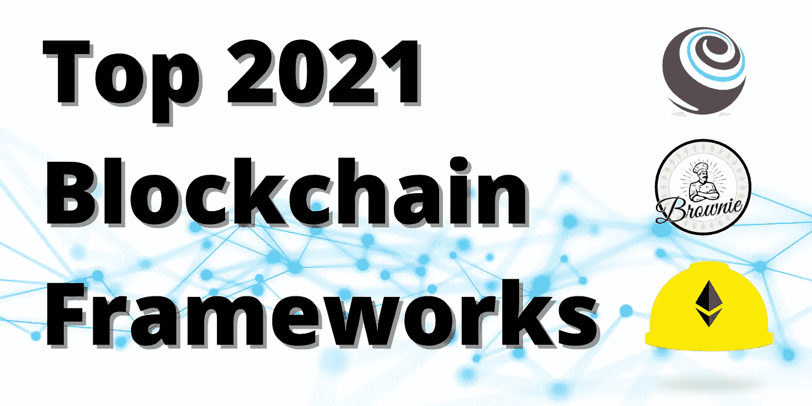
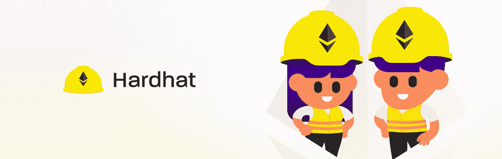
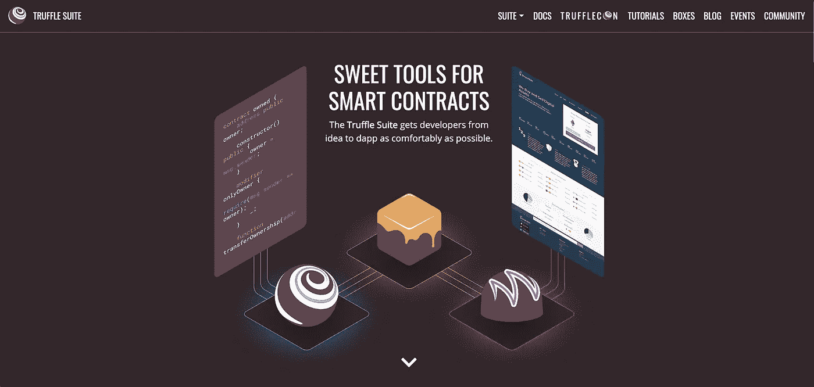
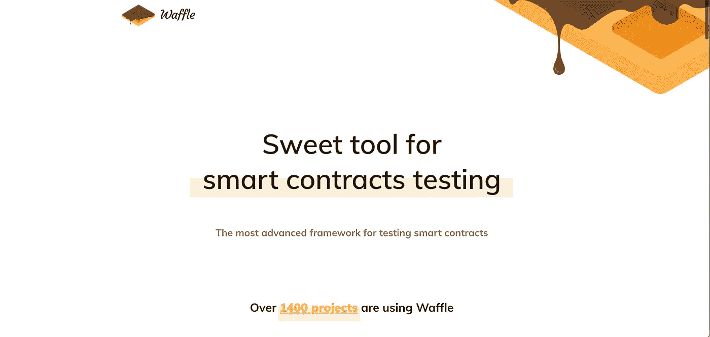
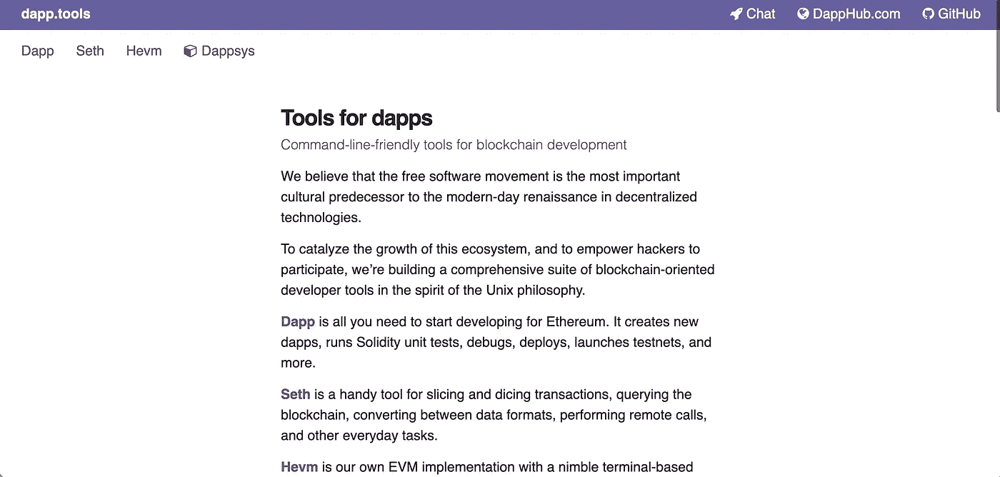
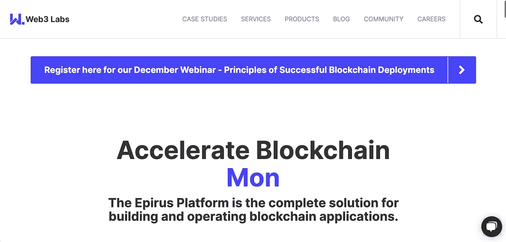
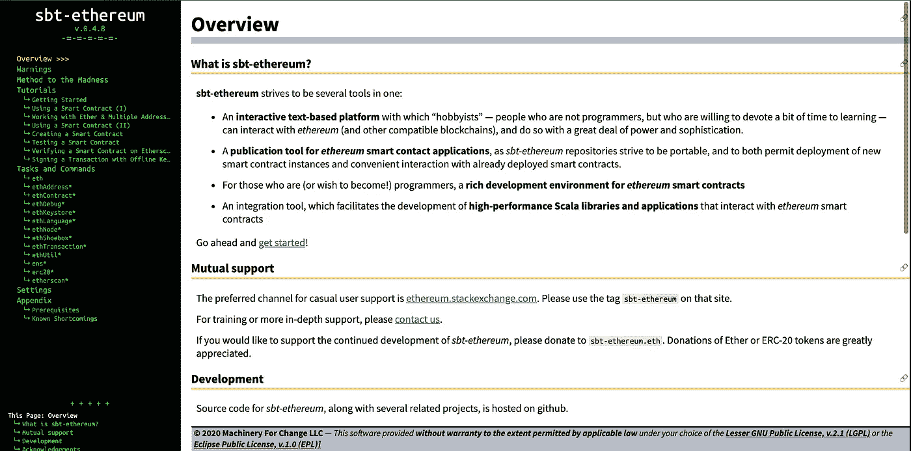
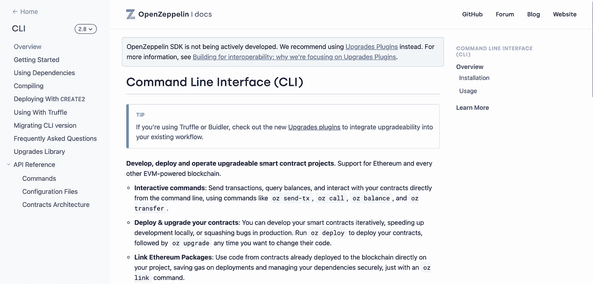
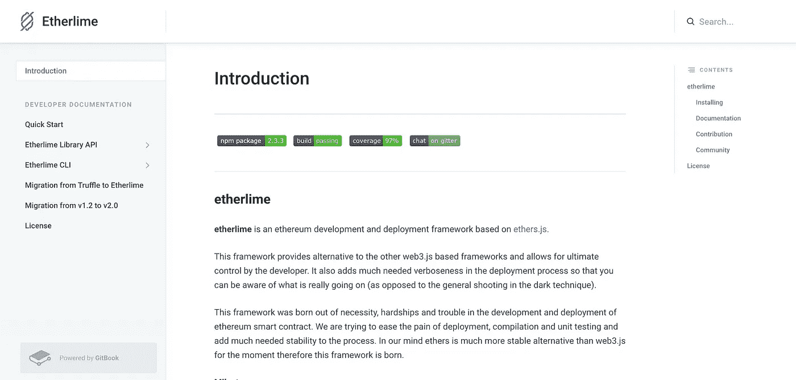
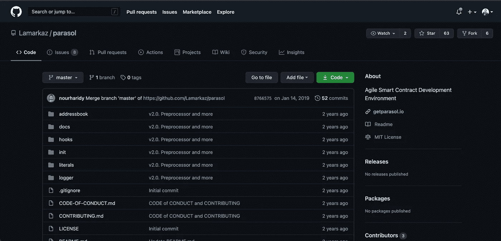

# 2021 年顶级区块链开发者框架

> 原文：<https://betterprogramming.pub/the-top-blockchain-developer-frameworks-for-2021-89afa5e7bd04>

## 最佳智能合约和区块链开发者框架，关注所有语言的以太坊智能合约



原始图片来自 blackred from[Getty Images Signature](https://www.gettyimages.ca/photos/signature-collection?phrase=signature%20collection&sort=mostpopular)

[智能合同开发框架](https://ethereum.org/en/developers/docs/frameworks/)允许工程师部署和测试他们的智能合同，让他们的生活变得更加轻松。我花了几个小时和几天的时间浏览了来自[咨询公司](https://github.com/ConsenSys/ethereum-developer-tools-list)和[以太坊网站](https://ethereum.org/en/developers/docs/frameworks/)的每一个推荐框架，看看哪些是最适合 2021 年的。你可以看到我在 GitHub 平台上的[实验。](https://github.com/PatrickAlphaC/smart-contract-frameworks)

不仅如此，我还对区块链黑客马拉松的参与者进行了数百次采访，查看了数百份黑客马拉松提交的材料，寻找哪些工具表现最好，拥有最好的开发人员体验。我自己也使用每个框架做了很多工作，我想为 2021 年做好准备。我已经为 2021 年做了艰苦的工作，所以你不必做了。

使用的标准很简单。该框架需要:

*   部署到本地区块链
*   进行快速有效的测试
*   使用 [Chainlink](https://chain.link/) 将智能合同部署到 [Kovan 测试网](https://kovan-testnet.github.io/website/)。

第三个标准很重要，因为它允许我测试框架如何与其他包和集成测试交互。使用甲骨文和第三方工具如 OpenZeppelin 基本上是 2021 年必须做的事情，这也是为什么最后一件事如此重要。

我们将简要提及 2021 年你需要了解的一些其他重要工具，但本文不会讨论初学者工具，如 ETH 钱包、以太坊客户端或文本编辑器。

视频漫游

# 三大智能合同开发框架

归根结底，我会向所有人推荐三个智能契约开发框架。每一种都有稍微不同的味道和你选择它的原因。它们是:

1.  安全帽(JavaScript)
2.  块菌(JavaScript)
3.  布朗尼(蟒蛇)

让我们逐一了解一下，并理解为什么您会想要使用它，为什么它会成为列表的第一名，以及其他值得注意的事情。

## 1.建筑工人



图片来源:[安全帽](https://hardhat.org/)

[Hardhat](https://hardhat.org/) 是最好的框架之一，拥有一些最快的测试、最好的教程和最简单的集成。老实说，每个喜欢 JS 框架的人都应该尝试一下 Hardhat。它很容易上手，测试速度极快，入门也很简单。他们的不和总是很快对问题做出反应，所以如果你遇到问题，你可以随时寻求帮助。他们使用 [Waffle](https://getwaffle.io/) 和 [Ethers.js](https://docs.ethers.io/v5/) 进行测试，这可以说是更好的 JavaScript 智能契约框架，因为相对于 [web3.js](https://web3js.readthedocs.io/en/v1.2.6/) 有一些真正好的生活质量改进。他们还可以直接集成 OpenZeppelin 的可升级智能合同插件，这是一个巨大的胜利。

这个项目给人一种很棒的感觉:它很干净。它会做你想让它做的事。真的很快。该项目正在不断改进，他们显然致力于使智能合同开发人员的生活更加轻松。

**总结**

*   ETH 基金会资助的项目，以前的建设者
*   技术:Javascript、Web3.js 和 Ethers.js 插件、OpenZeppelin 可升级合同插件、Etherscan 插件、区块链分叉
*   区块链:Hardhat 运行时环境/local、testnets、mainnet
*   Has 测试:华夫饼
*   维护:非常活跃
*   支持:主动
*   开放源码

## 2.松露



图片来源: [TruffleSuite](https://www.trufflesuite.com/)

几年来，Truffle 一直是默认的框架，这是有充分理由的。这是一个强大的框架，为许多其他人树立了遵循的标准。使用这个平台，你可以很容易地找到大多数项目，所以找到例子是很容易的。松露也可以很容易地与它的姐妹工具[毛毛雨](https://www.trufflesuite.com/drizzle)和[加纳切](https://www.trufflesuite.com/ganache)集成。尤其是 Ganache 是工程师管理本地区块链最受欢迎的方式之一。对于那些寻找更多工具的人来说，你可以支付升级的 Truffle 团队帐户，并获得智能合同持续集成、可视化部署和监控。他们还可以直接集成 OpenZeppelin 的可升级智能合同插件，这是一个巨大的胜利。他们显然是一群有才华的工程师，想要让世界变得更美好。

松露测试运行速度不如哈德哈特快，而且由于用户量大，获得支持可能很困难。我很期待看到自从被 ConsenSys 收购后，他们将如何改进这个项目。他们的文档似乎开始减少，可能很难理解，但是如果你在谷歌上搜索你遇到的错误，你很可能会遇到以前遇到过错误并解决了它的人。我发现改进这个项目的一些最好的方法是在他们的 GitHub 上留下一个问题。无论如何，保持生态系统变得更强更好是我们开源的责任！

由于几乎每个人都熟悉它，从你的同伴那里得到支持通常很容易。我真的希望看到团队在这个项目上得到更多的支持，因为他们有这么多*用户。我希望他们看到这篇文章，并努力改进他们的文档，这样他们就可以作为测试和部署智能合约的首选平台之一。*

**总结**

*   使用最广泛的平台；最近被 ConsenSys 收购(2020 年 11 月)
*   技术:Javascript，Web3.js，OpenZeppelin 可升级合同插件，Etherscan 插件，区块链分叉
*   区块链:Ganache/local，testnets，mainnet
*   有测试
*   维护:非常活跃
*   支持:主动
*   付费升级的开源软件

## 3.布朗尼


图片来源:[布朗尼](https://github.com/eth-brownie/brownie)

受块菌的启发，这基本上是 Python 的等价物，增加了一些生活质量的变化。这个项目实际上来自于大多数 Python 工程师都有的挫败感:[他们不喜欢 JavaScript](https://medium.com/@iamdefinitelyahuman/introducing-brownie-a763859409ca) 。由于它是用 Python 编写的，因此消除了使用 JavaScript 带来的许多令人头痛的问题，并且您获得了这个用于使用和部署智能合约的非常简单的框架。

作为一个热爱 Python 的人，我真的对这个项目的未来感到兴奋，随着采用的增加，看起来越来越多的项目正在考虑 Python 和这个框架来部署他们的智能合同。我已经开始使用布朗尼作为我的首选框架，并且一直很喜欢它。我和一些从事这项工作的人聊过，他们是一个非常聪明的团队。[似乎也买入了。](https://github.com/iearn-finance)

如果您来自 Python 世界，或者想要一个真正简单、干净的框架，这是为您准备的。不问任何问题。

再来一个！我知道我只说了三个，但我认为下一个也应该在这里有一席之地。

**总结**

*   最好的 Python 框架，被像 earning . finance 这样的 DeFi 项目使用。
*   技术:Python，Web3.py，区块链分叉，以太扫描插件，Vyper 支持
*   区块链:Ganache/local，testnets，mainnet
*   有测试
*   维护:非常活跃
*   支持:主动
*   开放源码

## 4.从事


图片来源:[登船](https://framework.embarklabs.io/docs/solidity.html)

在 GitHub (3.1k)上看到一个前三之外的框架有这么多明星，我很惊讶。这个工具有很多功能。我花了一点功夫去理解到底发生了什么，但那是因为 [Embark](https://framework.embarklabs.io/docs/solidity.html) 是一个完整的 dApp 框架。这是一个全栈区块链平台。在他们的 Gitter 的帮助下，我能够将我的 Chainlink 合同部署到 Kovan 网络上(在他们的 GitHub 上产生了一个问题；记住，开源本分！).它附带了一个用户界面，允许您在 GUI 中与区块链和您的合同进行交互。看起来有一点学习曲线，我没有花足够的时间来克服，但它显示了很多希望。这就是为什么我想把它放在这里，因为我觉得有很多东西我没有完全消化。

我很乐意看到人们更多地尝试这个框架，看看它的威力。我觉得由于我在这个项目上花费的时间有限，我可能无法在这里做到公正。我确实认为将你的前端和后端解耦仍然是最佳实践，但是如果你需要一个前端良好的项目，并且不在乎解耦，那么你应该 100%检查这个项目。

非常酷的项目，如果他们喜欢 Hardhat 和 Truffle，但希望与全栈解决方案集成，我建议任何人都来看看。

**总结**

*   JavaScript 框架为前端开发提供了大量的附加功能
*   技术:JavaScript、Web3.js、代理合同支持
*   区块链:Ganache/local，testnets，mainnet
*   有测试
*   维护:轻度活跃
*   支持:主动
*   开放源码

# 让我们暂停一下

现在，在我继续上面的一些替代方案之前，我想休息一下，指出 2021 年的一些重要的非框架工具。

*   OpenZeppelin 和升级插件
*   以太扫描/Block Explorer 验证器
*   创建-eth-app

## OpenZeppelin 和升级插件

[OpenZeppelin](https://openzeppelin.com/contracts/) 是一个为聪明的合同工程师创造工具的平台。他们有一些默认设置，如 ERC20 和 ERC721 工具，您可以导入他们的合同，然后在几秒钟内构建一个令牌。看看用 OpenZeppelin 制作 ERC20 有多简单:

```
pragma solidity ^0.6.0;
import “[@openzeppelin/contracts](http://twitter.com/openzeppelin/contracts)/token/ERC20/ERC20.sol”;contract GLDToken is ERC20 {
 constructor(uint256 initialSupply) public ERC20(“Gold”, “GLD”) {
 _mint(msg.sender, initialSupply);
 }
}
```

多此一举毫无意义。OpenZeppelin 是一个开源项目，致力于确保您不必这样做。

OpenZeppelin 的另一大优势是其可升级的合同功能。部署一个工作项目意味着您将不得不部署一个代理契约，无论何时您想要进行更改，您都需要更新这个代理契约。这又是一个感觉很神奇很干净的项目。老实说，每个项目，不管你用的是什么平台，都应该使用 OpenZeppelin 在某个时候创造的东西。

## 以太扫描/block explorer 验证器

[以太扫描](https://etherscan.io/)是最流行的块浏览器。当人们想要检查你的合同和你已经部署了什么，他们将不能，除非他们有 ABI 和合同地址。找到合同地址通常很容易，但要找到 ABI 就难多了。您希望人们能够轻松地看到您的智能合同并与之交互，因此您总是希望验证它，以便其他人可以这样做。大多数框架都有某种验证插件，你可以在其中部署智能合约，然后在 Etherscan 上验证它。请确保在您的应用程序中使用它。

## 创建-eth-app

拥有过多的后端智能合约是很好的，但是如果没有人可以使用你的 dApp，它就一文不值。create-eth-app 是一个平台，允许你使用 ReactJS 为你的智能合约建立一个前端。它使用了很多更新的 React 技巧，比如状态挂钩，使得构建真正强大的前端变得更加容易。

# 2021 年的一些令人惊叹的初学者工具

[Scaffold-ETH](https://github.com/austintgriffith/scaffold-eth)
ETH . build
[Remix](https://remix.ethereum.org/)
[一键 dApp](https://oneclickdapp.com/)

我不打算在这里详细介绍这些工具的作用，但是如果您是这个领域的新手，请查看这些工具！

# 替代框架

剩下的这些框架一点都不差，可能对你有用。他们中的一些人确实有一些非常酷的想法，可以将什么放入智能合同框架中，我希望主要的三家公司注意到这些令人敬畏的想法。这些工具可能需要更多的探索时间。

*   华夫饼干
*   戴普。工具(Haskell/CLI)
*   SBT (Scala/CLI)
*   伊庇鲁斯语(Java)

## 华夫饼



图片来源:[华夫饼](https://getwaffle.io/)

Waffle 本身可以作为一个部署框架，尽管你必须编写更多你自己的定制脚本。它被列为智能合约框架，尽管与这些其他框架相比感觉有点傻。Waffle 可以用于你喜欢的任何框架，并且是目前使用 Hardhat 的默认工具。

如果你想要一个框架能提供的所有好的特性，我不推荐单独使用它，但是如果你想使用一个更原始、简单、可定制的框架，这里你不会出错。

**总结**

*   专注于测试的轻量级 JavaScript 框架
*   技术:JavaScript，Ethers.js。
*   区块链:你运行的任何东西
*   有测试
*   维护:非常活跃
*   支持:主动
*   开放源码

## 戴普。工具



图片来源: [Dapp。工具](http://dapp.tools/)

[Dapp。工具](http://dapp.tools/)是 MakerDAO 用的，让我很惊讶。它是用 [Haskell](https://www.haskell.org/) 编写的，但是支持很多我们使用和喜爱的插件，比如 OpenZeppelin。它看起来是一个极简框架，足够强大，可以做你想让它做的事情。我在使用该平台部署我的合同时得到了帮助，并对它的简洁和简单感到惊讶。如果你正在寻找一个极简主义的命令行友好的框架，那么我也推荐看看这个。

**总结**

*   MakerDAO 使用的 Haskell 简单框架
*   技术:Haskell/CLI
*   区块链:Local/Ganache，testnets，mainnet
*   有测试
*   维护:活动
*   支持:主动
*   开放源码

## 伊庇鲁斯



图片来源:[伊庇鲁斯](https://www.web3labs.com/epirus)

尽管我说它“像松露一样”，但从商业角度来看， [Epirus](https://www.web3labs.com/epirus) 在风格上一点也不像松露。他们有一个开源项目，但他们有一个付费的升级工具，供那些希望更多地使用它的人使用。他们使用 Java 的 Web3 实现，看起来还处于项目开发的早期。我很高兴看到他们有 Android 支持，所以我真的很好奇这个项目进展如何。我们可以让更多的 Java 工程师进入这个行业，因为没有多少 Java 智能合约平台。

我无法部署到 Kovan，因为它不受支持，但看起来他们支持 Rinkeby。无论如何，我很高兴看到项目的进展。

**总结**

*   一个类似松露的 Java 实现
*   技术:Java
*   区块链:Ganache/local，testnets(不是 Kovan)
*   有测试
*   维护:活动
*   支持:不太积极
*   付费升级的开源软件

## SBT



SBT-以太坊

我参与的一个比较有趣的项目， [SBT](https://www.sbt-ethereum.io/) 专注于几乎完全从命令行与智能合约交互，或者与 [Scala](https://www.scalablockchain.com/) 交互。我几乎没有 Scala 经验，所以我没有一个很好的观点来评论这个平台。如果你了解 Scala，并且想进入以太坊，这看起来会很酷。

**总结**

*   命令行和 Scala 项目解决了两个问题。适用于使用智能合同和智能合同工程师的爱好者。
*   技术:Scala
*   区块链:Local/Ganache，testnets，mainnet
*   有测试
*   维护:轻度活跃
*   支持:无效
*   开放源码

# 过时的框架

你会不时看到这些弹出来。我敢肯定，他们出来的时候很棒，但在这个时候，他们要么不再受支持，要么处于非活动状态。这些是要避免的，这样可以省去你和他们一起工作的麻烦。

*   OpenZeppelin CLI/SDK (JS)
*   乙醚石灰
*   阳伞
*   眼镜蛇(PY)

## OpenZeppelin SDK



图片来源: [OpenZeppelin SDK](https://docs.openzeppelin.com/cli/2.8/)

现在我明白为什么[这个项目](https://docs.openzeppelin.com/cli/2.8/)停止了这项工作——作为一个团队，他们想专注于可升级智能合同这个难题——但老实说，这有点遗憾。这个项目非常干净。我能够部署我的链式智能合约，并且比几乎任何其他框架更快地读取 ETH 的价格。它也有一些非常好的 CLI 选项，看起来 Epirus 和 Hardhat 也有。它还内置了可升级选项，这在一个平台如此之少的世界中是巨大的。

我不推荐使用它，因为他们有意不再支持它，但这是我使用智能契约框架的最好的开发体验之一。我希望主要的三个人能够明白是什么让这个项目如此耀眼。我上面说大家都要用 OpenZeppelin 工具是有原因的。他们只是工作。

如果他们不停止这方面的工作，他们的 SDK 将很容易成为四大框架之一。

**总结**

*   OpenZeppelin 弃用的智能合约框架。他们反对专注于升级插件。否则真的清理 JS 框架。
*   技术:JavaScript、Web3.js 和 Ethers.js 插件、OpenZeppelin 可升级合同插件
*   区块链:本地、测试网、主网
*   有测试
*   维护:不活动
*   支持:无效
*   开放源码

## 乙醚石灰



图片来源:[以太时间](https://etherlime.gitbook.io/etherlime/)

Etherlime 似乎是另一个正在失宠并且没有被积极开发的 JS 框架。它与 Infura 的一个过时特性紧密结合，所以我们无法在 Kovan 上部署我们的智能合约。它活着的时候似乎是一个非常强大的项目，看起来它仍然为当地发展服务，但我不会推荐它超过前三名。

**总结**

*   不活动的 JS 框架
*   技术:JavaScript，Ethers.js
*   区块链:本地、测试网、主网
*   有测试
*   维护:不活动
*   支持:无效
*   开放源码

## 阳伞



图片来源:[阳伞](https://www.reddit.com/r/ethdev/comments/9ejdn2/parasol_a_new_agile_smart_contract_development/)

另一个不活跃的 JS 框架(两年多没有提交)。它有一些很酷的特性，比如`parasol interact`，和一些集成，很明显，一些真正聪明的人在这上面工作，但是我看不出有任何理由使用这个平台超过任何其他 JS 框架。

**总结**

*   不活动的 JS 框架
*   技术:JavaScript，Web3.js
*   区块链:local/Ganache，testnets，mainnet
*   有测试
*   维护:不活动
*   支持:无效
*   开放源码

# 摘要

智能合约和区块链世界发展迅速。一些两年前最热门的工具已经是旧闻了，智能契约开发框架也不例外。看到松露保持在游戏的顶端是很酷的，但更伟大的是，如此多的项目已经采取了不同的方法来解决这个问题。

如果你认为我漏掉了一个或弄错了，或者你有其他想法，请随时留下评论或联系我们。这里的想法是让聪明的合同工程师尽可能快速有效地开始工作。揭示所有工具将使我们更快地到达世界去中心化的那一点。希望这是有帮助的！