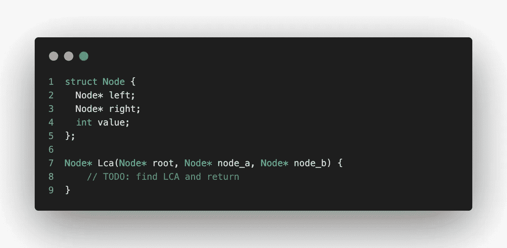
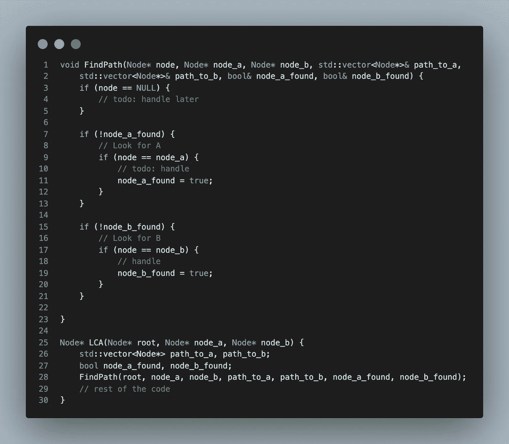
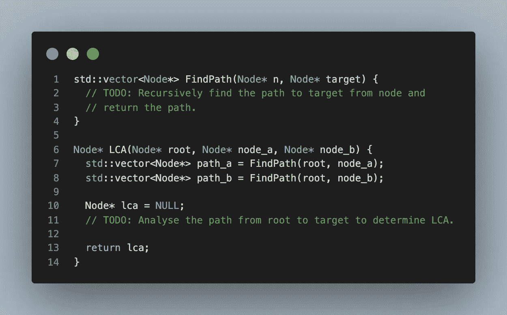
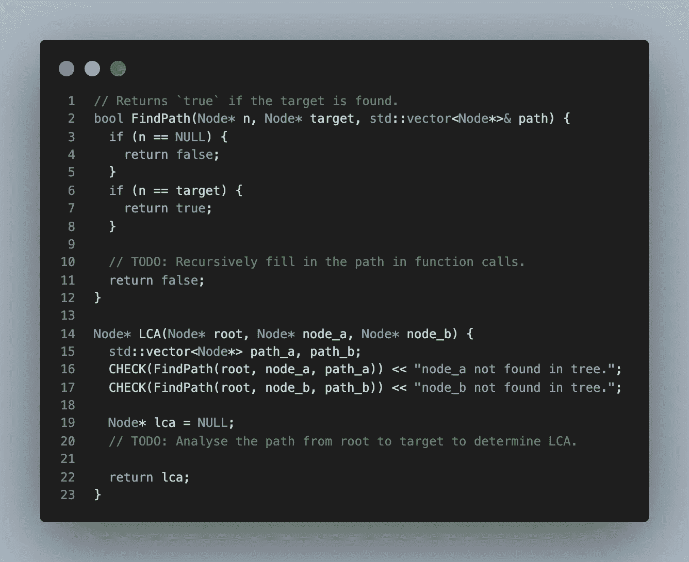
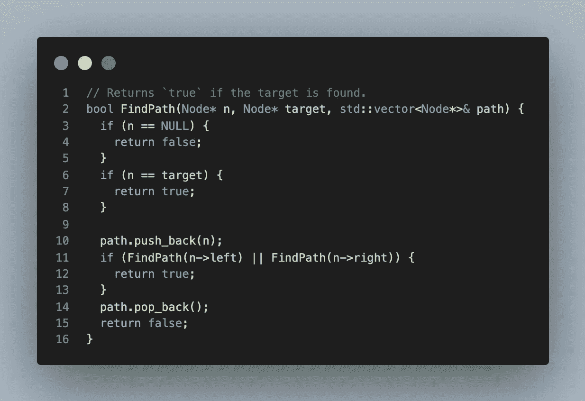

# 这是大多数面试考生纠结的编码话题

> 原文：<https://betterprogramming.pub/the-topic-i-have-seen-most-interview-candidate-struggle-with-9e11b92ea65e>

## 在过去的 5 年里，我参加了几次面试，有一个话题是我见过的求职者一直在纠结的，这可能会让你感到惊讶

不是别人，正是我们的伙伴“递归”。

# 就是“递归”了！

你失望吗？你希望我用动态编程或者分段树来对付你吗？也许这些也是大问题——但这是我见过的几个候选人正在努力解决的问题。

我在这里谈论的是一个典型的编程面试——给你一个或多个问题陈述，并期望你在 45 到 60 分钟内得出一个最佳解决方案(算法)并为其编写代码。

这些通常被称为*【数据结构和算法面试】*，大多数软件公司使用这种面试来招聘从初级到高级的软件工程师。

> *免责声明:这篇文章不属于谷歌或微软。纯属我的看法。*

# 递归有什么大不了的？

> 递归可能很容易描述，但是很难用公式表示和编码。—米娜兹(我)

通常编码面试分为两个关键阶段

*   首先，候选人应该对给定的问题提出一个最优的解决方案。
*   第二，要求候选人现场编码解决方案。

我经常看到有前途的候选人很好地理解了第一部分。

他们很好地解释了解决方案，并正确地陈述了时间和空间复杂性。在此之后，我要求他们进入我感兴趣的下一阶段

*   候选人将算法转换成代码的能力如何？
*   候选人制定代码(设计方面)的能力如何？
*   以及某种程度上候选代码的好坏——代码风格、语言掌握程度等。

我见过几个考生卡在这个阶段。也许不总是对的，但我相信

> 递归很难形象化，你不能临时解决它

现在我回头看——我觉得有些候选人会犯一些常见的错误。在这篇文章中，我想花一点时间和大家分享我关于如何避免这些问题的 2 美分。

大家来说说问题和解决方案吧！

# 示例:最低共同祖先(LCA)

我将用 LCA 问题作为一个例子来说明这些问题。

 [## 二叉树的最低共同祖先- LeetCode

### 给定一棵二叉树，找出树中两个给定节点的最低共同祖先(LCA)。根据定义…

leetcode.com](https://leetcode.com/problems/lowest-common-ancestor-of-a-binary-tree/) 

给你一个[二叉树](https://en.wikipedia.org/wiki/Binary_tree)的根节点和另外两个节点。问题是找到给定树中两个节点的最低共同祖先。

# 平常的谈话

一旦候选人口头描述了解决方案并解释了时间和空间的复杂性，通常的对话会是。

> 面试官:听起来差不多，我想看看你的代码。请随意开始。另外，请随意定义数据类型、接口和 LCA 的实现。

然后他们开始用这样的框架编码:

寻找最低共同祖先的骨架代码

# 然后，候选人开始编写代码

以下是我看到的求职者会犯的一系列错误——这些错误都是可以避免的。

> 候选人:首先我需要找到从根开始的两个节点的路径。

## [1]一步到位的搜索—复杂的过度优化

有时，候选人倾向于在单次遍历中解决整个问题。

> 候选人:由于两个节点都在树中，我可以尝试在一次遍历中从根节点开始跟踪两个节点的路径——因为我必须遍历整个树。这样我们可以避免多次遍历。

问题:

*   这并没有改善最坏情况下的复杂度，仍然是 O(N)。
*   候选人最终试图编写复杂和非模块化的代码。这没有展示出好的设计信号。
*   很多时候，考生会被复杂的代码卡住，无法完成。

所有这些都给了评估候选人的面试官不好的信号。

举个复杂代码的例子，候选人有时会试图一次找到两个节点的路径。代码片段只是部分完成——但是应该给出了我所指的复杂解决方案的想法。

这与我在这篇文章中试图提出的一个要点非常相关。

 [## 破解编码面试的一个技巧——使用抽象！

### 根据我五年的面试经验

better 编程. pub](/coding-interview-1-tip-use-abstractions-73d0f2b7b2ce) 

## [2]不知道递归函数应该做什么

解决这个问题的一种方法是找到从根节点到各个目标节点的路径，然后分析这些路径以确定 LCA。

有些候选人在设计模块化代码结构方面做得很好。我非常喜欢面试候选人以及和我一起工作的其他工程师。这通常只需要:*在开始写代码之前后退一步。*

在这个阶段，我通常感觉良好，但后来我看到一些候选人在没有明确说明递归函数到底应该做什么的情况下就开始编写代码。

另一个擅长初始代码模块化的代码框架。

虽然我同意这是一个好的开始(从接口的角度来看)，但是如果你没有明确说明“这个函数将做什么”就继续下去，你可能最终会走上特别的道路。

我见过一些候选人最终纠结于如何在不同层次的递归中返回那个`std::vector<Node*>`。有些人最终试图在函数内部迭代求解，等等。有些人最终意识到将`vector`作为输出参数传递可能更容易。

但是时间在流逝。阐明函数应该做什么可能有助于节省大量时间。

## [3]没有首先考虑退出条件

这大概和上一点有很大关系。这并不是什么新东西，当考虑递归函数时，这可能是到处都有的经验法则。

> 就像“while”循环需要有一个停止的地方一样，递归函数需要有一个“基本情况”。递归的第一个主要规则是需要有一个端点。——作者[科尔顿·凯泽](https://levelup.gitconnected.com/tackling-the-tricky-concept-of-recursion-d8608817f520)。

我同意，考虑结束条件或基本条件，会帮助你更好地表达整体函数。在编写代码之前，应该考虑这一点。在本例中，如果您找到了目标节点或叶节点，您希望退出递归调用。此外，在递归链中，您想知道是否已经在子子树中找到了目标。函数调用将此告知父函数调用的一种方法是返回一个布尔值。

一旦候选人决定了退出条件，在某种程度上，它会强制完成整个接口，下一步是填充函数定义的其余部分。

我认为 Colton 的这个提示非常重要！

首先考虑退出条件有助于你更好地表述递归函数。因为这个任务并不完全独立于函数的其余部分，你必须考虑某种程度上的剩余方法。

然后，您可以填充定义的其余部分，以简单的模块化和易于阅读的代码结束。

# 摘要

虽然强调得不够，但我认为递归是一个需要练习的话题。练习不仅仅局限于在头脑中想出解决方案，还要将它转化为代码。即使在实践中，不准确的实现也会导致类似`Stack Overflow`错误的问题。

在技术面试中，你的处境比常规工作或在 LeetCode 上写代码更有压力——实践可以帮助你更好地应对这场风暴。

一个通用的提示(您可能已经在本文中注意到了)是

> 在制定代码之前，先退一步考虑接口和实现。也许在纸上画画。大多数时候，你可能会找到正确的解决方案，但这可能只是节省一些宝贵的时间。

而且这不仅仅局限于技术面试。

如果你喜欢你读到的东西，这里还有一个你可能会喜欢的故事:

 [## 谷歌的一名高级工程师揭示了“2022 年最值得学习的编程语言”

### 我是谷歌新加坡公司的高级软件工程师，经常有人问我应该学习哪种编程语言

better 编程. pub](/the-best-programming-language-to-learn-in-2022-senior-engineer-at-google-explains-5abcbc5f6556) 

## 照片致谢

*   在 [Unsplash](https://unsplash.com/photos/u2d0BPZFXOY) 上由[Tine ivani](https://unsplash.com/@tine999)拍摄的照片。
*   由[马库斯·斯皮斯克](https://unsplash.com/@markusspiske)在 [Unsplash](https://unsplash.com/photos/FXFz-sW0uwo) 上拍摄。

## **参考文献**

*   [递归:解决一个棘手的概念](https://levelup.gitconnected.com/tackling-the-tricky-concept-of-recursion-d8608817f520)作者[科尔顿·凯瑟](https://coltonkaiser.medium.com/)。