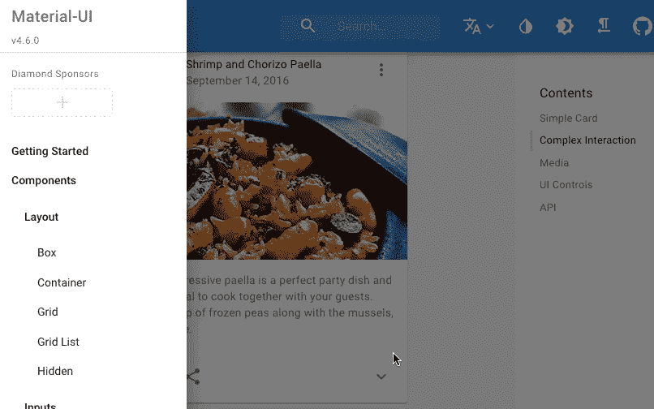
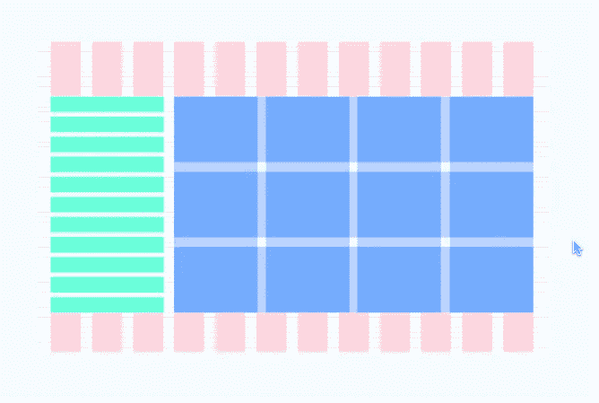
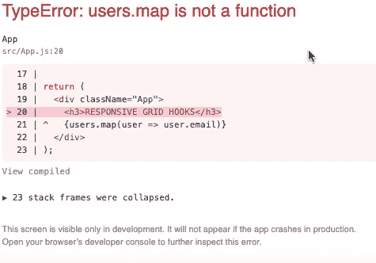
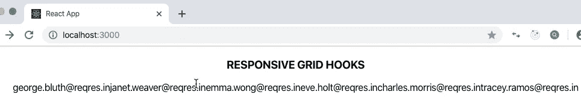
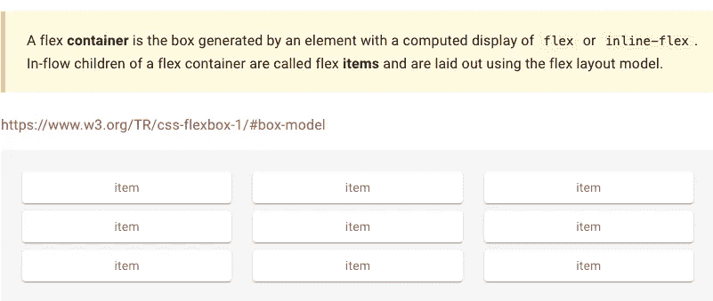
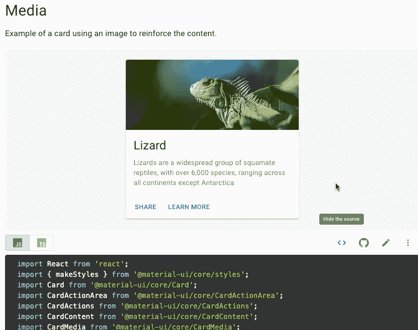

# 材料的真正美——UI

> 原文：<https://betterprogramming.pub/the-true-beauty-of-material-ui-d76fa3dc0dd4>

## 使用挂钩和嵌套网格为 2020 年构建响应性布局


矢量库存照片

功能不是一切。如果没有直观的美学设计，即使是最出色的编码应用程序也可能无法发挥其潜力。

*   [源代码](https://github.com/01Clarian/responsive-grid-hooks)
*   [视频教程](https://youtu.be/RnKSA-51kpI)

# *为什么要学 Material-UI？*

速度。质量。生产力。

如果你想升级和构建现代的专业布局，为你的应用程序提供完全的定制，而没有从零开始使用 CSS 的时间限制，那么不要再犹豫了。

简单来说， [Material-UI](https://material-ui.com/) 是一个强大的开源库，它将 Google 的材质设计实现到您的 React 组件中。

不仅如此，它的文档非常直观，很容易将它们的特性集成到您的应用程序中。该库是可靠的，显然很受 Bethesda、JPMorgan 和 Shutter Stock 等公司的广泛使用。



摘自“材料-用户界面网站组件”部分

在 2019 年，忽视一个 UI 库与你的前端框架结合的力量，就像合理化把一个铁匠铺带到一场剑斗。

在下面的分步教程中，我们将通过使用 React 和 Material-UI 创建一个响应式卡片布局来制作一个真实世界的设计。

我们的应用程序将实现更新的React Hooks 和 async/await 来获取用户数据，这些数据将被呈现为图像、电子邮件地址和姓名。

我们将展示 React 和 Material-UI 共生的力量，同时观察 JavaScript 的同步与异步编码等概念。

然后，我们将应用 Material-UI 网格中嵌套网格的设计方法来设置和绘制布局设计模式。



嵌套网格模式允许可控的布局定制。

本教程还将映射数据并将其发送到嵌套网格中，该网格将包含从 Material-UI 中提取的*卡组件* 。

通过一步一步地学习本教程，我们将从头开始设计一个从 API 获取的用户数据的移动和浏览器响应卡片库，如下所示:


期末项目教程截图

观察上面的截图，我们最后的真实世界的例子将由来自 Material-UI 的渲染卡组件组成，修改后接收 API 用户数据。

用户数据由以下 REST API 托管: [REQ | RES](https://reqres.in/) 。

最后一点，如果你已经熟悉了 Hooks 和 async/await，并且只是想回顾一下 Material-UI grid 部分，那么现在就继续向下滚动到那个部分。

这就是它的要点。所以，我们开始编码吧。

# React 设置和材质-UI 安装

首先，打开终端创建一个 React 应用程序，只需运行`npx`脚本命令`create-react-app`来安装一个完全捆绑的 React 包。我们将项目文件夹命名为`responsive-grid-hooks`。

```
npx create-react-app responsive-grid-hooks
```

从项目文件夹的目录中，使用以下命令安装最新版本的 Material-UI 库:

```
npm install @material-ui/core
```

接下来，在您选择的文本编辑器中打开项目文件夹的代码。之后，使用以下命令将终端中的应用程序启动到我们的本地主机服务器:

```
npm start 
```

# 应用程序清理

在文本编辑器中(我使用的是 [VS 代码](https://code.visualstudio.com/)，通过删除不需要的组件和代码来清理捆绑的应用程序。

拆下`App.Test.js`和`Logo.svg`。然后，在我们的`App.js` 文件中，用下面几行代码压缩代码，我们将在下面加入新的标题头。

`App.js`:

```
import React from 'react';import './App.css'; function App() { return ( <div className="App"> <h3>RESPONSIVE GRID HOOKS</h3> </div>);}export default App;
```

好了，现在我们已经整理好了东西，并在我们的`App.js`中编写了一些 JSX 的简单返回语句，让我们确保我们在本地主机上编译成功，然后继续前进。

# 钩子、异步/等待和 API 数据

是时候引入钩子了，这样我们就可以在应用程序中维护 API 用户数据信息。首先，请在您的`App.js`文件中键入以下内容。

`App.js`:

```
import React, {useState, useEffect} from 'react';import './App.css';function App() {const [users, setUsers] = useState([]) return ( <div className="App"> <h3>RESPONSIVE GRID HOOKS</h3> </div> ); }export default App;
```

钩子`UseState`用于设置我们的状态，而`UseEffect`将用于安装异步获取功能。`UseEffect`接受两个参数，第一个是函数，第二个是数组。我们设置一个空数组，这样`useEffect`只执行一次。这是默认设置。

请注意，const `users`现在用 state 在顶部初始化，并设置为空数组，以便我们可以接收用户数据。我们还放置了`setUsers`来使我们的用户能够在获取用户数据后改变状态。

接下来，让我们设置`useEffect` 钩子来获取数据。为此，我们将创建一个`async`回调函数。

最后，在我们的 return 语句中，让我们通过数据映射来提取用户的电子邮件并测试一切。我们的`App.js`文件现在应该看起来像这样。

`App.js`:

```
import React, {useState, useEffect} from 'react';import './App.css'; function App() {const [users, setUsers] = useState([])useEffect(()=>{ async function fetchData() { setUsers( fetch('https://reqres.in/api/users') .then(res => res.json()) .then(res => res.data))}; fetchData() },[])return ( <div className="App"> <h3>RESPONSIVE GRID HOOKS</h3> {users.map(user => user.email)}</div> )};export default App;
```

让我们保存新添加的内容并检查结果。然而，这将会失败。将出现以下错误(Chrome 开发控制台):



你难道不喜欢这种情况发生吗？

为了纠正这个错误，我们需要检查 JavaScript 的核心。虽然我们知道 JavaScript 是同步的，但是我们使用 Ajax 调用来执行异步操作。

关于上面的例子，虽然我们用`async` 函数*获取一个`promise`，但是* JavaScript 在运行它的脚本之前不会固有地等待承诺解决。

然而，我们可以通过让脚本知道等待承诺来解决这个问题，只需一个命令:`await`。

通过简单地将`await` 命令应用于我们的`async` 块获取，我们指示我们的代码暂停，直到承诺完成后再继续。这样，我们实际上是在告诉 JavaScript 等待。

我们的`fetchData`函数现在应该更新为:

```
//... **async** function fetchData() { setUsers( **await** fetch('https://reqres.in/api/users') .then(res => res.json()) .then(res => res.data)
                 .catch(err => console.log(err, 'error...'))

//note our code is the same as before except we've added **await** to //fetch...
```

由于我们的承诺正在兑现，当我们检查我们的应用程序时，我们应该看到我们的数据电子邮件从 API 显示出来。非常酷！



出色的工作。我们刚刚在 React 中实现了钩子，设置了 API 获取，异步获取数据(同时观察固有的脚本结构)并通过结果进行映射。

这是停下来喝一口咖啡的好时机。

# 材质-UI 文档、嵌套网格和组件

现在我们已经为 API 设置了状态，让我们继续用 Material-UI 构建一个嵌套的网格设计。这由作为容器的外部网格和设置为 item 的内部网格组成。

对以下设置进行编码:

```
xs={12} sm={6} md={4} lg={4} xl={3} 
```

在我们的内部网格中。这将根据我们的喜好在内部网格中定制我们的内部卡，使它们能够响应各种大小的浏览器。

Material-UI 的网格项`xl`代表特大，而`xs`代表特小。事实上，他们指的是我们浏览器的屏幕尺寸选择，也是本教程的一个亮点。

因此，在继续之前，让我们更仔细地研究一下它们，看看它们是如何工作的。

# 网格概念

当我们在内部网格中设置`xs={12}` 时，它指示当屏幕尺寸特别小时，将项目设置为跨越 12 列(*item:我们的卡被放在其中，因此受我们的内部网格影响)。

在我们的网格设计中，12 是缺省值，因为它保持了最大的灵活性，最多可以超过 12 个数字。(有关网格列的更多信息，请查看 CSS 网格和 Flexbox。)

让我们慢下来，慢慢来。如果我们的网格宽度最大为 12 列，那么通过将`xs` 设置为 12，每当屏幕尺寸改变为“额外小”时，网格项将设置为跨越 12 列，因此只返回一项。



取自 Material-UI 开源

继续这个思路，如果我们设置`md={4}` ( `md`:中等屏幕尺寸)它应用了这样一个条件，即每当浏览器尺寸为中等时，将我们的项目设置为跨越 4 列。

网格然后提供一个计算，并返回给我们 3 张卡片，这些卡片将相应地跨越最大 12 列。

这里有一个材料功能美的例子——UI。只需一点点设置，通过简单的表达和计算，Material-UI 就能使我们的卡片以高质量的内部设计做出适当的响应。

好东西。现在我们已经讨论过了，让我们再喝点咖啡，回到我们的应用程序，完成这件事。

回到`App.js`文件，让我们将所有的 API 数据，包括图像、电子邮件和名称映射到`Card`组件中，我们现在将创建、导入并命名为`PplCard`。

`App.js`文件(来自 return 语句)现在应该是这样的:

```
return (<div className="App"><h3>THE TRUE BEAUTY OF MATERIAL UI</h3><Grid container spacing={10}style={{padding: '24px'}}>{users.map( users =><Grid key={users.id} item**xs={12} sm={6} md={4} lg={4} xl={3}**><PplCardkey={users.id} email={users.email} firstname={users.first_name}lastname={users.last_name} avatar={users.avatar}/></Grid> )}</Grid></div>); }export default App;
```

*   请注意，在我们的 [API 主机](https://reqres.in/)的文档中，我们可以看到我们可以具体提取哪些属性数据名称。

接下来，在`PplCard.js`文件中，从 Material-UI 的网站文档中复制并粘贴*媒体卡组件*。



继续将功能`MediaCard`重命名为`PplCard`。之后，添加 props 和 destructure 到`PplCard`来接收用户数据和传播我们的响应卡。

定制卡片，首先用我们获取的头像数据替换媒体图像，用用户名和电子邮件替换内容。因此，我们更新的 Material-UI 卡现在应该看起来像这样:


`PplCard.js`文件现在应该看起来像这样:

```
import React from ‘react’;import { makeStyles } from ‘@material-ui/core/styles’;import Card from ‘@material-ui/core/Card’;import CardActionArea from ‘@material-ui/core/CardActionArea’;import CardActions from ‘@material-ui/core/CardActions’;import CardContent from ‘@material-ui/core/CardContent’;import CardMedia from ‘@material-ui/core/CardMedia’;import Button from ‘@material-ui/core/Button’;import Typography from ‘@material-ui/core/Typography’;const useStyles = makeStyles({card: { maxWidth: 345, },media: { height: 140, }, });export default function PplCard({email, firstname, lastname, avatar}) {const classes = useStyles();return ( <Card className={classes.card}> <CardActionArea><CardMedia className={classes.media}image={avatar} /> <CardContent><Typography gutterBottom variant=”h5" component=”h2">{firstname + “ “ + lastname}</Typography><Typography variant=”body2" color=”textSecondary” component=”p”>{email} </Typography> </CardContent> </CardActionArea><CardActions><Button href={avatar} size=”small” color=”primary”>Thumbnail Pic </Button> </CardActions></Card> ); }
```

瞧啊。

太棒了。所以，现在我们有一个定制的和现代的卡片图像布局。我们不仅可以用直观和最新的编码来显示我们的数据，还可以用时尚的方式来显示！

# 结论

将 React Hooks 和 Material Design 的嵌套网格和组件相结合，为我们提供了一种更新、快速、直观的方法，轻松实现专业设计。这就是 Material-UI 真正的美(是的，是的，让我们不要忘记库)。

如果您还没有开始在前端框架中使用 Material-UI 这样的库，我强烈建议您这样做。很高兴看到我们如何结合这些库的优势，从头开始创建一个现代的卡片布局。

如果您还有任何问题，请留言或给我发消息。源代码以及更多的视频代码可以在本教程的顶部找到。

如果你想了解更多关于 React 和 Material-UI 的信息，请在下面找到一些参考资料。

就是这样。感谢你的检查，我希望你能找到一些有用的东西！

[](https://material-ui.com/) [## Material-UI:一个流行的 React UI 框架

### React 组件使 web 开发更快更容易。建立自己的设计体系，或者从材料设计开始。

material-ui.com](https://material-ui.com/) [](https://scotch.io/tutorials/getting-started-with-react-hooks) [## React 挂钩入门

### React 钩子是 React 16.8 中一个很棒的新特性。React 16.6 带来了一些很棒的新东西，比如 React.memo()和…

scotch.io](https://scotch.io/tutorials/getting-started-with-react-hooks)