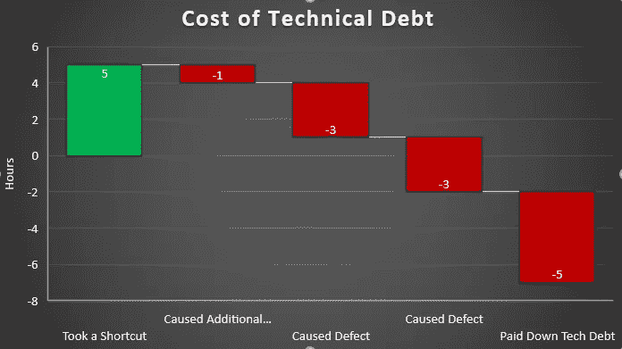
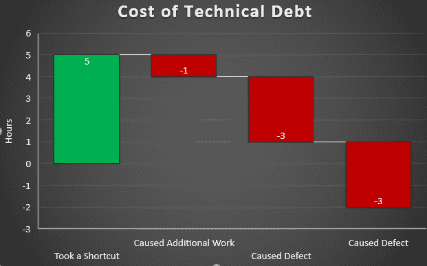
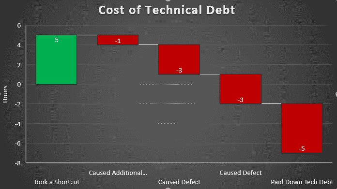

# 技术债务的真实成本

> 原文：<https://betterprogramming.pub/the-true-cost-of-technical-debt-265f198b1e0b>

## 我们大多数从事软件工作的人对技术债务都有适度的了解，但是您是否考虑过整个生命周期的成本？

在本文中，我们将从开始到解决的过程中来看一个虚构的技术债务。

我的目标是让你从几个不同的角度思考技术债务。

# 接受技术债务

我们的场景以一家公司努力工作以满足最后期限开始。在大型贸易展会上通过演示来完善产品功能，会带来巨大的财务收益。

这是演示前的最后冲刺。事情进展顺利，但是日程安排很紧。在《站起来》中，Kayla 描述了她正在开发的一个功能，以及它的复杂程度是如何远高于预期的。

Kalya 估计要花 8 个小时才能完成这个功能，但是在冲刺阶段没有足够的时间了。Dwayne 提出了一个建议，可以让团队在三个小时内满足关键需求。

经过深思熟虑后，团队决定采用短期解决方案，并创建一个 backlog 项目，以便在截止日期后正确地清理该特性。

团队按计划完成了特性，满足了最后期限，公司从团队的决策中获益。

在这一点上，团队已经从承担债务中获得了五个小时的生产力(贷款的本金)。

# 早期利息

演示结束后，该公司完成了一系列重要的销售和承诺，为公司带来了巨大的成就。对于公司来说，这是一个激动人心的时刻，团队很高兴看到他们的工作得到了回报。

由于在演示过程中发现了几个 bug，以及需要一些新特性，技术债单没有进入下一个 sprint。

此外，在 sprint 期间，Dwayne 发现，由于团队采取了变通办法，他现在需要在实现新功能时多花一个小时进行开发。在我们的金融比喻中，这可以被认为是*利息*。

让我们在这里暂停一下，在瀑布图上看看这个场景。这是一个财务图表，旨在绘制一段时间内的财务交易。毕竟，用财务图表来代表[一个财务隐喻](https://www.youtube.com/watch?v=pqeJFYwnkjE)比如技术性债务，似乎才是恰当的。

我们把这个图表看作是一个从左到右的故事。这里，我们通过承担债务获得了 5 个小时的生产率，但由于工作损失了 1 个小时，结果是净增加了 4 个小时的生产率。

# 额外债务

在下一个冲刺阶段，团队包括偿还技术债务的任务。

然而，在 Kayla 开始工作之前，出现了一对需要添加到 sprint 中的紧急 bug。这些错误原来是由于变通办法。每个 bug 需要三个小时的时间来复制、编写测试、修复、测试和补丁到产品中。

此外，Kayla 没有时间偿还债务，所以它滑向未来的冲刺。

因此，我们的瀑布图现在看起来像这样:

在这一点上，由于最初的捷径，团队总共损失了两个小时的生产力——而且他们甚至还没有开始偿还最初的技术债务。

# 技术债务的真实成本

清理原始债务的任务如期进入下一个冲刺阶段。

令人欣慰的是，这次没有任何事情干扰团队，Kayla 能够以另外五个小时的时间为代价全额还清债务。

总的来说，这使得从做出决定到损失 7 个小时的时间，总的生产力损失。此外，该决定导致了一些面向客户的缺陷，损害了用户体验和信任。

最重要的是，bug 和技术性债务偿还任务有一个与之相关的*机会成本*。换句话说，因为团队在这些项目上工作，他们不能在软件的其他改进上工作。

那么这意味着什么呢？团队是否应该不承担债务？

我会说没有。就解决技术债务而言，这实际上是一个相当理想的故事。这笔债务是出于明智和深思熟虑的考虑而承担的。如果没有这个决定，该公司就不会有今天，也会损失 10 万澳元的销售额和交易。

除此之外，团队还积极地对债务和由此产生的 bug 进行优先级排序。

不，仅仅因为债务花费了团队更多的开发时间并不意味着这是一个错误的决定。但我们在举债时必须记住，偿还债务的收益将远远超过生产率的提高——如果债务真的被偿还的话。

# 不幸的事实

这给我们带来了一个不幸的事实:这个团队像这样完全还清债务的故事是非常不寻常的。

根据我自己的经验，我认为大多数技术债务都没有得到解决。

根据我的经验，债务可以——而且经常——一直持续到产品退役。事实上，我已经观察到严重的技术债务代码被复制，并作为未来工作的基础。

如果你允许技术债务存在于你的代码中，它将作为未来代码的架构基础。

大多数团队不会像本文中我们的团队那样有意承担技术债务。这意味着他们不太可能从这些债务中获得很多或任何潜在的好处。

换句话说:如果你不得不承担五个小时的技术债务，你愿意是为了做成一笔大买卖，还是因为某天某个开发人员觉得有点懒？

那么，我们在这方面的主要收获是什么呢？

1.  技术债务的最终成本远远超过你做好它所花费的时间。
2.  短期技术债务对组织来说是一个关键的好处。
3.  技术债务通常构成质量的持续风险。
4.  应对技术债务进行监控和优先排序。