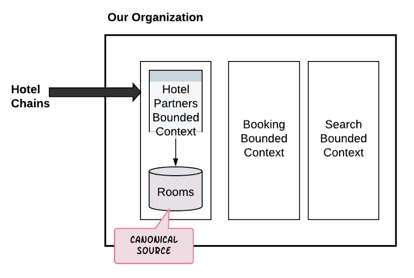
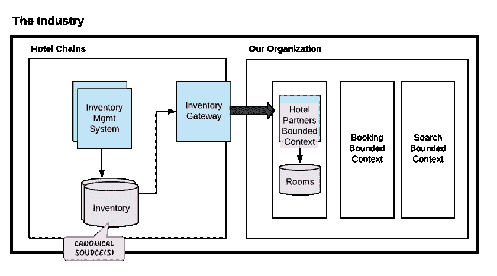
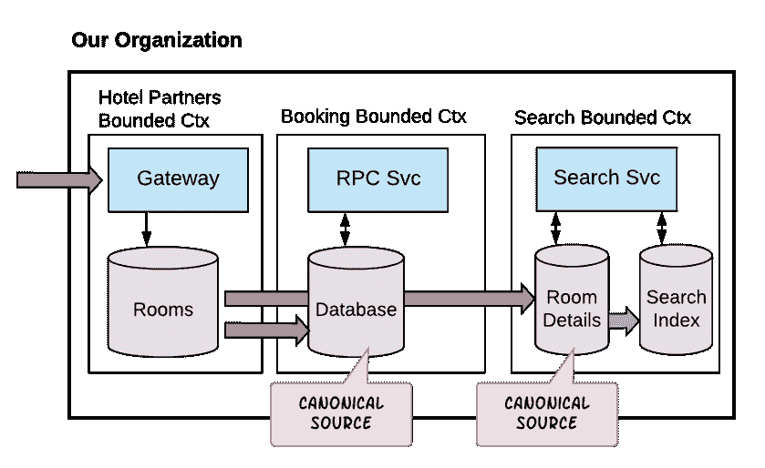
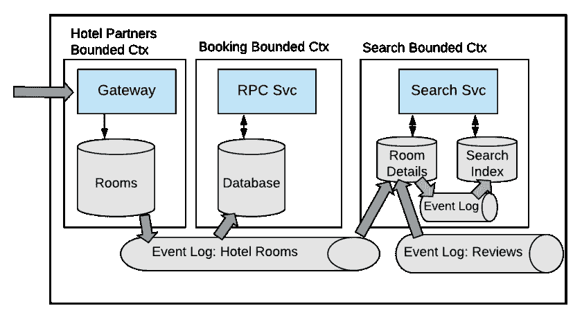
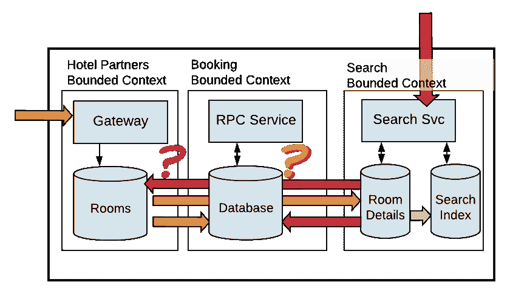
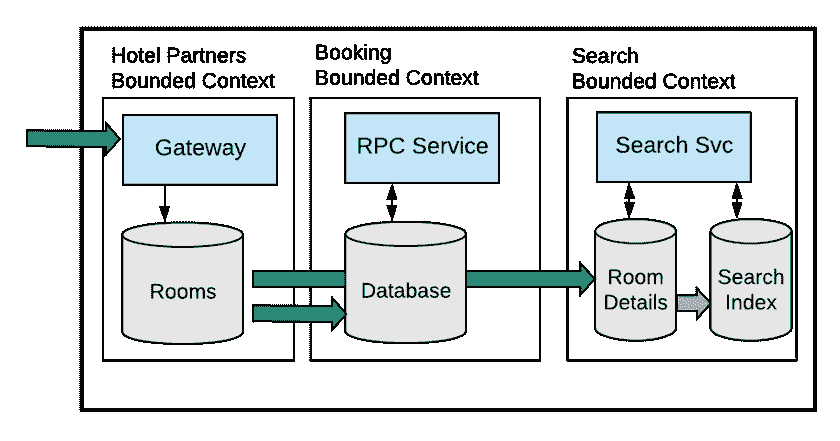
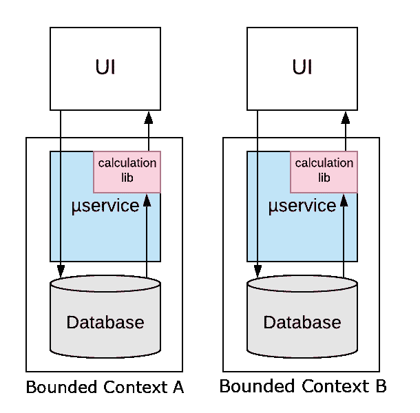
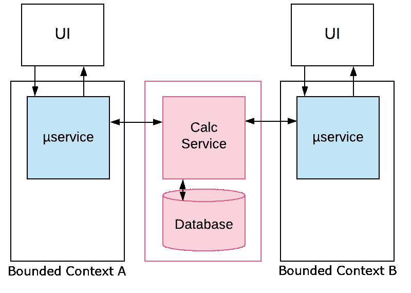
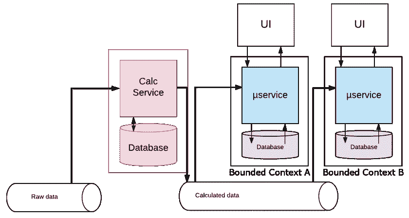

# 关于你的真相来源的真相

> 原文：<https://betterprogramming.pub/the-truth-about-your-source-of-truth-a1eb833c2d70>

## 随着您的服务规模的扩大，单一的事实来源可能会变得更加难以界定

瓦伦丁·安东尼尼在 [Unsplash](https://unsplash.com/s/photos/water-source?utm_source=unsplash&utm_medium=referral&utm_content=creditCopyText) 上拍摄的照片

当我们设计我们的微服务架构时，我们经常会发现自己试图为我们的领域实体定义一个单一的真实(或 SoT)来源。常识告诉我们，企业中的每个域实体都应该位于一个集中的位置。如果您想要获取该实体的一个实例，那么您可以到那个位置。

**注意:我讨厌微服务架构这个术语，但那是另一个讨论的话题。*

和许多常识一样，这并不一定如此。当然，跟踪我们的数据存放在哪里是个好主意。但是竭尽全力为每条数据定义一个单一的 SoT 是错误的方法。在最好的情况下，这通常是不必要的。更糟糕的是，它可能会引发比它声称要解决的问题更多的问题。事实上，这一概念与今天驱动许多企业的基于事件的系统背道而驰。正如我们将要讨论的，我们数据的真实来源大体上是虚构的。

# 单一的真相来源有什么问题？

在我们讨论单个软件的问题之前，让我们先回顾一下为什么我们要构建微服务。我们将从最基本的相关模式之一开始:[有界上下文](https://martinfowler.com/bliki/BoundedContext.html)。已经有很多关于该模式的文章，但是一般的想法是，每个业务领域都应该被认为是它自己的自包含系统，具有设计合理的输入和输出。

从组织的角度来看，每个有界的上下文都由一个单一的跨职能团队所拥有。该团队构建、部署和维护完成工作所需的服务和应用程序，对任何其他团队的依赖性最小。

这让我们看到了微服务架构最基本的好处。虽然我们可以一口气说出微服务的技术优势，但真正的优势是组织性的。团队对他们自己的项目有控制权和责任。他们可以随心所欲地修改自己的代码，而不用担心会影响其他团队。他们可以根据需要频繁地发布，而不需要与任何其他团队协作。他们拥有代码的整个生命周期，从设计和开发，到部署，再到生产监控。

对我们的领域实体实施单一的真实来源破坏了这些好处。

## 不必要的依赖

相反，单一的事实来源在团队之间和有限的上下文之间重新建立了依赖关系。他们迫使团队打破他们受限的环境来执行工作。如果团队需要对一个实体进行变更，那么现在就要看其他团队的时间表了。并考虑生产问题。团队将开始发现自己在晚上被唤醒，因为一些其他团队的服务行为不当。

单一的真理来源也等同于单点失败。要求所有服务从一个位置获取用户数据意味着如果用户服务停止，我们的整个企业可能会陷入停顿。sot 还引入了性能和可伸缩性瓶颈。随着需要访问用户数据的应用程序数量的横向和纵向增长，用户服务的负载将呈指数级增长。

也许最重要的是，坚持单一来源的真理严重阻碍了我们用可行的架构前进的能力。这一点变得很明显，因为团队越来越多地围绕着轴，争论着某某实体的 SoT。你有没有发现自己召集了多个不同的团队来讨论你的微服务的 API 的设计？努力满足每个团队的要求？当这些要求相互矛盾时，如何协商妥协？是啊，我也是。这清楚地表明我们一直在做错事。

我们为什么还要为微服务架构费心呢？

我们需要放松。不要再担心我们的“真相来源”，因为很有可能，我们寻求的唯一真相来源根本不存在。

# 对真理神圣源泉的探索

至少，它很可能不存在于我们的微服务当中。让我们建立一个简单的库存管理系统。我们的系统将包含跟踪存储在物理仓库中的物理库存项目的服务。每次一个新的商品被送到仓库，它的条形码被扫描，服务被更新以反映新的数量。因此，库存项目服务将是我们企业产品库存的可靠、唯一的真实来源，对吗？

除此之外，在仓库工人晚上带着塞满物品的口袋走出去之后，数据库还能有多准确呢？或者当仓库角落里一根漏水的管子导致包裹慢慢分解时？或者当一个新项目的调色板只是被扫描仪错过了？

让我们试试另一个例子。假设我们已经建立了一家公司，对酒店房间的交易进行汇总。我们与连锁酒店合作，从连锁酒店获取预订不足的房间，并向感兴趣的潜在游客提供最优惠的价格。为此，我们有一个 *HotelPartners* 有界上下文，它从我们的合作酒店获取房间数据，并将其存储在数据库中。

那么数据库是这些数据的存储库吗？不完全是。我们从其合作伙伴的数据库中获取这些数据，这些数据反过来代表了他们酒店房间的可用性。这些数据的任何真实来源肯定不在我们的组织内部。

关键是，执着于我们实体的真实来源可能是徒劳的。通常，没有这样的东西——至少在我们的企业系统中没有。

接受事实，真相的来源是相对的。

我们不应该为任何事情寻找难以捉摸的绝对单一的真理来源，而是应该接受真理来源是相对的这一事实。

认识到这个事实是非常自由的。

# 从规范视图和范围的角度考虑

我们可以考虑给定范围内数据的规范视图，而不是数据的单一 SoT。在任何管理数据的系统中，都会有一个数据存储来表示该数据在系统中的最新视图。这是系统的规范观点。系统中可能还有其他数据存储，它们也提供该数据的视图。也许数据被缓存是为了更快的读取访问，或者用来自另一个规范源的数据增强。但是这些额外的数据存储总是服从于作用域的规范数据源。

打个比方，想想数据库系统中的[物化视图](https://en.wikipedia.org/wiki/Materialized_view)。派生物化视图的原始表代表数据库模式范围内的数据的规范视图。

# 组织和行业范围

让我们回到几段前的酒店房间聚合器。作为这个半虚拟组织中的工程师，我们从第三方合作伙伴那里获取有关酒店房间的信息。数据进入我们的系统，进行转换和存储，所有这些都在我们*酒店合伙人*的有限范围内进行。然后，我们组织中其他以产品为中心的有界上下文将这些数据用于他们自己的目的。

*图 1 —我们组织的范围。*

所以在我们组织的范围内，这个 *HotelPartners* 有界上下文包含酒店房间数据的规范源。

现在，让我们缩小范围，从整体上来看这个行业。我们从连锁酒店获取了这些数据。因此，从这个意义上说，这些连锁店的数据库成为整个行业范围内数据的规范来源。

*图 2 —缩小到行业范围。*

我们还可以放大中的*并查看我们组织的特定有界上下文。就像我们整个组织从外部获取数据并存储自己的规范表示一样，我们的有界上下文也可以。具体来说，他们可以从 *HotelPartners* 有界上下文中获取数据，并存储他们自己的本地副本。*

*图 3——放大显示，我们组织中的每一个垂直方向都代表一个范围，每一个都有其规范的来源*

我们的产品团队现在有了自己的本地酒店房间数据规范来源。他们可以根据需要自由增强数据。他们可以用他们认为合适的任何格式存储它。他们不依赖*酒店合伙人*团队为他们做出改变。

产品团队还可以自由地为数据创建其他辅助数据存储。例如，*搜索*团队可能会建立一个二级数据存储，比如一个 ElasticSearch 索引，来支持跨不同轴的数据搜索。这个辅助数据存储仍然来源于 *Search* 的规范数据存储。

同时， *HotelPartners* 团队没有创建和维护“一刀切”的数据模型的负担，在这种模型中，他们试图让每个产品团队对存储的数据字段感到满意。

# 事件让它发生

如果您不熟悉基于事件的系统，您可能想知道面向产品的有界上下文(例如，搜索)应该如何从其封闭范围的规范源(例如，酒店合作伙伴)中获取数据。难道它还需要调用酒店合作伙伴的 API 服务吗？

事实证明，事实并非如此。相反，规范源将其更改作为事件发布。一般来说，我们使用类似 Kafka 的事件日志来实现这个目的，但是细节在这里并不重要。重要的是面向产品的有界上下文能够订阅这些事件，接收它们，并将结果存储在它们自己的数据存储中。

图 1 到图 3 在描述 Booking 和 Search 有界上下文如何获得它们的数据时有点过于简单。图 4 提供了一个更准确的视图。

*图 4 —使用事件从我们组织的规范源中获取数据的有界上下文*

Hotel Partners bounded context 从外部合作伙伴获取数据，并将其保存到其客房数据库中。一旦保存了数据，它就创建描述所保存数据的事件，并将这些事件发布到事件日志中。Booking 和 Search 有界上下文订阅该事件日志，当事件到来时，使用它们并填充它们自己的数据存储。

还有其他一些值得注意的事项。首先，Search bounded context 使用相同的基于事件的机制将更改从它自己的规范源(图中标题为 Room Details)传播到它的二级搜索索引。还要注意，搜索团队正在订阅另一个事件日志(标题为 Event Log: Reviews in the diagram ),以使用客户评论来扩充其库存数据存储。

我们通常把这样的系统称为基于事件的系统。它们不同于由同步 API 调用驱动的更传统的请求-响应系统，后者倾向于驱动对单一真实来源的渴望。基于事件的系统也固有地意味着最终的一致性。这意味着在任何给定的时间点，我们组织中的数据可能处于不同的状态。如果没有新的变化，这个状态将会收敛。由于变化通常是一个常数，这意味着在一段时间内(通常以毫秒计)，一个给定的实体在一个上下文中(比如酒店合作伙伴)可能比在另一个上下文中(比如搜索)更新。

好的一面是，在我们设计良好的系统中，有适当的有界环境，最终的一致性是完全可以接受的。回到我们的例子，酒店合作伙伴绑定上下文将首先接收数据。然后，数据大致但不完全同时流向预订和搜索受限上下文。此时，给定的实体可能在每个有界上下文之间不同步。然而，由于每个有界的上下文代表一个独立的业务领域——具有自己的应用程序和功能——简单的不一致变得很难察觉。

# 如果你一定要着迷，那就着迷于你的数据的原始来源

通常，当寻找一个真实的单一来源，一个从内部获取实体的单一位置时，我们真正寻找的是一个单一的原始来源——也就是说，一个从外部获取实体的单一位置。

换句话说，任何给定的实体都应该通过单一位置进入我们的组织。很自然地，数据将从这个入口点流经我们的组织。此外，它将单向流动。

让我们看一下上一节中的图 3(理解我们使用 Kafka 这样的事件日志来传播数据)。在这里，我们看到客房可用性数据是由酒店合作伙伴绑定的上下文从外部来源获取到我们的组织中的(可能通过批处理文件获取)。数据被分发到我们组织的各种有界限的上下文中(例如，搜索、预订等)。

现在，让我们假设搜索添加了一个新的 web 应用程序，允许注册个人将房间清单添加到我们的系统中。突然间，我们的系统中有了两个位置，我们可以在其中接收相同的数据。

*图 5——当相同的数据来自多个来源时会变得混乱*

为什么这是一个问题？在我们的系统中管理数据流的复杂性大大增加了。如果我们有来自酒店合作伙伴和搜索的数据，那么这两个有界上下文都需要将它们的传入数据作为消息发布。当然，双方都需要使用彼此的信息并做出适当的改变。

例如，酒店合作伙伴将需要使用来自搜索的消息，并更新其数据库。那么，它是否应该将这种变化作为一条消息发布，供搜索引擎随后使用呢？如果我们不小心，我们会创建一个无限的消息循环。预订呢？预订现在需要消耗来自酒店合作伙伴和搜索的消息。it 部门现在是否负责找出数据来自哪个服务？

接下来，考虑解决冲突。如果有人使用搜索的网络应用程序推送与我们从行业来源获取的其他数据相冲突的数据，谁来决定如何解决这些冲突？

与冲突解决类似，我们也有重复数据消除的问题。如果我们从多个来源接收数据，很有可能我们会经常摄取重复的数据。如果这些数据从多个位置进入我们的系统，那么会在哪里进行重复数据消除？

所以我们应该认识到我们的数据来自哪里。如果可能的话，我们应该将任何给定的实体限制在一个单一的原始来源。如果我们真的需要允许用户向我们的系统添加房间可用性数据，我们应该只允许在我们接收批量购买数据的相同范围内(即酒店合作伙伴范围)。这样，我们的数据单向流动，传播变得更容易推理，更不容易出错。

*图 6–好多了！*

# 现在是一些常见问题

当我讨论相对 sot 和基于上下文的规范数据源的概念时，会出现一些问题。我们在这里讨论一下。

## 主数据管理呢？

有人问我，这种规范数据源的想法是否违背了[主数据管理(T3)或 MDM 的行业实践。简而言之，MDM 的使用有助于组织确保在不同的内部小组中不会出现相同信息的重复表示。这里重要的是，MDM 意味着组织必须拥有公司业务领域中每个实体的单一规范来源。](https://searchdatamanagement.techtarget.com/definition/master-data-management)

尽管第一次出现，MDM 并不违背相对规范源的思想。如上所述，在整个组织的范围内，我们仍然有其数据的规范来源。在我们的 MDM 系统中，我们会对记录进行重复数据删除，并为它们分配一个惟一的 ID。反过来，存储在其他有界上下文中的记录将保留实体的规范 id。

同时，MDM 数据存储可以而且应该保持相对轻量级。事实上，对于这种数据存储来说，除了实体 id 和其他一些基本的标识信息之外，几乎不存放任何东西是完全可行的。

## 真理的单一版本呢？

有时，我们发现自己有不同的应用程序，这些应用程序根据自己的公共数据视图执行公共计算。在这种情况下，我们不是应该保留计算算法之间差异的可能性吗？我们最终可能会在不同的应用程序中显示相同数据的不同结果。

这与单一版本真理(SVoT)的概念有关。这个概念粗略地说，如果多个系统对相同的数据有各自的视图，那么必须有一个一致同意的数据解释。SVoTs 通常在业务分析和决策制定的上下文中引用，但在讨论分布式系统时也适用。

事实是，虽然我们不经常需要担心为我们的数据创建一个单一的真实来源，但我们有时需要为我们的算法定义一个单一的 SoT。

例如，我们的酒店房间聚合组织可能会为潜在的旅行者提供排名推荐。如果推荐可以出现在多个地方，那么我们希望为给定的用户显示相同的推荐，不管它们出现在哪里，或者原始数据来自哪里。从这个角度来看，虽然数据可能位于多个位置，但我们需要确保使用单一算法来执行计算。

# 我们如何确保给定算法或计算的单一 SoT？

我们有几个选择。

## 在图书馆分发

我们首先想到的可能是编写算法，将其打包成一个库，并让所有需要它的服务都可以导入它。这样，所有服务都有一个一致的本地机制来计算它们的本地数据。

图 7 —计算库

虽然这种方法听起来简单且有吸引力，但是在微服务架构中依赖库有一些主要缺点:

*   协调变化是困难的。如果算法要改变，我们需要构建和部署新版本的库。然后，我们需要以协调的方式重新部署所有这些服务。这打破了微服务的一个基本原则:可独立部署的服务。
*   我们把自己绑在一种语言上。如果我们的服务是用不同的语言编写的，我们就需要用不同的语言重复算法。然后，我们不再有一个算法的单一 SoT。

## 计算服务

我们可以部署一个微服务来执行计算。在这种情况下，我们需要来自各种有界上下文的应用程序同步调用该服务来获取计算的数据。

图 8 —计算服务

虽然这种方法可能比库更可取，但它让我们回到了本文中讨论的最初问题。我们现在已经为我们的计算建议实施了单一的真实来源。

## 计算发布者

那么，为什么我们的新微服务不能随着酒店房间可用性的变化而简单地执行计算，并将这些计算结果发布给不同的受限上下文来使用呢？

毕竟，这就是基于事件的系统的工作方式。

通过这种方法，我们的新微服务成为酒店合作伙伴生产的数据的消费者，就像我们其他有界上下文的微服务一样。

图 9 —计算生成器

# 我们是不是在说单一的真相来源总是一个坏主意？

我们已经看到，实施单一来源的真相往往是不必要的，有害的，在许多情况下，这是一个谬误，我们正试图使之成为现实。尽管如此，我们可能会遇到一些我们希望对其执行单一 SoT 的数据。正如我们上面讨论的，对于某些数据，最终的一致性可能是不可接受的。我们可能有不经常访问的服务，不在任何关键路径中，并且有简单的、不经常改变的 API。

认证是一种常见的情况。通常，我们希望在一个位置管理用户的登录凭据、角色、权限和令牌。一般来说，这些活动(相对)很少发生，但我们希望确保任何更新都立即得到反映。因此，我们可能会选择为我们的认证数据定义一个单一的真实来源。然而，即使在这种情况下，我们也希望确保尽可能简化身份验证模型。例如，姓名和联系信息等用户详细信息会放在其他地方。

但这不是我们必须遵守的普遍的黄金法则。尽管有共同的想法，我们的数据的单一来源并不是一个自动的要求。此外，它们通常是生产力以及应用程序性能和可伸缩性方面的障碍。

相反，用规范的源和范围来设计我们的系统将帮助我们避免瓶颈，允许我们设计更灵活、可伸缩的基于事件的系统，并允许我们的团队专注于完成工作。

觉得这个故事有用吗？想多读点？只需 [*在这里订阅*](https://dt-23597.medium.com/subscribe) *就能把我的最新故事直接发到你的收件箱里。*

*你也可以通过* [*成为今天的*](https://dt-23597.medium.com/membership) *媒体会员来支持我和我的写作，并获得无限量的故事。*