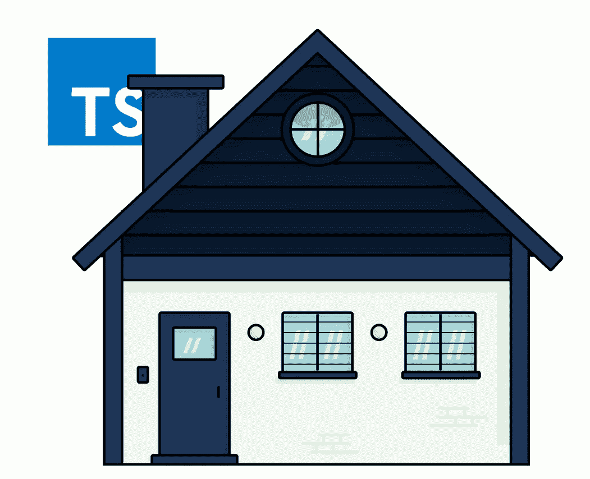
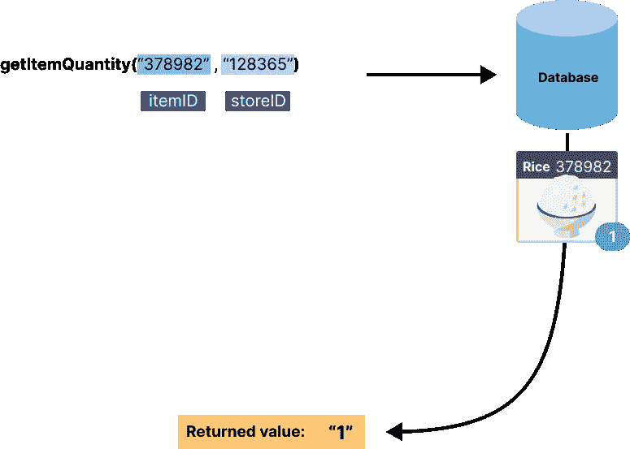
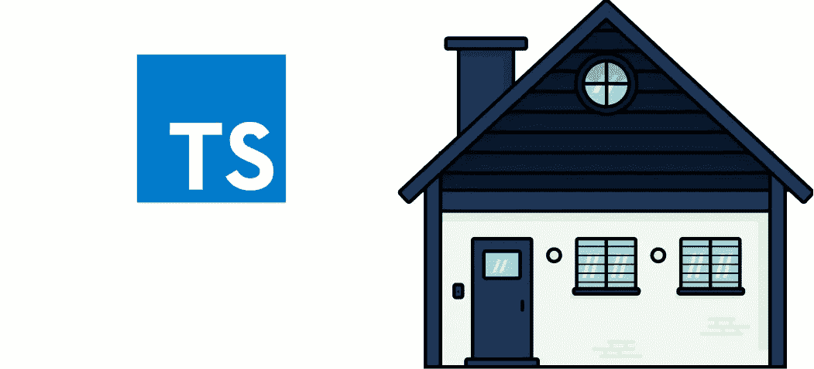

# 我希望我有打字指南

> 原文：<https://betterprogramming.pub/the-typescript-guide-i-wish-i-had-185087d66dd1>

## 通过可视化指南和简单的语言学习打字稿

斗争不必如此真实。

Typescript 伴随着一个严重的学习曲线，老实说，在早期阶段，它可能会感觉像一个你必须承担的负担，因为“行业”决定它是史诗般的新趋势…现在你需要学习这个新东西，只是为了在不久的将来保住(或获得)你的工作。

我是通过试错来学习 TS 的，顽固地磕磕绊绊，推高了我的编译器给我的痛苦之山，因为它一直对我大喊错误信息，甚至更糟的是，对于在 Typescript 出现之前绝对可以工作的代码。然而，经历这一切，其实是值得的；但是，如果有更多的视觉指南、简单的语言和具体的例子使它更容易理解，它就不会如此痛苦，这就是为什么我要写这个:我希望我有的打字稿指南。

本系列将分为许多部分，从使用 Typescript 的原因和一些介绍性概念开始。然后，我们将逐步转向我为各种平台构建的应用程序中遇到的高级用例。我们开始吧。

## **简介—从“为什么”开始**

> “我已经可以看着代码说出数据是什么了……用 typescript 有什么意义？”—我，当我被介绍给 TS 的时候

从表面上看，这种说法似乎并不遥远，因为 JavaScript 内置了数据类型，而且很多时候，我们只要看一看就能知道它们是什么。

*   `"Hello"`是字符串
*   `2`是一个数字
*   `true/false`是一个布尔
*   `{}`是一个物体
*   `[]`是一个阵
*   `NaN`不是数字
*   `null`为空或未知
*   `undefined`表示没有设置值

然而，大多数时候，数据驱动的应用程序并没有这么简单，因为数据通常是嵌套和抽象的。例如，假设您想从商店的数据库中获取某个商品的数量；让我们使用方法`getItemQuantity(“378982”, “128365”)`，其中第一个参数是商品的 ID，第二个参数是商店的 ID。

首先，并不完全清楚从名称`getItemQuantity`返回的值是什么，它可能是一个数字，一个数组，一个字符串，甚至是未定义的或空的；这完全取决于设计 API 的人。如果您从这个数据库中收到一个类似“1”的值会怎么样？然后想象你在你的应用中把它加到一个实际的 ***数字*** 上，比如 1，也许是为了增加它的数量。嗯，在 javascript 中，“1”+1 会给出“11”，而不是我们在将这些值相加时可能期望的 2。现在，您或其他开发人员可能需要花时间对代码进行故障排除，以最终认识到您正在使用的 API 以字符串格式返回数字。

TypeScript 可以帮助您准确地知道您应该(预期)处理哪种数据，因此您不必猜测某人是指“1”还是“1”，或者他们是否认为这两者都可以。请注意，这是一个简单的情况，数据会变得比这复杂得多，尤其是在处理对象、对象中的数组或对象中的数组时，哦，天哪(我们将在后面的文章中讨论这一点)。数据越复杂，TypeScript 就变得越有用。

# **工作原理**

让我们来看更多的例子:

Typescript 是用来描述事物的，它可以用来描述我们能想到的任何事物的特征。让我们从上面这个简单的房子插图开始。描述这一点的核心方法是使用 TypeScript 的接口工具。接口描述了事物的一个或多个属性。它让我们确切地知道某事是什么。

以下是该房屋插图的示例界面:

我们来分解一下这个接口。

`Interface SimpleHouse {` ←这是我们用来描述上图中房子的名字。它可以是任何名字，比如 CartoonHouse，TinyHouse，HouseIllustration，或者任何最能描述这个东西的名字。根据经验，我喜欢这样想——如果有人给你看这张图片，你会说它是什么？然后，尽量准确描述，尽量少用词。

`price: number;`**↓**这意味着价格可能是 10000，而不是“$ 10000”这告诉我们，接口期望这个价格是一个数字，而不是其他。如果你想同时允许一个数字和一个字符串，你可以这样写`price`属性:`price: number | string`。我们稍后将更详细地介绍这个符号(`|`)的含义。

`color: string;` **←** 这意味着它可以是任何颜色:“红色”、“黑色”、“绿色”等等。只要确保它是一个字符串，如`undefined`或`null`等。

`numberOfWindows: 0 | 1 | 2;`**↓**这意味着一个简单房屋允许的窗户数量是 0、1 或 2……没有别的。在 typescript 中使用竖线(|)称为“联合”。我喜欢把一个联合看作是多项选择，其中允许竖线之间拆分的任何一个值。如果我们试图为`numberOfWindows`设置值 3，typescript 会在我们的文本编辑器中抛出一个错误警告。这是因为 3 不在`0 | 1 | 2`的并集中。我们可以像这样添加 3 个成员:`0 | 1 | 2 | 3`。

## **重述**

在下面的示例应用程序中，尝试编辑房屋插图的值以查看它的更新，以及 typescript 如何根据它的预期告诉您某个值是否不正确。例如，尝试为`numberOfWindows` 输入值 3，看看 TS 如何处理警告。

我真诚地希望这篇文章是即将到来的系列文章的第一部分。感谢阅读。