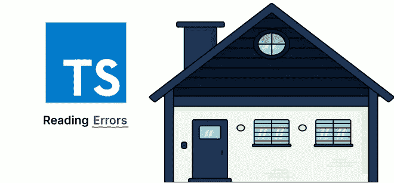
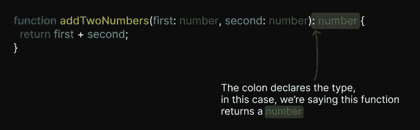
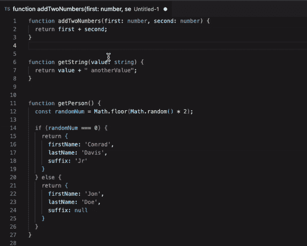
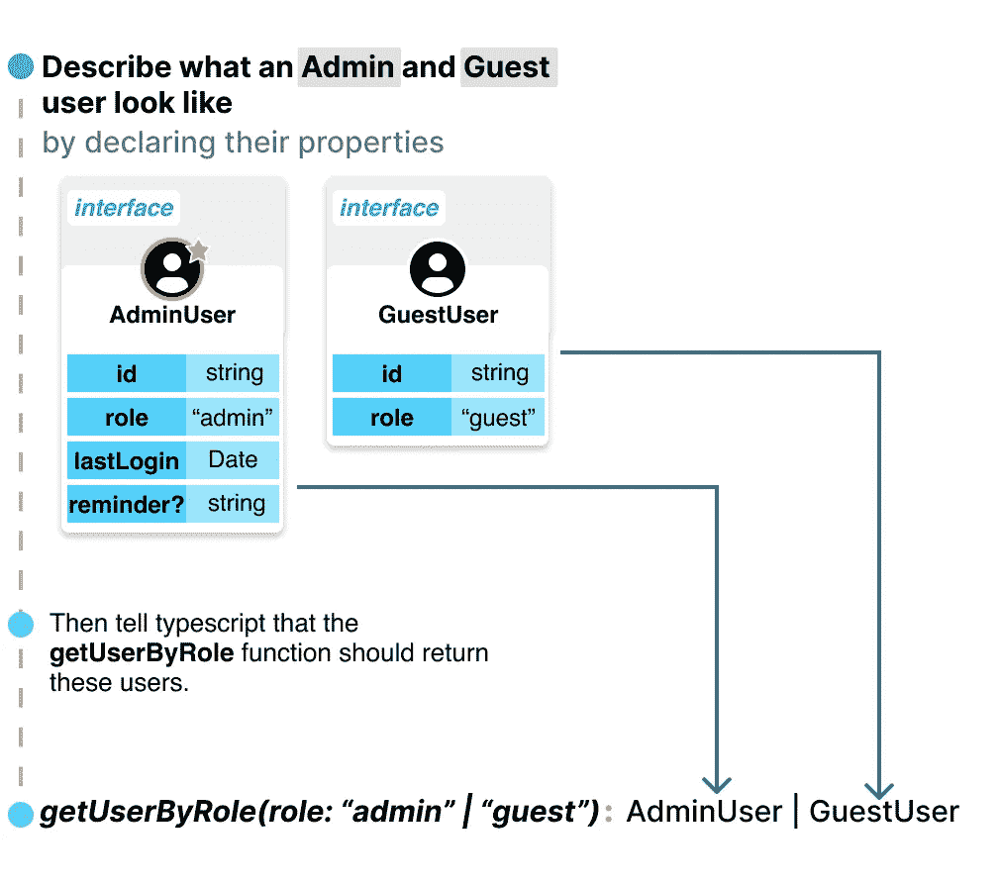
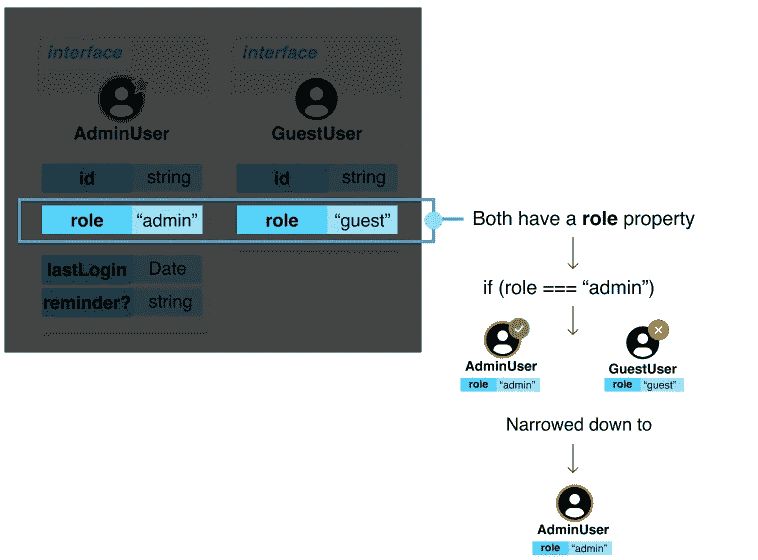
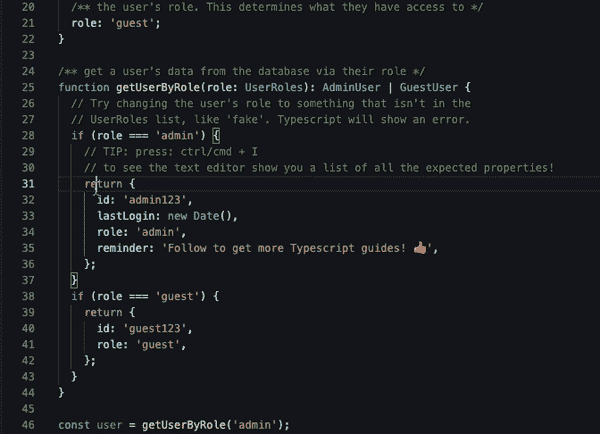
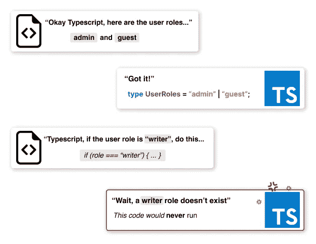
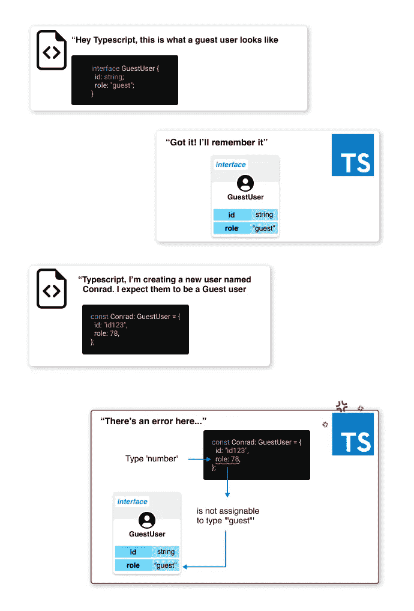

# 读取 TypeScript 中的简单错误

> 原文：<https://betterprogramming.pub/the-typescript-guide-i-wish-i-had-reading-errors-part-1-68a1c82d9303>

## 用直观的指南和简单的语言

作者图片

TypeScript 可能充斥着错误和警告，似乎是为了每一件小事。以这个函数为例:

(如果您不确定`:number`在函数参数中的含义，我会在本指南的[章节中介绍更多内容。但是不要担心，我们也会在本文中轻松地重温它。)](https://medium.com/@conraddavisjr/the-typescript-guide-i-wish-i-had-185087d66dd1)

在严格模式下，使用 TS eslint 设置，TypeScript 实际上会对这个使用 TypeScript 的完美工作函数发出警告！错误应该是这样的:`Missing return type on function`。

查找错误是一件令人头疼的事情，所以在这篇文章中，我们将深入讨论一系列错误以及如何理解和解决它们。由于在 TypeScript 中有大量不同的错误，本章将被分成许多部分，以尽量涵盖广泛的错误。如果你将来遇到这些讨厌的错误，请随意将它加入书签并重新阅读。我们开始吧！

## 1."函数缺少返回类型"

原因:

我们没有告诉 TypeScript 我们期望从函数中返回什么。很多时候，TypeScript 可以假设这一点，但是在严格模式下，它会要求您声明这一点。

解决方案:

在函数参数的结束参数后加一个冒号，并写出函数返回的类型，如下所示:

一个简单的函数，addTwoNumbers，将提供的第一个和第二个数字相加。该函数被分配一个数字类型作为返回值

**提示**:如果您不确定哪个(些)类型可以从您的函数返回，您可以将鼠标悬停在您的文本编辑器中的函数名称上，TypeScript 将向您显示可以使用的返回类型。这将在 99%的情况下有效！

GIF，显示 typescript 如何解释函数返回类型

为什么返回类型很重要:

函数可能会返回许多不同的结果。甚至像`addTwoNumbers`这样简单的东西也可以返回`number`、`NaN`、`null`、`void`，甚至是`string`，这取决于你如何设计它。因此，TS 希望您清楚地列出它应该期望的所有可能的返回值。

如果您正在构建一个其他人会使用的 API，这一点尤其有用。帮助他们可靠地知道预期的数据类型可以将您的 API 与其他 API 区分开来。

返回一个类型最酷的地方在于，当你重构或更新一个函数时，如果你不小心(或不知不觉地)忘记了返回一个重要的、期望的属性，TS 会让你知道。此外，它可以为您自动完成一个可用属性列表，帮助您发现代码中正在处理的数据的更多信息。我们将很快介绍所有这些内容。

我们将使用我为本文制作的这个小应用程序来查看其他几个错误(和好处)。你可以在那里随意探索…我们会详细讨论的。

让我们打开上面的应用程序。在第`25`行，我们使用一个`getUserByRole`函数根据用户的`role`返回一些用户数据。在这个应用程序中，用户可以是一个`admin`，也可以是一个`guest`。

使用一个接口，我们可以描述一个`AdminUser`和一个`GuestUser`看起来像什么，并通过把`:AdminUser | GuestUser`放在它的参数体之后，把它传达给我们的函数。我喜欢这样想象它:

显示接口如何分配给方法的图形

既然我们定义了一个`AdminUser`和一个`GuestUser`的样子，TypeScript 可以为我们做很多很酷的事情。以这段代码为例:

仅仅通过编写`if (role === 'admin')`，TypeScript 就可以*告诉*我们正在讨论`AdminUser`，并准备好期待返回它们特定形式的数据。这称为类型收缩。当你将一个类型列表(官方称为 union，看起来像这样→ `type1 | type2`)缩小到一个更小、更具体的列表，比如`AdminUser | GuestUser`到仅仅`AdminUser`。TypeScript 可以通过评估属于我们提供的类型的属性来解决这个问题。

TypeScript 有助于为`AdminUser`提供可用的属性列表。这可以让我们对物体有更深入的了解。

你自己试试吧！在下面的应用程序中，注释行`33–35.`然后，当你的光标在对象体内时，按`ctrl + I`或`cmd + I`(对于 Mac)来获得属于`AdminUser`的属性的完整列表！

**注意**:属性列表将只显示当前没有列出的对象属性。因此，如果您已经返回了它的所有属性，该命令将不会显示更多可用的属性。

如果我们试图检查一个角色不存在的用户，比如“writer”呢？如`if (role === ‘writer’)`。这会导致我们的下一个错误。

## 2.此条件将始终返回“false”，因为类型“UserRoles”和“`writer`”没有重叠。

原因:

我们试图比较的一个(或多个)值与 TypeScript 被告知的不一致。在上面的应用示例中，这是因为我们只有两个角色，“admin”和“guest”在我们的定义中,“作家”角色并不存在。我喜欢这样想象它:

> `This condition will always return ‘false’ since the types ‘UserRoles’ and ‘“writer”’ have no overlap`

让我们一字不差地分析错误。

`This condition` —条件评估。那是`if`座，也可能是`ternary`座等等。比较`true`或`false`中的值和结果的任何东西。

`will always return ‘false’` —它永远不会运行那部分代码！它不会进入条件语句，因为它总是假的…基本上是这样的:`if(false) {/* will never run */}`。

`since the types ‘UserRoles’` —在这种情况下，“用户角色”是 TypeScript 作为其真实来源引用的值。请注意，`UserRoles`是我选择的名字，它可以是你想要的任何名字。在您的应用程序中，这将匹配提供给 TS 的任何类型。

`and ‘“writer”’` —这是您试图使用的导致错误的值。

`have no overlap` —您尝试使用的值不存在于 TypeScript 所引用的真理来源(`UserRoles`)中。您可以将它添加到提供给 TS 的列表中，或者坚持使用 union 中的一个值(`UserRoles`)。

解决方案:

以下方法之一将有效:

A.更新类型`UserRoles`(在本例中)以包含“writer”，比如:`type UserRoles = ‘admin’ | ‘guest’ | ‘writer’`。

或者

B.回退到使用`UserRoles`中提供的值(在本例中为‘admin’或‘guest’)，这样我们就可以在使用的值中获得“重叠”。

对于下一个错误(TS 中最常见的错误之一)，进入下面的文本编辑器，将任何字符串值更改为不同的数据类型，比如数字。例如，在第`40`行，将`guest123`改为一个数字，如`2`。

## 3.类型“number”不可赋给类型“string”

或者`Type ‘[TYPE_1]’ is not assignable to type ‘[TYPE_2]’`

原因:

我们正在尝试使用与 TypeScript 期望的类型不匹配的类型。第一种类型，`TYPE_1`，是我们正在尝试使用的。另一种类型，`TYPE_2`，是 TypeScript 所期望的类型。下面是我对这个错误的形象化描述:

我们告诉 TypeScript，`role`只能是“客人”，然后我们转身尝试设置一个数字`78`，作为`role`的值。这种情况经常发生，尤其是对于我们没有构建的复杂数据和 API。

解决方案:

使您的类型与预期相符，或者更新预期。在上面的例子中，一个解决方案可以是将数字`78`改为`"guest"`，或者，如果我们想特别允许数字`78`的话。我们可以更新`GuestUser`接口以允许`78`或任何通用的`number`值。这里有一个例子:

感谢阅读。敬请关注更多内容。