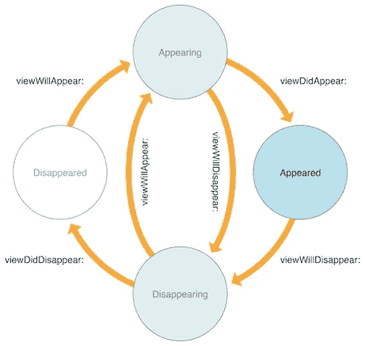
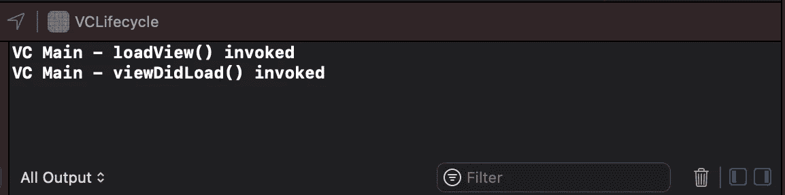
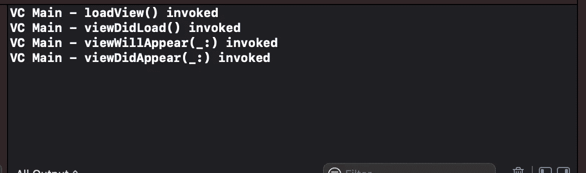
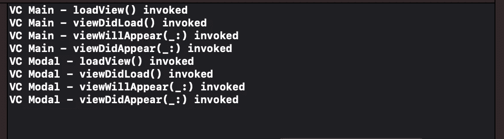
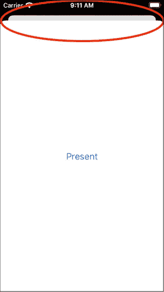
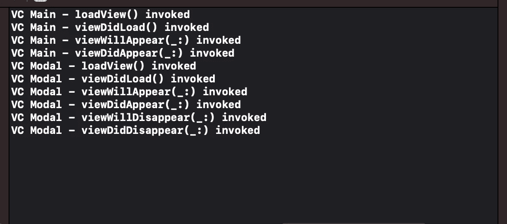
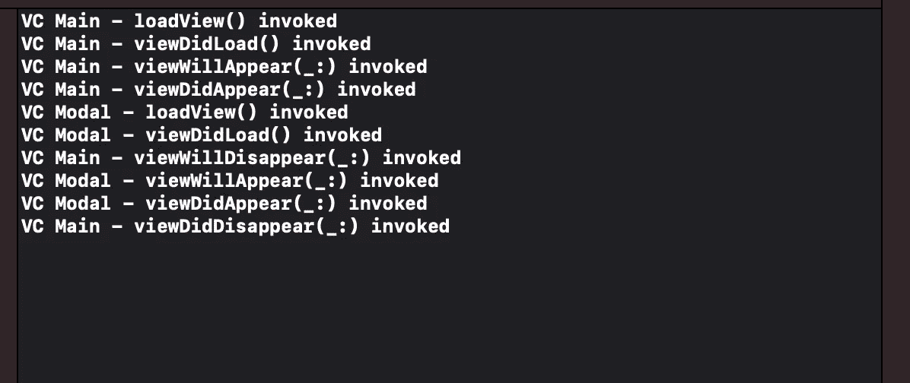

# UIViewController 生命周期解释

> 原文：<https://betterprogramming.pub/the-uiviewcontroller-lifecycle-explained-17c83d2c572f>

## 当一个 VC 被创建并呈现时会发生什么？

照片由[托尔加·乌尔坎](https://unsplash.com/@tolga__?utm_source=medium&utm_medium=referral)在 [Unsplash](https://unsplash.com?utm_source=medium&utm_medium=referral) 上拍摄。

当开发一个应用程序时，我们可能需要在加载一个`UIView`时添加一些自定义逻辑。例如，我们可能需要执行一个网络调用来从后端获取一些数据。在其他情况下，当视图即将被取消并对用户隐藏时，我们可能需要清理一些资源。

虽然这些想法很简单，但在 iOS 开发中还是有一些细微差别。一起探索它们可能会有所帮助。

*注意:即使您只使用 SwiftUI 进行开发，您也可以从本文中受益。SwiftUI 视图可能被加载到一个* `[*UIHostingController*](https://developer.apple.com/documentation/swiftui/uihostingcontroller)` *中，它继承了* `*UIViewController*` *，所以这些想法在那个上下文中也是有效的。*

# **生命周期**

视图控制器的生命周期可以分为两个大的阶段:T21 视图加载和视图生命周期。

视图控制器在第一次访问视图时创建它的视图，用它需要的所有数据装载它。这个过程就是视图加载。

第二个责任是在需要时呈现和隐藏它的视图。当这些事件发生时，VC 通知我们这些事件，以便我们可以运行一些定制的逻辑。这是视图生命周期。

下图摘自`UIViewController`文档，显示了视图生命周期:

图片来自:[苹果开发者](https://developer.apple.com/documentation/uikit/uiviewcontroller)

从这个[有限状态机(FSM)](https://en.wikipedia.org/wiki/Finite-state_machine) 中，我们可以看到每个状态(白色和浅蓝色圆圈)会发生什么。例如，如果 VC 处于`appearing`状态，它只能进入`appeared`状态，调用`viewDidAppear(_:)`方法)。或者它可以直接进入`disappearing`状态，调用`viewWillDisappear(_:)`方法。

## 查看加载

要记住的第一个细微差别是，当创建 VC 时，视图是*而不是*自动加载到内存中的。

`UIViewController.init`方法不调用`loadView`方法。这个函数在`ViewController`第一次被要求在屏幕上显示它的视图时被调用。

如果 VC 存在，而视图以前从未被加载过，则调用`loadView`方法。之后，VC 调用`viewDidLoad`方法，这是一个方便的覆盖点，可以添加一些只需要执行一次的定制逻辑。

以下代码显示:

`AppDelegate`创建了两个视图控制器:`mainVC`和`secondaryVC`。当`mainVC`打印`loadView`和`viewDidLoad`日志时，`secondaryVC`不打印。

`secondaryVC`没有显示，其视图也不会显示。因此，没有必要用一个可能根本不会被使用的视图来占用设备的内存。

为了完整起见，这是`ViewController`的代码:

如您所见，我们刚刚创建了一个属性来保存 VC 的`name`，并且我们覆盖了`loadView`和`viewDidLoad`方法来打印日志。

`logMethod`方法很有意思。它使用`#function`元参数。该参数由编译器赋值，包含当前方法的名称。通过将该参数传递给 log 函数，我们可以打印出调用`log`函数本身的方法的名称！

如果我们运行代码，我们将获得以下输出:

> 注意:还有另一种方法来强制 VC 将视图加载到内存中:通过访问视图来更新它的一个属性。尝试添加行`secondaryVC.view.backgroundColor = .systemRed`来查看视图是否被加载，即使 VC 不存在。

## **视图生命周期**

这是视图控制器的第二个职责。每当出现一个视图控制器时，它都会通过`viewWillAppear`方法，然后调用`viewDidAppear`方法。

视图消失时也会发生同样的情况:首先调用`viewWillDisappear`方法，然后调用`viewDidDisappear`方法。

我们可以通过修改我们的`ViewController`类中的代码来轻松检查这一点。

首先，让我们创建一个自定义的`View`，这样我们就可以向它添加一个按钮。

这个视图有一个名为`Present`的按钮，用户可以点击它来显示另一个视图控制器。该按钮位于屏幕中央。

然后，我们把这个观点和我们的 VC 联系起来。我们可以修改`loadView`方法来创建自定义的`View`，设置它的交互，并将其用作`ViewController`的默认视图。

有趣的是第 11 行，每当用户点击`Present`按钮时，我们都会呈现一个名为`Modal`的新`ViewController`。

最后，让我们为视图生命周期添加一些其他日志行:

这里没有什么特别的:我们覆盖了生命周期方法，添加了一个日志来查看它们何时被调用。如果我们现在运行代码，我们可以看到以下输出:

我们可以点击模拟器上的`Present`按钮，看看接下来会发生什么。

你可以看到`Modal` VC 已经被加载并呈现。然而`Main` VC 仍然在`Modal`后面。这是为什么呢？如果我们看屏幕，很容易理解:

红色圆圈突出显示了旧 VC 的`View`仍然在那里，并且在我们刚刚呈现的模态视图下面部分可见。所以，现在还没有消失。

我们现在可以从上到下滑动，并解散`Modal` VC。让我们看看我们的输出是如何变化的:

我们可以看到`viewWillDisappear`和`viewDidDisappear`最终被调用。

所有这些方法(`viewDidLoad`、`viewWillAppear`、`viewDidAppear`、`viewWillDisappear`、`viewDidDisappear`)总是被 VC 调用，尽管我们没有什么可运行的。这些是 VC 提供给我们的钩子，让我们在那些时刻运行一些特定的代码。

*注意:在重写这些方法时，要记住调用* `*super*` *，传递调用钩子时我们收到的相同参数。如果我们不这样做，行为是未定义的。*

## 方法之间的差异

顾名思义，这些方法之间有一些细微的差别:

*   当 VC 正在呈现视图，但是视图还不可见时，调用`viewWillAppear`。
*   当视图已经呈现在屏幕上时，调用`viewDidAppear`。
*   当 VC 将要关闭视图时，调用`viewWillDisappear`,但是视图仍然呈现在屏幕上
*   `viewDidDisappear`当视图不再被渲染时被调用。

为了验证这一点，让我们修改一下`loadView`的代码。

这段代码中的变化发生在第 12 行到第 14 行。这里，我们在一个单独的变量中创建 VC，然后将`modalPresentationStyle`更改为`fullScreen`。这迫使`Modal`视图覆盖整个屏幕，因此`Main` VC 将不再可见。

*注意:使用这种方法，我们将不再能够通过从上到下滑动来解散新的 VC。如果您想要建立这种行为，您需要添加一个关闭按钮。*

如果我们运行这个新代码并点击`Present`按钮，我们将获得以下输出:

有趣的部分浓缩在最后四行。加载`Modal`视图后:

*   `Main` VC 的观点即将被驳回。
*   `Modal` VC 的观点即将呈现。
*   `Modal` VC 的观点提出来了。
*   VC 的观点最终被驳回。

因此，`Modal` VC 的`viewXXXAppear`方法被`Main`的`viewXXXDisappear`方法包装。这是有意义的，因为`Modal`视图即将完全覆盖`Main`视图。只有当`Modal`的视图完全呈现在屏幕上时，这个过程才完成。

# 结论

在本文中，我们探索了`ViewController`生命周期方法如何相互作用，以及如何在我们的应用中利用它们。

我们探索了一些他们的优化，陷阱，以及他们如何改变 VC 的演示模式。

呈现的钩子是重要的。我们可以使用它们来加载和卸载资源，或者执行与视图生命周期相关的操作。