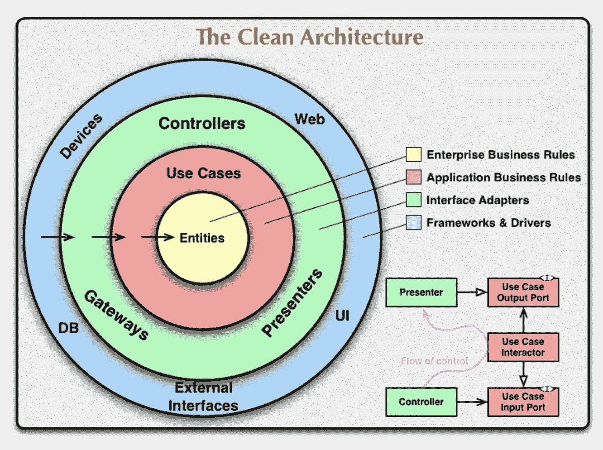
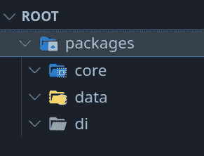
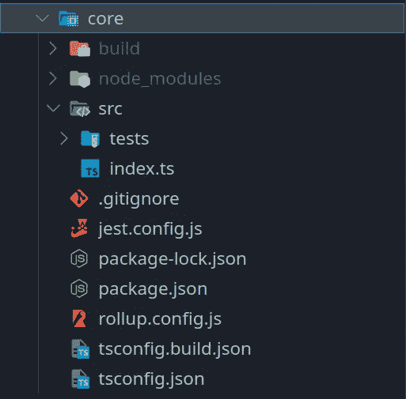

# TypeScript 项目的终极干净架构模板

> 原文：<https://betterprogramming.pub/the-ultimate-clean-architecture-template-for-typescript-projects-e53936269bb9>

## 遵循干净架构原则创建基于层的 TypeScript 项目模板的指南


马克斯·兰格洛特在 [Unsplash](https://unsplash.com?utm_source=medium&utm_medium=referral) 上的照片

```
Table of Contents[Intro](#e215)
[What is clean architecture](#8887)[A Detailed Implementation Guide](#8571)
[Create your project directories and root](#6973)
[Configuring Core, Data, and DI](#bd70)
[Setting up the mono repo configuration](#9fa7)
[Setting up dependencies between packages](#8c97)[How do I use this masterpiece of a mono repo](#88f7)
[Why I did things the way that I did](#0a61)
[Extras](#1179)
[References and Links](#9ea1)
```

# 介绍

这就是了。你一生都在寻找这个。你猜怎么着？你找到了！结束您的痛苦，苦难，以及在您认为您的应用程序将在三个小时内完成的日子里编写的调试代码的时间。或者当你认为你只是在做一个不值得努力的演示应用时。或者当你还不知道的时候。

在本指南中，我将解释我创建实现干净架构原则的 TypeScript 项目模板的方法。这可能适用于你能想到的任何类型的应用程序，包括带有 Angular、React、Vue 或 React Native 或 electronic 等其他框架的 SPAs(单页应用程序)。基本上它用 TypeScript 就行了。

干净的架构不仅仅是遵循几条规则，让编写应用程序不那么痛苦。它是关于转变您的工作环境，以帮助您实施适当的架构和依赖规则。你不允许你自己，可能在未来的某个时刻，变得懒惰，完全无视规则，只是为了尽快制作一部电影，因为<insert_bad_reason_here>它会反咬你一口。</insert_bad_reason_here>

# 什么是干净的建筑？

[点击此处跳到精彩片段](#8571)

Bob 叔叔的干净架构背后的想法是关注点的分离。它允许您的代码独立于框架、数据库或用户界面。这也使得你的代码更易测试。



干净架构中依赖关系的可视化(摘自鲍勃叔叔的博客)

该图可视化了干净架构的核心思想:依赖规则。你会注意到所有的箭头都向内指向实体。这意味着实体不依赖于任何东西，但一切都依赖于它们。这是因为实体代表你的业务规则，并不关心你是否使用 Angular、React、Vue 等。

简而言之，企业业务规则是您实现定义企业/应用程序核心规则的类或模型的层。

您使用包含层与这些实体进行交互，这就是用例。它们规定了实体之间的数据流。它们允许下面的层与实体进行交互。

接下来，控制器与用例进行交互，以产生在演示者中使用的输出，正如您在图的右下部分所看到的。这是角度或反应组件发生的地方，承担控制器和演示者的角色。

最后，在最外层有一些细节，比如数据库。这意味着你可以改变这些最外层的细节，而不必改变任何内部的圆圈。有道理，对吧？例如，一个 Web 框架并不关心你使用的是 MongoDB、SQL 还是区块链。当然，用例或实体离这些工具更远。

# 详细的实施指南

开始之前，有几件事要提一下:

首先，我将应用程序模板分为四层:核心层、数据层、依赖注入层(DI)和表示层。

*   核心:包含我们的实体、用例以及存储库接口。这是应用程序的核心(因此得名)。
*   数据:包含用于从本地和远程存储中检索数据的核心存储库的实现。这就是我们获取和存储数据的方式。
*   DI:将核心和数据联系在一起，允许表示直接依赖于核心。
*   表示层:这一层是用户看到我们的应用程序并与之交互的方式。例如，它将包含我们的角度或反应代码。

第二，我更喜欢在这里使用 Lerna，因为它最不会让我头疼。有像 Yarn 或 Npm 工作空间这样的替代方案，但对我来说，它们没有当前的解决方案那么简单。

最后，在某些方面你可能不同意我的方法，但是，这个架构的美妙之处在于，只要你的应用程序核心不变，并且它的依赖只针对它自己，你就可以用任何东西替换任何东西。

说了这么多，开始吧。

## 创建您的项目目录和根目录

*   为您的项目创建一个文件夹。我刚把我的叫做`root`。
*   在该文件夹中，创建一个名为 packages 的文件夹。在其中，创建三个文件夹:`core`、`data`和`di`。

您现在应该有如下内容:



初始文件夹结构

接下来，我们必须初始化所有这些。在每个`root`、`core`、`data`、`di`内，执行以下命令:

*   运行`npm init -y`
*   创建一个`tsconfig.json`文件。使用下面提供的配置。

对于根节点`tsconfig.json`

对于`core`和`data` tsconfig.json

`di`为`tsconfig.json`

最后，我们创建演示文稿。你想怎么做都行。我只是使用 angular CLI 来创建它，因为这是我更喜欢的框架。要用 Angular CLI 初始化一个项目，运行包目录中的`ng new`,根据您的喜好完成各个步骤。

我还补充道。gitignore 文件到所有的包以及根来忽略`node_module` s 并通过添加一个`/node_modules`和一个`/build`条目来构建。

完成所有这些后，您应该有以下内容:


# 配置核心、数据和 DI

接下来，我们配置`core`、`data`和`di`。它们都遵循相同的初始配置。因此，对所有这些应用程序执行以下步骤(或者仅对核心应用程序执行这些步骤，然后将所有内容复制并粘贴到数据和 di 中):

首先，创建一个名为`src`的文件夹，并在其中添加一个名为`index.ts`的文件。这个文件将暴露我们想要从包中导出的所有内容。在`src`内部，创建一个名为`tests`的文件夹。这将包含我们对这个包的所有单元测试。

有几个脚本和`devDependencies`我们需要添加到`package.json`。您可以复制并粘贴以下内容(更改数据和 di 包的名称):

注意文件末尾的`types`属性。这对于允许此包在其他包中导入和使用是必要的。

以下是对这些脚本的解释:

*   `build`:构建您的项目，产生一个包含 index.d.ts 的构建文件夹，它将使这个包能够被导入到其他包中。
*   `build:watch`:导致项目在每次代码更改时重新生成
*   `rollup`:在构建之后捆绑你的项目类型。这是创建包含正确声明和导出的`index.d.ts`所必需的。
*   `test`:运行您的包中的所有单元测试
*   `test:watch`:对每一个相关的变更重新运行你的测试。(更多信息见 [jest 文档](https://jestjs.io/docs/cli#--watch)

下面是对`devDependencies`的解释:

*   `rollup`、`rollup-plugin-dts`和`@rollup/plugin-typescript`:一个模块捆绑器，用于将`index.d.ts`文件固定成对我们的用例更有用的东西。
*   `jest`和`ts-jest`:用于编写和运行单元测试
*   `nodemon`:允许我们在代码改变时运行命令。参见`build:watch`脚本。
*   剩下的都是 TypeScript 的依赖。

我们需要为 rollup 和 jest 添加几个配置文件。这些文件与`package.json`处于同一级别。他们在这里:

最后一件事:我们不希望我们的构建包含测试，所以在`tsconfig.json`旁边创建一个名为`tsconfig.build.json`的新文件。这是我们在`package.json`的构建脚本中使用的文件。其内容如下:

就是这样！

您的每个包现在应该看起来像这样:



我们现在可以对我们的包进行测试构建了。为了在构建中实现，将任何导出添加到您的包的`index.ts`文件中。例如:`export const Foo = 1;`

现在，在每个内核、数据和 di 中运行`npm install && npm run build`。

正确运行后，查看您的`build/src/index.ts and build/src/index.d.ts`文件中的构建结果是否正确。

项目的包现在已经准备好了。

# 设置单声道回购配置

现在，我们只有五个不相关的包(`root`、`core`、`data`、`di`和`presentation`)。我们需要`root`作为其他包装的容器。为此，我们将使用 Lerna。

首先，将下面的配置复制并粘贴到您的根目录`package.json`:

以下是脚本的分类:

*   `prestart`:当你运行`npm start`时，这个脚本自动运行。它确保所有包的所有依赖项都存在并且配置正确。
*   `start`:运行`packages`目录下所有包的启动脚本。
*   `test`和`build`:同`start`
*   创建一个交互式依赖图，这样你就可以可视化你的项目依赖关系。

Lerna 和 NX 的依赖项是必需的，因为我们的脚本使用它们。

接下来，有几个用于 Lerna 和 NX 的配置文件，分别命名为`lerna.json`和`nx.json`。

你会注意到在`nx.json`我们有一个名为`cacheableOperations`的酒店。这使得只有有变化的包才被重建/重新测试。随着项目的增长，您会更加感激这个特性。

您会注意到的另一件事是`targetDefaults`包含两个条目:一个用于`start`，一个用于`build`。这里的配置使得如果包 A 依赖于包 B，那么包 A 的启动将只在包 B 构建之后运行，以此类推。如果现在还不明显，您将在下一节看到为什么这是必要的。

## 设置包之间的依赖关系

还有最后一步，我们就完成了。我们还没有告诉`data`、`presentation`、`di`他们依赖`core`。我们接下来会这么做。

在`data/package.json`内部，在`devDependencies`上方添加以下属性:`dependencies: { "core": "*" }`

在`di/package.json`内部，在`devDependencies`上方添加以下属性:`dependencies: { "core": "*", "data": "*" }`

在`presentation/package.json`内部，在`devDependencies`上方添加以下属性:`dependencies: { "core": "*", "di": "*" }`

NX 和 Lerna 足够聪明，可以确保`core`、`data`和`di`在 `presentation`开始之前就已经构建好了，因为演示依赖于那些其他的包。

我们正式结束了！在 root 中运行`npm start`，观察神奇的事情发生。

如果遇到任何错误，从所有文件夹中删除所有 package-lock.json 和 node_modules，然后再次运行`npm start`。

下面是以上所有指令的最终实现。

# 我如何使用这个单声道回购的杰作？

你可以阅读我的文章，这篇文章解释了如何一步一步地使用这个模板。这里可以找到链接[。](https://medium.com/@aziznal/create-your-next-web-app-using-clean-architecture-27c7eb745ab4)

 [## 用干净的架构编写你的下一个 Web 应用

### 如何用干净的架构构建下一个应用程序的详细指南

medium.com](https://medium.com/@aziznal/create-your-next-web-app-using-clean-architecture-27c7eb745ab4) 

# 为什么我会这样做

一段时间以来，我一直试图找到一种好的方法来做到这一点。我考虑过最快的方法，把所有的东西都放在一个包里，相信自己会遵守规则，因为我是一个好的程序员(或者说我愿意相信)，但这对我来说还不够好。

我需要一些东西来确保规则不会被打破。当然，我所说的规则是指依赖规则。我们不允许实体依赖于数据库，也不允许实体依赖于 UI 代码。我试图通过包含一些脚本来解决这个问题，这些脚本会在错误的事物之间建立依赖关系时抛出错误(使用 dependency-cruiser)，但这太挑剔了。而且它显示错误也太晚了。

所以，我决定把每个应用层分成自己的包。配有自己的`package.json`和`tsconfig.json`以及一个配置好的捆扎机。我使用 Lerna 和 NX 将所有这些层放在一起。这样，一个包就永远不会依赖于它不应该依赖的东西，“意外地”或者其他，如果它不存在于它的`package.json`依赖项中。如果我自己这么说的话，它已经成为一件艺术品。

# 临时演员

我建议你在使用 mono repo 时使用 [VS 代码工作空间](https://code.visualstudio.com/docs/editor/workspaces)，就像我们刚刚做的那样。

当您使用 VS 代码工作区时，通过允许 VS 代码将每个 VS 代码与其他代码分开处理，您可以充分利用语法突出显示和特定于工作区的扩展。

VS 代码只关心项目根目录下的`tsconfig.json`文件。这意味着它完全忽略了我们每个包中的每个`tsconfig.json`文件，导致误报出现在你的问题部分。工作空间让你远离这些。

感谢您的阅读！

# 参考和链接

*   [我关于使用这个模板的文章](https://medium.com/@aziznal/create-your-next-web-app-using-clean-architecture-27c7eb745ab4)
*   [已经完成实现的 GitHub repo](https://github.com/aziznal/typescript-clean-architecture)
*   [鲍勃大叔的干净建筑](https://blog.cleancoder.com/uncle-bob/2012/08/13/the-clean-architecture.html)
*   [Lerna 文档](https://lerna.js.org/docs/introduction)
*   [NX 文档](https://nx.dev/getting-started/intro)