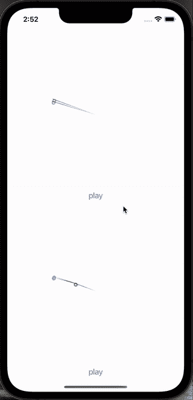
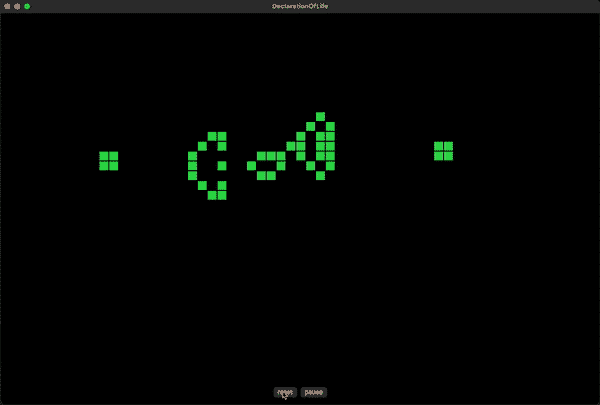

# 终极领域语言:声明式 Swift

> 原文：<https://betterprogramming.pub/the-ultimate-domain-language-declarative-swift-37b0a04e4e32>

## 探索声明性领域范例


照片由 [Solaiman Hossen](https://unsplash.com/@sh_sumon?utm_source=medium&utm_medium=referral) 在 [Unsplash](https://unsplash.com?utm_source=medium&utm_medium=referral) 上拍摄

我想向您介绍一下声明式 Swift——一种允许我们高效且有效地创建易于验证的领域驱动代码的编码风格。事实证明，像这样编写代码比传统的编码更快，同时也给 bug 提供了更少的藏身空间。

# 领域示例

让我们从一个简单的例子开始:待办事项列表。

以下代码块包含待办事项项和待办事项列表的数据类型:

```
struct TodoItem:Identifiable {
    enum Change {
        case title   (to:String)
        case due     (to:TodoDate)
        case location(to:Location)
        case   finish
        case unfinish
    }
    // members
    let id       : UUID
    let title    : String
    let completed: Bool
    let created  : Date
    let due      : TodoDate
    let location : Location

    // initialisers
    init(title:String) { self.init(UUID(),title,false,.unknown, Date(),.unknown) }
    private 
    init(_ i:UUID,_ t:String,_ c:Bool,_ d:TodoDate,_ cd:Date,_ l:Location) { id=i; title=t; completed=c; due=d; created=cd; location=l }

    func alter(_ c:Change...) -> Self { c.reduce(self) { $0.alter($1) } }
    private 
    func alter(_ c:Change   ) -> Self {
        switch c {
        case let    .title(to:t): return Self(id,t    ,completed,due,created,location)
        case       .finish      : return Self(id,title,true     ,due,created,location)
        case     .unfinish      : return Self(id,title,false    ,due,created,location)
        case let .location(to:l): return Self(id,title,false    ,due,created,l       )
        case let      .due(to:.timeSpan(.start(.from(b),.to(e)))):
            return e > b  //check for timespans if dates are in correct order
                ? Self(id,title,completed,.timeSpan(.start(.from(b),.to(e))),created,location)
                : self
        case let      .due(to:d): return Self(id,title,completed,d  ,created,location)
        }
    }
}
struct TodoList: Identifiable {
    enum Change {
        case add   (Add   ); enum Add    { case item(TodoItem) }
        case remove(Remove); enum Remove { case item(TodoItem) }
        case update(Update); enum Update { case item(TodoItem) }
    }
    // members
    let id   : UUID
    let items: [TodoItem]

    // initializers
    init() { self.init(UUID(),[]) }
    private 
    init(_ i:UUID,_ its:[TodoItem]) { id = i; items = its }

    func alter(_ c:Change...) -> Self { c.reduce(self) { $0.alter($1) } }
    private 
    func alter(_ c:Change   ) -> Self {
        switch c {
        case let .add   (.item(i)): return Self(id,items + [i])
        case let .remove(.item(i)): return Self(id,items - [i])
        case let .update(.item(i)): return
            items.contains(where:{ $0.id == i.id })
                ? self
                    .alter(
                        .remove(.item(i)),
                        .add   (.item(i)))
                : self
        }
    }
}
```

定义所有成员属性`let`。因此，这些数据类型实际上是不可变的。为了反映变化，我们需要从以前的状态重新生成一个新的对象，并引入变化。这里是通过用一个或多个更改值调用`alter`方法来完成的——每次调用 alter 都会产生一个新的对象。

在下面的例子中，我们创建了一个`TodoItem`,然后将标题改为更紧迫的内容:

```
let t0 = TodoItem(title:"Get Coffee")
let t1 = t0.alter(.title("Get Coffee — ASAP"))
```

下一个调用将完成一个项目:

```
let t1 = t0.alter(.finish)
```

虽然这一个将完成它:

```
let t1 = t0.alter(.unfinish)
```

改变标题和完成/不完成一个项目是微不足道的。让我们看一些更有趣的例子。

下面的示例代码包含了对`TodoDate`的声明。
可能是`unknown`，可能是`Date`，也可能是`TimeSpan`。

一个`TimeSpan`可以被定义为开始和结束或者持续时间。

```
enum TodoDate {
    case unknown
    case date(Date)
    case timeSpan(TimeSpan)
    var timeSpan:TimeSpan? { switch self { case let .timeSpan(t): return t default: return nil } }
    var date:Date?         { switch self { case let .date    (d): return d default: return nil } }
}
enum TimeSpan {
    enum TimeComponent {
        var id: Int { hashValue }
        case seconds
        case minutes
        case hours
        case days
    }
    enum Start {
        var id:Int { hashValue }
        case from(Date)
        var date:Date { switch self { case .from(let d): return d } }
    }
    enum End {
        var id: Int { hashValue }
        case unknown
        case to(Date)
    }
    var id:Int { hashValue }
    case start   (Start,End)
    case duration(Start,for:Int,TimeComponent)
    var begin:Date {
        switch self{
        case let .start   (s,_  ): return s.date
        case let .duration(s,_,_): return s.date
        }
    }
}
```

现在，这些代码是可能的:

```
let t1 = t0.alter(.due(to:.date(.tomorrow.noon)))
let t1 = t0.alter(.due(to:.unknown))
let t1 = t0.alter(.due(to:.timeSpan(.duration(.from(.tomorrow.noon),for:3,.days))))
let t1 = t0.alter(.due(to:.timeSpan(.start(.from(.tomorrow.noon),.to(.tomorrow.noon.dayAfter)))))
let t1 = t0.alter(.due(to:.timeSpan(.start(.from(.tomorrow.noon),.unknown))))
```

不言自明，对吧？

下面的代码会无声地失败(也就是不要改变)，因为时间跨度是不可能的。

```
let t1 = t0.alter(.due(to:.timeSpan(.start(.from(.tomorrow.noon.dayAfter),.to(.tomorrow.noon)))))
```

这是通过`TodoItem`的`alter`方法检查有效性实现的:

```
func alter(_ c:Change) -> Self {
    switch c {
    // ...
    case let .due(to:.timeSpan(.start(.from(b),.to(e)))):
         return e > b  //check for timespans if dates are in correct order
            ? Self(id,title,completed,.timeSpan(.start(.from(b),.to(e))),created,location)
            : self // return unchanged
    case let .due(to:d): return Self(id,title,completed,d  ,created,location)
    }
}
```

到目前为止，我们只产生了少数几行代码，但我们已经获得了令人难以置信的高度可编码的信息——这些代码非常可读。

现在，我们要表达一个项目的位置，位置可以是`unknown`、`address`、`coordinate`或`directions`，描述方式:

```
enum Location {
    var id:Int { hashValue }
    case unknown
    case address(Address)
    case coordinate(Coordinate)
    case directions(Directions)
    var address   : Address?    { switch self { case .address   (let a): return a default: return nil } }
    var coordinate: Coordinate? { switch self { case .coordinate(let c): return c default: return nil } }
    var directions: Directions? { switch self { case .directions(let d): return d default: return nil } }
}
struct Address {
    enum Change {
        case street (String)
        case city   (String)
        case country(String)
        case zipCode(String)
    }
    init(street:String, city:String, country:String, zipCode:String) { self.init(UUID(),street,city,country,zipCode) }
    private 
    init(_ i:UUID,_ s:String,_ ci:String,_ co:String,_ z:String) { id=i; street=s; city=ci; country=co; zipCode=z }
    let id     : UUID
    let street : String
    let city   : String
    let country: String
    let zipCode: String

    func alter(_ c:Change...) -> Self { c.reduce(self) { $0.alter($1) } }
    private 
    func alter(_ c:Change) -> Self {
        switch c {
        case let .street (s):return .init(id,s,     city,country,zipCode)
        case let .city   (c):return .init(id,street,c,   country,zipCode)
        case let .country(c):return .init(id,street,city,c,      zipCode)
        case let .zipCode(z):return .init(id,street,city,country,z      )
        }
    }
}
struct Coordinate {
    init(latitude la:Double,longitude lo:Double)  { id = UUID(); latitude = la; longitude = lo }
    let id       : UUID
    let latitude : Double
    let longitude: Double
}
struct Directions {
    enum Step:Identifiable, Hashable,Codable {
        var id: Int { hashValue }
        case step(String)
    }
    enum Change {
        case replace(Replace); enum Replace{
            case steps([Step])
        }
    }

    init() { self.init(UUID(), []) }
    private 
    init(_ x:UUID,_ s: [Step]) { id=x; steps=s }
    let id: UUID
    let steps: [Step]
    func alter(_ c:Change) -> Self {
        switch c {
        case let .replace(.steps(s)): return .init(id,s)
        }
    }
}
```

这允许以下代码:

```
let a = Address(street: "Karl Kunger 333", city: "Berlin", country: "Germany", zipCode: "12435")
let t1 = t0.alter(.location(to:.address(a)))

let c = Coordinate(latitude:53.3174759,longitude:6.4681397)
let t1 = t0.alter(.location(to:.coordinate(c)))

let d = Directions().alter(.replace(.steps([.step("Enter house"), .step("turn left"), .step("take lift to 3rd floor")])))
let t1 = t0.alter(.location(to:.directions(d)))
```

在这些声明中只需要很少几行代码，我们就可以用非常不同的方式来表达一个项的位置。

你会在`[https://gitlab.com/vikingosegundo/items](https://gitlab.com/vikingosegundo/items)`找到一个应用，包括一个简单的 SwiftUI 用户界面。[虽然我不认为自己是 SwiftUI 专家，但如果您看到问题或改进空间，请让我知道。]

现在，让我们转到其他领域。

```
struct Snake {
    init (head:Coordinate) { self.init(head, [], .north) }

    enum Facing { case north, east, south, west }
    enum Move   { case forward, right, left     }
    enum Change { case move(Move), grow         }

    let head  : Coordinate
    let tail  : [Coordinate]
    var body  : [Coordinate] { [head] + tail }
    let facing: Facing

    func alter(_ change:Change) -> Self {
        func growTail() -> [Coordinate] { tail.last != nil ? tail + [tail.last!] : [head] } // grow by appending last element again
        switch change {
        case let .move(direction): return move (direction)
        case     .grow:            return .init(head, growTail(), facing)
        }
    }

    private init(_ h:Coordinate, _ t:[Coordinate], _ f:Facing) { head = h; tail = t; facing = f }
    private func move(_ m:Move) -> Self {
        func newSnakeTail() -> [Coordinate] { Array(([head] + tail).prefix(tail.count)) }
        switch (m, facing) {
        case (.forward, .north): return .init(.init(x:head.x,     y:head.y - 1), newSnakeTail(), .north)
        case (.forward, .east ): return .init(.init(x:head.x + 1, y:head.y    ), newSnakeTail(), .east )
        case (.forward, .south): return .init(.init(x:head.x,     y:head.y + 1), newSnakeTail(), .south)
        case (.forward, .west ): return .init(.init(x:head.x - 1, y:head.y    ), newSnakeTail(), .west )
        case (   .left, .north): return .init(.init(x:head.x - 1, y:head.y    ), newSnakeTail(), .west )
        case (   .left, .east ): return .init(.init(x:head.x,     y:head.y - 1), newSnakeTail(), .north)
        case (   .left, .south): return .init(.init(x:head.x + 1, y:head.y    ), newSnakeTail(), .east )
        case (   .left, .west ): return .init(.init(x:head.x,     y:head.y + 1), newSnakeTail(), .south)
        case (  .right, .north): return .init(.init(x:head.x + 1, y:head.y    ), newSnakeTail(), .east )
        case (  .right, .east ): return .init(.init(x:head.x,     y:head.y + 1), newSnakeTail(), .south)
        case (  .right, .south): return .init(.init(x:head.x - 1, y:head.y    ), newSnakeTail(), .west )
        case (  .right, .west ): return .init(.init(x:head.x,     y:head.y - 1), newSnakeTail(), .north)
        }
    }
}
```

这个数据结构实现了来自同名游戏的`Snake`。看起来是这样的:


数据结构的使用如下:

```
snake = snake.alter(.move(.left)) 
snake = snake.alter(.move(.right))
```

这将改变蛇指向的方向，而

```
snake = snake.alter(.grow)
```

会在主体上附加一个坐标。

你可以在这里找到 snake 应用:`[https://gitlab.com/vikingosegundo/declarative-snake](https://gitlab.com/vikingosegundo/declarative-snake)`，尽管它的用户界面只是一个原型。

现在，让我们看看另一个非常不同的领域。

这一次，我们将看到一个单摆和双摆的模拟，其中双摆是两个钟摆相连。

这是物理学解释复杂行为的一个标准例子。

顶部的两个单摆被模拟，只是起始位置略有不同。在底部，我们看到相同的设置，但这次是双摆。



很明显，这两个简单的钟摆有着相同的命运。他们的行为在遥远的未来也是可以预测的。

另一方面，双摆表现出复杂而混乱的行为。尽管他们的起点几乎完全相同，但他们的命运却立即发生了分歧。我们既不能预测一个双摆的未来，除了接下来的几个时刻，也不能从一个双摆的命运告诉我们任何关于另一个双摆的事情。

这是单摆的代码:

```
 struct SimplePendulum:Codable {
    enum Change {
        case tick
        case pause
        case unpause
        case set(_Set); enum _Set {
            case radius   (Double)
            case gravity  (Double)
            case dampening(Double)
        }
    }
    let angle      : Double
    let angleV     : Double
    let angleA     : Double
    let r          : Double
    let gravity    : Double
    let dampening  : Double
    let bobDiameter: Double
    let hue        : Double
    let paused     : Bool
    init(
            angle: Double,
                r: Double,
          gravity: Double,
      dampening d: Double = 0.0125,
   bobDiameter bd: Double = 6,
              hue: Double = 0.0,
           paused: Bool   = false
    ) {
        self.init(angle,0.0,0.0,r,gravity,d,bd,hue,paused)
    }
    func alter(_ changes:  Change...) -> Self { changes.reduce(self) { $0.alter($1) } }
    func alter(_ changes: [Change]  ) -> Self { changes.reduce(self) { $0.alter($1) } }
    func bobPoint() -> ((Double,Double)) { (r * sin(angle) ,r * cos(angle)) }
}

//MARK: - manipulate recursively & axiomatically
private
extension SimplePendulum {
    init(
     _       angle: Double,
     _      angleV: Double,
     _      angleA: Double,
     _           r: Double,
     _     gravity: Double,
     _   dampening: Double,
     _ bobDiameter: Double,
     _         hue: Double,
     _      paused: Bool
    ) {
        // math
        self.angle     = angle
        self.angleV    = angleV
        self.angleA    = angleA
        self.r         = r
        self.gravity   = gravity
        self.dampening = dampening
        //style & operations
        self.bobDiameter = bobDiameter
        self.hue         = hue
        self.paused      = paused
    }
    func alter(_ cmd:Change) -> Self {
        switch (paused,cmd) {
        case (false,       .tick        ): return advance()
        case ( true,    .unpause        ): return .init(angle,angleV,angleA,r,gravity,dampening,bobDiameter,hue,false )
        case (false,      .pause        ): return .init(angle,angleV,angleA,r,gravity,dampening,bobDiameter,hue,true  )
        case (_, let .set(.radius   (r))): return .init(angle,angleV,angleA,r,gravity,dampening,bobDiameter,hue,paused)
        case (_, let .set(.dampening(d))): return .init(angle,angleV,angleA,r,gravity,        d,bobDiameter,hue,paused)
        case (_, let .set(.gravity  (g))): return .init(angle,angleV,angleA,r,g      ,dampening,bobDiameter,hue,paused)
        case (_, _                      ): return self
        }
    }
}
// MARK: - // Calculations

private
extension SimplePendulum {
    func advance() -> Self {
        let force = gravity * sin(angle)
        let aa = (-1 * force) / r
        let av = (angleV + angleA) * (1.0 - dampening)
        let  a = angle + angleV
        return .init(a,av,aa,r,gravity,dampening,bobDiameter,hue,paused)
    }
}
```

这是双摆的代码:

```
struct DoublePendulum:Codable {
    enum Change {
        case tick
        case pause
        case unpause
        case set(_Set); enum _Set {
            case masses   ((Double,Double))
            case radii    ((Double,Double))
            case gravity  (Double)
            case dampening(Double)
        }
    }
    let bobDiameter: Double
    let hue        : Double
    let paused     : Bool
    init( radii r: (Double, Double),
         masses m: (Double, Double),
         angles a: (Double, Double),
      dampening d: Double = 0.0,
        gravity g: Double = 1.0,
   bobDiameter bd: Double = 6,
            hue h: Double = 0.0,
         paused p: Bool   = false
    ) {
        self.init(r,m,a,(0,0),d,g,bd,h,p)
    }
    func alter(_ changes:  Change...) -> Self { changes.reduce(self) { $0.alter($1) } }
    func alter(_ changes: [Change]  ) -> Self { changes.reduce(self) { $0.alter($1) } }
    func bobPoints() -> (
        (Double,Double),
        (Double,Double)
    ) {
        let p0 = (       r0 * sin(a0),        r0 * cos(a0))
        let p1 = (p0.0 + r1 * sin(a1), p0.1 + r1 * cos(a1))
        return (p0, p1)
    }
    private let r0 : Double
    private let r1 : Double
    private let m0 : Double
    private let m1 : Double
    private let a0 : Double
    private let a1 : Double
    private let av0: Double
    private let av1: Double
    private let g  : Double
    private let d  : Double
}

//MARK: - manipulate recursively & axiomatically
private
extension DoublePendulum {
    init(      _ r: (Double,Double),
               _ m: (Double,Double),
               _ a: (Double,Double),
              _ av: (Double,Double),
               _ d: Double,
               _ g: Double,
     _ bobDiameter: Double,
             _ hue: Double,
          _ paused: Bool
    ) {
        // math
        self.r0 = r.0
        self.r1 = r.1

        self.m0 = m.0
        self.m1 = m.1

        self.a0 = a.0
        self.a1 = a.1
        self.av0 = av.0
        self.av1 = av.1
        self.g = g
        self.d = d
        //style & operations
        self.bobDiameter = bobDiameter
        self.hue         = hue
        self.paused      = paused
    }
    func alter(_ cmd:Change) -> Self {
        switch (paused,cmd) {
        case (false,       .tick        ): return advance()
        case ( true,    .unpause        ): return .init((r0,r1),(m0,m1),(a0,a1),(av0,av1),d,g,bobDiameter,hue,false )
        case (false,      .pause        ): return .init((r0,r1),(m0,m1),(a0,a1),(av0,av1),d,g,bobDiameter,hue,true  )
        case (_, let .set(.radii    (r))): return .init(  r    ,(m0,m1),(a0,a1),(av0,av1),d,g,bobDiameter,hue,paused)
        case (_, let .set(.masses   (m))): return .init((r0,r1),  m    ,(a0,a1),(av0,av1),d,g,bobDiameter,hue,paused)
        case (_, let .set(.dampening(d))): return .init((r0,r1),(m0,m1),(a0,a1),(av0,av1),d,g,bobDiameter,hue,paused)
        case (_, let .set(.gravity  (g))): return .init((r0,r1),(m0,m1),(a0,a1),(av0,av1),d,g,bobDiameter,hue,paused)
        case (_, _                      ): return self
        }
    }
}
// MARK: - // Calculations
private
extension DoublePendulum {
    func advance() -> Self {
        let damp = (1.0 - d)
        let acc = calc()
        let av  = ((av0 + acc.0) * damp, (av1 + acc.1) * damp)
        let a   = ((a0 + av0 ) , (a1 + av1) )
        return .init((r0,r1),(m0,m1),a,av,d,g,bobDiameter,hue,paused)
    }
    func calc() -> (Double, Double) { // -> (pendulum arm 0, pendulum arm 1)
        //|      |<------------------ pendulum arm 0 ----------------->| |<----------- pendulum arm 1 ----------->|
        let n0 = (-g * (2 * m0 + m1) * sin(a0),                        2 * sin(a0 - a1)                      )
        let n1 = (-m1 * g * sin(a0 - 2 * a1),                          av0 * av0 * r0 * (m0 + m1)         )
        let n2 = (-2 * sin(a0 - a1) * m1,                              g * (m0 + m1) * cos(a0)              )
        let n3 = (av1 * av1 * r1 + av0 * av0 * r0 * cos(a0 - a1), av1 * av1 * r1 * m1 * cos(a0 - a1))

        let d0 = r0 * (2 * m0 + m1 - m1 * cos(2 * a0 - 2 * a1))
        let d1 = r1 * (2 * m0 + m1 - m1 * cos(2 * a0 - 2 * a1))

        return (
            (n0.0 +  n1.0 + (n2.0 * n3.0) / d0).truncatingRemainder(dividingBy:.pi * 2) / 360.0,
            (n0.1 * (n1.1 +  n2.1 + n3.1) / d1))
    }
}
```

那些被用作

```
pendulum0 = pendulum0.alter(.tick))
```

来计算下一个位置

```
pendulum0 = pendulum0.alter(.pause)
pendulum0 = pendulum0.alter(.play)
```

停下来玩一个钟摆

你可以在这里找到钟摆代码:`[https://gitlab.com/vikingosegundo/declarativependulum](https://gitlab.com/vikingosegundo/declarativependulum)`

同样，UI 只是概念质量的证明。

现在，作为最后一个领域的例子，我准备了康威生命游戏的实现——我们当中的计算机科学家应该明白，这证明了这种编码的图灵完整性。



`Life`数据结构

```
struct Life:Codable {
    enum Change {
        case process
        case pause, unpause
        case set (_Set); enum _Set {
            case cells([Cell])
        }
    }
    struct Cell: Hashable, Equatable, Codable {
        init(coordinate: Coordinate, state:State = .alive) {
            self.coordinate = coordinate
            self.state = state
        }
        let coordinate: Coordinate; struct Coordinate: Equatable, Codable {  let x, y: Int   }
        let state     : State;        enum State     :  Hashable, Codable { case alive, dead }
    }
    init(coordinates: [Cell.Coordinate]) { self.init(cells:coordinates.map { Cell(coordinate:$0) }) }
    init(cells      : [Cell           ]) { self.init(0,cells,false, 0)                              }
    func alter(_ cs: [Change] ) -> Self { cs.reduce(self) { $0.alter($1) } }
    func alter(_ cs: Change...) -> Self { cs.reduce(self) { $0.alter($1) } }
    func alter(_ c : Change   ) -> Self {
        if paused && !unpausing(c) { return self }
        switch c {
            // axomiatic                           |step|, |<------------------------- cells ---------------------->|, paused, |<------- size -------->|
        case let .set(.cells(cells)): return .init(step+1, cells                                                     , paused, stateForCoordiantes.count)
        case                  .pause: return .init(step+1, stateForCoordiantes.map{ Cell(coordinate: $0, state: $1) },   true, stateForCoordiantes.count)
        case                .unpause: return .init(step+1, stateForCoordiantes.map{ Cell(coordinate: $0, state: $1) },  false, stateForCoordiantes.count)
            // recursive
        case                .process: return alter(.set(.cells(applyRules())))
        }
    }
    func debug(_ exe: (Self) -> ()) -> Self { exe(self); return self }
    let paused             : Bool
    let step               : Int
    let size               : Int
    let stateForCoordiantes: [Life.Cell.Coordinate : Life.Cell.State]
}
//MARK: - private
private extension Life {
    init(_ step: Int,_ cells: [Cell] = [],_ paused:Bool,_ size:Int) {
        self.step                = step
        self.paused              = paused
        self.stateForCoordiantes = cells.reduce([:]) { var a = $0; a[$1.coordinate] = $1.state; return a }
        self.size                = size
    }
    func applyRules() -> [Life.Cell] {
        Array(Set(self.stateForCoordiantes.map { k,v in Cell(coordinate: k, state: v)}.flatMap { neighbors(for:$0) }))
            .compactMap {
                let neigbours = aliveNeighbors(for: $0)
                let isAlive:Bool
                switch (neigbours.count, $0.state) {
                case (0...1, .alive): isAlive = false
                case (2...3, .alive): isAlive = true
                case (4...8, _     ): isAlive = false
                case (3,      .dead): isAlive = true
                case (_,      _    ): isAlive = false
                }
                return isAlive ? .init(coordinate: .init(x: $0.coordinate.x, y: $0.coordinate.y), state:.alive) : nil
            }
    }
    func neighbors(for cell: Life.Cell) -> [Life.Cell] {
        aliveNeighbors(for: cell) + deadNeighbors(for: cell)
    }
    func aliveNeighbors(for cell: Life.Cell) -> [Life.Cell] {
        allNeigbourCoordinates(cell).map {
            Cell(coordinate: $0, state: stateForCoordiantes[$0] ?? .dead)
        }.filter { $0.state == .alive }
    }
    func allNeigbourCoordinates(_ cell: Life.Cell) -> [Life.Cell.Coordinate] {
        [
            .init(x:cell.coordinate.x-1, y:cell.coordinate.y-1),
            .init(x:cell.coordinate.x-1, y:cell.coordinate.y  ),
            .init(x:cell.coordinate.x-1, y:cell.coordinate.y+1),
            .init(x:cell.coordinate.x  , y:cell.coordinate.y-1),
            .init(x:cell.coordinate.x  , y:cell.coordinate.y+1),
            .init(x:cell.coordinate.x+1, y:cell.coordinate.y-1),
            .init(x:cell.coordinate.x+1, y:cell.coordinate.y  ),
            .init(x:cell.coordinate.x+1, y:cell.coordinate.y+1),
        ]
    }
    func deadNeighbors(for cell: Life.Cell) -> [Life.Cell] {
        Set(allNeigbourCoordinates(cell))
            .subtracting(aliveNeighbors(for:cell).map{ $0.coordinate })
            .map { Cell(coordinate:$0,state:.dead) }
    }
}
private func unpausing(_ c:Life.Change) -> Bool {
    switch c {
    case .unpause: return true
    default      : return false
    }
}
extension Life.Cell.Coordinate: Hashable {
    func hash(into hasher: inout Hasher) {
        hasher.combine(x)
        hasher.combine(y)
    }
}
```

以下命令将创建下一个有效状态

```
life = life.alter(.process)
```

# 公理代码

上面的所有例子都是不可变的，这意味着每次触发更改时都会重新创建对象——未更改的值只是被重用，而更改的值会覆盖旧的值。

在我的代码中，这总是发生在`alter`方法中，它们同样都有相同的结构:通过模式匹配，解码出一个`Change` -DSL 值，并执行正确的动作。我称之为“公理”，因为每个 case 语句的左边描述了需要什么，而右边实现了这个。

那些代码非常简单，很难想象虫子会藏在那里。通常，它们非常简单，很容易理解。

让我们回到带有更多代码的`TodoItem`的例子:

```
func alter(_ c:Change   ) -> Self {
        switch c {
        case let    .title(to:t): return Self(id,t    ,completed,due,created,location)
        case       .finish      : return Self(id,title,true     ,due,created,location)
        case     .unfinish      : return Self(id,title,false    ,due,created,location)
        case let .location(to:l): return Self(id,title,completed,due,created,l       )
        case let      .due(to:d): return Self(id,title,completed,d  ,created,location)
        }
    }
```

正如我们很容易看到的，解码改变命令`.title(to:t)` 将导致`return Self(id,t ,completed,due,created,location)`，其中`t`替换`title`的任何早期值。

命令`.finish`将导致`true`覆盖任何先前的完成值，`.unfinish`将使用`false`覆盖。
`.location(to:l)`将用新值覆盖当前位置。
`.due(to:d)`也会对到期日做同样的事情。

所有这些都是公理化的陈述。case 语句的左侧列出了变更 DSL 中声明的词汇表，而右侧尽可能简单地实现命令。

“生命宣言”app 可以在这里找到:`[https://gitlab.com/vikingosegundo/declaration-of-live](https://gitlab.com/vikingosegundo/declaration-of-live)`

(UI 不是生产质量)

# 验证正确性

毫无疑问，您将在下一个代码块中注意到，测试具有一定的公理特征。我这里用的是[快速](https://github.com/Quick/Quick)和[敏捷](https://github.com/Quick/Nimble)。每个`it(expect(…))`语句都是一个小单元测试。代码大约有 130 行(非空)，但是它包含 89 个单元测试。

测试名称与测试嵌套的所有`describe`、`context`和`it`描述相结合，测试的第一个程序块将是

`“TodoItem__just_created__has_an_id
“TodoItem__just_created__has_correct_title”
“TodoItem__just_created__has_unknown_due_date”
“TodoItem__just_created__isnt_finished”
“TodoItem__just_created__has_no_location”`

您会注意到，测试策略非常简单:进行一项更改，然后观察预期会发生更改的所有内容都发生了更改。而且还要确保没有其他事情发生变化。

在“更改标题”上下文中，我们确切地看到:
命令`.title(to:”Get Coffee — ASAP”)`被传递到`alter`中，在接下来的几行中，测试出只有标题被更改——而该上下文中的所有其他测试确保其他内容都没有更改。

实际上，这是科学方法在起作用。

如果您自己尝试并编写这样的代码和测试，您会很快注意到一件事:两者都编写得非常快。实现一个特性需要几分钟，每小时编写 80 或 90 个测试并不难。

```
 import Quick
import Nimble
import ItemsModels

final class TodoItemSpecifications: QuickSpec {
    override func spec() {
        describe("TodoItem") {
            let t0 = TodoItem(title:"Get Coffee")
            context("just created") {
                it("has an id"          ) { expect(t0.id       ).toNot(beNil()            ) }
                it("has correct title"  ) { expect(t0.title    ).to   (equal("Get Coffee")) }
                it("has unkown due date") { expect(t0.due      ).to   (equal(.unknown)    ) }
                it("isnt finished"      ) { expect(t0.completed).to   (beFalse()          ) }
                it("has no location"    ) { expect(t0.location ).to   (equal(.unknown)    ) }
            }
            context("change title") {
                let t1 = t0.alter(.title(to:"Get Coffee — ASAP"))
                it("has same id"        ) { expect(t1.id       ).to   (equal(t0.id)              ) }
                it("has different title") { expect(t1.title    ).toNot(equal(t0.title)           ) }
                it("has correct title"  ) { expect(t1.title    ).to   (equal("Get Coffee — ASAP")) }
                it("has same due date"  ) { expect(t1.due      ).to   (equal(t0.due)             ) }
                it("has same state"     ) { expect(t1.completed).to   (equal(t0.completed)       ) }
                it("has same location"  ) { expect(t0.location ).to   (equal(t0.location)        ) }
            }
            context("change state") {
                let t1 = t0.alter(.finish)
                it("has same id"        ) { expect(t1.id       ).to   (equal(t0.id)       ) }
                it("has different state") { expect(t1.completed).toNot(equal(t0.completed)) }
                it("has correct state"  ) { expect(t1.completed).to   (beTrue()           ) }
                it("has same title"     ) { expect(t1.title    ).to   (equal(t0.title)    ) }
                it("has same due date"  ) { expect(t1.due      ).to   (equal(t0.due)      ) }
                it("has same location"  ) { expect(t0.location ).to   (equal(t0.location) ) }
                context("change state back") {
                    let t2 = t1.alter(.unfinish)
                    it("has same id"        ) { expect(t2.id       ).to   (equal(t1.id)       ) }
                    it("has different state") { expect(t2.completed).toNot(equal(t1.completed)) }
                    it("has correct state"  ) { expect(t2.completed).to   (beFalse()          ) }
                    it("has same title"     ) { expect(t2.title    ).to   (equal(t1.title)    ) }
                    it("has same due date"  ) { expect(t2.due      ).to   (equal(t1.due)      ) }
                    it("has same location"  ) { expect(t2.location ).to   (equal(t1.location) ) }
                }
            }
            context("change due date") {
                context("to date") {
                    let t1 = t0.alter(.due(to:.date(.tomorrow.noon)))
                    it("has same id"               ) { expect(t1.id       ).to   (equal(t0.id)         ) }
                    it("has different due date"    ) { expect(t1.due      ).toNot(equal(t0.due)        ) }
                    it("has due date tomorrow noon") { expect(t1.due.date ).to   (equal(.tomorrow.noon)) }
                    it("has same state"            ) { expect(t1.completed).to   (equal(t0.completed)  ) }
                    it("has correct state"         ) { expect(t1.completed).to   (beFalse()            ) }
                    it("has same title"            ) { expect(t1.title    ).to   (equal(t0.title)      ) }
                    context("back to unknown") {
                        let t2 = t1.alter(.due(to:.unknown))
                        it("has same id"               ) { expect(t2.id       ).to   (equal(t1.id)       ) }
                        it("has unkown due date"       ) { expect(t2.due      ).toNot(equal(t1.due)      ) }
                        it("has due date tomorrow noon") { expect(t2.due      ).to   (equal(.unknown)    ) }
                        it("has same state"            ) { expect(t2.completed).to   (equal(t1.completed)) }
                        it("has correct state"         ) { expect(t2.completed).to   (beFalse()          ) }
                        it("has same title"            ) { expect(t2.title    ).to   (equal(t1.title)    ) }
                    }
                }
                context("to timespan with duration") {
                    let t1 = t0.alter(.due(to:.timeSpan(.duration(.from(.tomorrow.noon),for:3,.days))))
                    it("has same id"                    ) { expect(t1.id              ).to   (equal(t0.id)                        ) }
                    it("has different due date"         ) { expect(t1.due             ).toNot(equal(t0.due)                       ) }
                    it("has due date duration time span") { expect(t1.due.timeSpan    ).to   (equal(.duration(.from(.tomorrow.noon),
                    it("has same state"                 ) { expect(t1.completed       ).to   (equal(t0.completed)                 ) }
                    it("has correct state"              ) { expect(t1.completed       ).to   (beFalse()                           ) }
                    it("has same title"                 ) { expect(t1.title           ).to   (equal(t0.title)                     ) }
                    it("has timeSpan id"                ) { expect(t1.due.timeSpan?.id).toNot(beNil()                             ) }

                    context("back to unknown") {
                        let t2 = t1.alter(.due(to:.unknown))
                        it("has same id"               ) { expect(t2.id       ).to   (equal(t1.id)       ) }
                        it("has unkown due date"       ) { expect(t2.due      ).toNot(equal(t1.due)      ) }
                        it("has due date tomorrow noon") { expect(t2.due      ).to   (equal(.unknown)    ) }
                        it("has same state"            ) { expect(t2.completed).to   (equal(t1.completed)) }
                        it("has correct state"         ) { expect(t2.completed).to   (beFalse()          ) }
                        it("has same title"            ) { expect(t2.title    ).to   (equal(t1.title)    ) }
                    }
                }
                context("to timespan with start/end") {
                    let t1 = t0.alter(.due(to:.timeSpan(.start(.from(.tomorrow.noon),.to(.tomorrow.noon.dayAfter)))))
                    it("has same id"                     ) { expect(t1.id          ).to   (equal(t0.id)                                 ) }
                    it("has different due date"          ) { expect(t1.due         ).toNot(equal(t0.due)                                ) }
                    it("has due date start/end time span") { expect(t1.due.timeSpan).to   (equal(.start(.from(.tomorrow.noon),
                    it("has same state"                  ) { expect(t1.completed   ).to   (equal(t0.completed)                          ) }
                    it("has correct state"               ) { expect(t1.completed   ).to   (beFalse()                                    ) }
                    it("has same title"                  ) { expect(t1.title       ).to   (equal(t0.title)                              ) }
                    context("back to unknown") {
                        let t2 = t1.alter(.due(to:.unknown))
                        it("has same id"               ) { expect(t2.id       ).to   (equal(t1.id)       ) }
                        it("has unkown due date"       ) { expect(t2.due      ).toNot(equal(t1.due)      ) }
                        it("has due date tomorrow noon") { expect(t2.due      ).to   (equal(.unknown)    ) }
                        it("has same state"            ) { expect(t2.completed).to   (equal(t1.completed)) }
                        it("has correct state"         ) { expect(t2.completed).to   (beFalse()          ) }
                        it("has same title"            ) { expect(t2.title    ).to   (equal(t1.title)    ) }
                    }
                }
                context("to timespan with stat/end fails silently for mixed up dates") {
                    let t1 = t0.alter(.due(to:.timeSpan(.start(.from(.tomorrow.noon.dayAfter),.to(.tomorrow.noon)))))
                    it("has same id"               ) { expect(t1.id          ).to(equal(t0.id)       ) }
                    it("has unchanged due date"    ) { expect(t1.due         ).to(equal(t0.due)      ) }
                    it("doesnt correct mixed dates") { expect(t1.due.timeSpan).to(beNil()            ) }
                    it("doesnt accept mixed dates" ) { expect(t1.due.timeSpan).to(beNil()            ) }
                    it("has same state"            ) { expect(t1.completed   ).to(equal(t0.completed)) }
                    it("has correct state"         ) { expect(t1.completed   ).to(beFalse()          ) }
                    it("has same title"            ) { expect(t1.title       ).to(equal(t0.title)    ) }
                    it("has same location"         ) { expect(t1.location    ).to(equal(t0.location) ) }
                }
            }
            context("location") {
                context("Address") {
                    let a = Address(street: "Karl Kunger", city: "Berlin", country: "Germany", zipCode: "12435")
                    let t1 = t0.alter(.location(to:.address(a)))
                    it("has same id"           ) { expect(t1.id                 ).to   (equal(t0.id)       ) }
                    it("has different location") { expect(t1.location           ).toNot(equal(t0.location) ) }
                    it("has address location"  ) { expect(t1.location.address   ).to   (equal(a)           ) }
                    it("has not coord location") { expect(t1.location.coordinate).to   (beNil()            ) }
                    it("has same title"        ) { expect(t1.title              ).to   (equal(t0.title)    ) }
                    it("has same due date"     ) { expect(t1.due                ).to   (equal(t0.due)      ) }
                    it("has same state"        ) { expect(t1.completed          ).to   (equal(t0.completed)) }
                }
                context("Coordinate") {
                    let c = Coordinate(latitude:53.3174759,longitude:6.4681397)
                    let t1 = t0.alter(.location(to:.coordinate(c)))
                    it("has same id"           ) { expect(t1.id                 ).to   (equal(t0.id)       ) }
                    it("has different location") { expect(t1.location           ).toNot(equal(t0.location) ) }
                    it("has coord location"    ) { expect(t1.location.coordinate).to   (equal(c)           ) }
                    it("has no addr location"  ) { expect(t1.location.address   ).to   (beNil()            ) }
                    it("has same title"        ) { expect(t1.title              ).to   (equal(t0.title)    ) }
                    it("has same due date"     ) { expect(t1.due                ).to   (equal(t0.due)      ) }
                    it("has same state"        ) { expect(t1.completed          ).to   (equal(t0.completed)) }
                }
                context("Directions") {
                    let d = Directions().alter(.replace(.steps([.step("Enter house"), .step("turn left"), .step("take lift to 3rd floor")])))
                    let t1 = t0.alter(.location(to:.directions(d)))
                    it("has same id"            ) { expect(t1.id                 ).to   (equal(t0.id)       ) }
                    it("has different location" ) { expect(t1.location           ).toNot(equal(t0.location) ) }
                    it("has directions location") { expect(t1.location.directions).to   (equal(d)           ) }
                    it("has no addr location"   ) { expect(t1.location.address   ).to   (beNil()            ) }
                    it("has same title"         ) { expect(t1.title              ).to   (equal(t0.title)    ) }
                    it("has same due date"      ) { expect(t1.due                ).to   (equal(t0.due)      ) }
                    it("has same state"         ) { expect(t1.completed          ).to   (equal(t0.completed)) }
                }
            }
        }
    }
}
```

但是这种测试并不局限于数据结构。

接下来的测试代码是测试应用程序(没有 UI，更确切地说是`AppDomain`)本身——这些是特别有价值的测试，因为这准确地反映了这些代码将如何在 UI 中使用——就像 UI 一样，测试是应用程序的简单客户端。

```
/* abbriviations */
func b(_ code:@escaping () ->()) { beforeEach(code) }
func a(_ code:@escaping () ->()) {  afterEach(code) }
typealias AppStore = Store<AppState,AppState.Change>
func appdomain(_ roothandler: @escaping (Message) -> (), _ store:AppStore) -> Input { createAppDomain(store:store, receivers: [],rootHandler: roothandler) }

final class AppsSpecifications: QuickSpec {
    override func spec() {              /* beforeEach */                                       /* afterEach */
        var store      :AppStore!         ;b{store = createDiskStore(pathInDocs:"appspecs.json")};a{destroy(&store)  }
        var roothandler:((Message) -> ())!;b{roothandler = { msg in }                           };a{roothandler = nil}
        var app        :Input!            ;b{app         = appdomain(roothandler,store)         };a{app         = nil}
        describe("ItemsApp") {
            context("uninitialized") {
                it("has no todos") { expect(store.state().todos).to(beNil()) }
            }
            context("initialized") {
                beforeEach {
                    app(.todos(.cmd(.initialize)))
                }
                it("has todos object"     ) { expect(store.state().todos       ).toNot(beNil())   }
                it("has empty todos items") { expect(store.state().todos?.items).to   (beEmpty()) }
                context("add") {
                    let i0 = TodoItem(title:"hey Ho")
                        beforeEach {
                        app(.todos(.cmd(.add(item:i0))))
                    }
                    context("item defaults" ) {
                        it("has an id"          ) { expect(i0.id        ).toNot(beNil())         }
                        it("has correct title"  ) { expect(i0.title     ).to   (equal("hey Ho")) }
                        it("isnt completed"     ) { expect(i0.completed ).to   (beFalse())       }
                        it("no due date known"  ) { expect(i0.due       ).to   (equal(.unknown)) }
                    }
                    it("has a todo item"                  ) { expect(store.state().todos?.items                 ).to(haveCount(1))        }
                    it("has the added item, title"        ) { expect(store.state().todos?.items.first?.title    ).to(equal("hey Ho"))     }
                    it("has the added item, id"           ) { expect(store.state().todos?.items.first?.id       ).to(equal(i0.id))        }
                    it("has the items completed unchanged") { expect(store.state().todos?.items.first?.completed).to(equal(i0.completed)) }
                    it("no due date known"                ) { expect(store.state().todos?.items.first?.due      ).to(equal(i0.due))       }
                    context("add") {
                        let i1 = TodoItem(title:"Let's go")
                        beforeEach {
                            app(.todos(.cmd(.add(item:i1))))
                        }
                        it("has two todo items"                 ) { expect(store.state().todos?.items                 ).to(haveCount(2))        }
                        it("has first item title"               ) { expect(store.state().todos?.items.first?.title    ).to(equal("hey Ho"))     }
                        it("has first item id"                  ) { expect(store.state().todos?.items.first?.id       ).to(equal(i0.id))        }
                        it("has first item completed unchanged" ) { expect(store.state().todos?.items.first?.completed).to(equal(i0.completed)) }
                        it("has no due date known first item"   ) { expect(store.state().todos?.items.first?.due      ).to(equal(i0.due))       }
                        it("has second item title"              ) { expect(store.state().todos?.items.last? .title    ).to(equal("Let's go"))   }
                        it("has second item id"                 ) { expect(store.state().todos?.items.last? .id       ).to(equal(i1.id))        }
                        it("has second item completed unchanged") { expect(store.state().todos?.items.last? .completed).to(equal(i1.completed)) }
                        it("has no due date known second item"  ) { expect(store.state().todos?.items.first?.due      ).to(equal(i1.due))       }
                        context("remove") {
                            beforeEach {
                                app(.todos(.cmd(.remove(item:i0))))
                            }
                            it("has the added item, id") { expect(store.state().todos?.items.first?.id).to(equal(i1.id)) }
                            it("has a todo item"       ) { expect(store.state().todos?.items          ).to(haveCount(1)) }
                            context("remove twice fails silently") {
                                beforeEach {
                                    app(.todos(.cmd(.remove(item:i0))))
                                }
                                it("has a todo item") { expect(store.state().todos?.items.map(\.id)).to(equal([i1.id])) }
                            }
                        }
                    }
                    context("remove") {
                        beforeEach {
                            app(.todos(.cmd(.remove(item:i0))))
                        }
                        it("has todos object"     ) { expect(store.state().todos       ).toNot(beNil())   }
                        it("has empty todos items") { expect(store.state().todos?.items).to   (beEmpty()) }
                        context("removing unpresent item fails silently") {
                            beforeEach {
                                app(.todos(.cmd(.remove(item:i0))))
                            }
                            it("has todos object"     ) { expect(store.state().todos       ).toNot(beNil())   }
                            it("has empty todos items") { expect(store.state().todos?.items).to   (beEmpty()) }
                        }
                    }
                    context("updates") {
                        beforeEach {
                            app(.todos(.cmd(.update(item: i0.alter(.title(to:"Hey Ho!"))))))
                        }
                        it("has a todo item"                  ) { expect(store.state().todos?.items                 ).to(haveCount(1))        }
                        it("has the added item, title"        ) { expect(store.state().todos?.items.first?.title    ).to(equal("Hey Ho!"))    }
                        it("has the added item, id"           ) { expect(store.state().todos?.items.first?.id       ).to(equal(i0.id))        }
                        it("has the items completed unchanged") { expect(store.state().todos?.items.first?.completed).to(equal(i0.completed)) }
                        it("no due date known"                ) { expect(store.state().todos?.items.first?.due      ).to(equal(i0.due))       }
                    }
                }
            }
        }
    }
}
```

以下代码为 SwiftUI 代码，其中`viewState.roothandler` 与之前测试中的`app`功能相同。

```
Button {
    viewState.roothandler(.todos(.cmd(.add(item:.init(title:"Item \(viewState.todos!.items.count)")))))
} label: { Text("add item") }
```

# 我们将何去何从

我已经向您展示了我们如何编写声明性的域代码，并通过示例实现了使用`Change`-DSL 改变的数据结构。但是这种技术也可以有效地组装任何域和大小的应用程序结构。我的主要(虽然不是唯一的)架构通篇都使用这个，被称为“Khipu ”,在下面的文章中有描述:

*   [介绍 Khipu:我在 Swift 中的干净架构的样板代码自由实现](/meet-khipu-a-boilercode-free-implementation-of-clean-architecture-in-swift-f76ccab82ff3?sk=a8938450032cb5aa67a4e7938c0b774a)
*   [Khipu:通过声明性领域范例在 Swift 中快速、可持续地创建软件](/khipu-rapid-and-sustainable-software-creation-in-swift-using-engineering-and-science-principles-312a933cce57?sk=8359f48cc06571e53de156db8cbc005c)

Khipu 可以用作独立的架构或库，因为它唯一的接口是一个函数和一个`Message` DSL 值。它可以包装在任何其他类型中，如结构或类。