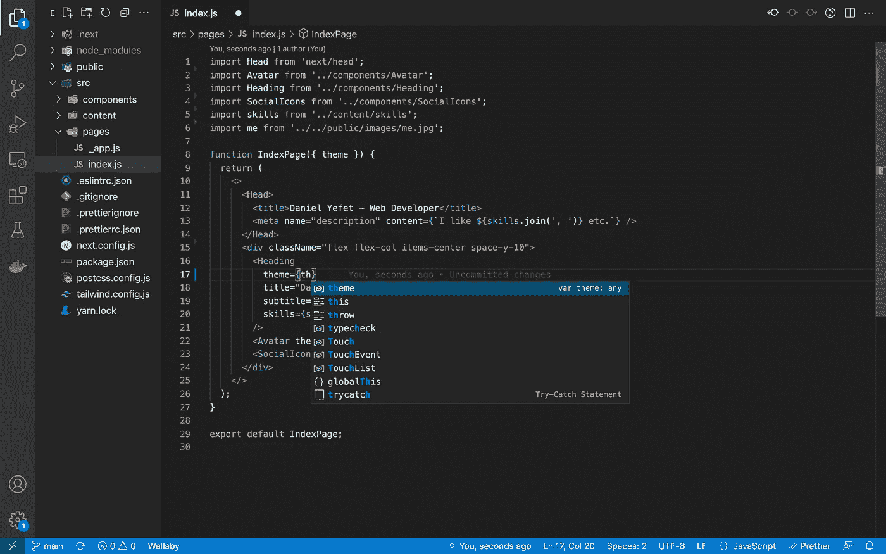
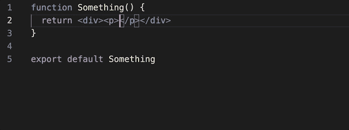
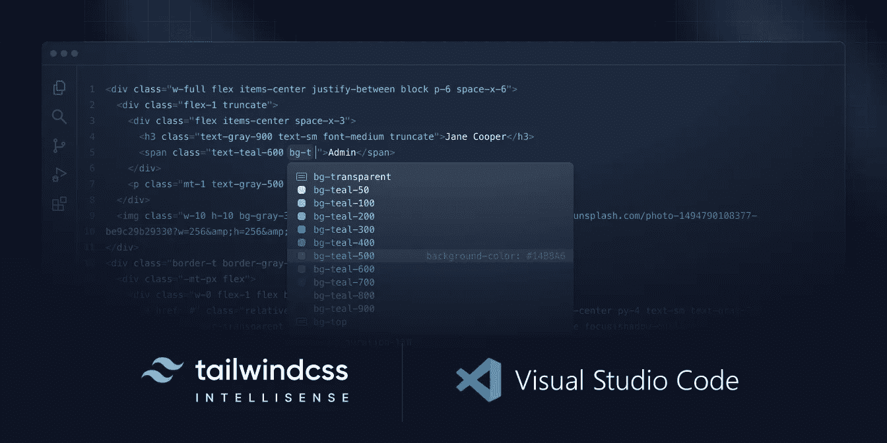

# 2022 年的终极前端工具包

> 原文：<https://betterprogramming.pub/the-ultimate-front-end-toolkit-for-2022-302f4e535679>

## 继续…拥抱点击诱饵！


作者图片(Shutterstock)

差不多是时候向 2021 年说再见了——或者如果你喜欢的话，也可以说是摆脱了！—也是一个反思和评估的绝佳机会。看到前端空间中的大量创新是令人着迷的，尽管考虑到选择的数量，这是相当令人生畏的。

然而，我注意到今年大部分时间我的技术都保持不变，这是一个很好的迹象，表明它运行良好。一切都运行得如此和谐，以至于我不会很快偏离我目前的设置。事实上，我记得最后一次感受这些内容的时候，我正在将 PSDs 切片并导出到 Dreamweaver 中！

所以，事不宜迟，让我们看看我的 2022 年走向前端工具包。

# 基本要素

不考虑项目类型，我从下面开始*每个*前端项目:

## [VSCode](https://code.visualstudio.com)



我抛弃了 Sublime Text，和 Atom 调情了一下，然后继续用 Visual Studio 代码寻找真爱，这已经过去 6 年了。代码编辑体验流畅、直观、无与伦比。它有恰到好处的开箱即用的高质量功能，以及大量令人惊叹的插件来满足您的每一个需求。此外，VSCode 有一些我见过的最好看的应用内发行说明。做得好，微软！

## [更漂亮](https://prettier.io)

没错，我就是把一个小小的代码格式化工具和 VSCode 放在一个类别里！

在更漂亮之前，如果我想标准化代码格式，我首先必须定义一个样式指南(这比看起来更复杂)，然后找到相关的 ESLint 规则来匹配它。但是漂亮一点就是固执己见，那就不必了！此外，保存时自动格式化的价值不应该被认为是理所当然的——它极大地减少了认知工作并节省了大量时间。



Prettier 还促进了关注点的逻辑分离——正如它在文档中所说:

> "更漂亮的格式和捕捉虫子的棉绒！"

**提示:**要在特定的 VSCode 项目中进行格式保存，只需在根目录的`.vscode/settings.json`中添加以下内容:

```
{
   "editor.formatOnSave": true,
   "[javascript]": {
      "editor.defaultFormatter": "esbenp.prettier-vscode",    
   },
   "prettier.requireConfig": true
}
```

## [Next.js](https://nextjs.org)

我真的需要把这个卖给你吗？除非你一直生活在岩石下，否则你会知道 Next.js。他们早期让我研究“同构 JavaScript ”,并继续以无尽的创新震撼我的心灵。

Next.js 团队致力于确保您的应用程序符合最高的 web 性能标准和最佳实践。他们这样做的同时也提供了我所见过的最好的开发者体验。

Next.js 就像一个极其慷慨和体贴的伙伴，不断渴望让你的生活更轻松，让你的产品更好。就我而言，如果你想在你的前端游戏中保持领先，坚持使用他们是一个安全的赌注。

**提示:**在你的项目中运行`npx next lint`并使用 Next 的 ESLint 规则。如果你这样做旁边漂亮，这是林挺和格式完全排序。

## [顺风 CSS](https://tailwindcss.com)

啊，臭名昭著的顺风。当我最初听到风声时(lol)，我的第一个想法是，“我从来不需要 UI 组件的 Bootstrap，我也不需要这个东西！”(无意冒犯自举❤️).除了 Tailwind 是一个 UI 组件库，它是一个实用优先的 CSS 框架，这是一个完全不同的领域。

Tailwind 使您无需离开 HTML 就可以设计组件的样式。为了方便起见，它公开了一组非常低级的实用程序类。很难表达完全不考虑类名而随意设计 HTML 样式是多么自由。此外，它的配置方式允许您在自己的设计系统的约束下工作，这是非常强大的。



别忘了安装神奇的[顺风智能感知插件](https://marketplace.visualstudio.com/items?itemName=bradlc.vscode-tailwindcss)！

当你熟悉类名的时候，会有一个轻微的学习曲线，但是这是完全值得的。听听顺风的创造者是怎么说的:

> “如果你能抑制住想吐的冲动，给它一个机会，我真的认为你会想知道你是如何以其他方式使用 CSS 的。”— [亚当·瓦森](https://medium.com/u/2bdb4734b294?source=post_page-----302f4e535679--------------------------------)

## [韦尔塞尔](https://vercel.com)

我已经尝试了几乎所有的云服务提供商，并且用几乎所有的 CI 工具创建了无数的构建管道，但是没有什么比得上 Vercel 的魔力。

只需将 Vercel 指向您现有的 Git repo，嘿，很快——构建管道和生产架构就完成了！但不只是任何旧的架构——假设这些人是 Next.js 的开发者，您将获得开箱即用的性能和最佳实践。

《灯塔》满分，想都没想…

不仅如此，如果您正在使用 Next，它会神奇地根据您的应用程序代码了解您的每个部署需要什么样的基础架构。不，不是作为代码的基础设施，而是*字面上的*你的应用程序代码，也就是你编写的构建特性的东西——巫术！

Vercel 自动确保您获得最高的架构标准，将 web 性能放在首位，而且完全免费。没错；如果你喜欢使用 Vercel 的域名，你可以点击一个按钮，将一个面向公众的应用程序投入生产。这是显而易见的，尤其是如果你喜欢 Next.js。

# 临时演员

好了，我们快完成了！上面的工具包对于大多数前端应用程序来说都非常好用——特别是如果你把它和一个无头的 CMS 或者电子商务平台结合起来。但是，以下是一些值得注意的技术，这些技术可能不是每个项目的一部分:

*   [**NextAuth.js**](https://next-auth.js.org) —如果你喜欢 Next.js，那么 NextAuth 是一个显而易见的认证选择。他们让所有流行的提供商(谷歌、脸书、Github 等)将单点登录添加到你的应用程序变得超级简单。)—太容易了！
*   [**Prisma**](https://www.prisma.io)**—这种下一代 ORM 使您能够在应用程序代码中声明性地定义数据模型，生成定制的 SDK 供您查询，并为探索您的数据提供可爱的 UI—强烈推荐！**
*   **[**planet scale**](https://planetscale.com)**—需要一个数据库来完成您的无服务器堆栈？只看行星尺度。他们有一个令人难以置信的平台，使您能够基本上“分支”您的数据库，并使“PRs”到它的模式——太酷了！****

# ****摘要****

****用 Tegan 和 Sara 的话说——一切都棒极了！我们很幸运地生活在这样一个世界里，任何一个拥有一台不太像样的电脑和互联网连接的人都可以获得这些东西。现在不要找借口——去创造非凡的东西吧……****