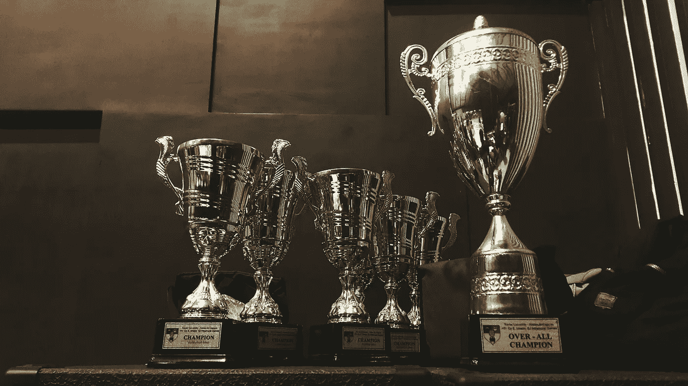

# ICPC 终极指南

> 原文：<https://betterprogramming.pub/the-ultimate-guide-for-the-icpc-407b7f6409dd>

## 为参加*国际大学生编程竞赛(ICPC)或任何竞争性编程竞赛*做准备的资源

照片由[阿里尔·贝沙加](https://unsplash.com/@arielbeagar?utm_source=unsplash&utm_medium=referral&utm_content=creditCopyText)在 [Unsplash](https://unsplash.com/s/photos/trophy?utm_source=unsplash&utm_medium=referral&utm_content=creditCopyText) 上拍摄

# 什么是 ICPC？

> “ICPC，即‘国际大学生编程竞赛’，是一项面向世界各地大学学生的课外编程竞赛。ICPC 竞赛为有天赋的学生提供了互动、展示和提高团队合作、编程和解决问题能力的机会。ICPC 是一个全球性的平台，让学术界、工业界和社区聚焦于追求卓越的下一代计算专业人士，并激发他们的抱负。”— [维基百科](https://en.wikipedia.org/wiki/International_Collegiate_Programming_Contest)

## 放弃

我绝不是顶尖程序员或世界决赛选手。我只是想分享我发现有用的资源，如果你遵循它们，希望你会成为 ICPC 世界决赛选手。

# 介绍

我真的很喜欢竞技编程，很想成为 [Gennady Korotkevich](https://en.wikipedia.org/wiki/Gennady_Korotkevich) 那样的人。在竞争性编程领域，他确实是一个活着的传奇。

无论如何，让我们进入细节…

# 成为优秀的有竞争力的程序员的步骤

这真的很简单:没有诀窍，也没有捷径…你需要的只是奉献和目标，你就万事俱备了。

首先，您需要熟悉以下编程语言中的至少一种:Python、Java、C 或 C++。

其次，你需要学习所有关于数据结构和算法的不同主题。

最后做很多题……*很多！*

# 主题

这些是应该彻底做好的主要课题。

## 数论

1.  [欧几里德和扩展欧几里德算法](https://www.geeksforgeeks.org/basic-and-extended-euclidean-algorithms/)
2.  [模运算和模逆运算](https://www.geeksforgeeks.org/multiplicative-inverse-under-modulo-m/)
3.  质数生成([筛](https://www.geeksforgeeks.org/sieve-of-eratosthenes/)和[分段筛](https://www.geeksforgeeks.org/segmented-sieve/)
4.  [费马大定理](http://mathworld.wolfram.com/FermatsLittleTheorem.html)
5.  [欧拉的极限函数](https://www.geeksforgeeks.org/eulers-totient-function/)
6.  [米勒·拉宾素性测试](https://www.geeksforgeeks.org/primality-test-set-3-miller-rabin/)
7.  [中国剩余定理](https://www.google.com/url?sa=t&rct=j&q=&esrc=s&source=web&cd=24&cad=rja&uact=8&ved=2ahUKEwjo-KCtq-fkAhVjposKHbzvAkYQFjAXegQIBBAB&url=https%3A%2F%2Fwww.geeksforgeeks.org%2Fchinese-remainder-theorem-set-1-introduction%2F&usg=AOvVaw0dK78WjQciMCC-w29rYlqC)
8.  [卢卡斯定理](https://www.geeksforgeeks.org/compute-ncr-p-set-2-lucas-theorem/)

## 贪婪算法

1.  [活动选择问题](https://www.geeksforgeeks.org/greedy-algorithms-set-1-activity-selection-problem/)
2.  [克鲁斯卡尔算法](https://www.geeksforgeeks.org/greedy-algorithms-set-2-kruskals-minimum-spanning-tree-mst/)
3.  [普里姆的算法](https://www.geeksforgeeks.org/greedy-algorithms-set-5-prims-minimum-spanning-tree-mst-2/)

## 二进位检索

1.  [Topcoder 二分搜索法](https://www.topcoder.com/community/data-science/data-science-tutorials/binary-search/)
2.  [二分搜索法](https://www.geeksforgeeks.org/binary-search/)
3.  无处不在的二分搜索法——掌握离散和连续的二进制搜索

## 数据结构

1.  [链表](https://www.geeksforgeeks.org/data-structures/linked-list/)
2.  [二分查找树](https://www.geeksforgeeks.org/binary-search-tree-data-structure/)
3.  [二进制索引树或芬威克树](https://www.geeksforgeeks.org/binary-indexed-tree-or-fenwick-tree-2/)
4.  [段树](https://www.geeksforgeeks.org/segment-tree-set-1-range-minimum-query/) ( [RMQ](https://www.geeksforgeeks.org/segment-tree-set-1-range-minimum-query/) 、[范围总和、](https://www.geeksforgeeks.org/segment-tree-set-1-sum-of-given-range/)和[懒传播](https://www.geeksforgeeks.org/lazy-propagation-in-segment-tree/)
5.  [红黑树](https://www.geeksforgeeks.org/red-black-tree-set-1-introduction-2/)
6.  [散列法](https://www.geeksforgeeks.org/hashing/)
7.  [广泛的数据结构列表](https://www.geeksforgeeks.org/data-structures/)

## **图形算法**

1.  [广度优先搜索(BFS)](https://www.geeksforgeeks.org/breadth-first-traversal-for-a-graph/)
2.  [深度优先搜索](https://www.geeksforgeeks.org/depth-first-traversal-for-a-graph/)
3.  从源到所有顶点的最短路径(Dijkstra
4.  从一个顶点到另一个顶点的最短路径
5.  [最小生成树(Prim](https://www.geeksforgeeks.org/greedy-algorithms-set-5-prims-minimum-spanning-tree-mst-2/)
6.  [最小生成树(克鲁斯卡尔](https://www.geeksforgeeks.org/greedy-algorithms-set-2-kruskals-minimum-spanning-tree-mst/)
7.  [拓扑排序](https://www.geeksforgeeks.org/topological-sorting/)
8.  [约翰逊算法](https://www.geeksforgeeks.org/johnsons-algorithm/)
9.  [图中的关节点(或切割顶点)](http://www.test.geeksforgeeks.org/articulation-points-or-cut-vertices-in-a-graph/)
10.  [图中的桥梁](http://www.test.geeksforgeeks.org/bridge-in-a-graph/)
11.  [所有图形算法](http://www.test.geeksforgeeks.org/category/graph/)

## **字符串算法**

事实证明，学习 string 的库函数非常有帮助。(C++:见 Java 中的[这个](https://www.geeksforgeeks.org/c-string-class-and-its-applications/)、[这个](https://www.geeksforgeeks.org/stdstring-class-in-c/)、[字符串](http://quiz.geeksforgeeks.org/string-class-in-java/)。)

1.  [KMP 算法](https://www.geeksforgeeks.org/searching-for-patterns-set-2-kmp-algorithm/)
2.  [拉宾·卡普](https://www.geeksforgeeks.org/searching-for-patterns-set-3-rabin-karp-algorithm/)
3.  [Z 的算法](https://www.geeksforgeeks.org/z-algorithm-linear-time-pattern-searching-algorithm/)
4.  [Aho-Corasick 字符串匹配](https://www.geeksforgeeks.org/aho-corasick-algorithm-pattern-searching/)
5.  [后缀数组](https://www.geeksforgeeks.org/suffix-array-set-1-introduction/)
6.  [特里](https://www.geeksforgeeks.org/trie-insert-and-search/)
7.  [有限自动机](https://www.geeksforgeeks.org/searching-for-patterns-set-5-finite-automata/)

## **动态编程**

1.  [动态编程— GeeksforGeeks](https://www.geeksforgeeks.org/category/algorithm/dynamic-programming/)
2.  [动态编程— Codechef](https://www.codechef.com/wiki/tutorial-dynamic-programming)

动态编程是非常重要的，可以注入和询问各种其他主题。一些不同类型的 DP 概念有:

**经典 DP**

1.  [最长公共子序列](https://www.geeksforgeeks.org/dynamic-programming-set-4-longest-common-subsequence/)
2.  [最长递增子序列](https://www.geeksforgeeks.org/dynamic-programming-set-3-longest-increasing-subsequence/)
3.  [编辑距离](https://www.geeksforgeeks.org/dynamic-programming-set-5-edit-distance/)
4.  [最小分区](https://www.geeksforgeeks.org/partition-a-set-into-two-subsets-such-that-the-difference-of-subset-sums-is-minimum/)
5.  [行驶一段距离的方法](https://www.geeksforgeeks.org/count-number-of-ways-to-cover-a-distance/)
6.  [矩阵中最长的路径](https://www.geeksforgeeks.org/find-the-longest-path-in-a-matrix-with-given-constraints/)
7.  [子集和问题](https://www.geeksforgeeks.org/dynamic-programming-subset-sum-problem/)
8.  [博弈的最优策略](https://www.geeksforgeeks.org/dynamic-programming-set-31-optimal-strategy-for-a-game/)
9.  [0–1 背包问题](https://www.geeksforgeeks.org/dynamic-programming-set-10-0-1-knapsack-problem/)
10.  [装配线调度](https://www.geeksforgeeks.org/dynamic-programming-set-34-assembly-line-scheduling/)
11.  [所有 DP 算法](https://www.geeksforgeeks.org/tag/dynamic-programming/)

## **计算几何**

1.  [凸包算法](https://www.geeksforgeeks.org/convex-hull-set-1-jarviss-algorithm-or-wrapping/)
2.  [几何算法](https://www.geeksforgeeks.org/category/algorithm/geometric/)

# 资源

[《竞技编程 3》](http://www.lulu.com/shop/http://www.lulu.com/shop/steven-halim/competitive-programming-3/paperback/product-21059906.html):**这本书太棒了。我目前正处于其中，我很喜欢这些问题和这本书的结构。我强烈推荐它。**

**[“竞争性编程中训练的‘科学’”](https://codeforces.com/blog/entry/17842):**在这篇博客中，作者解释了如何为 CP 进行训练，以及为了成为一名优秀的问题解决者，他做了些什么。****

****[如何成为一个红色编码员:](https://www.quora.com/TopCoder/By-practicing-can-one-become-a-red-yellow-coder-at-Topcoder-despite-not-being-that-intelligent-I%E2%80%99m-a-gray-coder-and-really-want-to-excel-in-algorithmic-programming-Is-practice-the-only-factor-that-can-make-one-red-or-yellow)这个 Quora 的回答真的很深入的探讨了如何成为一个红色编码员，高效的训练。****