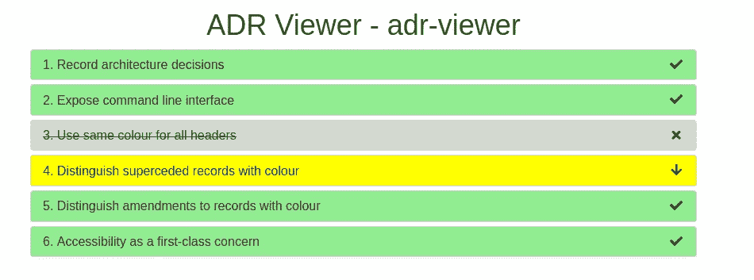
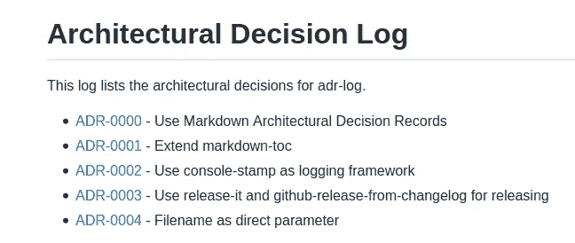
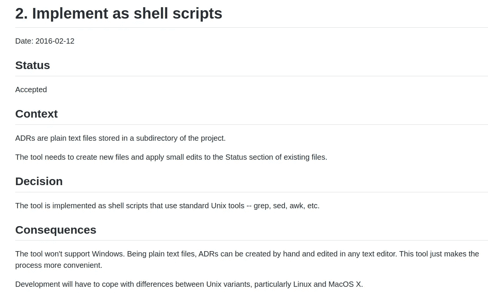

# 建筑决策记录的最终指南

> 原文：<https://betterprogramming.pub/the-ultimate-guide-to-architectural-decision-records-6d74fd3850ee>

## ADR 简介，包括示例、模板和管理工具

劳拉·卡弗在 [Unsplash](https://unsplash.com?utm_source=medium&utm_medium=referral) 上的照片

# 什么是架构决策记录(ADR)

架构决策记录(ADRs)记录了重要的架构决策及其背景和结果。迈克尔·尼加德在 2011 年的[博客文章](https://cognitect.com/blog/2011/11/15/documenting-architecture-decisions)中首次介绍了它们。

ADR 通常由描述特定架构决策的简短文本文件组成。您可以用纯文本、AsciiDoc/Markdown 格式编写它们，或者使用 wiki 页面模板。

# 使用 ADR 的好处

让我们看看使用 ADR 的一些主要好处:

*   它们捕获了关于软件的基本信息，可以随时查看。
*   它们可以作为记录软件架构的有效手段。发展成果评估强调了做出特定决定的原因。它还描述了权衡分析，例如，选择性能而不是可伸缩性。
*   如果开发人员想了解为什么为给定的项目选择了特定的技术，他们可以在 ADR 中找到解释。这减少了内部争论。开发人员具有批判性思维，所以让他们理解为什么是至关重要的。这导致团队内部更多的信任。
*   他们帮助新团队成员熟悉架构思维方式。新来者将理解哪些方面在基础设施中起着最重要的作用。他们将了解过去做了些什么。
*   如果有人想提出一项新技术，结果可能是这个话题已经讨论过了，被否决了。原因在 ADR。因此，他们可以投入时间寻找新的解决方案。
*   保持团队内外的透明度。任何对这个话题感兴趣的人都可以阅读决策过程。这样，不同的小组可以互相学习。

# ADR 结构

ADR 应该简洁明了。

## 标题

标题包含一个描述架构决策的简短短语。

示例:

我们前端的编程语言和框架。

## 状态

状态可以是:

*   提议(正在审查中)
*   接受(批准并准备实施)
*   被取代(被另一项决定取代)

## 语境

上下文解释了我们为什么需要做出决定。它还描述了替代方案及其优缺点。

示例:

我们需要为我们的前端选择一种编程语言。它需要适合 web 和移动应用程序。我们的 UI 需要大量的细节定制。

## 决定

决策描述了接受特定解决方案的理由。它更强调为什么，而不是如何。

示例(这只是一个技术决策的示例；不认同也行):

我们将使用 Flutter 作为前端框架。

我们考虑了以下框架:

*   摆动
*   反应自然

**自变量**

flutter——fast，提供了许多现成的 UI 组件，无需我们自己实现这些组件，就可以加快开发速度。它有一个内置的材料设计。尽管它是一个年轻的框架，但它是有据可查的。

本地反应——我们必须自己实现大部分组件。文档不是很详细。整体性能不如 Flutter 的。

## 结果

后果部分包含关于架构决策的总体影响的信息。每个决定都有取舍。这就是为什么包含分析以提供清晰的画面是至关重要的。

示例:

它有一个学习曲线:开发人员必须学习 Dart 编程语言才能使用 Flutter 框架。

# 何时撰写 ADR

你可能会问自己:我应该总是写 ADR 吗？不一定，但以下几点可以帮助您决定是否值得创建 ADR:

*   你是否听到人们不断地问同样的问题:为什么做出这个特别的决定？为什么建筑师选择这项技术而不是这项技术？当前的实现有一些缺点，比如性能较低，那么他们为什么选择这种体系结构呢？
*   你想提出一个影响整个软件的改变吗？这是一个合适的开始讨论的方式，在这里可以回顾利弊。

# 管理 ADR

## 储存；储备

您可以将 ADR 存储在 Git 存储库中的一个单独的 ADR 文件夹中。然而，并不是每个人都可以访问 Git，例如，业务分析师、产品负责人等。所以，这并不是最优的选择。最简单的方法是将 ADR 存储在一个共享的 Wiki 页面中，每个人都可以看到它们。

## 模板

如果您不确定如何开始，不要担心，因为已经存在大量 ADR 模板。最广泛使用的是迈克尔·尼加德的作品:

 [## 主 joelparkerhenderson/architecture-decision-record/index . MD

### 这是记录架构决策的模板。您可以使用 adr 工具来管理 ADR…

github.com](https://github.com/joelparkerhenderson/architecture-decision-record/blob/main/templates/decision-record-template-by-michael-nygard/index.md) 

查看 GitHub 上的这个[系列](https://github.com/joelparkerhenderson/architecture-decision-record#adr-example-templates)，了解更多创意和风格。

## 工具

有各种工具可以帮助您跟踪您的 ADR。这里有一个方便的轻量级工具可以帮助你:【https://github.com/mrwilson/adr-viewer

这个基于 Python 的工具显示本地 web 服务器上的 ADR 或生成的静态内容。

ADR 查看器官方演示

完整的演示可以在这里找到:[https://mrwilson.github.io/adr-viewer/index.html](https://mrwilson.github.io/adr-viewer/index.html)

如果你已经有一些 ADR，考虑创建一个日志。 [Adr-Log 工具](https://github.com/adr/adr-log)生成 ADRS 的架构决策日志:

截图来自原出处:【https://github.com/adr/adr-log/blob/master/docs/index.md 

为了处理 ADR 日志，我推荐一个名为 [Adr-tools](https://github.com/npryce/adr-tools) 的命令行工具。它运行命令来创建基于模板的 ADR，例如像[这样的](https://github.com/npryce/adr-tools/blob/master/doc/adr/0002-implement-as-shell-scripts.md)一个:

ADR 模板

# 最后的想法

恭喜你！你学习了药品不良反应的原理。现在你知道为什么、何时以及如何使用它们了。我还列出了一些管理 ADR 的有用工具。

我希望你今天学到了一些新东西。感谢您的阅读，下次再见！