# 构建 Chrome 扩展的终极指南

> 原文：<https://betterprogramming.pub/the-ultimate-guide-to-building-a-chrome-extension-4c01834c63ec>

## 快速轻松地构建 Chrome 扩展


来自 [Pexels](https://www.pexels.com/photo/two-people-on-mountain-cliff-1647962/?utm_content=attributionCopyText&utm_medium=referral&utm_source=pexels) 的 [Valdemaras D.](https://www.pexels.com/@valdemaras-d-784301?utm_content=attributionCopyText&utm_medium=referral&utm_source=pexels) 摄影

本教程将帮助你建立创建 Chrome 扩展所需的心智模型。在我们构建扩展的过程中，我将介绍核心概念。

我们将从头开始构建一个 Chrome 扩展，让你可以替换一篇中型文章中的任何文本。这是最终结果的样子:

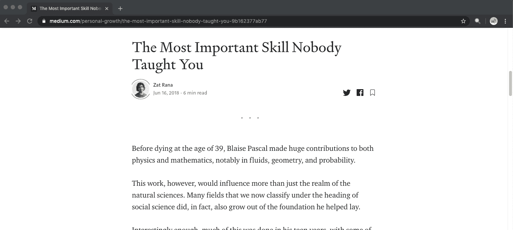

我建议您在阅读时在您最喜欢的文本编辑器中构建扩展。在我们介绍完每个关键概念后，我会继续在 GitHub 上添加代码链接，这样你就可以跟踪到目前为止我们已经构建了什么。

# TL；速度三角形定位法(dead reckoning)

我将本文分成了五个主要概念，在构建任何扩展时，您都需要了解这五个概念，即清单文件、内容脚本、后台脚本、消息传递和扩展弹出窗口。

我还从头开始构建了一个扩展，因为我们涵盖了上面提到的每个主题。你可以在这里找到扩展[的最终代码。](https://github.com/prateek3255/replacely)

# 先决条件

我假设你熟悉基本的 [HTML](https://developer.mozilla.org/en-US/docs/Web/HTML) 、 [CSS](https://developer.mozilla.org/en-US/docs/Web/CSS) 和 [JavaScript](https://developer.mozilla.org/en-US/docs/Web/javascript) ，并且至少对[HTML DOM API](https://developer.mozilla.org/en-US/docs/Web/API/HTML_DOM_API)有一个模糊的了解。

# 初始设置

您将需要创建一个新文件夹，所有与该扩展相关的文件都将保存在其中，还需要一个代码编辑器和一个 Chrome 或 Chrome 浏览器来开发和测试该扩展。

# 清单文件

每个扩展都需要一个清单文件来安装和运行。这个文件就像你的 Chrome 扩展的蓝图。它告诉扩展它是什么，允许它做什么，以及什么时候允许它做。

创建一个名为`manifest.json`的新文件，并将以下代码片段粘贴到其中:

让我们来分解一下:

*   属性是扩展的主要标识符，将在扩展管理 UI 和 Chrome 网络商店中使用。它只有 45 个字符的限制。
*   接下来是`description`键，用来描述你的分机。它也用于扩展管理 UI 和 Chrome 网络商店。它的字符限制稍大，为 132 个字符。
*   `version`键定义了你的扩展的当前版本(我们从 0.1 开始)。每当您想要发布一个新版本的扩展时，您都需要更新这个字段。
*   最后但同样重要的是，`manifest_version`指定了我们的包目标的清单规范。我们应该使用第二版，因为第一版很久以前就被废弃了。如果你对第一版到第二版的变化感到好奇，你可以在这里找到变更日志[。](https://developer.chrome.com/extensions/manifestVersion)

你猜怎么着？我们已经有足够的内容在浏览器中加载我们的扩展:

*   只需转到`chrome://extensions`并从右上角打开开发者模式:

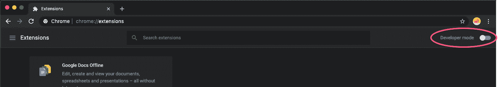

*   然后点击`Load unpacked`，选择包含我们刚刚创建的清单文件的文件夹:

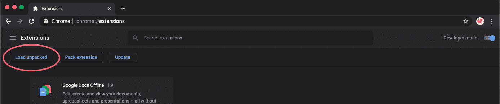

*   好了，我们的扩展很快就启动并运行了。

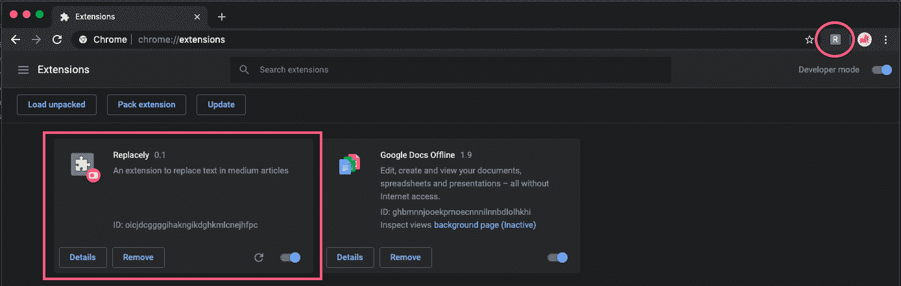

但是这个扩展没有合适的图标看起来还是有点怪，所以我们来添加一个。

*   创建一个名为 images 的文件夹，并将这些图像下载并解压到该文件夹中。
*   然后将其粘贴到您的清单文件中:

*   现在返回到扩展管理页面，单击扩展卡上的重新加载按钮。瞧，我们的扩展现在开始看起来像一个真正的扩展了！

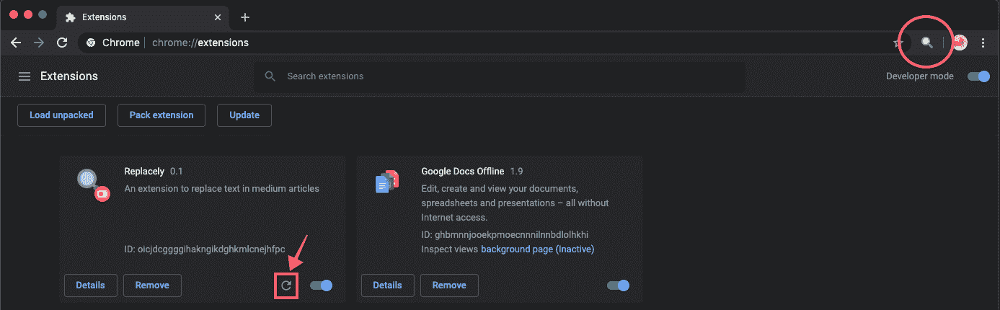

那么这是如何工作的，为什么这里需要两个不同的键，即使它们有相同的值？

我给你的图片文件夹对于同一张图片有不同的文件大小。我们使用 size 作为键，使用相应大小的图像路径作为值。

`page_action`下的`default_icon`键用于指定将用于浏览器工具栏的图标，而`icons`键指定将用于其他任何地方的图标，例如扩展管理页面和 Chrome 网络商店。

**注意**只有`name`、`manifest_version`和扩展`version`是必需键。此外，这里使用的所有路径都是相对于清单文件的。

你可以在这里了解更多关于清单文件[中使用的不同键及其角色的信息。此外，该步骤的代码可在](https://developer.chrome.com/extensions/manifest)[这里](https://github.com/prateek3255/replacely/tree/ae684e7fe75d15c6eea6576e3a890cce03378299)获得。

# 内容脚本

在最后一步中，我们在浏览器中安装并运行了扩展。现在让我们替换一些文本。

这就是内容脚本的用武之地。它们允许您修改网页 DOM，与原始网页 JavaScript 隔离工作。

网页上的扩展可以执行多个内容脚本。这些脚本中的每一个都将在它们自己的孤立世界中运行。


每个孤立的世界都有自己的 JavaScript 环境，确保库之间不会冲突。

DOM 在所有内容脚本和原始网页的 JavaScript 之间共享。

对于我们的扩展，我们还需要访问 DOM 来修改网页的内容，所以我们需要一个内容脚本。

您可以以编程方式注入脚本[(从后台或弹出文件)或以声明方式注入](https://developer.chrome.com/extensions/content_scripts#programmatic)[(在特定页面上自动执行脚本)。](https://developer.chrome.com/extensions/content_scripts#declaratively)

因为我们希望这个脚本在中型文章中执行，所以现在我们将使用声明性方法。

将以下代码片段添加到您的清单文件中:

```
{
 "name": "Replacely",
 .
 .
 .
 "content_scripts": [
      {
        "matches": ["[https://medium.com/*](https://medium.com/*)"],
        "js": ["contentScript.js"]
      }
    ]
}
```

`content_scripts`是一个对象数组，其中每个对象具有以下属性:

*   `matches`—[regex](https://regexr.com/)字符串数组，指定内容脚本将被注入的页面。
*   `js` -表示应该在匹配页面上执行的文件的字符串数组。

还有一些其他的属性，你可以在这里找到。

因此，我们创建一个名为`contentScript.js`的新文件，并将这个日志添加到其中:

```
console.log("Content script running...");
```

现在重新加载扩展，打开任何您喜欢的中型文章，并检查控制台。如果一切都按预期运行，您将在控制台中看到以下日志。

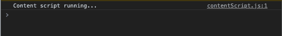

***注意:*** *每次我们对扩展进行修改时，您都需要重新加载扩展。*

因为我们现在已经准备好了内容脚本，所以让我们添加创建这个扩展的代码:

这段代码选择媒体页面上所有不同种类的标签，在它们的文本内容中找到`FIND`字符串，并用`REPLACE_WITH`字符串替换它。


正在运行的内容脚本，将单词“The”替换为“replacely”。好玩不是吗；).

通过对不同媒体文章的`FIND`和`REPLACE_WITH`变量使用不同的值，试着按照代码进行操作。

总结这一节，我们学习了内容脚本如何让我们访问网页的 DOM，允许我们独立于网页 JavaScript 操作它。你可以在这里找到到目前为止[的代码。](https://github.com/prateek3255/replacely/tree/271c38c317250ba9a91bc08222b86a4604c52ed4)

# 背景脚本

这个脚本在后台监听特定的事件，比如更改标签、URL 更新和添加书签，它还做各种其他事情来影响浏览器的整体行为。

与内容脚本不同，它作为一个整体为浏览器工作，而不是在单独的选项卡中有单独的实例。尽管一个扩展可以有多个后台脚本。

此外，浏览器一启动，后台脚本就被执行，而内容脚本在要执行脚本的网页加载时被执行。

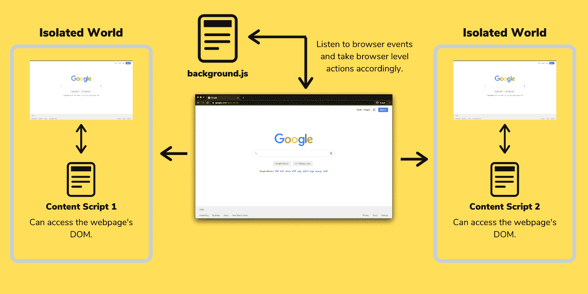

要创建一个背景脚本，请将下面的代码片段添加到您的`mainfest.json`中:

```
{
 "name": "Replacely",
 .
 .
 .
 "background": {
     "scripts": ["background.js"],
     "persistent": false
 }
}
```

与内容脚本类似，`background`键也接受一组通过`scripts`键执行的脚本。

当您的扩展使用 [chrome.webRequest](https://developer.chrome.com/extensions/webRequest) API 来阻止或修改网络请求时，需要将`persistent`键设置为 true。当持久键为 false 时，浏览器会在几秒钟不活动后自动挂起脚本。

创建一个名为`backgound.js`的新文件，向其中添加以下日志，然后重新加载扩展。

```
console.log("Background script running...");
```

现在再次打开您最喜欢的中型文章并检查控制台:


等等，什么？这是我们在内容脚本中添加的控制台。那么后台脚本在哪里被记录呢？

请记住，如前所述，它作为一个整体为浏览器工作——您将无法在网页的控制台上查看日志。相反，它有自己的一套开发工具。转到您的扩展管理页面，然后单击“检查视图背景页面”链接。

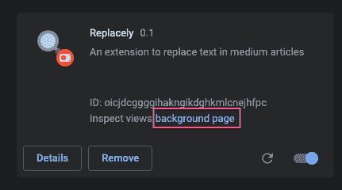

这是我们可爱的小圆木:

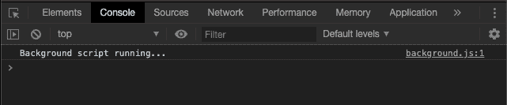

现在我们知道了什么是后台脚本，让我们用我们的扩展来尝试这些事件。首先，对于非中等 URL，我们将使浏览器工具栏中的扩展图标变灰。

为此，我们需要使用`[chrome.declarativeContent](https://developer.chrome.com/declarativeContent)` API，它允许我们根据页面的内容或 URL 采取行动，而不需要获得读取页面内容的许可。

大多数 API，比如我们将要使用的 API，需要在清单文件中的`permissions`键下注册，以便扩展使用它们:

```
{
 "name": "Replacely",
 .
 .
 .
 "permissions": ["declarativeContent"], 
 .
 .
 .
}
```

现在将下面的片段添加到`background.js`:

这可能看起来有点吓人，但实际上不是。我们创建了一个名为`iconRules`的数组，其中包含了我们扩展的所有规则。我们现在只有一条规则。

每个规则都是一个带有两个键的对象:`conditions`和`actions`。它们指定了条件以及在满足这些条件时要执行的相应操作。

在我们的例子中，唯一的条件是主机应该等于`medium.com`并且要执行的动作是显示页面动作，这是该页面的一个活动工具栏图标。

在下面几行中，我们通过将`undefined`传递给`chrome.declarativeContent.onPageChanged.removeRules`来删除页面发生变化时的所有现有规则。在回调中，我们传递刚刚使用`chrome.declarativeContent.onPageChanged.addRules` API 创建的规则。

在重新加载扩展并访问任何非介质 URL 时，您应该在浏览器工具栏中看到以下内容:

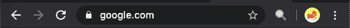

在中等 URL 上，您应该会看到:

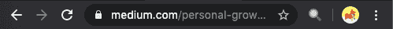

总之，在本节中，我们看到了后台脚本如何帮助我们监听浏览器事件并使用它们采取行动。

你可以在这里了解更多关于后台脚本[的内容，在这里](https://developer.chrome.com/extensions/background_pages)找到到此为止的代码[。](https://github.com/prateek3255/replacely/tree/3d9d3e710dd4e073b4661f9ed6de82ec559369ac)

在下一节中，我们将看到如何通过消息传递将后台脚本和内容脚本的功能结合起来。

# 信息传递

到目前为止，我们已经了解了如何使用内容脚本来操作网页数据，以及如何通过在后台脚本中监听浏览器事件来执行一些浏览器级的操作。

但是，如果你想通过监听一些浏览器事件来操纵网页，或者反之亦然，该怎么办呢？这就是消息传递的由来。

通过消息传递，您可以在内容脚本和扩展之间进行通信。任何一端都可以侦听从另一端发送的消息，并在同一信道上做出响应。消息可以包含任何有效的 JSON 对象(null、boolean、number、string、array 或 object)。

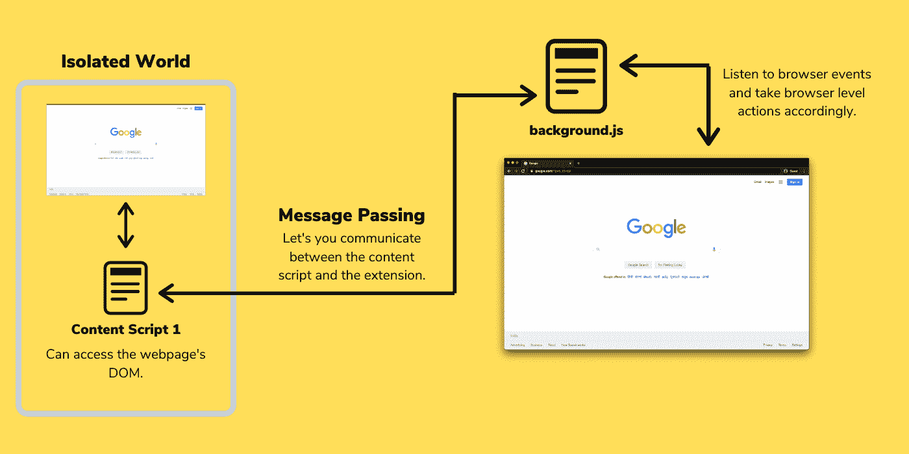

有两种类型的消息传递 API 可用——一种用于简单的一次性请求，另一种更复杂，用于需要在内容脚本和扩展之间共享状态的长期连接。

对于我们的例子，我们将使用简单的一次性请求消息传递。

到目前为止，只要中等文章加载，扩展就会替换文本，现在让我们只在单击浏览器工具栏中的扩展图标时替换文本。

为此，我们需要在后台脚本中监听扩展图标上的点击事件，然后向内容脚本发送一条消息，在收到该消息时替换文本。

将下面的片段添加到您的`background.js`文件中:

```
.
.
.
chrome.pageAction.onClicked.addListener(function(){
    chrome.tabs.query({active: true, currentWindow: true}, function(tabs) {
        chrome.tabs.sendMessage(tabs[0].id, {action: "REPLACE_TEXT"});
    })
});
```

`[chrome.pageAction.onClicked](https://developer.chrome.com/extensions/pageAction#event-onClicked)` API 接受一个回调，每当单击浏览器工具栏中的扩展图标时，就会触发这个回调。

由于浏览器中可以打开多个标签页，我们只想将消息发送到当前活动的标签页，所以我们使用`[chrome.tabs.query](https://developer.chrome.com/extensions/tabs#method-query)` API 在当前窗口中查找当前活动的标签页。它接受一个回调，该回调包含一个满足上述查询的选项卡数组作为它的参数。

然后，我们使用上述回调函数中的`[chrome.tabs.sendMessage](https://developer.chrome.com/extensions/runtime#method-sendMessage)` API 向活动选项卡发送消息。它将选项卡 ID 作为第一个参数，将消息作为第二个参数。

在`contentScript.js`文件中添加下面的代码片段来监听任何消息:

```
.
.
.
chrome.runtime.onMessage.addListener(function(message){
    console.log(message);
});
```

显然，无论何时收到消息，都会执行对`[chrome.runtime.onMessage](https://developer.chrome.com/extensions/runtime#event-onMessage)`的回调，第一个参数是它收到的消息。

现在重新加载扩展，打开一篇中型文章，点击扩展图标。如果一切正常，每次单击图标时，您都会在浏览器控制台中看到以下消息:

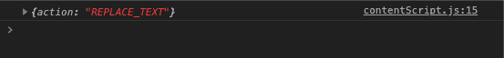

现在我们只需要在收到上述消息时替换文本。用下面的代码片段替换您的`contentScript.js`文件中的代码:

我们只是将我们的 replacer 逻辑包装在一个名为`replaceText`的函数中，并且只有当我们收到一个 action 属性的值为`REPLACE_TEXT`的消息时才执行它。

现在重新加载扩展来看看神奇之处:


在这一节中，我们看到了如何在消息传递中结合使用内容脚本和后台脚本。你可以在这里找到到目前为止的代码[。](https://github.com/prateek3255/replacely/tree/09f92bc3471b45dc7b6f1e52c7cd154ee0a108f6)

# 扩展弹出菜单

到目前为止，当我们点击图标时，我们的扩展可以替换文本，但是如果我们需要控制`FIND`和`REPLACE_WITH`字符串，我们仍然需要修改代码。

我们需要一个用户界面，以便用户可以决定查找和替换字符串。弹出窗口是 Chrome 扩展可以提供的几种用户界面类型之一。

如果你曾经安装过 Chrome 扩展，你可能已经知道什么是弹出窗口。它们通常在单击浏览器工具栏中的扩展图标时出现。

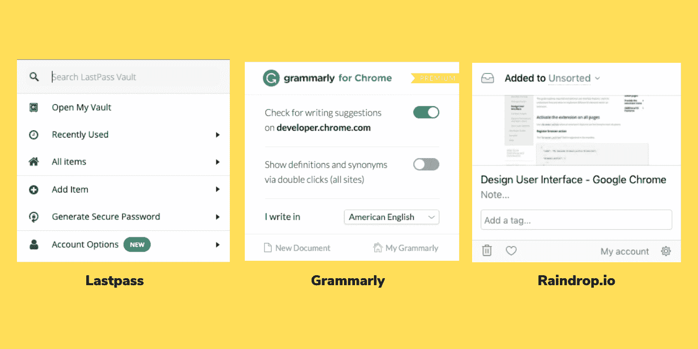

一些流行扩展的弹出窗口

为此，将下面一行添加到清单文件中的`page_action`:

```
{
 .
 .
 .
 "page_action": {
        "default_popup": "popup.html",
    .
    .
 }
 .
 .
}
```

现在创建一个名为`popup.html`的文件，并将下面的代码片段粘贴到其中:

然后创建一个名为`popup.css`的文件，并将这个 CSS 粘贴到[文件中。](https://raw.githubusercontent.com/prateek3255/replacely/92bd878257af950e0dbe53fde4c6f4d66e2c3705/popup.css)

现在，重新加载扩展并单击浏览器工具栏中的图标，您将能够看到我们刚刚创建的弹出窗口。

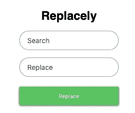

您还会注意到，我们在上一节中添加的文本替换操作停止了。这是因为`chrome.pageAction.onClicked` API 只有在扩展中没有弹出窗口时才起作用。所以，你可以从`background.js`文件中删除[代码，因为它现在已经没用了。](https://github.com/prateek3255/replacely/blob/09f92bc3471b45dc7b6f1e52c7cd154ee0a108f6/background.js#L16-L20)

在`popup.html`的底部，我们还包含了一个名为`popup.js`的脚本——它将包含表单提交时需要执行的代码。

用下面的代码创建一个名为`popup.js`的文件:

我们将`onsubmit`处理程序附加到表单上，在该处理程序中，我们向内容脚本发送了一条消息——类似于我们在上一节中所做的。然而，这一次我们还在消息中添加了`find`和`replace`文本，并将在各自输入中输入的文本作为它们的值。

最后，我们还需要稍微修改一下`contentScript.js`，因为之前我们已经对查找和替换文本进行了硬编码。将以下代码片段粘贴到内容脚本文件中:

我们已经更新了`replaceText`函数，它现在接受两个包含`find`和`replace`字符串的参数，这在以前是硬编码的。

现在最后一次重新加载扩展，查看运行中的扩展(这次您可能还需要重新加载中型文章)。

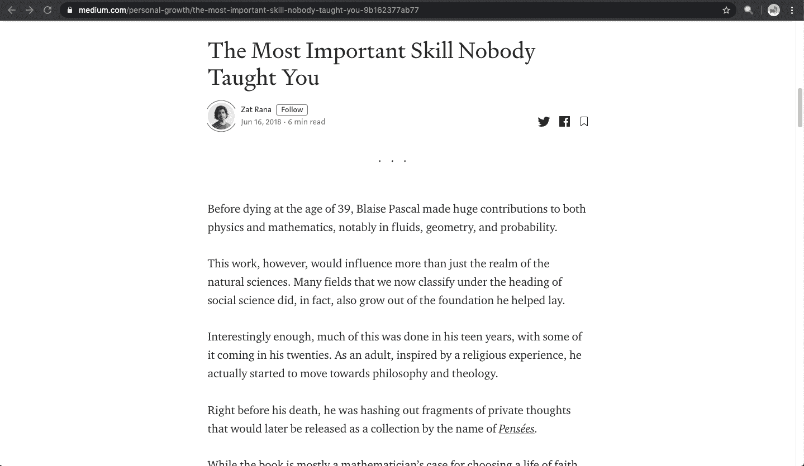

# 结论

如果你已经读到这里，我希望你已经很好的理解了 Chrome 扩展是如何工作的，它们能做什么，最重要的是，你如何创建一个。如果你有任何疑问，请在下面的评论中写下来，或者在 [twitter](https://twitter.com/@psuranas) 上 ping 我。

此外，如果您想探索更多的内容，可以尝试使用`[chrome.storage](https://developer.chrome.com/apps/storage)` API 持久化查找和替换更改，并在弹出菜单中添加一个清除按钮来清除所有当前的更改。对着 [GitHub repo](https://github.com/prateek3255/replacely) 开个 PR，够好我再审核合并。

*感谢阅读！*