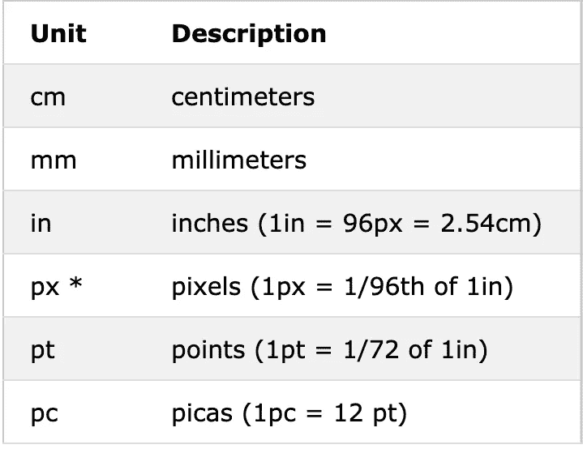
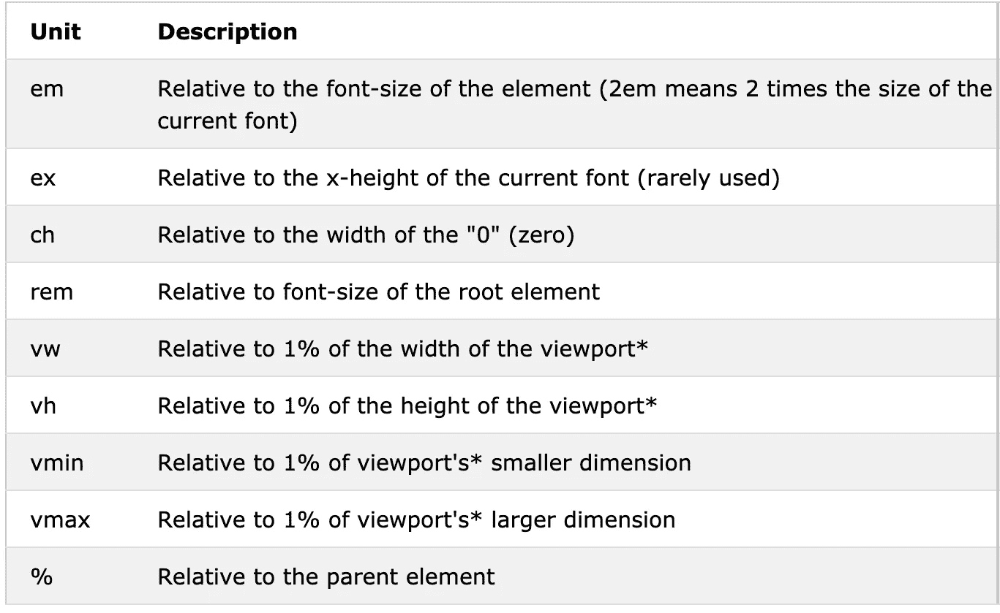
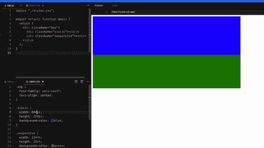
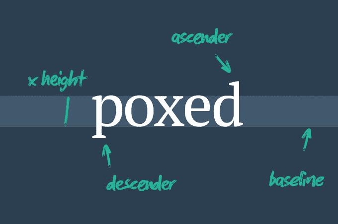
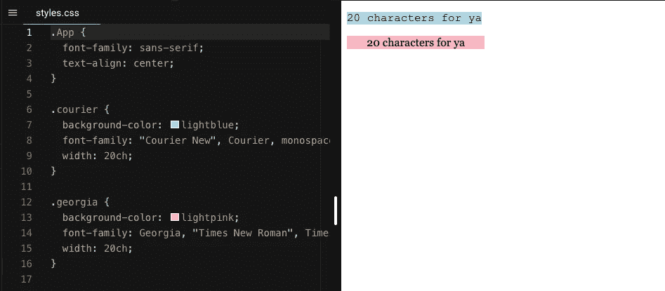

# CSS 长度单位的终极指南

> 原文：<https://betterprogramming.pub/the-ultimate-guide-to-css-length-units-be9595e3c64d>

## 你应该总是使用像素吗？em 和 rem 有什么区别？让我们看看你所有的选择。


图片由 [vectorjuice](https://www.freepik.com/vectorjuice) 在 [freepik](https://www.freepik.com/free-vector/layout-abstract-concept-illustration-website-development-user-interface-frontend-graphic-design-team-landing-page-responsive-design-marking-tool-consistency_12144973.htm#page=1&query=frontend&position=10)

我从事 CSS 工作已经很多年了，我必须承认:直到最近我才完全理解 CSS 单元。有如此多的选择，以至于开发者很容易坚持使用他们经常使用的或者使用试错法。

然而，了解所有现存的 CSS 度量单位以及何时应用它们中的每一个，为任何可能出现的情况打开了一个可能性的范围。我决定是时候填补我的知识空白了，而致力于我的研究的最好方式就是写下它。以下是我对 CSS 度量单位的了解。

有许多 CSS 属性将长度值作为属性:盒模型属性、`font-size`，甚至是`box-shadow`的偏移量。这些属性接受几个不同的长度单位，可以分类为`absolute`或`relative`。

# 绝对长度单位

绝对长度单位有固定值。这意味着具有任何绝对长度单位的长度集将总是以定义的精确大小出现。

[W3C 将像素归类为唯一的视角单位](https://www.w3.org/TR/css-values-3/#absolute-lengths)，以区别于物理单位(厘米、毫米、英寸等)。

以下是一些最常见的绝对长度单位:



来源: [W3Schools](https://www.w3schools.com/cssref/css_units.asp)

物理单位最适合大小不变的东西，比如一张桌子或者一个人的身高。对于像屏幕显示这样的东西，由于有各种各样的显示尺寸，像素反而是正确的选择。这是因为像素值是相对于查看设备的。低 DPI 设备，将 1px 视为显示器的一个设备像素(点)。但是，打印机和高分辨率屏幕将 1px 称为多个设备像素。

大多数绝对长度单位，如英寸和厘米，在浏览器中被转换为像素。正因为如此，我不知道任何使用绝对单位的情况，但像素可能是有用的。

# 相对长度单位

相对长度单位定义与另一个长度属性相关的长度值。这些单元最适合在屏幕上使用，因为它们可以在不同的显示尺寸之间缩放。



来源: [W3Schools](https://www.w3schools.com/cssref/css_units.asp)

上表中的大多数定义都不容易用如此简短的描述来理解。然而，一旦你深刻理解了所描述的概念，这个表就变成了一个有用的备忘单！

# 字体大小

适合字体大小的 CSS 相对单位有两个:`rem`和`em`。为了理解如何以及何时使用它们，我们首先必须记住大多数浏览器使用 16px 作为默认字体大小。这意味着 HTML 根元素的字体大小默认设置为 16px。相当于:

```
html {
  font-size: 16px;
}
```

## em 单元

如果我们想把根字体大小设置为 10px 而不是默认的 16px，我们要做的就是把它乘以 62.5%，因为 16px*0.625=10px。这使一切变得更容易，因为从现在起，如果你想，例如，定义每个标题为 24px，你只需设置为 2.4 em。

```
body { font-size:62.5%; } 
h1 { font-size: 2.4em; } /* =24px */ 
p  { font-size: 1.4em; } /* =14px */ 
li { font-size: 1.4em; } /* =14px? */
```

## 复合效应

使用 em 单位的问题是它们是相对于自己的组件而言的。因此，对于子元素，计算可能会变得混乱。

以上面的例子为例，你能猜到如果在另一个列表中定义一个列表会发生什么吗？你可能会等它变成 14px，但是内部列表的字体大小却是 20px (10px*1.4*1.4)！

这种情况很容易导致意想不到的问题，这些问题贯穿于复杂的元素。

然而，这不是世界末日。您总是可以通过使用以下方法来解决这个问题:

```
li li {
font-size: 1.4em;
}
```

很简单，对吧？你只需要密切关注并考虑到每一种可能发生嵌套的情况。

## rem 单位

没有一个开发人员希望作为一个媒介工作，并预测他们的代码中可能发生的任何问题，对吗？幸运的是，`rem`在 CSS3 中引入了单位来使我们的工作更容易。

每个`rem`单元都与 HTML 根元素的大小相关。因此，您可以像这样设置项目的字体大小:

```
html { font-size: 0.625 rem; }  /* =10px */
body { font-size: 0.875rem; } /* =14px */ 
h1   { font-size: 1.5rem; } /* =24px */
li { font-size: 0.875em; } /* =14px */
```

或者，简单来说:

```
html { font-size: 62.5%; }  
body { font-size: 1.4rem; } /* =14px */ 
h1   { font-size: 2.4rem; } /* =24px */
li { font-size: 1.4em; } /* =14px */
```

许多现代前端框架使用`rem`单元。实际上，我觉得有必要更好地理解这一点，因为我使用 React 并经常使用材质 UI 工具包，其[指南求助于](https://material-ui.com/customization/typography/#html-font-size) `[rem](https://material-ui.com/customization/typography/#html-font-size)` [单元。](https://material-ui.com/customization/typography/#html-font-size)

# 相对于视口调整大小

## vh 和 vw

当前的响应式网页设计技术严重依赖于百分比规则。然而，百分比 CSS 单位并不总是所有问题的最佳解决方案。例如，CSS 中的`width`是相对于父元素的。当需要使用视口的`width`或`height`时，我们该怎么办？这正是`vh`和`vw`单位允许我们做的。

视窗高度(`vh`)单位等于视窗高度的 1/100。所以，比如浏览器的高度是 900px，1vh 等于 9px。视窗宽度(`vw`)单位的工作方式完全相同，但视窗宽度:如果视窗宽度为 750 像素，1vw 等于 7.5 像素。

这里有一个使用`vh`和`vw`单元的例子:



请注意，在开始时，两个`div`看起来大小都一样。然而，当调整浏览器窗口大小时，绿色的`div`会自动调整其`width`和`height`属性，因为它们是分别用`vw`和`vh`单位定义的。用像素定义的蓝色`div`的大小保持不变。

## vmin 和 vmax

`vh`和`vw`分别与视口的高度和宽度相关，而视口最小值(`vmin`)和视口最大值(`vmax`)分别指视口高度和宽度值之间的最大值和最小值，以较大值或较小值为准。

例如，如果浏览器设置为 MacBook Pro 视窗，1536x960 px，1 个`vmin`将是 10px，1 个`vmax`将是 15px。然而，如果浏览器设置为 iPhone 12 的视窗，即 390x844 px，`vmin`将等于 4 px，`vmax`将等于 8px。

这些度量单位可以方便地替代 CSS 媒体查询或作为 CSS 媒体查询的补充。不是为每个视窗设置特定的媒体查询，而是使用`vmin`和`vmax`单位设置长度或字体大小，创建自动响应屏幕宽高比的元素。

# 其他单位

这些是名单上最具体和最先进的单位。我承认，在为这篇文章做研究之前，我从未使用过甚至听说过它们。

## 前单位

x 高度单位(`ex`)定义为[“当前字体的 x 高度或 1em 的一半。”](https://www.freecodecamp.org/news/css-unit-guide/)我发现理解这意味着什么的最好方法是使用这张来自[网页排版剖析](https://webdesign.tutsplus.com/articles/the-anatomy-of-web-typography--webdesign-10533)的图片:



基本上，通过设置一个大小为 1ex 的字体，我们将文本高度定义为与该字体的小写`x`字符的高度相同。如果需要对文本的上行、下行或基线进行排版调整，这个单元非常有用。

## 胸部单元

字符单位(`ch`)定义为“[零字符宽度的提前量(](https://webdesign.tutsplus.com/articles/7-css-units-you-might-not-know-about--cms-22573) `[0](https://webdesign.tutsplus.com/articles/7-css-units-you-might-not-know-about--cms-22573)` [)](https://webdesign.tutsplus.com/articles/7-css-units-you-might-not-know-about--cms-22573) ”。换句话说，给定字体中的`0`字符的宽度是一个`ch`的尺寸。

基本概念是，给定一个固定宽度的字体，一个宽度为`N`个字符单位的框——例如`width: 40cx;` —可以总是包含一个 40 个字符的字符串。这里有一个例子来说明这种情况:



两个`div`都被设置为具有`20ch`宽度，并容纳 20 个字符的相同文本。由于 Courier 的字符都有相同的宽度，所以它们完全填满了`div`。当使用 Georgia 作为`font-family`时，不会发生同样的情况。

老实说，我还没有找到任何对`ch`单位有用的应用，但我会留给你的想象力。

# 最后

了解使用 CSS 度量单位开发高质量前端项目的所有可用工具和可能性是非常有用的。

不太可能需要在同一个项目中使用它们。使用它们中的一些——例如`ex`和`ch`——本身是不太可能的。但具体问题需要创造性的解决方案，有时求助于这些鲜为人知的单位可能是关键。开发人员是解决问题的人，所以他们知道的资源越多，他们就会成为更好的专业人员。

你知道这篇文章中引用的所有 CSS 度量单位吗？你用过`ch`或者`ex`吗？出于什么目的？