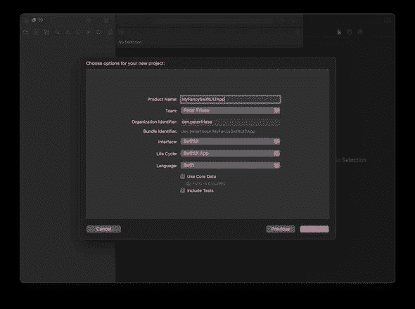
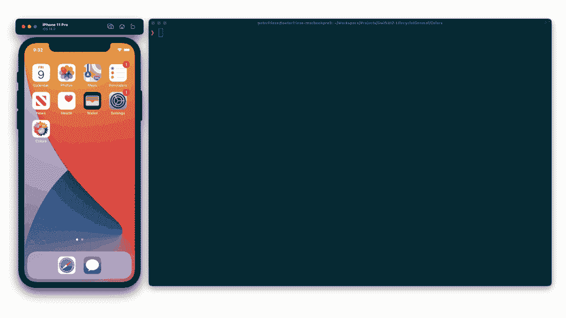

# SwiftUI 2 应用程序生命周期的终极指南

> 原文：<https://betterprogramming.pub/the-ultimate-guide-to-the-swiftui-2-application-life-cycle-e4358e27a92a>

## 再见 AppDelegate

图片基于[火箭](https://thenounproject.com/kavya261990/collection/space/?i=3437783)由 [Icongeek26](https://thenounproject.com/kavya261990) 上的[名词项目](https://thenounproject.com/)

长久以来，iOS 开发者一直将`AppDelegate`作为他们应用的主要入口。随着 SwiftUI2 在 WWDC 2020 上的发布，苹果引入了一个新的应用生命周期，它(几乎)完全废除了`AppDelegate`，为类似 DSL 的方法让路。

在本文中，我将讨论为什么引入这一变化，以及如何在新的或现有的应用程序中利用新的生命周期。

# 指定应用程序入口点

我们需要回答的第一个问题是“我们如何告诉编译器我们应用程序的入口点？” [SE-0281](https://github.com/apple/swift-evolution/blob/master/proposals/0281-main-attribute.md) 指定基于类型的程序入口点如何工作:

> “Swift 编译器会将注释有`@main`属性的类型识别为提供程序的入口点。标有`@main`的类型只有一个隐含的需求:声明一个静态的`main()`方法

创建新的 SwiftUI 应用程序时，该应用程序的`@main`类如下所示:

那么 SE-0281 中提到的静态`main()`函数在哪里呢？

事实证明，为了用户的方便，框架提供者可以(也应该)提供默认的实现。查看上面的代码片段，您会注意到`SwiftUIAppLifeCycleApp`符合`App`协议。Apple 提供了一个协议扩展，如下所示:

现在我们知道了——这个协议扩展提供了一个负责应用程序启动的默认实现。

由于 SwiftUI 框架不是开源的，我们看不到苹果是如何实现的，但是 [Swift Argument Parser](https://github.com/apple/swift-argument-parser) 是开源的，也使用这种方法。查看`ParsableCommand`的源代码，了解他们如何使用协议扩展来提供作为程序入口点的静态`main`函数的默认实现:

如果这一切听起来有点复杂，好消息是，在创建新的 SwiftUI 应用程序时，您实际上不必担心这一点:在创建您的应用程序时，只需确保在生命周期下拉列表中选择“SwiftUI 应用程序”，就大功告成了:

*创建新的 SwiftUI 项目*

让我们来看看一些常见的场景。

# 初始化资源/你最喜欢的 SDK 或框架

大多数应用程序需要在应用程序启动时执行几个步骤:获取一些配置值，连接到数据库，或者初始化框架或第三方 SDK。

通常，你会在你的`ApplicationDelegate`的`application(_:didFinishLaunchingWithOptions:)`方法中这样做。由于我们不再有应用程序委托，我们需要找到其他方法来初始化我们的应用程序。根据您的具体要求，这里有一些策略:

*   在你的主类上实现一个初始化器(参见[文档](https://docs.swift.org/swift-book/LanguageGuide/Initialization.html#ID205)
*   设置存储属性的初始值(参见[文档](https://docs.swift.org/swift-book/LanguageGuide/Initialization.html#ID206)
*   使用闭包设置默认属性值(参见[文档](https://docs.swift.org/swift-book/LanguageGuide/Initialization.html#ID232)

如果这些都不能满足你的需求，你可能需要一个`ApplicationDelegate`。一直读到最后，了解如何添加一个。

# 处理应用程序的生命周期

知道应用程序处于哪种状态有时很有用。例如，您可能希望在应用程序变为活动状态时获取新数据，或者在应用程序变为非活动状态并转换到后台时刷新任何缓存。

通常，你会在你的`ApplicationDelegate`上实现`applicationDidBecomeActive`、`applicationWillResignActive`或`applicationDidEnterBackground`。

从 iOS 14.0 开始，苹果提供了一个新的 API，允许以更优雅和可维护的方式跟踪应用程序的状态:`[ScenePhase](https://developer.apple.com/documentation/swiftui/scenephase)`。你的项目可以有多个场景，但是很可能你只有一个场景，用`[WindowGroup](https://developer.apple.com/documentation/swiftui/windowgroup)`表示。

SwiftUI 跟踪环境中场景的状态，您可以通过使用`@Environment`属性包装器获取当前值，然后使用`onChange(of:)`修饰符监听任何更改，从而使代码可以访问当前值:

值得注意的是，你也可以从应用程序的其他位置读取相位。当读取应用程序顶层的阶段时(如代码片段所示)，您将获得应用程序中所有阶段的汇总。值为`.inactive`意味着应用程序中没有任何场景处于活动状态。

当读取一个视图上的阶段时，您将收到包含该视图的阶段的值。请记住，此时您的应用程序可能包含具有其他阶段值的其他场景。关于场景阶段的更多细节，请阅读苹果的[文档](https://developer.apple.com/documentation/swiftui/scenephase)。

# 处理深层链接

以前，当处理深层链接时，您必须实现`application(_:open:options:)`并将传入的 URL 路由到最合适的处理程序。

有了新的应用程序生命周期模型，这变得容易多了。你可以通过将`onOpenURL`修改器附加到应用程序最顶层的场景来处理传入的 URL:

真正酷的是:你可以在你的应用程序中安装多个 URL 处理程序——使深度链接变得更加容易，因为你可以在最合适的地方处理传入的链接。

如果可能的话，你应该使用[通用链接](https://developer.apple.com/documentation/xcode/allowing_apps_and_websites_to_link_to_your_content)(或 [Firebase 动态链接](https://firebase.google.com/docs/dynamic-links)，它利用[iOS 应用](https://firebase.google.com/docs/dynamic-links/operating-system-integrations)的通用链接)，因为这些使用关联的域来创建你拥有的网站和你的应用之间的连接——这将允许你安全地共享数据。

但是，您仍然可以使用[自定义 URL 方案](https://developer.apple.com/documentation/xcode/allowing_apps_and_websites_to_link_to_your_content/defining_a_custom_url_scheme_for_your_app)链接到您的应用程序中的内容。

无论哪种方式，在您的应用程序中触发深层链接的简单方法是在您的开发机器上使用以下命令:

`$ xcrun simctl openurl booted <your url>`

演示:打开深层链接并继续用户活动

# 持续用户活动

如果你的应用使用`NSUserActivity`到[与](https://developer.apple.com/documentation/foundation/nsuseractivity) Siri、Handoff 或 Spotlight 集成，你需要处理用户活动的延续。

同样，新的应用程序生命周期模型通过提供两个修饰符使这变得更容易，这两个修饰符允许您广告一个活动并在以后继续它。

下面是一个片段，展示了如何宣传一项活动，例如，在详细信息视图中:

为了继续这个活动，您可以在顶级导航视图中注册一个`onContinueUserActivity`闭包，如下所示:

# 求助——以上都不适合我！

新的应用程序生命周期并不支持`AppDelegate`的所有回调。如果以上都不能满足你的需求，你可能需要一个`AppDelegate`。

您可能需要一个`AppDelegate`的另一个原因是，如果您使用任何第三方 SDK，它们利用[方法 swizzling](https://pspdfkit.com/blog/2019/swizzling-in-swift/) 将自己注入到应用程序生命周期中。[火情](https://firebase.google.com/)是一个[众所周知的案例](https://stackoverflow.com/a/62633158/281221)。

为了帮助您，Swift 提供了一种将`AppDelegate`的 conformer 与您的`App`实现:`@UIApplicationDelegateAdaptor`连接起来的方法。下面是它的使用方法:

如果您复制一个现有的`AppDelegate`实现，不要忘记删除`@main`属性——否则，编译器会抱怨有多个应用程序入口点。

# 结论

说完这些，我们再来讨论一下苹果为什么要做出这样的改变。我认为有几个原因:

SE-0281 明确声明设计目标之一是“提供一个更通用的轻量级机制，用于将程序的入口点委托给指定的类型。”

Apple 为处理应用程序生命周期而选择的基于 DSL 的方法与在 SwiftUI 中构建 UI 的声明式方法非常一致。使用相同的概念使事情更容易理解，并有助于新的开发人员。

总的来说，新的应用程序生命周期模型使实现应用程序启动变得更容易、更简单。

任何声明式方法的主要好处是:框架/平台提供者负责实现特定功能，而不是将实现特定功能的负担推给开发人员。如果有必要进行任何更改，在不破坏许多开发人员的应用程序的情况下发布这些更改会容易得多——理想情况下，开发人员不必更改他们的实现，因为框架会为您处理一切。

总的来说，新的应用程序生命周期模型使实现应用程序启动变得更容易、更简单。你的代码会更干净，更容易维护——如果你问我的话，这总是一件好事。

我希望这篇文章能帮助您理解新应用程序生命周期的来龙去脉。

感谢阅读！

# 进一步阅读

如果您想了解更多信息，请查看以下资源:

 [## Firebase 和新的 SwiftUI 2 应用程序生命周期

### 了解如何在 SwiftUI 2 应用程序中初始化 Firebase

medium.com](https://medium.com/firebase-developers/firebase-and-the-new-swiftui-2-application-life-cycle-e568c9f744e9)  [## 底色/颜色

### 这是 Colors 的源代码，这是一个示例应用程序，用于演示新的 SwiftUI 2 应用程序生命周期…

github.com](https://github.com/peterfriese/Colors)  [## 苹果/swift——进化

### 一种 Swift 语言功能，用于指定一种类型作为开始程序执行的入口点。而不是写…

github.com](https://github.com/apple/swift-evolution/blob/master/proposals/0281-main-attribute.md)  [## Apple 开发者文档

### 应用

developer.apple.com](https://developer.apple.com/documentation/swiftui/app)  [## Apple 开发者文档

### 允许应用程序和网站链接到您的内容

developer.apple.com](https://developer.apple.com/documentation/xcode/allowing_apps_and_websites_to_link_to_your_content)