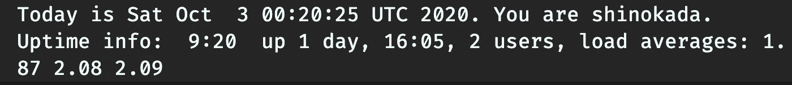
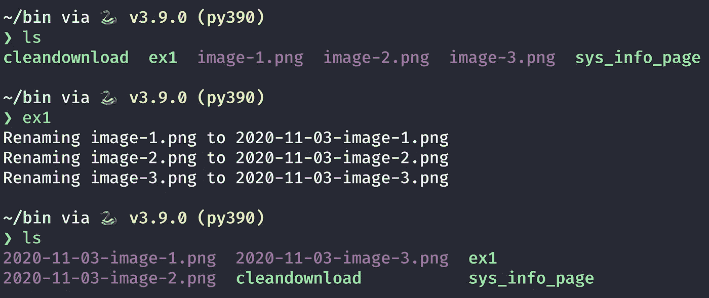

# Bash 脚本编程的终极程序员指南

> 原文：<https://betterprogramming.pub/the-ultimate-programmers-guide-to-bash-scripting-2d11d4e6e978>

## 深入探究 Bash 脚本，帮助您自动化任务


杰里米·毕晓普在 [Unsplash](https://unsplash.com?utm_source=medium&utm_medium=referral) 上的照片

[更新于 2021 年 2 月 18 日。代码更改为要点并添加了链接]

# 介绍

Bash 脚本允许您自动化命令行任务。比如看[这个视频](https://www.youtube.com/watch?v=PS5vBJELtj4)。该视频展示了如何使用 Bash 脚本自动创建 YouTube 频道。看完之后，你可能想创建自己的 YouTube 频道。再举一个例子，在这篇[文章](https://towardsdatascience.com/4-bash-script-helpers-to-get-more-done-4144046be13)中，我自动化了常见的终端任务。

在本文中，我们将介绍面向初学者的基本 Bash 脚本，并创建简单的可执行脚本。

让我们深入 Bash 脚本吧！

```
**Table of Contents**· [Introduction](#826d)
· [Setting Things Up](#c48e)
  ∘ [Mac](#dbce)
  ∘ [The bin directory](#9453)
· [VSCode Extensions](#280c)
· [Getting Started](#a9f0)
  ∘ [Shebang](#4537)
  ∘ [Comment](#16fc)
· [Variables](#e1fc)
  ∘ [Variable assignment](#5a38)
  ∘ [Environment variables](#1b60)
  ∘ [Internal variables](#3f49)
  ∘ [Assigning the command output to a variable](#8cef)
  ∘ [Built-in commands](#18b6)
· [Tests](#a6ca)
  ∘ [if statement](#d663)
  ∘ [Spaces Matter](#253a)
  ∘ [Test file expressions](#e615)
  ∘ [Test string expressions](#46bc)
  ∘ [Test integer expressions](#89ad)
  ∘ [Double parentheses](#f609)
· [How To Use if/else and if/elif/else Statements](#33be)
· [Double Brackets](#b994)
· [How To Use for Loops](#98d4)
  ∘ [Using a for loop to rename files](#2e94)
· [How To Use Parameters](#199f)
· [How To Accept User Input](#eff3)
· [Brace Expansion Using Ranges](#401b)
· [How To Use While Loops](#3492)
· [What Are Exit Status/Return Codes?](#5a36)
  ∘ [Checking the exit status](#9fb4)
· [How To Connect Commands](#7d76)
  ∘ [Logical operators and the command exit status](#0006)
  ∘ [Exit command](#c933)
  ∘ [Logical AND (&&)](#173c)
  ∘ [Logical OR (||)](#977b)
  ∘ [The semicolon](#16a4)
  ∘ [Pipe |](#c479)
· [Functions](#ebab)
  ∘ [Function parameters](#99c9)
· [Variable Scope](#f0b6)
  ∘ [Local variables](#94c5)
· [Function Exit Status](#6ed4)
· [Checklist](#0381)
· [Conclusion](#1343)
  ∘ [Newsletter](#2e8b)
  ∘ [References](#bd1d)
```

# 设置事物

## **Mac**

您可以检查您的 Bash 版本:

```
$ bash --version
GNU bash, version 3.2.57(1)-release (x86_64-apple-darwin19)
Copyright (C) 2007 Free Software Foundation, Inc.
```

让我们升级 Bash 版本:

```
$ brew install bash
```

您可以列出找到的所有可执行文件的实例。

```
$ which -a bash
/usr/local/bin/bash
/bin/bash
```

让我们检查一下新安装的版本:

```
$ /usr/local/bin/bash --version
GNU bash, version 5.0.18(1)-release (x86_64-apple-darwin19.5.0)
Copyright (C) 2019 Free Software Foundation, Inc.
...
```

让我们看看您使用的是哪个版本的 Bash:

```
$ which bash
/usr/local/bin/bash
# or
$ type bash
bash is /usr/local/bin/bash
```

如果这不起作用，您需要在您的`~/.bashrc`(或者对于 Zsh 用户是`~/.zshrc`)中导出 Bash 路径。

```
export PATH="/usr/local/bin:$PATH"
```

打开一个新的终端选项卡或重启终端，并检查 Bash 版本。

```
$ bash --version
GNU bash, version 5.0.18(1)-release (x86_64-apple-darwin19.5.0)
Copyright (C) 2019 Free Software Foundation, Inc.
...
```

将`/usr/local/bin/bash`添加到`/etc/shells`作为可信外壳。

```
$ vim /etc/shells
# List of acceptable shells for chpass(1).
# Ftpd will not allow users to connect who are not using
# one of these shells./bin/bash
/bin/csh
/bin/ksh
/bin/sh
/bin/tcsh
/bin/zsh
/usr/local/bin/bash
```

在 Bash 脚本中检查 Bash 版本。稍后我们将学习如何运行这个脚本。

```
#!/usr/local/bin/bash
echo $BASH_VERSION
```

**Mac gotcha** Mac 使用 Zsh 作为默认 shell。例如，`echo $BASH_VERSION`不会在终端上工作。如果你使用的是`#!/bin/bash`，它可以在 shell 脚本中工作。

**在 Mac 上运行 Linux** 你可以使用 [Multipass](https://multipass.run/) 在 Mac/Windows 上运行 Ubuntu。[这篇文章](https://codeburst.io/run-an-instant-ubuntu-vms-on-mac-windows-linux-ff8421e25db0)会帮你入门。另一种选择是使用 Docker 和 Linux 映像。

## **垃圾箱目录**

让我们创建一个目录，并将路径添加到终端配置文件(`.bashrc`、`.zshrc`)。通过这样做，你可以以`myscript`而不是`./myscript`的身份运行你的脚本。

在您的主目录中，创建`bin`目录:

```
$ mkdir bin
```

在终端配置文件中添加该目录的路径。(或者`.bashrc`或者`.zshrc`)

```
export PATH="$PATH:$HOME/bin"
```

重新加载配置文件:

```
# for .zshrc
$ . ~/.zshrc 
# or
$ source ~/.zshrc
# for .bashrc
$ . ~/.bashrc
# or
$ source ~/.bashrc
```

我们将在这个`bin`目录中创建我们所有的脚本。

**多遍提示** 您可以将本地目录挂载到您的[多遍实例](https://codeburst.io/run-an-instant-ubuntu-vms-on-mac-windows-linux-ff8421e25db0#5dc0)中，并导出 `[~/.bashrc](https://codeburst.io/run-an-instant-ubuntu-vms-on-mac-windows-linux-ff8421e25db0#95ba)`中的`[PATH](https://codeburst.io/run-an-instant-ubuntu-vms-on-mac-windows-linux-ff8421e25db0#95ba)` [。](https://codeburst.io/run-an-instant-ubuntu-vms-on-mac-windows-linux-ff8421e25db0#95ba)

# VSCode 扩展

如果您使用 VSCode，我推荐 shellcheck [2]和 shell-format [3]扩展。shellcheck 为 Bash、Zsh 和 sh 的 shell 脚本添加了一个 linter。shell-format 是一种 shellscript 文档格式。

# 入门指南


[布拉登·科拉姆](https://unsplash.com/@bradencollum?utm_source=medium&utm_medium=referral)在 [Unsplash](https://unsplash.com?utm_source=medium&utm_medium=referral) 上拍摄的照片

使用一个`.sh`扩展是一个惯例，但是你不需要使用一个扩展。创建一个名为`myscript`的文件:

```
$ cd ~/bin
# create a empty file
$ > myscript
# or
$ touch myscript
```

然后添加以下内容:

在网上试试这个。

我们需要使文件可执行。在终端中:

```
$ chmod 755 myscript
```

如果您已经在终端配置文件(`~/.bashrc`或`~/.zshrc`)中添加了`bin`目录，那么您可以像下面这样运行它:

```
$ myscript
Welcome to Shell Scripting.
```

## **射棒**

脚本开头的`#!`语法表示在 UNIX/Linux 操作系统下执行的解释器。

```
#!/bin/bash
echo "I use the newest bash interpreter."
---
#!/bin/csh
echo "use csh interpreter."
---
#!/bin/ksh
echo "use ksh interpreter."
---
#!/bin/zsh
echo "use zsh interpreter."
```

使用`which -a bash`的一个输出。如果您的 Bash 不在`/bin`目录中，您也可以使用`#!/usr/bin/env bash`。

## **评论**

使用`#`注释掉一行。

```
#!/bin/bash
# This is a bash comment.
echo "Hi"
```

# 变量

Bash 变量是区分大小写的，用大写字母命名是一种惯例。但是您可以自由使用小写名称或混合大小写。变量名只能包含字母(`a-z`或 A-Z)；数字(`0-9`)；或者以字母开头的下划线字符(`_`)。不要以数字开头，并且在`=`符号前后没有空格。

请注意，一些网站建议使用全小写的变量名，因为系统变量名通常都是大写的。

```
# valid
FIRSTLETTERS="ABC"
FIRST_THREE_LETTERS="ABC"
firstThreeLetters="ABC"
MY_SHELL="bash"
my_another_shell="my another shell"
My_Shell="My shell"# Invalid
3LETTERS="ABC"
first-three-letters="ABC"
first@Thtree@Letters="ABC"
ABC = "ABC "
MY_SHELL = "bash"
My-SHELL="bash"
1MY_SHELL="My shell"
```

当在变量前/后使用字母时，使用`{}`:

在网上试试这个。

## **变量赋值**

除了`$`、```和`\`之外，双引号保留引号内的文字值。美元符号和反斜杠在双引号中保持其特殊含义，反斜杠`\`是转义字符。

单引号保留引号内的文字值。

在网上试试这个。

## **环境变量**

Linux 环境变量将信息存储在系统中。全局变量也称为环境变量。

您可以在终端中找到一些环境变量:

```
$ env
# or
$ printenv
```

您可以在脚本中使用这些变量:

```
#!/bin/bash
echo $SHELL, $USER, $HOME # /bin/zsh, shinokada, /Users/shinokada
```

## **内部变量**

有 Bourne shell 保留变量、Bash 保留变量和特殊 Bash 变量。[1]

## **将命令输出分配给变量**

您可以使用`$(command)`将命令输出存储在一个变量中。例如，您可以输出`ls -l`:

```
#!/bin/bash
# file name ex1
LIST=$(ls -l)
echo "File information: $LIST"
```

在您的终端中运行它(不要忘记使文件可执行)。

```
$ ex1
File information total 40
-rwxr-xr-x  1 shinokada  staff   272 Oct 27 08:52 ex1
-rwxr-xr-x  1 shinokada  staff     0 Oct 26 14:14 ex2
...
```

下面将把时间和日期、用户名和系统正常运行时间保存到日志文件中。`>`是重定向之一，它会覆盖一个文件。您可以使用`>>`将输出附加到文件中。

```
#!/bin/bashDATE=$(date -u) # date and time, -u option gives the UTC
WHO=$(whoami) # user name
UPTIME=$(uptime) # shows how long the system has been running
echo "Today is $DATE. You are $WHO. Uptime info: $UPTIME" > logfile
```



以上脚本的输出。图片由作者提供。

## **内置命令**

Shell 内置命令是可以在 shell 中运行的命令。您可以找到内置命令:

```
$ compgen -b | sort
-
.
:
[
alias
autoload
bg
bindkey
break
...
```

您可以使用`type`来查找命令的种类:

```
$ type cd
cd is a shell builtin
```

`which`命令返回文件路径名。它只对可执行程序有效:

```
$ which ls
/usr/bin/ls
```

当您将`which`命令用于替代实际可执行程序的一些内置或别名时，它要么不响应，要么返回一条错误消息:

```
# no response
$ which cd
$ which umask
$ which alert
```

你可以通过`man builtin`找到更多关于`builtin`的细节:

```
$ man builtin
BUILTIN(1)  BSD General Commands ManualNAME
     builtin, !, %, ., :, @, {, }, alias, alloc, bg, bind, bindkey,
     break, breaksw, builtins, case, cd, chdir, command, complete, 
     continue, default, dirs, do, done, echo, echotc, elif, else, end, 
     ....
```

# 试验

test 命令执行各种检查和比较，您可以将它与`if`语句一起使用。

## **if 语句**

`then`关键字跟在`if`语句之后:

```
if [ condition-for-test ]
then
  command
  ...
fi
```

您可以在一行中使用`if`和`then`，使用`;`终止`if`语句:

```
if [ condition-for-test ]; then
  command
  ...
fi
```

(后面会有更多关于`if`的说法。)

通常，当变量是一个单词时，比较使用双引号和单引号:

在网上试试这个。

单引号在某些情况下不起作用:

在网上试试这个。

如果没有双引号，可能会有问题:

在网上试试这个。

在第一个测试中，有四个参数:来自`$VAR1`的两个参数，其中有`"my"`和`"var"`，然后是`=`和`"my var"`。

简而言之，总是使用双引号。

## 空间很重要


太空照片由[杰瑞米·托马斯](https://unsplash.com/@jeremythomasphoto?utm_source=medium&utm_medium=referral)在 [Unsplash](https://unsplash.com?utm_source=medium&utm_medium=referral) 拍摄

如果在`=`符号前后没有空格，则表达式被视为一个单词，然后被视为`true`。

在网上试试这个。

记住在`[`和变量名以及等式操作符、`=`或`==`之间必须有一个空格。如果您遗漏了这里的任何空格，您可能会看到类似`‘unary operator expected’ or missing `]’`的错误。

```
# correct, a space before and after = sign
if [ $VAR2 = 1 ]; then
    echo "\$VAR2 is 1."
else
    echo "It's not 1."
fi# wrong, no space before and after = sign
if [ $VAR2=1 ]; then
    echo "$VAR2 is 1."
else
    echo "It's not 1."
fi
```

## **测试文件表达式**

下表显示了测试文件的表达式。

你可以通过使用`man test`找到所有的选项。

当表达式为`true`时，测试命令返回退出状态`0`，当表达式为`false`时，返回状态`1`。

在网上试试这个。

## **测试字符串表达式**

下表显示了测试字符串的表达式。

```
#!/bin/bashSTRING=""if [ -z "$STRING" ]; then
  echo "There is no string." >&2 
  exit 1
fi# Output
# There is no string.
```

`>&2`将错误消息重定向至标准错误:请读取`exit 1`的退出状态。

## **测试整数表达式**

下表显示了测试整数的表达式。对于符合 POSIX 的使用表达式的左边，对于 Bash 使用右边。

## **双括号**

您可以使用双括号`((... ))`进行算术展开和求值。

在网上试试这个。

# 如何使用 if/else 和 if/elif/else 语句

以下是`if...else`和`if...elif...else`语句的示例。

`if/else`语句的结构如下:

```
if [ condition-is-true ]
then
  command A
else
  command B
fi
# or
if [ condition-is-true ]; then
  command A
else
  command B
fi
```

示例:

在网上试试这个。

`if/elif/else`语句的结构如下:

```
if [ condition-is-true ]
then
  command A
elif [ condition-is-true ]
then
  command B
else
  command C
fi
# or
if [ condition-is-true ]; then
  command A
elif [ condition-is-true ]; then
  command B
else
  command C
fi
```

示例:

在网上试试这个。

# 双括号


双彩虹。由[大卫·布鲁克·马丁](https://unsplash.com/@dbmartin00?utm_source=medium&utm_medium=referral)在 [Unsplash](https://unsplash.com?utm_source=medium&utm_medium=referral) 上拍摄的照片。

如果变量是一个单词，双括号条件复合命令`[[ condition-for-test ]]`不需要双引号；但是一个方括号`[ condition-for-test ]`需要一个变量的双引号。但是使用双引号是一个很好的习惯。

与单支架相比，双支架具有额外的功能。对于正则表达式，可以使用逻辑`&&`和`||`和`=~`。

在网上试试这个。

在网上试试这个。

# 如何使用 for 循环

`for`循环用于对序列进行迭代，其结构如下:

```
for VARIABLE_NAME in ITEM_1 ITEM_N
do
  command A
done
```

示例:

在线试试这个 Bash 脚本。

您可以按如下方式使用变量:

在线试试这个 Bash 脚本。

## **使用** `**for**` **循环重命名文件**

```
#!/bin/bashIMGS=$(ls *png)
DATE=$(date +%F)for IMGin $IMGS
do
  echo "Renaming ${IMG} to ${DATE}-${IMG}"
  mv ${IMG} ${DATE}-${IMG}
done
```

`+%F`中的`+`符号表示用户自定义的格式，`%F`表示完整的日期。关于`date`的更多细节，请使用`man date`。



以循环为例。图片由作者提供。

# 如何使用 P **参数**

Bash 脚本可以接受多个参数，如下所示:

```
$ scriptname param1 param2 param3
```

`param1`至`param3`称为*位置参数。*可以用`$0`、`$1`、`$2`等。(经常我们用`${1}`、`${2}`等)输出参数。例如:

```
#!/bin/bashecho "'\$0' is $0"
echo "'\$1' is $1"
echo "'\$2' is $2"
echo "'\$3' is $3"
```

产出:

```
$ ex1 param1 param2 param3
'$0' is /Users/shinokada/bin/ex1
'$1' is param1
'$2' is param2
'$3' is param3
```

`$0`输出文件名，包括路径。

要访问所有参数，您可以使用`$@`。

```
#!/bin/bashfor PET in $@
do
  echo "My pet is: $PET"
done
```

使用此脚本:

```
$ ex1 cat dog gorilla
My pet is: cat
My pet is: dog
My pet is: gorilla
```

# 如何接受用户输入

用户输入被称为*标准输入。*你可以使用带有`-p`(提示)选项的`read`命令来读取用户输入。它将输出提示字符串。`-r`选项不允许反斜杠转义任何字符。

```
read -rp "PROMPT" VARIABLE
```

示例:

```
#!/bin/bashread -rp "Enter your programming languages: " PROGRAMMESecho "Your programming languages are: "
for PROGRAMME in $PROGRAMMES; do
    echo "$PROGRAMME "
done
```

运行脚本:

```
$ ex1                     
Enter your programming languages: python js rust 
Your programming languages are: 
python 
js 
rust
```

# 使用范围进行大括号扩展

使用范围的大括号展开是一个序列表达式。您可以将它用于整数和字符。

```
$ echo {0..3}
$ echo {a..d}
# output: 
# 0 1 2 3
# a b c d
```

您可以在`for`循环中使用这种括号扩展:

```
#!/bin/bashfor i in {0..9}; 
do 
  touch file_"$i".txt; 
done
```

这将创建具有不同修改时间的不同文件名。

```
$ ls -al
-rw-r--r--    1 shinokada  staff      0 Jan 27 08:25 file_0.txt
-rw-r--r--    1 shinokada  staff      0 Jan 27 08:25 file_1.txt
-rw-r--r--    1 shinokada  staff      0 Jan 27 08:25 file_2.txt
-rw-r--r--    1 shinokada  staff      0 Jan 27 08:25 file_3.txt
-rw-r--r--    1 shinokada  staff      0 Jan 27 08:25 file_4.txt
...
```

# 如何使用 While 循环

当表达式为`true`时，`while`循环继续执行代码行。

```
#!/bin/bashi=1
while [ $i -le 5 ]; do
  echo $i
  ((i++))
done
```

输出:

```
1
2
3
4
5
```

# 什么是退出状态/返回代码？


[塔里克·黑格](https://unsplash.com/@tar1k?utm_source=medium&utm_medium=referral)在 [Unsplash](https://unsplash.com?utm_source=medium&utm_medium=referral) 上拍摄的照片

每个命令返回一个范围从 0-255 的退出状态。`0`代表成功，除了`0`之外的任何东西都代表错误。我们可以用这个来检查错误。

找到更多退出代码。

## **检查退出状态**

`$?`包含之前执行的命令的返回代码:

```
$ ls ./no/exist
ls: cannot access './no/exist': No such file or directory
$ echo "$?"
2
```

让我们在`if`语句中使用退出代码:

在 if 语句中使用退出代码。在线试试这个 Bash 脚本。

`-c 1`发送一个请求包后停止。这里我们检查退出状态是否等于`0`。

输出:

```
$ ex1
PING google.com (216.58.197.206): 56 data bytes
64 bytes from 216.58.197.206: icmp_seq=0 ttl=114 time=11.045 ms--- google.com ping statistics ---
1 packets transmitted, 1 packets received, 0.0% packet loss
round-trip min/avg/max/stddev = 11.045/11.045/11.045/0.000 ms
**google.com reachable.**
```

# 如何连接命令

## 逻辑运算符和命令退出状态

一个命令输出一个退出状态，我们可以用`&&`和`||`来决定下一步的动作。

## 退出命令

您可以使用`exit`明确定义返回代码。

```
exit 0
exit 1
exit 2
etc.
```

示例:

```
#!/bin/bashHOST="google.com"
ping -c 1 $HOST  
if [ "$?"" -ne "0" ]
then
  echo "$HOST unreachable."
  exit 1
fi
exit 0
```

因为该脚本显式返回退出状态代码，所以您可以调用另一个 shell 脚本或命令。

```
$ ex1 && ls          
...
2020-10-03-image-1.png  ex1     myscript1
2020-10-03-image-2.png  ifstatement  
2020-10-03-image-3.png  logfile
```

## **逻辑与(& & )**

如果第一个命令返回`0`状态码，则第二个命令运行，这意味着它成功了。

```
mkdir /tmp/bak && cp test.txt /tmp/bak
```

## **逻辑或(||)**

如果第一个命令返回非`0`状态代码，则第二个命令运行，这意味着它失败了。

```
cp test.txt /tmp/bak/ || cp test.test.txt /tmp
```

**例题**

如果 ping 命令成功，echo 语句将运行。

```
#!/bin/bashhost="google.com"
ping -c 1 $host && echo "You can reach ${host}."
```

如果 ping 命令失败，将运行 echo 语句。

```
#!/bin/bashhost="google.com"
ping -c 1 $host || echo "You can't reach ${host}."
```

## **分号**

分号不是逻辑运算符，但是您可以使用它来分隔命令，以确保它们都得到执行。

```
cp text.txt /tmp/bak/ ; cp test.txt /tmp
# This is the same as
cp text.txt /tmp/bak/  
cp test.txt /tmp
```

## 烟斗|


照片由[郭锦恩](https://unsplash.com/@spacexuan?utm_source=medium&utm_medium=referral)在 [Unsplash](https://unsplash.com?utm_source=medium&utm_medium=referral) 上拍摄

`|`两侧的命令在各自的子外壳中运行，并且同时启动。

第一个命令将目录更改为主目录，并列出文件和目录。

第二个命令只打印命令执行的目录。

```
$ echo "$(cd ~ && ls)"
$ echo "$(cd ~ | ls)"
```

# 功能

在 Bash 脚本中，您必须在使用函数之前定义它。您可以使用或不使用`function`关键字来创建函数。

```
function function-name(){}
# or
function-name(){}
```

当你调用一个函数时，只使用不带`()`的函数名。

在线尝试这个 Bash 脚本。

函数可以调用其他函数。

在线试试这个 Bash 脚本。

在调用`hello`函数之前声明了`now`函数。如果在调用`hello`函数后定义`now`函数，就不行了。

```
#!/bin/bash
# this won't work
function hello(){
  echo "Hello!"
  now
}
hello
function now(){
  echo "It's $(date +%r)"
}
```

`date +%r`以 05:04:12 PM 的格式输出。

## **功能参数**

正如我们在脚本参数一节中所讨论的，`$0`不是函数名，而是脚本本身。`$1`是函数的第一个参数。

```
#!/bin/bash
function fullname(){
  echo "$0"
  echo "My name is $1 $2"
}
fullname John Doe# Output
# /Users/shinokada/bin/ex1
# My name is John Doe
```

`$@`包含所有的参数。

在线试试这个 Bash 脚本。

# 变量作用域

默认情况下，变量是全局的，您必须在使用它们之前定义它们。在顶部声明所有的全局变量是一个好习惯。

在线试试这个 Bash 脚本。

## 局部变量

您可以使用`local`关键字访问函数中的局部变量。只有函数可以有局部变量。

在线试试这个 Bash 脚本。

# 功能退出状态

您可以在函数中显式返回退出状态:

```
return 0
```

隐式返回函数中执行的最后一个命令的退出状态。有效代码范围为 0-255。`0`表示成功，`$?`表示退出状态。

```
$ my_function
$ echo $?
0
```

您可以在`if`语句中使用`$?`:

如果没有争论的话，上面的脚本默认支持`/etc/hosts`。如果你给出一个参数，它会检查它是否是一个文件。如果是一个文件，它会在`/tmp`目录下创建一个副本。

`$$`是[脚本本身的进程 ID(PID)](https://tldp.org/LDP/abs/html/internalvariables.html)。每次运行脚本时，PID 都是不同的。因此，如果您一天不止一次运行该脚本，它将非常有用。

`basename ${1}`返回参数中的文件名。比如`/etc/hosts`的`basename`就是`hosts`。

`date +%F`的一个例子就是`2020-10-04`。

```
$ ls /tmp$ ex1           
Backing up /etc/hosts to /tmp/hosts.2020-10-04.77124
Backup succeeded.
$ ls /tmp
hosts.2020-10-04.77124
```

**退出和返回关键字**

`return`将导致当前函数超出范围，而`exit`将导致脚本在被调用的地方结束。

# 清单

*   从一个 shebang 开始。
*   描述脚本的目的
*   首先声明所有的全局变量
*   在全局变量之后声明所有的函数
*   在函数中使用局部变量。
*   在函数之后写主体
*   在函数、`if`语句和脚本末尾使用明确的退出状态代码

# 结论

我们讨论了设置、变量、测试、`if`语句、双括号、`for`循环、参数、用户输入、`while`循环、退出状态、逻辑运算符、函数和变量范围。

我希望这篇文章为您学习 Bash 脚本的下一步打下基础。各位编码愉快。

**通过** [**成为**](https://blog.codewithshin.com/membership) **会员，可以完全访问媒体上的每一个故事。**


[https://blog.codewithshin.com/subscribe](https://blog.codewithshin.com/subscribe)

# 参考

1.  [变量](https://tldp.org/LDP/Bash-Beginners-Guide/html/sect_03_02.html)，[内部变量](https://tldp.org/LDP/abs/html/internalvariables.html)
2.  [外壳检查](https://marketplace.visualstudio.com/items?itemName=timonwong.shellcheck)
3.  [shellcheck wiki](https://github.com/koalaman/shellcheck/wiki)
4.  [壳格式](https://marketplace.visualstudio.com/items?itemName=foxundermoon.shell-format)
5.  [痛击黑客维基](https://wiki.bash-hackers.org/start)
6.  [高级 Bash 脚本指南](https://tldp.org/LDP/abs/html/index.html)

[](https://medium.com/better-programming/13-fantastic-learning-tools-and-resources-for-bash-scripting-51a6de98015c) [## 13 个精彩的 Bash 脚本学习工具和资源

### 您将每天使用的替代 Bash 脚本工具

medium.com](https://medium.com/better-programming/13-fantastic-learning-tools-and-resources-for-bash-scripting-51a6de98015c) [](https://medium.com/better-programming/27-simple-bash-scripting-tips-for-beginners-d6764c977546) [## 初学者的 27 个简单 Bash 脚本技巧

### 不要害怕 Bash 脚本。看完这些提示会更容易

medium.com](https://medium.com/better-programming/27-simple-bash-scripting-tips-for-beginners-d6764c977546) [](https://towardsdatascience.com/comparing-sh-bash-ksh-and-zsh-speed-82a72bbc20ed) [## 比较上海、巴什、KSH 和 ZSH 的速度

### 获胜者去…击鼓

towardsdatascience.com](https://towardsdatascience.com/comparing-sh-bash-ksh-and-zsh-speed-82a72bbc20ed)