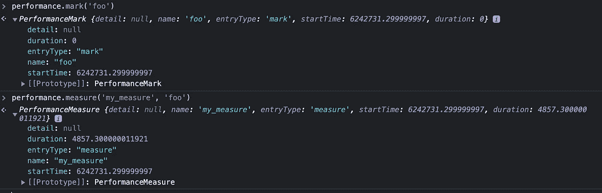
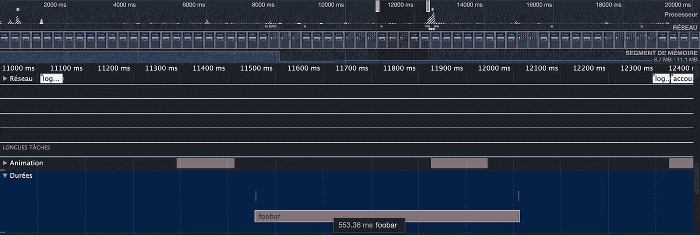
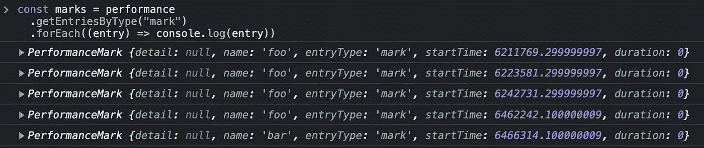

# 探索未被充分利用的 Web 性能 API

> 原文：<https://betterprogramming.pub/the-underused-web-performance-api-9eb9946ac30d>

## 一个使 web 性能分析更加简单的 API


照片由[马克斯·本德](https://unsplash.com/@maxwbender?utm_source=medium&utm_medium=referral)在 [Unsplash](https://unsplash.com?utm_source=medium&utm_medium=referral) 拍摄

> 这篇文章是处理未被充分利用的 [Web 性能 API](https://developer.mozilla.org/en-US/docs/Web/API/Performance) 的[系列文章的一部分。](https://medium.com/@chamerling/list/web-performance-aea332cb8386)
> 
> 在这第一篇文章中，我将介绍这个强大的 API，所有的 Web 开发人员都可以使用，不需要安装任何东西。
> 
> 在接下来的文章中，我们将更详细地讨论，试图用更具体的例子来说明为什么不更深入地创建可重用的和准备好投入生产的代码和组件。


克里斯托夫·哈默林

## 网络表演系列

[时间起点是一个标准时间，被认为是当前文档生命周期的开始](https://medium.com/@chamerling/list/web-performance-series-aea332cb8386#the_time_origin))。

在上面的例子中使用其中一个没有什么大不了的，但是在调试时，获得页面时间原点的毫秒数比获得自 1970 年 1 月 1 日以来的毫秒数更容易阅读。(告诉我你是否可以轻松处理最新的一个，而无需将其转换为更具可读性的内容。)

Web Performance API 有趣的部分不是关于`now()`，而是您可以使用其他特性做和构建的所有事情。我们再深入一步，玩玩`measure()`函数。它允许我们做同样的事情，即处理时差，但采用了更灵活的方法，如下所示:

```
performance.mark('foo')
// do something
const diff = performance.measure('my_measure', 'foo')
```

当然，你猜对了！您可以创建一个 [PerformanceMeasure](https://developer.mozilla.org/en-US/docs/Web/API/PerformanceMeasure) ，方法是给出您之前使用`performance.mark(markName)`创建的标记名称，因此您可以在代码中的任何地方使用性能度量，而不必向下传递`start`变量。`diff`变量现在包含了一个`PerformanceMeasure`对象，它包含了比两个时间戳之间的差异更多的信息:



您也可以通过给定开始和结束标记名称来创建两个标记之间的度量:


这看起来很容易使用，然后你可以在代码的几个地方使用它，在某个地方创建第一个标记，在另一个地方创建第二个标记，然后通过知道它们的名称来测量你选择的标记之间的距离。进入 web 性能的巨大世界是非常容易的。

更好的是，您现在可以切换您的浏览器开发工具，并检查您的应用程序中正在发生什么。您对`mark()`和`measure()`的每次调用都可以在性能记录中找到，如下所示:



performance.measure('foobar '，' foo '，' bar ')

这是奖金。您可以将性能日志下载为一个文件，并在以后打开它们进行进一步的分析。您创建的所有标记和度量也可以在这里找到！

让我们用精彩的性能 API 更进一步，和[性能观察者](https://developer.mozilla.org/en-US/docs/Web/API/PerformanceObserver)一起玩吧！

如前所述，能够从标记中创建度量是很好的，但是它有点静态。使用 performance observers 允许您进行更复杂的性能分析，比如实时收集您标记或测量的所有内容，对其进行处理，并将其发送到另一个地方(例如，收集一些监控数据的服务，应用程序的另一部分，等等。)

这个 API 使用起来很简单:创建一个带有回调的观察器，一旦您选择的新性能数据可用，就会调用这个回调。通过告诉观察器观察什么来启动它。代码如下:

```
try {
  const po = new PerformanceObserver((list) => {
    for (const entry of list.getEntries()) {
      // Do anything you want with the performance entry you observe
      // Here we deal with marks as it is what we tell to observe below.
      console.log(entry.toJSON());
    }
  });
  po.observe({ type: 'mark', buffered: false });
} catch (e) {
  // Do nothing if the browser doesn't support this API.
}
```

如果“实时”对您来说不是什么有用的东西，您还可以查询 Performance API 并通过使用`getEntries`或`getEntriesByType`来检索数据。

```
const marks = performance
  .getEntriesByType("mark")
  .forEach((entry) => console.log(entry))
```



这里有几个注意事项:

1.  正如您所看到的，性能标记名称不必是唯一的，但是如果您使用与您的应用程序相关联的命名约定，那就更好了。这有助于避免与您使用的任何库或框架发生冲突(想象每个人都使用‘start’和‘end’用上面的代码获取条目并从列表中进行一些计算可能会产生不一致的东西)。
2.  请记住，您创建的标记和度量将保留在这里，直到您重新加载页面、条目缓冲区已满，或者您使用`clearMarks`或`clearMeasures`请求一些清理。

在本文中，我们开始深入研究性能标记、度量、观察者和记录，展示了它的易用性以及它是如何打开 web 性能分析之门的。在下一篇文章中，我们将实现现实世界和生产就绪的代码和组件来收集您的应用程序中的指标。