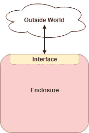

# 通用函数

> 原文：<https://betterprogramming.pub/the-universal-function-2e3b3fa063e6>

## 关于 JavaScript、函数和函数式编程的思考


由[杰佛森·桑多斯](https://unsplash.com/photos/fCEJGBzAkrU)在 [Unsplash](https://unsplash.com/) 上拍摄的照片

在代码块的层次之上——在代码块中，使用循环和条件语句(如`for()`和`if()`规则)进行流控制——是函数。

就像吉他弹奏中的和弦一样，理解函数既是基本编码的入口，也是掌握的关键。

函数是如此重要，因为它是我们在软件开发中如何应对复杂性的最基本的表现。

我将把这个基本的东西叫做*外壳和接口*。



外壳和接口

这种结构在整个堆栈、分层和微服务架构、系统和开发运维中反复出现。无论你走到哪里，当我们面对复杂性时，它都会突然出现。

**这是将解决方案分解成包含其内部复杂性的更小的离散元素，然后通过接口相互交互来解决更大问题的本质。**

## 函数式编程

当我们考虑*函数式编程* (FP)时，那么，简单的问题应该是:如何最好地使用函数来分解系统以管理复杂性？

我相信关键是始终记住(当我们写代码和考虑设计方法时)我们在使用功能时应用基本的软件设计。

该功能是一个*工具*来应用可靠的软件设计原则。

记住，也就是说，工具*服务于*原理。(通过掌握这一点，我们可以掌握 FP 的工具，而不会被时尚所吸引。)

这种技能在我们构建软件时会接触到的所有东西中都有体现:函数、对象、包、模块、远程 API。

# 内部设计，外部架构

函数允许我们把软件分成内部和外部。这是普遍的功能。

函数是我们如何在软件开发中解决复杂性的一些基本问题的表现。

所以我们可以孤立的思考一下功能的*内部设计*，然后再到更高的层次，把功能的关系当做*外部架构来思考。*

在现实世界的应用程序中，函数之间的相互关系是复杂的。您希望能够在尽可能远离实现的逻辑层次上考虑该架构。

# 外壳和接口

函数的基础很简单:它是一段可调用的代码，接受 0-n 个参数，并可能返回值。

但是在那个简单的想法里是*外壳的力量。*函数内部的代码与其他代码隔离，对代码的访问通过其签名(又名，其 API，又名，其*接口)来控制。*

事实证明，这与我们使用对象(封装称为封装)、模块/包以及远程 API(如 RESTful 服务)的目的是一样的。

在考虑设计时，这个概念有时被称为*关注点分离。*有了这个想法，我们将重点放在概念复杂性的管理上。这个概念框架在函数中表现为可变上下文的隔离。

# 能见度

在 JavaScript 中，术语*上下文*和*范围*被明确定义为*。*想法是这样的:哪些变量是可见的(作用域)，解析`this`关键字的对象是什么(上下文)？

(当我指“范围”时，我经常使用“上下文”哦好吧。重要的是理解这些东西是如何工作的。)

归结起来就是*可变能见度。*

可变可见性有两个关键方面:

*   信息隐藏:我在函数中声明的东西只有在那里才是可见的。
*   **变量范围:**在我的函数中，总共有哪些变量是可见的？

# 信息隐蔽

除了推入全局范围的未修改的变量(没有显式声明的变量名)之外，我们在函数中定义的所有内容仅对该函数及其嵌套的子级可见。

在 JS 中，我们有三种选择:var、let 和 const。我这里大概要追那只兔子四段。

`var`声明被“提升”到函数参考框架，也就是说，无论在哪里声明，它们对整个函数都是可见的。这是最不可取的，因为在编写代码时，我们想要尽可能小的内存占用，但仍能实现目标。

(话虽这么说，我还是用 var，我觉得还好。通常，一个变量确实存在于整个函数体中——通常，在函数的头部定义这些变量。

`let`声明包含在当前代码块中。所以，我们可以用`let`把变量的范围细化到循环或者 if 块之类的。这很好，因为它保持了较小的影响范围。

`const`在影响区域方面的行为类似于`let`，但是增加了不允许变量被重新赋值的额外限制。常量是一个很好的选择，因为它进一步约束了变量，并在考虑代码如何工作时限制了变量。

# 可变地平线

我们知道我们定义的变量在函数及其块中是如何可见的。函数的变量范围中还有另外两个重要的特性:全局变量和“词法范围”变量。

全局变量是不言自明的:它们存在于应用程序的任何地方。通常，它们只是一个错误或一个坏主意。然而，在某些情况下(比如在 React/Angular/Vue 中提供一个中央存储)，它们是值得的。

在任何情况下，你的函数都可以看到全局变量。小心名称冲突！

# 词法范围的变量

我对“词法范围”这个名字很失望，因为它看起来很复杂，会让人无法理解。这确实是 JS 函数的一个简单但重要的特性——在另一个函数中声明的函数可以访问包含的函数变量。

我喜欢“嵌套函数可见性”这个名字(但是没人问我)。

词法范围非常有用。它的基本含义如下:

词汇范围

但是这对于具有高阶函数(尤其是作为参数的函数)和匿名内联函数的函数式编程有着更重要的意义。让我们深入研究一下。

# 函数式编程

函数式编程(FP)实际上仅仅意味着考虑软件的结构，强调功能作为排序原则。就对象而言，这类似于面向对象的编程。

函数式编程的细节围绕着如何最好地部署函数作为组织原则。

这主要意味着将函数作为可以传递的离散功能块来使用，从而强调编程中所谓的*声明性*方面。

例如，FP 没有定义对集合进行操作的循环，而是定义了一个应用于集合的函数。

这通常会减少代码行的数量，并且可以( *can)* 提高可读性，因为与“命令式”循环修改代码相比，使用类似`myCollection.reduce(x => x > 10)`的调用确实非常简洁。

# 一级功能:JS 超能力

JS 如此成功的一个重要原因是它在功能上的灵活性。它从一开始就支持函数引用(即作为“数据”的函数)和匿名函数。

函数式编程最明显的例子是将匿名函数作为参数传递。

`foo(function(x){ return x+10 }`

在上面的例子中，我们调用了`foo()`函数，并传入了另一个内联定义的函数。这是一种有效的编码形式，因为它允许代码的作者和读者将功能组合到语句中。

正是这种事情刺激了“胖箭头”语法的引入。

`foo(x => x+10)`

完成同样的事情。

在所有情况下，匿名函数都可以访问作用域内的父函数变量。

粗箭头语义在携带词法范围`this`方面也有所不同——这有时是一个非常有用的特性。(我认为这一特点在这一点上已经得到了很好的理解和利用。)

# 胖箭头匿名函数:函数式编程的明星

当人们说“函数式编程”时，最突出的意思可能是使用匿名函数作为参数，如上所述。尤其是有趣的新胖箭头语法。

这些东西*爽！*

(顺便说一句，任何时候软件行业有什么很酷的东西，*当心。*)

该功能是应用可靠的软件设计原则的工具。你在 Angular 和它对 RxJS 的大量使用中看到了它:

```
Observable.from(movieLists)
  .map(movie => movie.videos)
  .concatAll()
  .map(movie => movie.id);
```

你可以在 Vue 中看到:

```
export default {
  // ...
  computed: mapState({
    count: state => state.count
```

反应过来(来自[本中文章](https://medium.com/silesis/handle-events-in-react-with-arrow-functions-ede88184bbb)):

```
render() {
   return(<MyInput onChange={ (e) => this.handleOnChange(e) } />)
}
```

这些用法通常是有效的。

# 简洁与模糊

匿名函数的美妙之处在于允许思想/代码的流动不间断地进行。(换句话说:它对*内部设计的好处，*多于*外部架构*。)

危险在于过度压缩代码——而您不想压缩代码，这可能会很痛苦。

严肃地说，简洁的代码是伟大的，直到它开始看起来像 Perl。

也就是简洁是否变成了混淆？

# 高阶函数

FP 提倡使用“高阶函数”——即返回其他函数或接受它们作为参数的函数。(在后一种情况下，我称它们为元函数或函数工厂。)

这是工具(函数)有时会压倒原则(组织良好且可读的代码)的另一个领域。

在代码库中，有几次我不得不拆开紧密嵌套的高阶函数，用箭头函数来使事情更清楚并识别逻辑错误。

你可以听到编码人员在想:“这太简单明了了，我需要使用一个返回另一个函数的函数，并在其上使用一个粗箭头。这些都是很受欢迎的新想法和语法，它们肯定是最好的方法。”

我在哪里见过这种密集的功能链接被描述为诗歌。好像这就是代码的理想。不是真的！

代码应该是简洁的散文，而不是诗歌！

# 结果

一个函数的内部应该努力达到清晰的理想状态。函数的外部形式(它的签名或接口)应该尽可能的小，并且不特定于实现。

理想情况下，我们可以考虑函数的参数和目的，只考虑它的设计目的，忽略它所处的更广泛的环境。

它公开的接口表面应该尽可能小，以允许客户端代码将该函数视为执行服务的黑盒，并暗示实现该服务的最小依赖量。

这些原则同样适用于对象、模块和库中的函数集合，以及公开远程 API。

记住我们想要达到的目标(可读的、有组织的和可维护的代码)将有助于我们避免使用中的不平衡，同时利用它们有意义的地方。

这确实是一个普遍的功能。