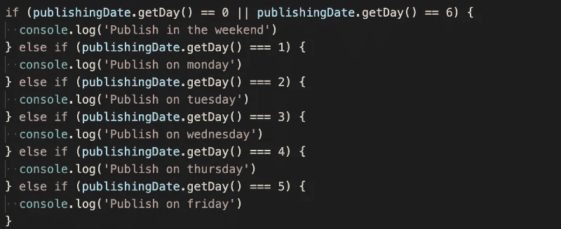
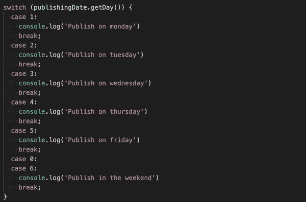
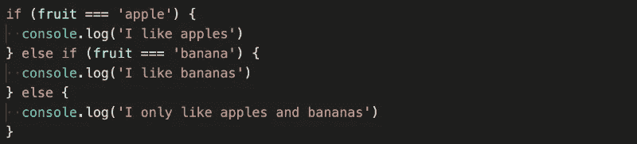
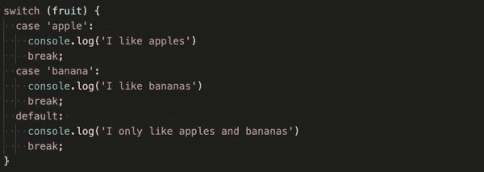
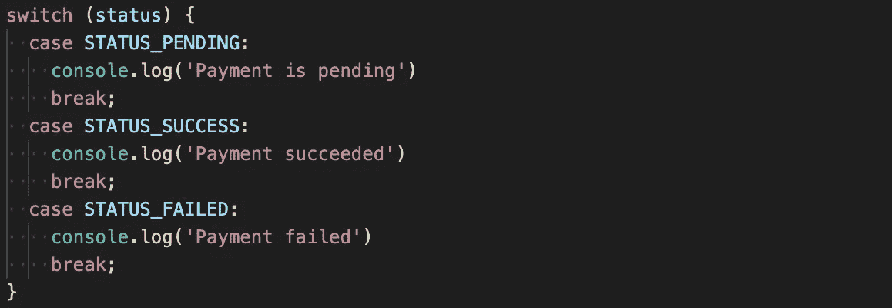

# Switch 语句的用例

> 原文：<https://betterprogramming.pub/the-use-case-for-switch-statements-891254328d80>

## 或者我们应该坚持老式的如果-否则？

Vishnu R Nair 在 [Unsplash](https://unsplash.com?utm_source=medium&utm_medium=referral) 上拍照。

为什么要使用*开关语句*而不是 *if-else* ？这是一个很好的问题，也是一个敏感的话题。每个开发人员都倾向于对 switch 语句有强烈的看法。有些人喜欢它们，并且一直在使用它们，而有些人甚至懒得去摆弄它们。

但是 switch 语句还有有效的用例吗？在选择 switch 语句和 if-else 语句时，有一些问题需要考虑。其中一个是可读性，另一个是速度。

速度通常可以忽略不计，因为我们谈论的是毫秒。最重要的是，这很大程度上取决于形势。有时，使用 switch 语句可能会快一点。其他时候，使用 if-else 可能会更好。因此，我们将把重点放在这篇文章的可读性方面。

# 开关与 If-Else

当我们开始从可读性的角度来看这场辩论时，事情变得非常有趣。我们将通过两个示例来了解 switch 语句和 if-else 语句在代码中的不同之处:

正如您在这个例子中看到的，switch 块看起来没有那么混乱，因此可读性更好。这有几个原因。

首先，我们正在检查单个变量的值，这正是开关的用途。您可能还注意到，在 switch 语句中，OR 检查更加简洁。

第二个原因是，随着逻辑链变得越来越大——加上五个 else-if，我们可以说它非常大——if 块往往会变得非常混乱。其中一部分与我们需要使用的花括号的数量有关，以使这段代码能够工作。当涉及到大型逻辑链时，switch 语句似乎更具可读性。

在 switch 与 if-else 的第二个例子中，我们比较的是一个字符串，对于 switch 语句来说，这在大多数情况下并不是一个很好的用例。

如果数据类型可用于开关，并且所有选项都有常量值，那么当您至少有两个选项需要区分时，您应该始终使用开关，或者至少认真考虑使用开关。

大多数情况下，当您比较一个字符串时，所有选项都没有常量值，这就是为什么这不是 switch 语句的一个好用例。

以下是我对 switch 语句的理解:如果我要切换单个变量的值，并且至少有两个选项是常量值，那么我每次都会使用 switch 来区分它们。这就是开关构造的目的。否则，坚持使用多个 if-else 语句。

一些程序员使用 switch 语句的另一个原因是，他们觉得它们更美观。这也是使用 switch 语句的一个很好的理由，因为它使代码更易于阅读。

就我个人而言，我喜欢将 switch 语句与枚举相结合，因为它可读性很强。下面的例子在我看来非常简洁:

# 你呢？

你是那种喜欢 switch 语句的程序员吗，因为在某些情况下它会使你的代码更具可读性？还是避免在代码中使用 switch 语句？

最后，对于 switch 语句和 if-else 哪个更好的问题，没有一个确定的答案。在某些情况下坚持 if-else 结构没有错。

我只是对你对这个话题的观点很感兴趣，所以请分享你的想法。我们来聊聊 switch 语句及其用例吧！