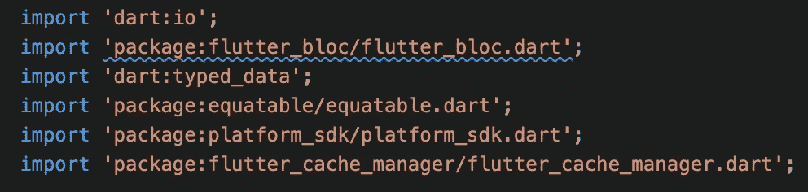
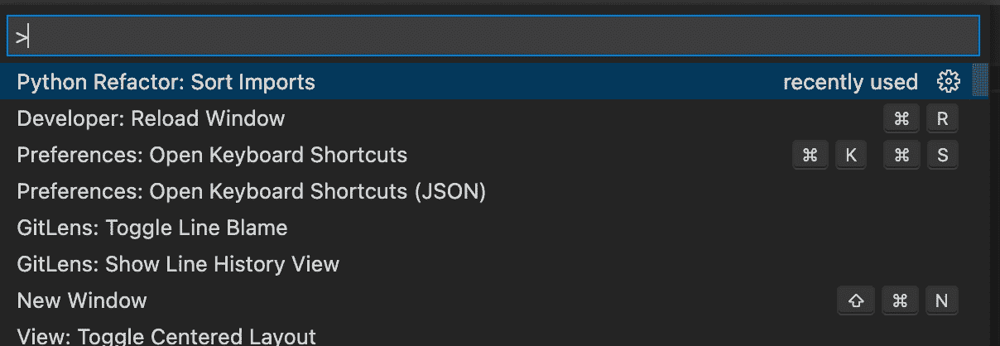

# 您的工作流需要的 VS 代码命令

> 原文：<https://betterprogramming.pub/the-vs-code-command-your-workflow-needs-e2da6e6d291f>

## 有时候是一些小事


照片由[约书亚·阿拉贡](https://unsplash.com/@goshua13?utm_source=medium&utm_medium=referral)在 [Unsplash](https://unsplash.com?utm_source=medium&utm_medium=referral) 拍摄

VS Code 成功的一个重要原因是它很好地迎合了开发者。这在某种程度上是意料之中的，因为这在很大程度上是社区驱动的努力，允许短时间的反馈循环和稳步发展的生态系统。在第三方扩展的汪洋大海和不断扩展的核心功能之间，当您偶尔遇到一些您不知道存在的漂亮技巧或工具时，这并不奇怪。

今天我想和大家分享的命令是`organizeImports`。顾名思义，这个方便的内置指令告诉 VS 代码“组织”当前文件中的导入语句。这意味着 VS 代码将负责对你的导入语句进行排序和分组，以及删除未使用的导入。



有几种不同的方法来执行`organizeImports`。首先也是最重要的，该命令已经内置在键盘快捷键中。

**MAC:**⌥+⇧+o
**windows:**alt+shift+o

这当然可以根据需要进行调整。

如果你不喜欢快捷方式，你也可以通过命令面板做同样的事情，在 Mac 上可以通过**⌘**+**⇧**+**p**，或者在 Windows 上通过**ctrl**+**shift**+**p**调出。



将命令设置为在保存时执行也不在话下，这是我个人最常使用的方式。只需打开您的用户设置并添加以下内容:

```
"editor.codeActionsOnSave": {
    "source.organizeImports": true,
},
```

***提示:*** `[*sortImports*](https://code.visualstudio.com/updates/v1_57#_sort-imports-source-action)` *是该命令的一个更为克制的版本，它在组织时不会删除未使用的导入。然而，目前，它只适用于 TypeScript 和 JavaScript。*

现在你知道了！花更少的时间担心讨厌的进口产品，花更多的时间专注于构建令人惊叹的东西。

编码快乐！

如果你喜欢这个故事，你可能也会喜欢:

*   如果你正在学习编码，你需要学习 Git
*   在 VS 代码中可以做的 9 件很酷的事情