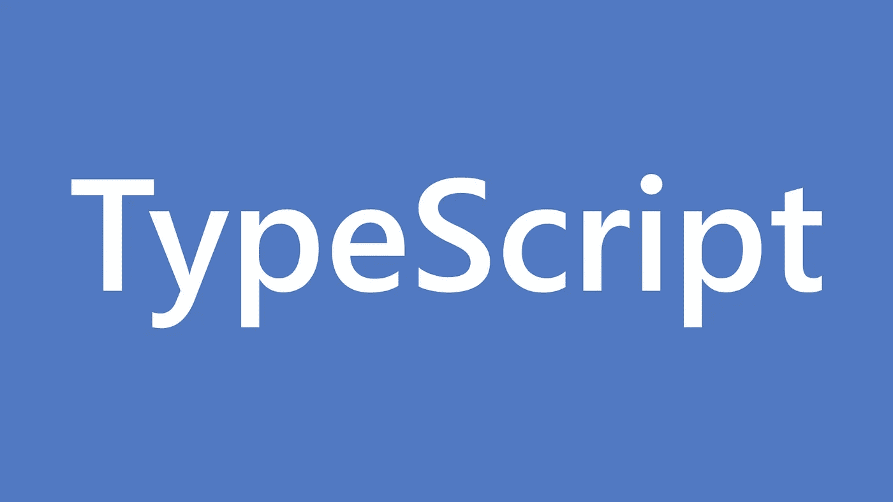
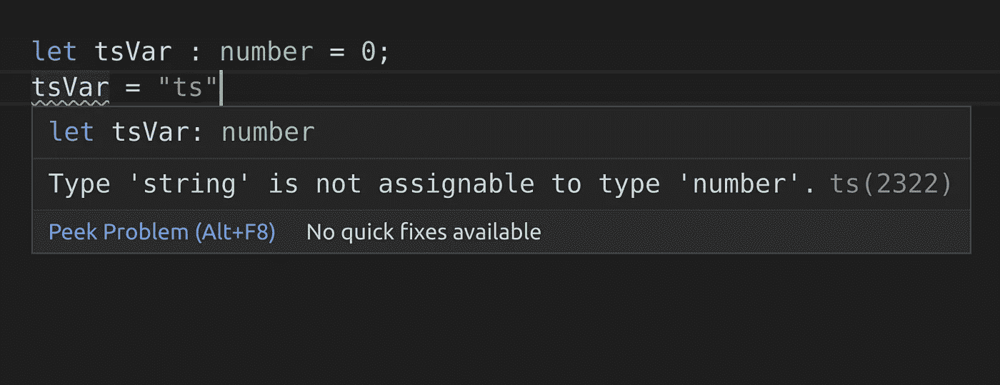
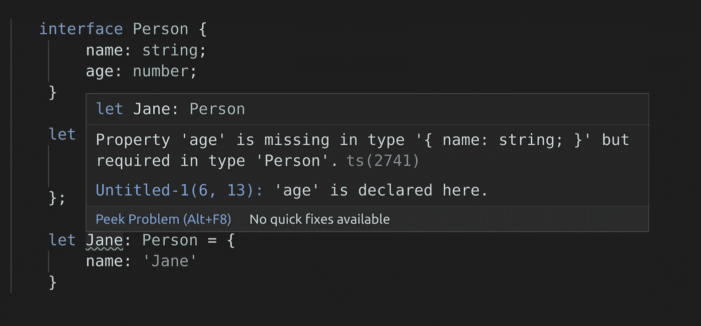

# 面向 JavaScript 开发人员的 TypeScript 是什么、为什么和如何

> 原文：<https://betterprogramming.pub/the-what-why-and-how-of-typescript-for-javascript-developers-a2177675f6d2>

## JavaScript 的类型化介绍



作者图片

如果您是一名 JavaScript 开发人员，您一定在某个地方听说过 TypeScript。如果您不愿意尝试 Typescript，因为您不确定它如何能比 JavaScript 更好地为您服务，那么您来对地方了。

本指南为任何 JavaScript 开发人员提供了入门的全面的 TypeScript 指南。

什么是 TypeScript，它的类型系统是什么，作为一名 JavaScript 开发人员，在您的下一个项目中使用 TypeScript 对您有什么好处？在这篇文章的结尾，你会找到所有这些问题的答案。

注意:我可能有点偏向 TypeScript。在我开始的项目中，没有一个是我更喜欢 JS 而不是 TypeScript 的。

# 什么是 TypeScript？

您可以将 TypeScript 视为一种在 JavaScript 之上提供额外一层的语言。

## 为什么？

尽管我们最初用 TypeScript 编写代码，但我们不能像运行 JavaScript 那样在浏览器上直接运行 TypeScript。相反，TypeScript 通过一个额外的编译步骤将其代码转换为浏览器可识别的 JavaScript。

所以即使我们用 TypeScript 编程，在浏览器上运行的最终程序也是用 JavaScript 编写的。

## 那我们为什么还要使用 TypeScript 呢？

尽管 TypeScript 在运行时并没有提供比 JavaScript 更多的功能，但它提供了一组特性来确保我们这些开发人员与只使用 JavaScript 相比，能够编写出更少出错、更易维护的代码。

## TypeScript 是如何做到的？

TypeScript，顾名思义，在普通 JavaScript 之上引入了一个类型系统。在 JavaScript 中，变量的类型是动态分配的，而 TypeScript 迫使我们预先定义我们要声明的变量的类型。

使用 JavaScript，我们可以在第一行给一个变量赋一个整数值，在下一行给它赋一个字符串值。

```
let jsVar = 0;
jsVar = "js";
```

但是使用 TypeScript，我们可以通过显式声明变量的类型来限制这种行为。如果我们试图将一个字符串赋给一个类型为`number`的变量，它会产生一个错误。

```
let tsVar: number = 0;
tsVar = "ts"; //error
```



错误类型分配的 VS 代码警告

简言之，这就是 TypeScript 与 JavaScript 的不同之处:使用类型来防止我们在代码中犯愚蠢的错误。

# TypeScript 如何改进 JavaScript

虽然缺乏定义类型的能力不一定是 JavaScript 的缺陷，但它给了程序员太多的自由，这不可避免地导致他们编写糟糕的代码。

```
let aNumber = 123;aNumber = {
    name: "John",
    age: 23
}
```

在上面的 JavaScript 场景中，没有什么可以阻止开发人员使用`aNumber`变量来表示对象。虽然这不是一个会导致程序崩溃的错误，但它违背了使用变量名自我记录代码的目的。

TypeScript 通过在声明期间定义变量的类型很容易地解决了这个问题，这样它就不能被赋给另一种类型的值。

```
let aNumber: number = 123;
```

如果另一个开发人员可以访问你程序中的这个变量，他们现在可以依赖它的值是一个数字，正如它的名字所暗示的。

在这种情况下，`isEligible`函数需要一个具有名为`age`的字段的对象。但是 JavaScript 无法保证传递给函数的参数实际上是一个对象，或者它有一个名为`age`的字段。

同样，TypeScript 有这个问题的解决方案。

现在，这段代码可能对你来说没有意义。但是请注意它是如何确保传递的变量的类型是在开头定义的类型`Person`。

使用 TypeScript 可以从你的程序中去掉数百个粗心的编码错误，并避免你每次遇到最愚蠢的错误时都要抓狂。这也将使您的代码更好地自我记录，并增加其可维护性。

如果您对 IDE 中为 JavaScript 提供的代码建议不足感到沮丧，那么您还有另一个理由来尝试一下 TypeScript。类型的存在使 TypeScript 能够在 IDE 中显示更好的代码建议。

# 将类型与 TypeScript 一起使用

## 基本类型

TypeScript 有许多预定义的基本类型。数字、字符串、布尔和数组就是其中的几个例子。

您可以在 [TypeScript 文档](https://www.typescriptlang.org/docs/handbook/basic-types.html)中找到基本类型的完整列表。

这里有几个例子:

请注意`any` type 如何将 TypeScript 转换为与 JavaScript 相同的行为方式。因为我们使用 TypeScript 的目的是给我们的代码一个更好的结构，所以尽可能避免使用`any`类型。

同样，尽量避免使用类型的联合，但如果不可避免，则尽可能限制联合中允许的类型数量。

## 声明自定义类型

还记得我在前面的代码示例中如何使用一个名为`Person`的类型吗？但是`Person`不是 TypeScript 中的基本数据类型。我根据自己的需求创建了 Person 类型，以将其用作给定函数接受的参数类型。

我们使用接口来定义我们引入到应用程序中的新类型的基本结构。

```
interface Person {
    name: string;
    age: number;
}
```

现在，如果我们创建一个类型为`Person`的新对象，它应该包含字段的名称和年龄。否则，TypeScript 将引发错误。



VS 自定义类型中缺失属性的代码警告

您还可以在接口中定义可选字段。

然后，在定义另一种类型时，可以使用自定义类型作为字段的类型。

```
interface Person{
    name: string;
    age: number;
    address: Address;
}
```

## 扩展接口

在 TypeScript 中，您可以通过扩展另一个类型的接口来继承它的属性。

假设您的应用程序需要两种不同的类型，`Person`和`Employee`。因为雇员也是人，所以在创建`Employee`接口时继承`Person`类型的属性是有意义的。它防止代码重复。

您可以通过扩展`Person`接口来快速实现这一点。

## 函数参数类型和返回类型

与变量类型类似，您可以为函数参数和返回值定义类型。虽然参数类型是在参数名旁边声明的，但返回类型是在花括号之前声明的。

通过定义参数和返回值的类型，我们可以保证您或任何使用该函数的人不会意外地传递不具有`Car`类型特征的对象。

您还可以保证传递的任何对象中的字段`sold`不会未定义或为空。并且它消除了许多可能在运行时抛出错误的场景。如果您使用 JavaScript，您将不得不编写更多的代码来防止在运行时出现这种错误的可能性。

与变量类似，您可以将返回和参数类型定义为几种类型的联合。

```
function buyCar(car : Car): Car | boolean {
    if (car.sold === true){
        return false;
    }
    return car;
}
```

当您声明接受的参数或返回类型时，扩展初始类型的接口的类型的对象也被接受为参数或返回值。

# 使用泛型

使用 TypeScript，您可以像我们到目前为止所介绍的那样轻松地定义泛型变量。如果您正在定义一个泛型函数，您可以使用它来处理属于任何内置或自定义类型的数据。

```
function getInfo<T>(input: T): T {
    return input;
}const stringInfo = getInfo<string>("Hello World");
const numberInfo = getInfo<number>(3321);
const carInfo = getInfo<Car>(car1);
```

## 如果使用“any”类型而不是泛型会怎样？

当然，您可以使用`any`类型修改上述函数以接受任何类型的参数。

```
function getInfo(input : any) {
    return input;
}const stringInfo: string = getInfo("Hello World");
const numberInfo: number = getInfo(3321);
const carInfo: Car = getInfo(car1);
```

但是，这个方法不保留传递给函数的数据类型。相反，它记录作为属于任何类型传递的每个参数。另外，你要避免使用`any`。

不过，使用泛型，您可以保留传递给函数的数据类型。如果要根据传递的数据类型改变函数逻辑，使用泛型比接受任何类型的数据都好。

# 使用类型别名

当您要在应用程序中使用的特定字段可能属于几种类型之一时，您可以将其类型定义为这些独立类型的联合。

不需要像上面那样每次都重写联合，您可以使用 type 关键字为联合定义一个别名。

现在你不必使用长的类型联合。此外，如果您想在将来更改函数的返回类型，现在只需更改一行代码。

# 类型变换

当一种类型通过扩展另一种类型的接口来定义时，两者之间生成的关系允许我们将其中一种类型中定义的对象转换为另一种类型。

以我之前定义的`Car`和`ImportedCar`类型为例。首先，我将创建一个类型为`ImportedCar`的对象，看看转换是如何在其上进行的。

这段代码编译时没有错误。这种转换是有意义的，因为`ImportedCar`类型已经拥有了在`Car`类型中定义的所有字段。

如果我们试图在转换前访问对象中定义的制造商字段，它会产生一个错误，因为转换后的对象是`Car`类型。

```
convertedCar.manufacturer;  //error
```

这种转换也可以反过来进行。我们可以将一个`Car`对象转换成一个`ImportedCar`对象。

在这种情况下，如果您试图访问`Car`对象以前没有的新字段`manufacturer`，您将看到它返回`undefined`。

```
convertedImportedCar.manufacturer;   //undefined
```

# 结论

我希望这篇文章消除了您对使用 TypeScript 进行前端开发的任何疑虑。由于 TypeScript 中的大多数特性已经与 JavaScript 相似，您也将能够很快掌握 TypeScript。这在你的下一个项目中肯定会有回报。

接下来，你会成为一名离不开 TypeScript 的 JavaScript 开发人员，就像我一样。

感谢阅读！