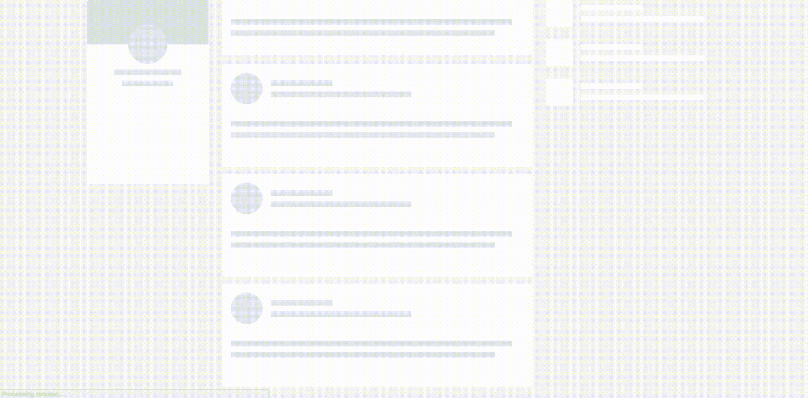
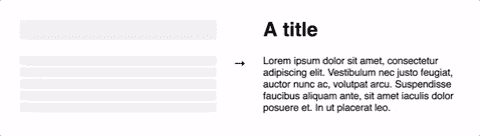
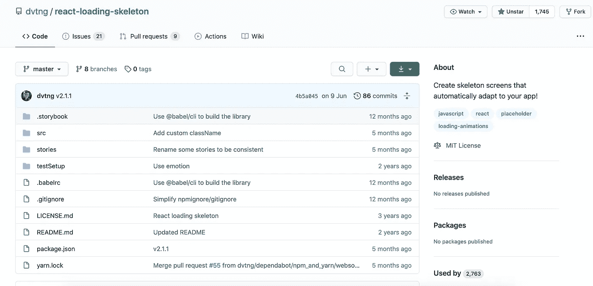
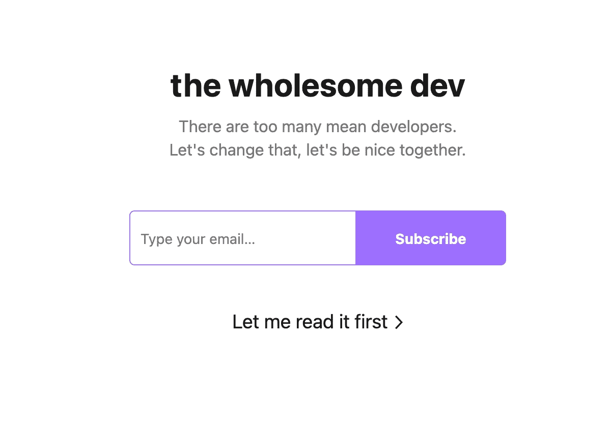

# 使用骨架加载屏幕的内容、原因和方法

> 原文：<https://betterprogramming.pub/the-what-why-and-how-of-using-a-skeleton-loading-screen-e68809d7f702>

## 框架加载屏幕将改善你的应用程序的用户体验，让它感觉更有性能



LinkedIn.com 风格骨架加载屏幕示例(图片来源:作者)

Reddit、Discord、Medium、LinkedIn 有什么共同点？他们为他们的应用程序使用所谓的*骨架加载屏幕*。

框架屏幕本质上是应用程序的线框。线框是一个占位符，直到应用程序最终加载。

这是骨架加载屏幕通常的样子。请注意它们是如何取代传统装载旋转器的。


普通博客文章的框架加载屏幕

骨架加载屏幕实质上模拟了原始布局。

这让用户知道屏幕上发生了什么。用户将此解释为应用程序正在启动，内容正在加载。

# 什么是骨架加载屏幕？

框架屏幕是一个模仿页面布局的用户界面版本。



图片来自[反应-加载-骨架](https://github.com/dvtng/react-loading-skeleton)

框架加载屏幕以与实际内容相似的形状显示页面，因为它正在加载并变得可用。

# 为什么要用骨架加载屏幕？

显示内容加载让用户感觉应用程序响应更快，而不是显示空白页面。

不和谐的直接信息:这是另一个骨架加载屏幕适用的主要例子。


Discord 大量使用了骨架加载屏幕

我们可以显示一个框架屏幕，让用户看到启动和导航应用程序时的进度，而不是显示加载微调器。

以下是您可能会考虑在下一个项目中使用框架加载屏幕的几个原因。

*   他们感觉速度更快，反应更灵敏，用户友好。
*   加载 spinner 的问题是我们不知道它将加载多长时间。

# 如何使用反应-加载-骨架

有多种解决方案，但今天我们将使用[react-loading-skeleton](https://github.com/dvtng/react-loading-skeleton)**开源包。**

> **"制作漂亮的动画加载框架，自动适应你的应用程序. "— [反应-加载-骨架](https://github.com/dvtng/react-loading-skeleton) GitHub 页面。**

****

**反应-加载-骨架—[https://github.com/dvtng/react-loading-skeleton](https://github.com/dvtng/react-loading-skeleton)**

# **开始**

**启动和运行相当简单明了。像任何包一样，你可以通过 npm 或者 Yarn 安装 react-loading-skeleton。**

## **故事**

```
yarn add react-loading-skeleton
```

## **npm**

```
npm i react-loading-skeleton
```

> **“`<Skeleton>`组件被设计成直接在你的组件中使用，在它还在加载的时候代替内容。**
> 
> **“与其精心制作一个框架屏幕来匹配你的内容所呈现的`font-size`、`line-height`或`margin`，不如使用一个`<Skeleton>`组件来让它自动填充正确的尺寸。”—反应-加载-框架文档**

# **博客帖子反应组件**

**让我们创建一个基本的博客帖子，接受文本的`title`、`subtitle`和`body`作为道具。**

**我们将使用`||`操作符，而不是仅仅将道具传递给组件。该操作器的作用类似于*或*检查。**

**如果没有标题，显示骨架加载程序。如果有标题，就显示标题。**

**记住,`<Skeleton>`组件被设计成在你的组件中直接使用，而不是在它还在加载的时候替换内容。**

# **渲染博客文章**

**接下来，将 blog post 组件导入到包装器组件中。**

**用这三个属性创建一个博客文章对象。像这样将 blog post 对象传递给 blog post 组件。**

**注意我是如何使用`useEffect`钩子来模拟获取数据的。由于使用了`setTimeout`，整整一秒钟，我们将延迟向我们的博客文章传递道具。**

**这就像我们获取数据一秒钟，一旦完成，就将数据传递给 blog post。这就像[从 API](https://medium.com/better-programming/how-to-fetch-data-from-an-api-with-react-hooks-9e7202b8afcd) 中获取数据一样。**

****注意:**如果你是 React 钩子的新手，可以看看我之前写的“[揭开 React 钩子](https://medium.com/better-programming/demystifying-react-hooks-a0b56a6254c2)的神秘面纱”这篇文章。**

**我们现在应该看到一个完整的一秒钟的框架屏幕。过一会儿，我们会看到这篇博文。**

****

**瞧啊。一个框架加载屏幕实现**

# **画圆来模仿轮廓图像**

**对于圆形骨架占位符，将`circle`属性设置为`true`。**

```
<Skeleton circle={true} height={50} width={50} />
```

****

**将 circle 属性设置为 true 可让我们创建一个轮廓图像骨架占位符。**

**这是博客文章组件的完整代码示例。**

**BlogPost.js**

**尝试使用下面的演示应用程序。**

**CodeSandBox 演示应用程序—[https://codesandbox.io/s/objective-cohen-1g53b](https://codesandbox.io/s/objective-cohen-1g53b)**

# **结论**

**感谢阅读！我希望你学到了新东西。编码快乐！**

**哦，如果你想了解最新消息，我的 [**简讯**](https://wholesomedev.substack.com/welcome) 是一个极好的资源。**

****

**我的简讯—【https://wholesomedev.substack.com/welcome **