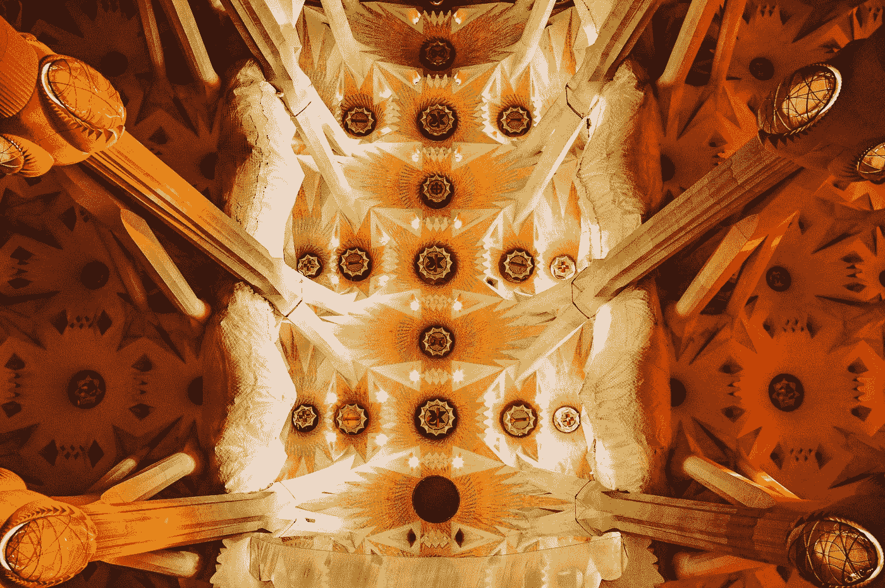

# 软件架构模式的奇迹

> 原文：<https://betterprogramming.pub/the-wonders-of-software-architecture-patterns-d588f2cba31a>

## 鸟瞰三种流行模式

[戴红帽的女孩](https://unsplash.com/@girlwithredhat?utm_source=medium&utm_medium=referral)在 [Unsplash](https://unsplash.com?utm_source=medium&utm_medium=referral) 上的照片

当我在写我的第一首《Hello world》的时候我假设所有的软件都写在一个大文件里。但是很快我意识到事实并非如此，很多东西都被分解成可以相互交流的小组件。

当有这么多这样的组件时，通常会变成“不知道什么在做什么，谁在和谁说话”的混乱局面。但是不要害怕，因为这是软件架构模式发挥作用的地方！

这些定义良好的模式提供了一种组织软件的模板，不同类型的模式根据您的用例提供了不同的优点和缺点。现在我将解释我们在软件开发中看到的一些最常见的模式。

# **分层建筑**

这是这个列表中最古老的架构模式，令人惊讶的是，它仍然是你看到的应用程序中最常见的架构模式，不幸的是，这并不是一个好的理由。这种模式可以追溯到 90 年代，非常适合当时的情况。

它涉及分层/基于分层的结构，其中每一层/层处理特定的任务，并将任务传递给下一层，直到所需的过程完成。

当您构建简单的 web 应用程序时，这种模式工作得很好，但是随着您的软件变得越来越复杂，这种模式很快就会崩溃，并且无法满足现代软件的许多需求。

这也是软件最终成为一个整体的门户，如果不加以修复，可能会引入扩展、部署和性能问题。

照片由 [K8](https://unsplash.com/@k8_iv?utm_source=medium&utm_medium=referral) 在 [Unsplash](https://unsplash.com?utm_source=medium&utm_medium=referral) 上拍摄

# **微服务架构**

如果您已经在软件开发领域工作了一段时间，那么您现在可能已经听说过这种架构模式了——它之所以出名是有原因的！

微服务架构允许将大型应用程序分解为独立的小服务，这些小服务相互调用以完成一个流程。这些微服务都是独立的，各司其职。您可能已经注意到，微服务架构有助于分解大型应用程序或单体，并且是公司在试图摆脱其单体软件并使其更加现代化时通常采用的路线。

微服务模式在几乎所有方面都比分层模式更好，因为它使应用程序易于部署、测试和更好地执行，它可能缺乏的部分是开发的容易性，因为编码所有这些服务会带来更多的复杂性。

# **事件驱动架构**

这是另一种流行的模式，它的秘密在于，通过允许组件异步发送和接收事件，它承诺使应用程序高度解耦和可伸缩。这种模式适用于各种规模的应用，这表明了去耦在任何应用中的重要性。

在这种模式中，通常有一个事件通道或总线来传输应用程序的各个组件发送的所有事件，通道或总线用于异步接收这些事件。事件驱动模式比微服务模式具有更高的可伸缩性，但是缺乏测试的便利性。

[Denys Nevozhai](https://unsplash.com/@dnevozhai?utm_source=medium&utm_medium=referral) 在 [Unsplash](https://unsplash.com?utm_source=medium&utm_medium=referral) 上的照片

好了，我的第一篇博客已经结束了。软件架构模式还有很多，如果你想了解更多，这里有一篇[很好的入门文章](https://www.oreilly.com/content/software-architecture-patterns/)。