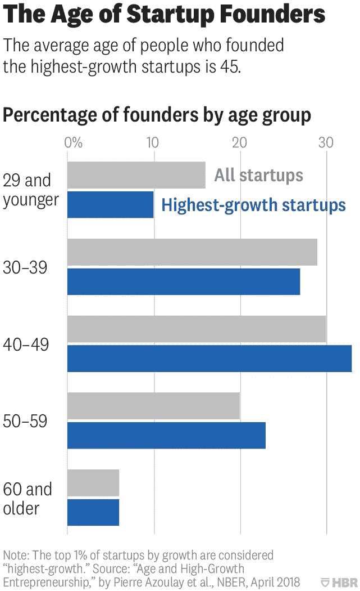
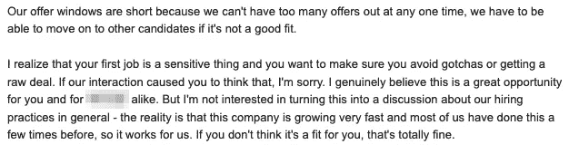
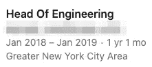
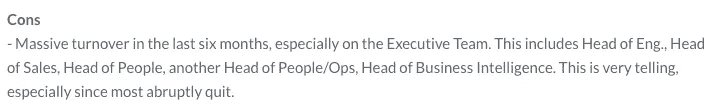
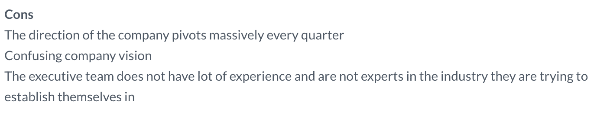
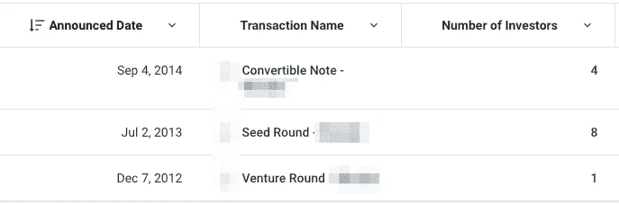
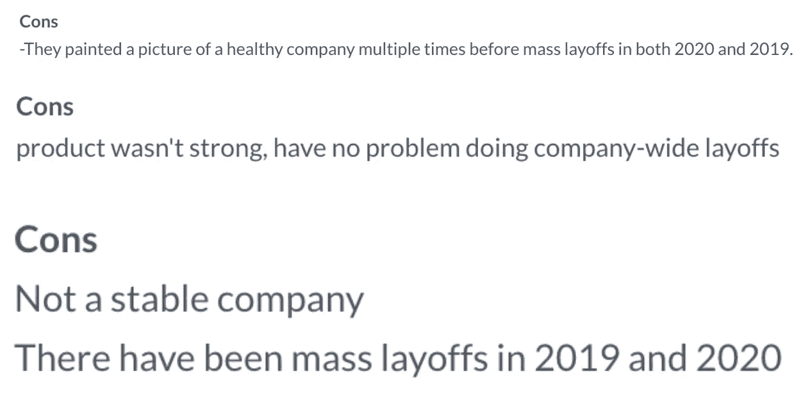
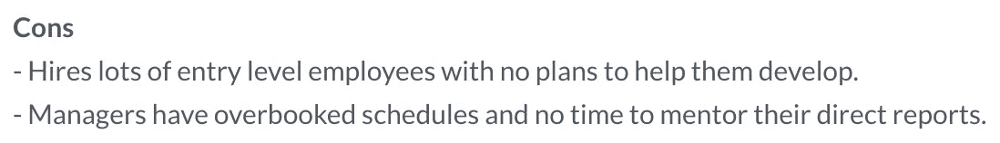
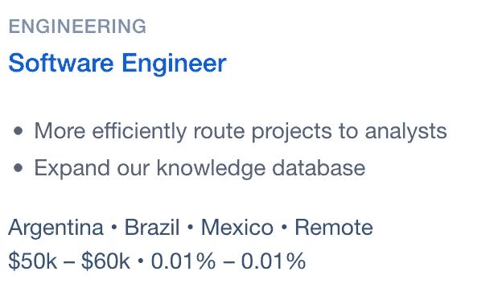

# 我经历过的最糟糕的工作面试

> 原文：<https://betterprogramming.pub/the-worst-job-interview-ive-ever-had-4e15f380f387>

## 以及给我这份工作的公司是如何陷入困境的

丹尼尔·麦卡洛在 [Unsplash](https://unsplash.com?utm_source=medium&utm_medium=referral) 上的照片

2021 年 3 月 27 日，标志着我在目前职位上工作三周年。我做了我通常在工作纪念日做的事。我给自己倒了一杯苏格兰威士忌，“干杯”庆祝又一个过去的一年，然后去查阅一些 Glassdoor 的评论。然而，我没有查看对我目前雇主的评论。

相反，我找到了一家公司，在我上次找工作时，这家公司让我经历了我经历过的最糟糕的技术面试。但是为什么要沉湎于过去？毕竟，我有一份很好的工作，和一个优秀的团队一起工作。为什么要重提旧事？

我承认，这里面有一些琐碎的因素。但更深层次的推理更具学术性。我在这家公司的面试经历包含了一连串的危险信号。以至于我确信他们在自残。

*没有一家健康的公司会这样做，也没有一个称职的开发者会容忍这种行为*，我推断。

因此，在过去的三年里，我一直在测试我的假设。每年我都会深入研究他们的公开数据——包括员工评估、公司发展和资金数据。随着时间的推移，我已经能够看到一家初创公司挣扎着生存，并逐渐变得默默无闻。

# 面试

凯文·Ku 在 [Unsplash](https://unsplash.com?utm_source=medium&utm_medium=referral) 上的照片

我的故事从许多糟糕的面试故事开始的地方开始: [AngelList](https://angel.co) 。

对于那些不知道的人来说，AngelList 是一个工作聚合网站。虽然 AngelList 本身没有问题，但问题更多地出在它所服务的公司身上。即初创公司和早期公司。

会有人读到这里会想:“嘿！我为一家初创公司工作，我们很棒！我们会善待我们的求职者！”我相信这是真的。然而，有许多人不这样认为。问题出在从哑弹中筛选宝石。

当我偶然发现这家公司招聘软件工程师时，我觉得它很有前途。他们有一个好看的标志，一份有吸引力的流行语的工作描述，和一个时髦的营销网站。我上钩了，递交了一份申请。

## 危险信号#1:带回家的项目

[‏摄🌸🙌في عین الله](https://unsplash.com/@mhrezaa?utm_source=medium&utm_medium=referral) 开[退溅](https://unsplash.com?utm_source=medium&utm_medium=referral)

我面试的最初阶段相对顺利。通过 AngelList 申请后，我收到了工程主管的电子邮件回复——他想建立一个初始呼叫。

在电话中，他们告诉我，我的技术评估将以带回家挑战的形式进行。我试图掩饰我的失望。我过去不是，现在也不是，带回家项目的最大粉丝。

我对带回家的挑战最大的问题是它们是一个时间水槽。每个公司都低估了他们需要多长时间来完成。理解需求、设置样板文件、阅读文档，然后最终编写该死的代码，这些都需要时间。更不用说你永远不知道什么时候是正确的“停止点”但是每个面试官只是把这些细节放在一边，说:“应该只需要几个小时。”

但作为一个当时没有工作的人，我没有资格抱怨。因此，当工程主管给我发来项目细节的电子邮件时，我深吸了一口气，然后点击打开。

挑战在于实现一个实时聊天应用程序，包括前端和后端。该应用程序将支持连接两个用户到一个单独的聊天室。如果这还不够，它还需要支持一些他们定义的 IRC 风格的命令。

这个要求有点过分，但我还是默认了。有足够的时间，我知道我能完成它。直到我进一步向下滚动邮件，看到他们希望在周末前完成。那是星期三下午三点左右。这给了我大约 48 小时来完成它。

*两天？！他们是认真的吗？即使现在回想起来，我已经有了三年的经验，这个挑战也是荒谬的。但在当时，这似乎是不可能的。*

我不会用实现的所有细节来烦你。最后，我花了两天时间在我的笔记本电脑上。我最终公然从 Socket.io 的[演示聊天应用](https://socket.io/demos/chat/)复制了代码，对代码进行了一点重构，并添加了对命令的支持。

成品带回家项目演示

如果不是因为我正在寻找一份全职工作，并且没有其他项目要做，我甚至不会考虑这个角色。我很好奇有多少其他候选人真的通过了这一步。没有一个全职工作的开发人员，一个家庭，或者其他有竞争力的提议，会考虑一个来自无名创业公司的带回家的项目。

但是最后，我能够按时提交代码，几乎没有剩余的时间。

## 危险信号#2:首席执行官

在 [Unsplash](https://unsplash.com?utm_source=medium&utm_medium=referral) 上由 [Austin Distel](https://unsplash.com/@austindistel?utm_source=medium&utm_medium=referral) 拍摄的照片

幸运的是(或者不幸的是)，我通过了他们的带回家的挑战。招聘经理在接下来的周二给我回了信息，说他们想安排现场面试。

当现场的日子到来时，我很紧张。他们的技术评估已经踢了我的屁股；我无法想象他们的现场面试会是什么样的。

但是我的担心是多余的。我在前几次面试中表现不错。我和面试官相处得很好，我在问题上表现得很好，总体来说过得很愉快。我很紧张，但也谨慎乐观。随着我获得工作机会的可能性越来越大，带回家考试的混乱慢慢从我的脑海中消失了。

*这个地方不会那么糟糕，我记得当时对自己说。然而，麻烦的第一个迹象出现在对首席执行官的采访中。*

给我印象最深的是他的年龄。他看上去不比我大多少。事实上，他没有。我后来发现，他只比我大三岁，在大约 25 岁时就创办了这家公司。

尽管年轻的创业者们议论纷纷，但我一直对他们保持警惕。年轻的创始人不太可能成功创业。

来源:[哈佛商业评论](https://hbr.org/2018/07/research-the-average-age-of-a-successful-startup-founder-is-45)

但同样，总有例外。我不想急于下结论，所以我抛开了先入为主的观念，继续进行面试。

首席执行官和我闲聊了一下公司的背景，它是如何开始的，以及我为什么想在那里工作。样板文件类似于第一个电话屏幕。然后他给了我一个机会问他关于角色、公司和产品的问题。

因为我以前从未使用过他们的产品，所以我的很多问题都集中在产品和未来路线图上。

*   公司的未来看起来怎么样？
*   财务状况如何？
*   他想把公司未来带向何方？

我所有的问题都得到了明确的乐观和朗朗上口的习惯用语:

"我们是一家拥有 D 系列商业模式的 A 系列公司."

“我们没有竞争对手，因为我们一直设法保持隐秘。”

他还提到，尽管他们并不需要资金，但他们正在争取另一轮资金。“获得资助的最佳时机是你不需要的时候。”我从未质疑过任何一件事，因为我怎么能质疑呢？我对这家公司不是很了解，他看起来很自信，也很有条理。

当他描述对公司的愿景时，真正的危险信号出现了。他将该产品描述为一个以人为本的搜索引擎。人们带着难以回答的问题来找他们，这些问题可能需要几个小时来研究。但他们会立刻为他们做，并收取费用。目前他们需要 24 小时，但他决心把这个时间缩短到一秒钟以内。

这是一个宏伟的想法，但充满了潜在的问题。当我就各种瓶颈和限制向他施压时，我得到的回应是挥手和模糊的类比。他提到了谷歌是如何让网络搜索不到一秒钟的。他想用他们的产品做一些类似的事情。

我怀疑地扬起眉毛。对投资者来说，说你想成为“谷歌”可能听起来很棒，但对我来说，这听起来只不过是空话。

这位首席执行官的白日梦，结合他的年龄和乐观的习惯用语，告诉我，我正在和一个超出他们能力的人打交道。但这也表明他们面临的障碍缺乏透明度。对于给你开支票的人来说，这是一个令人担忧的前景。

然而，我又一次无视了内部的批评。虽然该公司的未来不确定，但它目前做得很好。

如果他能够雇佣强有力的技术领导，这可以弥补他自己的不足，对吗？

## 危险信号 3 :(爆炸式)报价

斯蒂芬·拉德福德在 Unsplash[拍摄的照片](https://unsplash.com?utm_source=medium&utm_medium=referral)

与首席执行官的会面是我最后一次现场面试。尽管目前有危险信号，我仍然渴望听到他们的回音。就像我说的，我在技术评估上做得很好，并且和其他工程师相处得很好。我有其他的提议，但是如果他们回来的提议有竞争力，我会倾向于接受。

所以，想象一下，当工程主管走进来进行面试后总结时说，“我们想给你一个报价”时，我是多么惊讶和高兴。

“我和其他面试官聊过，他们都对你赞不绝口。虽然我们通常会雇佣更有经验的人，但你真的给我们留下了深刻的印象，我们希望继续前进。”我保持着镇静，在他说话时点头附和，但内心深处，我在墙壁上跳动。

但就在那时，他们的工程主管敲下了锤子。他们通知我，在报价到期之前，我只有一个工作日的时间来接受报价。他们的理由是，“在我们看来，接受邀请并加入一个团队是一个本能的决定。要么你真的喜欢它并接受它，要么你没有感觉到它，你没有。”

此外，他们的报价将是最终的。不接受任何谈判。如果技术屏幕和首席执行官会议仅仅是红旗，这就是告诉我离开那里的霓虹灯。

来源:[蒂姆·埃切尔斯](https://timetchells.com/projects/g-o/)

我从来不明白爆炸优惠的用途。虽然一家公司使用它们的原因可能各不相同，但它们都是不安全的信号。他们担心如果他们让你看市场上的其他报价，你会走开。问题是这是自我破坏。

知道自己价值的有经验的候选人不会被一份爆炸性的工作说服。他们知道自己可以轻松走开，找到另一份工作。即使报价很有竞争力，但附带保险丝的事实可能会被视为一种侮辱。这样一来，公司就只能雇佣那些愿意接受高报价的人了。这些通常是那些自身缺乏经验和安全感，或者处于绝望境地的考生。这不是你创建一个健康的、运行良好的工程组织的方式。

我当时就知道我不会接受这个提议。我点点头，笑着听完了工程主管关于报价的长篇大论，抓起我的包就跑了。

当我到家时，我气极了。我为面试这家公司投入的所有时间和精力都白费了。我发了一封电子邮件，披露了我对他们招聘做法的不满，以及我对大量裁员的想法。这是亲切的，尽管每一句话都在我的脑海中被粗话打断。

工程主管很快回复道:

我们电子邮件交流的截图。

> 我没有兴趣把这变成一场关于我们总体招聘实践的讨论——事实是，这家公司发展非常快，我们大多数人以前都这样做过几次，所以这对我们很有用。

如果这是首席执行官信任的领导他的公司的技术领导，我不想参与。我接着做了简短的回应，说我不会接受这个提议。

我经历过的最糟糕的面试就这样结束了。

# 他们现在在哪里？

正如我在介绍中提到的，故事还没有结束。

我很高兴地说，在我那次不愉快的经历后不久，我接受了一家很棒的公司提供的 3 万多美元的薪酬。但是任何明显的负面经历都会留下印记。我仍然不时回想起我与那家不知名公司的采访。这就是为什么在过去的三年里，我一直关注着这家公司，跟踪它的发展。我想看看它是否会证明我是错的并蓬勃发展——或者证实我的信念并挣扎？

## 人事部门

首先，工程主管在我们面试后不久就离开了公司，回到了非管理软件工程的岗位。根据我和他们相处的一点点经验，这是一个他们更适合的角色。

来源:LinkedIn

事实上，他们的许多高管要么突然离开，要么被解雇。

来源:glassdoor.com

该公司的许多人认为，高管团队缺乏该领域的专业知识。

来源:glassdoor.com

## 提供资金

当我在 2018 年采访他们时，首席执行官一再提到他们的下一轮融资。据 Crunchbase 称，这笔资金从未到位。他们最后一次注入风险资本是在 2014 年。

来源: [Crunchbase](https://www.crunchbase.com/)

没有资金的创业可能是一个不稳定的场景。但缺乏融资并不一定是出了问题的迹象。一家公司选择放弃融资有很多原因。毕竟这家公司是一家“D 轮商业模式的 A 轮创业公司”，对吧？如果他们有利可图，有跑道，他们可能不需要资金。

然而，情况似乎并非如此。他们进行了两次裁员——一次在 2019 年，另一次在 2020 年。

来源:[glassdoor.com](https://www.glassdoor.com/)

虽然许多公司因新冠肺炎而裁员，但他们 2019 年的裁员与疫情无关。此外，他们的产品完全是在线的，属于知识领域，这是 2020 年蓬勃发展的科技行业的一部分。所以我怀疑他们的问题完全与病毒有关。

## 产品路线图

在我的采访中，最大的危险信号之一是首席执行官对产品的愿景。这似乎是一个缺乏技术专长的人的异想天开的管道梦——我可能不会太离谱。

来源:[glassdoor.com](https://www.glassdoor.com/)

从我的玻璃门观察来看，他们遇到的最大问题之一似乎是产品与市场不匹配，缺乏扩展产品的眼光。

## 面试过程

我最大的信念之一是，他们的面试过程主动赶走了有经验的候选人，因为只有没有经验的候选人会成为他们操纵策略的牺牲品。这似乎得到了一些支持。

来源:glassdoor.com

还记得工程主管如何陈述他们的快速增长是他们使用爆炸式报价的原因吗？该公司的开发人员数量只有三年前的一半，而且也没有积极招聘。他们目前唯一的工作列表是南美的一名远程软件工程师。除此之外，你还得直接给公司发电子邮件询问空缺职位。

来源: [AngelList](https://angel.co/jobs)

我承认这个数据可能不是最准确的。我只是一个愤愤不平的受访者，在网上挑选不讨人喜欢的数据。话虽如此，但这并不能抹杀这家公司正在苦苦挣扎的事实。虽然他们的面试过程不太可能完全出错，但这肯定不会给他们带来任何好处。

如果我想从我的经历中得到什么教训的话，那就是倾听并注意你在面试公司时看到的危险信号。诸如截止日期短或报价爆炸之类的策略可能是一个信号，表明公司对他们能提供的东西没有信心，表面之下隐藏着更大的问题。

一家公司的面试过程是对其内部运作的一瞥。如果你不喜欢你所看到的，尽管这很难，只要走开。有很多公司会尊重你。你只需要从这些无用的东西中筛选出宝石。

[*订阅我的个人资料*](https://medium.com/subscribe/@SunnyB) *如果你想在我上传新故事时得到通知。*