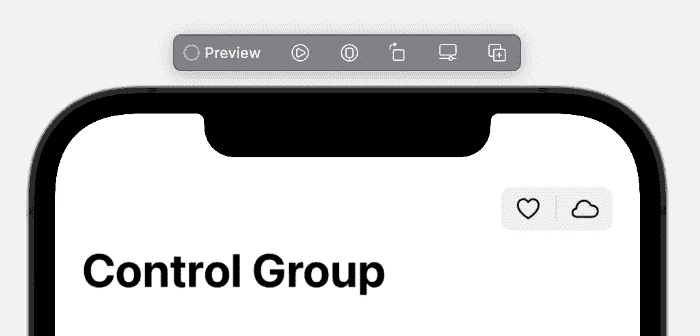

# WWDC 2021 版

> 原文：<https://betterprogramming.pub/the-wwdc-2021-edition-649749502a4c>

## 《更好的规划》综合报道了 WWDC 2021 的公告

嘿，更好的编程读者们，

又是一个星期六，我希望你们都做得很好。对于科技爱好者来说，六月总是一个美好的月份。此外，在 iOS 开发者的 WWDC 大会上，今年我们还看到微软在 Windows 操作系统上推出了 Android 应用。我相信 Android 开发者会喜欢这个变化的。

继续我们的每周主题传统，在这份时事通讯中，我们将为开发人员做一个最大的 WWDC 2021 公告的综述。事不宜迟，我们开始吧。

# SwiftUI 中的降价支持

作者图片

自前两次 WWDC 活动以来，SwiftUI 一直备受瞩目，今年也不例外。SwiftUI 视图中引入的 Markdown 支持对许多人来说是一个受欢迎的新增功能。

[郑](https://medium.com/u/3968fe272788?source=post_page-----649749502a4c--------------------------------)带你先睹为快 iOS 15 中的`AttributedString`以及如何与 SwiftUI `Text`和`TextEditor`整合:

1.  [iOS 15 将属性化字符串引入 SwiftUI](/ios-15-attributed-strings-in-swiftui-markdown-271204bec5c1)
2.  [在 iOS 15 中用 SwiftUI 构建 Markdown 编辑器](/build-a-markdown-editor-with-swiftui-in-ios-15-767a2e9348a9)

构建您自己的自定义文本编辑器应用程序从未如此简单。

# iOS 15 中按钮的巨大改进

作者图片

按钮是任何用户界面中最常见的元素之一。然而，定制一个`UIButton`对于 iOS 开发者来说一直是一个繁琐的体验。

令我们惊讶的是，`UIButton`有了一些巨大的改进。设置预定义样式的新配置 API 和集中式状态处理程序是受欢迎的新增功能。

*   [Mohammad Azam](https://medium.com/u/2300266301b3?source=post_page-----649749502a4c--------------------------------) 展示了 iOS 15swift ui 中[自定义按钮的所有新方法。](/customizing-buttons-in-swiftui-ios-15-97a02394417c)
*   为了了解 UIKit 按钮的增强功能，这里是我的[ui button](/whats-new-in-uibutton-for-ios-15-eba1ce9ad899)中的新功能。

# 看看 iOS 15 的新 SwiftUI 功能

[要点](https://gist.github.com/iosdevie/af2df84e9b44f239b7f4b05a9d541880)

SwiftUI 今年获得了十几个新功能。从急需的拉动刷新功能到可搜索的修改器和可定制的列表滑动操作，[这篇文章](/whats-new-in-swiftui3-ios15-fa0e0d62235b)几乎涵盖了 iOS 15 的所有新 SwiftUI 功能(附插图)。

[穆罕默德·阿扎姆](https://medium.com/u/2300266301b3?source=post_page-----649749502a4c--------------------------------)在他的第二个 iOS 15 版 SwiftUI 中向我们展示了如何[使用全新的](/understanding-asyncimage-in-swiftui-55dd2fb6a86e) `[AsyncImage](/understanding-asyncimage-in-swiftui-55dd2fb6a86e)`。

直到去年，从集合项访问可变绑定还是一项单调乏味的任务。很高兴，SwiftUI 支持列表元素的绑定。 [Peter Friese](https://medium.com/u/ea0b1eb1f5d2?source=post_page-----649749502a4c--------------------------------) 用一个代码示例向[展示了它是如何在幕后实现的](/introducing-swiftui-list-bindings-a150410b836b)。

# Swift 中的并发变化

[Ruud de Peijper](https://unsplash.com/@ruud_exploor?utm_source=medium&utm_medium=referral) 在 [Unsplash](https://unsplash.com/?utm_source=medium&utm_medium=referral) 上拍摄的照片。

虽然 Combine 框架没有再次收到任何更新，但苹果在 WWDC 21 期间确实把很多注意力放在了并发性上。随着 Swift 5.5 引入新的 async/await 功能， [Neel Bakshi](https://medium.com/u/735e5c873f3d?source=post_page-----649749502a4c--------------------------------) 对 Swift 5.5 中的 Actors 进行了[深入研究。](/a-deep-dive-into-actors-in-swift-5-5-8cc2fa004ded)

# 新的对象捕获 API 初探

由[苏甘特](https://unsplash.com/@suganth?utm_source=medium&utm_medium=referral)在 [Unsplash](https://unsplash.com/?utm_source=medium&utm_medium=referral) 上拍摄的照片。

曾经想要从真实的物体创建 AR 模型吗？RealityKit 现在有一个简单的过程来做这件事。

借助新的对象捕捉 API，您可以使用摄影测量从图像中快速生成 3D 对象。 [Bruno Rocha](https://medium.com/u/715242f242dd?source=post_page-----649749502a4c--------------------------------) 动手使用 Swift 中的 RealityKit 从照片中创建 [3D 模型。](/creating-3d-models-from-photographs-using-realitykit-in-swift-e48d4c7db695)

这就是本周的时事通讯！查看 [betterprogramming.pub](https://betterprogramming.pub/) 获取更多 SwiftUI 资源和其他编程故事。像[Sarah](/build-animated-pie-and-donut-charts-in-swiftui-9b74b95f8b39)[制作的饼状图和甜甜圈图](https://medium.com/u/267e16a7c893?source=post_page-----649749502a4c--------------------------------)可能会启发你在 SwiftUI 中创建自定义形状。或者，如果你完全不熟悉 SwiftUI， [Rob Sturgeon](https://medium.com/u/1de9d252156e?source=post_page-----649749502a4c--------------------------------) 的 [SwiftUI 文档](/the-complete-swiftui-documentation-youve-been-waiting-for-fdfe7241add9)可能是开始的最佳地方(这是一篇 46 分钟的阅读)。

感谢阅读。直到下一次，

Anupam 和更好的编程团队