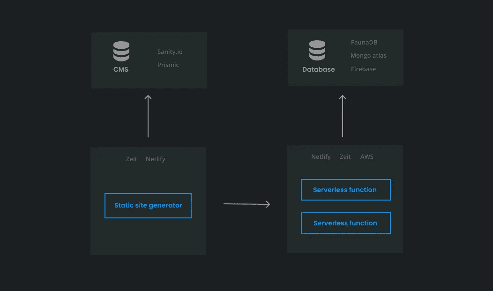

# 零美元基础架构堆栈

> 原文：<https://betterprogramming.pub/the-zero-dollar-infrastructure-stack-7c840a8b555b>

## 如何免费运行您的应用程序

诺德伍德主题公司在 [Unsplash](https://unsplash.com?utm_source=medium&utm_medium=referral) 上拍摄的照片。

我很好奇是否有可能选择一个成本为 0 美元的基础架构堆栈。这对个人爱好项目或刚起步的企业非常有益。在本文中，我将分享我用来将基础设施成本降至最低的服务和技术。

作为一个示例应用程序，我想到了一个简单的平台，它主要需要一个静态网站、一些服务器端业务逻辑和一个数据库。

当然，这个堆栈不会总是完全免费的。如果使用率增加，成本也会增加。重点是看我们能否在开始时以接近 0 美元的价格组装一个堆栈。

# 网站托管

考虑网站托管时，有几个不错的选择。

我最喜欢的是维尔塞尔和奈特利菲。它们提供的功能非常相似:持续部署、每月约 100GB 的带宽和内置 CDN。另一个好处是，它们都提供了无服务器功能的选项，我们将在下一节中看到。这简化了我们需要为整个堆栈集成的服务数量。

像 Gatsby 这样的静态站点生成器非常适合这些提供商。它也可以很好地与一个无头的 CMS 相结合。通过这种方式，网站可以由一个不懂技术的人来编辑。

# 后端

为了将大多数业务逻辑排除在前端之外，我们需要一个后端。我们可以使用它的一个场景是认证或注册新用户。

因为我们希望将托管成本保持在最低水平，所以托管传统的后端服务是不可能的。

解决方案是采用无服务器功能。这意味着它不是完全占用服务器，而是仅在功能需要运行时使用服务器的容量。一个示例功能可以是提供一个登录端点来检查用户是否输入了正确的凭证。大多数提供商在使用这些功能时都有免版税层。

有提供这种功能的。

## 网络功能

Netlify 提供了广泛的免费层。在这一层中，您每月可以有多达 125，000 个请求和 100 个小时的运行时间。

当决定使用 Netlify 作为网站主机时，它也可以很好地集成。这些函数可以放在根项目中，并由 Netlify 拾取。

## Vercel 函数

Vercel 还提供无服务器功能。在自由层，当使用 1GB 的 RAM 时，对请求的数量没有限制，而且每月还有 100 小时的运行时间。

它们对执行时间有额外的限制。功能只能运行 10 秒钟。

对于大多数用例来说应该足够了，但这是需要考虑的事情。

## AWS 功能

亚马逊是所有提供商中免版税最多的。它将允许你每月提出 100 万个免费请求。

需要考虑的一件事是，你需要一张信用卡来注册 AWS。对于本文中的其他提供者或服务，这不是必需的。

# 数据库ˌ资料库

我们的平台将需要存储数据。例如，我们可能想要处理用户管理。

没有很多带免费层的托管数据库，它们都是 NoSQL。以下是我觉得最有趣的几个。

## FaunaDB

这是一个有趣的新数据库播放器。正如在网站上看到的，它将自己标记为“关系型 NoSQL 数据库”它有一个相当广泛的免费层:

*   5GB 存储空间
*   每月 300 万次读取操作
*   每月 150 万次写操作
*   每月传出 1.5 GB 的数据

它提供了一个 GraphQL API 来与数据库交互。另外，需要注意的是，它提供了与 Netlify 和 Vercel 的轻松集成。

## MongoDB 地图集

MongoDB 的官方托管平台有一个免费层。在这一层中，您有一个 512MB 的实例。请注意，这个实例并不是在每个地区都可用，所以您必须检查它是否是您可以使用的东西。

## 重火力点

Firebase 是谷歌的一个实时数据库。它的自由层与 FaunaDB 的非常相似:

*   每月 5GB 存储空间
*   10GB/月下载限制

# 羧甲基淀粉钠

对于我们的平台解决方案，我们希望 CMS 能够为我们网站页面上的信息提供简单的创建、编辑和管理体验。

一个无头 CMS 将很好地集成到我们现有的堆栈中。据我所知，有一些免费的选择。

## 理智. io

一个灵活的 CMS，其中数据模型是用代码定义的。与数据交互的界面也是可定制的。它在自由层有一个很大的限制:

*   每月 10 万个 API 请求
*   10GB 带宽
*   2 个数据集
*   3 个用户

## 普里米克

Prismic 类似于 Sanity.io，但在自由层有所不同:

*   只有一个用户
*   “合理使用”使用政策

问题是 Prismic 认为什么是合理使用，但如果你刚开始，这可能就足够了。

# 概观

简化的架构概述。

但是所有这些拼图是如何拼在一起的呢？在上图中，有一个不同技术和提供商的简化架构概述。

*   静态站点生成器将从 CMS 中为其公共页面提取数据。
*   静态站点生成器还可以调用业务逻辑的无服务器功能，比如对用户进行身份验证。
*   只有无服务器功能可以访问数据库。这样，我们不需要在静态站点生成器中保存凭证。

# 结论

希望这篇文章是创建一个接近$0 的设置的有用起点。可能有更多的免费提供者，但是我分享的那些给了我积极的体验。