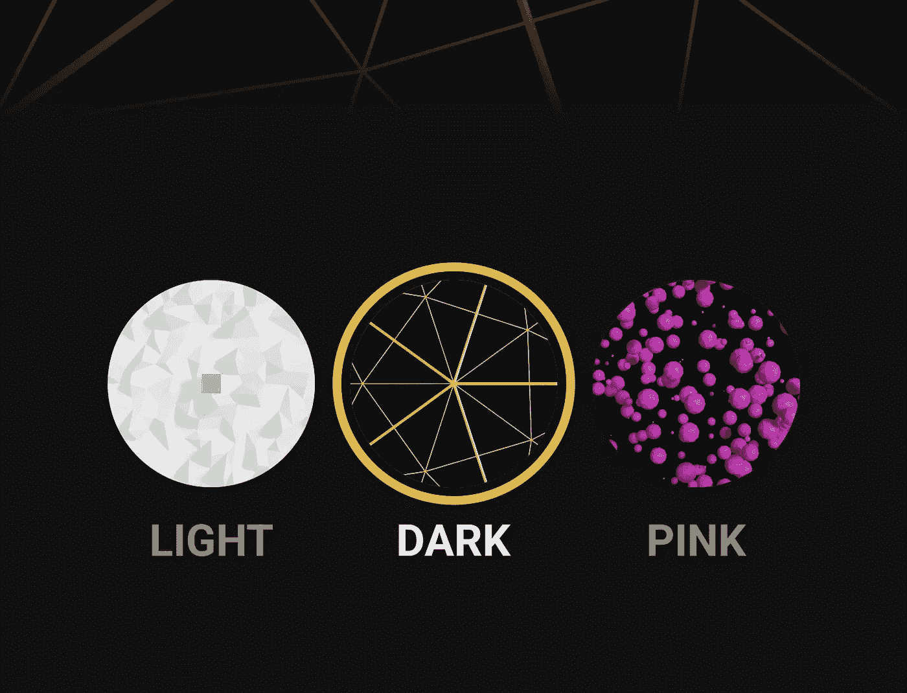
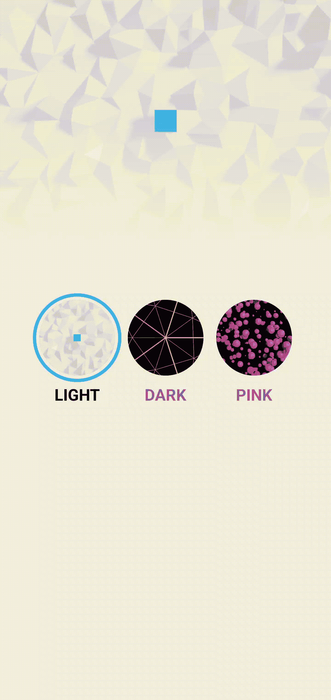

# Jetpack Compose 中的主题选择器动画

> 原文：<https://betterprogramming.pub/theme-picker-animation-in-jetpack-compose-9351a8f50969>

## 为你的用户提供定制的 Android 主题



Jetpack Compose 改进了我们在 Android 中处理主题的旧方法。它提供了很大的灵活性，这让我们在定义 UI 外观时有了更多的可能性。与此同时，compose 中的动画系统使我们能够轻松地创建更具雄心和愉悦的 UI 动画。在本教程中，我将结合这两者来创建一个切换主题的动画。最终结果将如下所示:


我们将使用`AnimatedContent`来实现这个动画。这是一个可组合的对象，它接受任何对象作为状态和内容来显示。每当该状态改变时，它就使用新的状态从以前的内容变成新的内容。

首先，我们需要定义一个对象作为包含所有当前主题数据的状态来传递。

```
data class CustomTheme(  
    val primaryColor: Color,  
    val background: Color,  
    val textColor: Color,  
    val image: Int,  
)  

val darkTheme = CustomTheme(  
    primaryColor = Color(0xFFE9B518),  
    background = Color(0xFF111111),  
    textColor = Color(0xffFFFFFF),  
    image = R.drawable.dark,  
)  

val lightTheme = CustomTheme(  
    primaryColor = Color(0xFF2CB6DA),  
    background = Color(0xFFF1F1F1),  
    textColor = Color(0xff000000),  
    image = R.drawable.light,  
)  

val pinkTheme = CustomTheme(  
    primaryColor = Color(0xFFF01EE5),  
    background = Color(0xFF110910),  
    textColor = Color(0xFFEE8CE1),  
    image = R.drawable.pink,  
)
```

在这里，我定义了一个数据类和三个具有独特颜色的主题。

现在我们可以实现`AnimatedContent`并使用这个对象作为状态。

```
[@ExperimentalAnimatio](http://twitter.com/ExperimentalAnimatio)nApi  
[@Composable](http://twitter.com/Composable)  
fun App() {  
    var theme by remember { mutableStateOf(lightTheme) }  
    AnimatedContent(  
        targetState = theme,  
        modifier = Modifier  
            .background(Color.Black)  
            .fillMaxSize(),  
    ) { currentTheme ->  
        Surface(  
            modifier = Modifier  
                 .fillMaxSize(),  
            color = currentTheme.background  
 ) {  
            Box {  
                Box(  
                    modifier = Modifier  
                        .fillMaxWidth()  
                        .height(300.dp)  
                ) {  
                    Image(  
                        painter = painterResource(id = currentTheme.image),  
                        contentDescription = "headerImage",  
                        contentScale = ContentScale.Crop,  
                    )  
                    Box(  
                        modifier = Modifier  
                            .fillMaxSize()  
                            .background(  
                                brush = Brush.verticalGradient(  
                                    colors = listOf(  
                                        Color.Transparent,  currentTheme.background.copy(alpha = .2f),  
                                        currentTheme.background  
                                    )  
                                )  
                            )  
                    )  
                }  

                Row(  
                    modifier = Modifier  
                        .align(Alignment.Center),  
                    horizontalArrangement = Arrangement.Center,  
                    verticalAlignment = Alignment.CenterVertically,  
                ) {  

                    ThemeButton(  
                        theme = lightTheme,  
                        currentTheme = currentTheme,  
                        text = "Light",  
                    ) {  
                        theme = lightTheme  
                    }  

                    ThemeButton(  
                        theme = darkTheme,  
                        currentTheme = currentTheme,  
                        text = "Dark",  
                    ) {  
                        theme = darkTheme  
                    }  

                    ThemeButton(  
                        theme = pinkTheme,  
                        currentTheme = currentTheme,  
                        text = "Pink",  
                    ) {  
                        theme = pinkTheme  
                    }  
                }  
            }  
        }  
    }  
}
```

状态`theme`已经被初始化并传递给`AnimatedContent`。在内容中，`currentTheme`被传入用于主题化我们的用户界面。

注意，我们应该使用这个而不是`theme`，这样当状态改变时，先前的内容不会立即切换到新的主题。

有一个简单的 UI，定义了一个标题图像和三个按钮，可以在可用的主题之间切换。在这一点上，我们将有一个动画看起来像这样:



这是`AnimatedContent`自带的默认动画。

没关系，但我们需要改变这一点，以便在最终动画中实现圆形显示动画。

```
transitionSpec = {  
    fadeIn(  
        initialAlpha = 0f,  
        animationSpec = tween(100)  
    ) with fadeOut(  
        targetAlpha = .9f,  
        animationSpec = tween(800)  
    ) + scaleOut(  
        targetScale = .95f,  
        animationSpec = tween(800)  
    )  
}
```

这是我们需要传入`AnimatedContent`的自定义动画。新内容几乎会立即淡入，而旧内容会在较长时间内发生微妙的淡入和缩放。新的内容有一个快速淡入，这样我们就可以立即开始显示动画。当在`AnimatedContent`中改变状态时，新的内容是一个新的可组合内容，因此它触发自己的`LaunchedEffect`。我们将从这里开始播放动画，并使用该值在新内容上播放一个循环剪辑。

```
...
var theme by remember { mutableStateOf(pinkTheme) }  
var animationOffset by remember { mutableStateOf(Offset(0f, 0f)) }
AnimatedContent(  
    ...
) { currentTheme ->val revealSize = remember { Animatable(1f) }  
    LaunchedEffect(key1 = "reveal", block = {  
        if (animationOffset.x > 0f) {  
            revealSize.snapTo(0f)  
            revealSize.animateTo(1f, animationSpec = tween(800))  
        } else {  
            revealSize.snapTo(1f)  
        }  
    })  

    Box(  
        modifier = Modifier  
   .fillMaxSize()  
            .clip(CirclePath(revealSize.value, animationOffset))  
    ) {  
        Surface(
...
```

`animationOffset`状态定义了圆动画的原点在哪里。这将稍后在`ThemeButton`中设置。`revealSize`制作剪辑新内容的圆圈的动画。

在`LaunchedEffect`中，如果我们有一个有效的原点，我们开始圆形剪辑动画。如果没有，这意味着这是我们刚打开这个屏幕时的第一次重组，所以我们只是将动画捕捉到结尾。

接下来，我们用一个盒子把`Surface`包起来。

请注意，所使用的形状是自定义的。原因是默认的`CircleShape`只是一个半径很大的圆角矩形，我不能用它来达到我想要的效果。

```
class CirclePath(private val progress: Float, private val origin: Offset = Offset(0f, 0f)) : Shape {  
    override fun createOutline(  
        size: Size,  
        layoutDirection: LayoutDirection,  
        density: Density  
 ): Outline {  

        val center = Offset(  
            x = size.center.x - ((size.center.x - origin.x) * (1f - progress)),  
            y = size.center.y - ((size.center.y - origin.y) * (1f - progress)),  
        )  
        val radius = (sqrt(  
            size.height * size.height + size.width * size.width  
        ) * .5f) * progress  

  return Outline.Generic(  
            Path().apply {  
                addOval(  
                    Rect(  
                        center = center,  
                        radius = radius,  
                    )  
                )  
            }  
        )  
    }  
}
```

形状`CirclePath`接受一个浮点，它定义了目前为止的进度和动画的原点。

这两者和大小用于创建覆盖整个内容的圆形显示动画。

最后要做的事情是定义单击按钮时动画的原点。这个值在`ThemeButton`中，当点击一个按钮时被传递。

```
[@Composable](http://twitter.com/Composable)  
fun ThemeButton(  
    theme: CustomTheme,  
    currentTheme: CustomTheme,  
    text: String,  
    onClick: (Offset) -> Unit,  
) {  
    val isSelected = theme == currentTheme  
 var offset: Offset = remember { Offset(0f, 0f) }  
    Column(  
        horizontalAlignment = Alignment.CenterHorizontally  
 ) {  
        Box(  
            modifier = Modifier  
    .onGloballyPositioned {  
                    offset = Offset(  
                        x = it.positionInWindow().x + it.size.width / 2,  
                        y = it.positionInWindow().y + it.size.height / 2  
     )  
                }  
                .size(110.dp)  
                .border(  
                    4.dp,  
                    color = if (isSelected) theme.primaryColor else Color.Transparent,  
                    shape = CircleShape  
    )  
                .padding(8.dp)  
                .background(color = theme.primaryColor, shape = CircleShape)  
                .clip(CircleShape)  
                .clickable {  
                    onClick(offset)  
                }  
        ) {  
            Image(  
                modifier = Modifier.fillMaxSize(),  
                painter = painterResource(id = theme.image),  
                contentDescription = "themeImage",  
                contentScale = ContentScale.Crop,  
            )  
        }  

        Text(  
            text = text.uppercase(),  
            modifier = Modifier  
                .alpha(if (isSelected) 1f else .5f)  
                .padding(2.dp),  
            color = currentTheme.textColor,  
            fontWeight = FontWeight.Bold,  
            fontSize = 20.sp  
        )  
    }  
}
```

这里是`ThemButton`的定义。如您所见，单击按钮时会发送按钮的中心偏移量。

然后，我们可以将它设置为圆显示动画的原点，如下所示:

```
ThemeButton(  
    ...  
) {  
    animationOffset = it  
    theme = lightTheme  
}  

ThemeButton(  
    ...
) {  
    animationOffset = it  
    theme = darkTheme  
}  

ThemeButton(  
    ... 
) {  
    animationOffset = it  
    theme = pinkTheme  
}
```

仅此而已。我们现在有一个自定义的主题选择器动画，肯定会让我们的用户高兴。完整的源代码可以在[这里](https://github.com/sinasamaki/ThemeChooser/tree/master)找到。

感谢阅读，祝你好运！

```
**Want to Connect?**Originally published at [https://sinasamaki.com](https://sinasamaki.com/post/2022-02-28-theme-picker/).
```