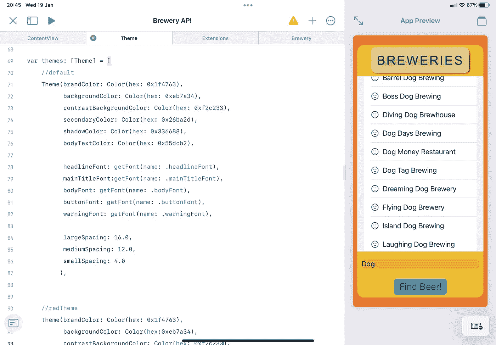
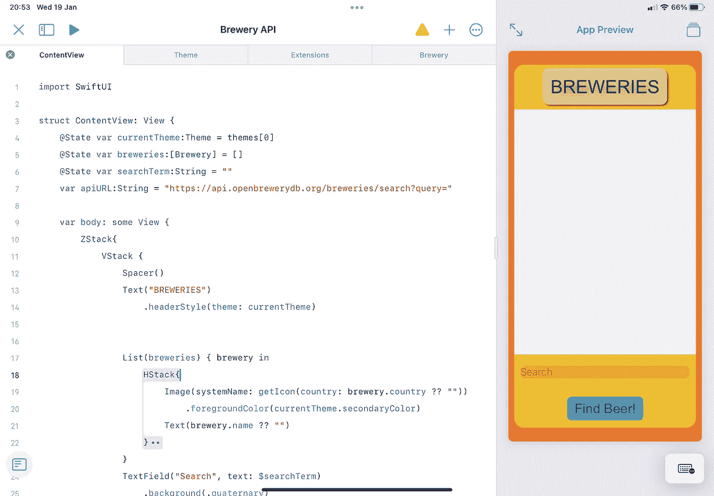

# SwiftUI 中的主题、元素和结构

> 原文：<https://betterprogramming.pub/themes-elements-structure-in-swiftui-ac83652b5856>

## 创建可重用元素和自定义视图修改器

Kelly sik kema-Unsplash 提供的照片

当我开始编写一个应用程序时，我通常从主视图和关键组件开始。在我进行的过程中，我将向元素中添加一些修饰符，以给出应用程序的感觉(以及进度感)。

问题来了，不久之后，我为一个简单的视图生成了一个长达数百行的 SwiftUI 文件，因为我为每个元素单独声明了修饰符。一个文本标签最多可以有七个修饰词来使它看起来更漂亮。接下来，我想精简我的 UI 外观，调整间距、颜色和大小。这包括检查每一个修饰符并改变静态值。一定有更简单的方法…

# 集中主题和视图修改器

Xcode 有一个很好的管理颜色资源的系统，但是它不是最直观的，而且只能在 Xcode 上访问。

在 iPad 上使用 Playgrounds 4，你需要手动管理颜色。让我们再详细阐述一下。主题不仅仅是颜色。是的，这是一个不错的定制入口，但实际上一个主题还应该包含尺寸、字体、阴影、圆角半径、字距等等。

当你在设备上从亮模式切换到暗模式时，你会看到设计中的微妙之处，让应用程序在视觉上更令人愉悦，这正是主题所需要的。当使用较深的颜色时，文本的字距调整在视觉上更令人愉快。所以让我们来看看如何适应这一点。

首先，想想你想在你的应用程序中声明什么。从颜色开始，因为这是我们可能想要提供差异的第一件事。

对于以下内容，创建一个`Theme.swift`文件来放置以下代码。

首先为我们的主题声明一个类，首先声明所有的颜色:

为了帮助解决这个问题，我使用了一个扩展来允许我输入十六进制值。这真的不是必需的，但是我发现它有助于在使用多种颜色时保持代码整洁。稍后您将看到如何使用它。

理想情况下，这将是广泛的，但在大多数情况下，你的应用程序不会有超过 7 或 8 种颜色需要定义。

接下来，考虑你的应用程序中可能需要的各种字体。它可能只是 4 或 5 种不同的字体(包括你想要引用的大小:标题、页眉、正文、按钮文本、警告)。

现在我们可以简单地在我们的主题类中定义每一个，但是我们可能希望从一个地方更新所有主题的字体或大小。为此，我们创建一个枚举来定义我们的字体。

这样，我们可以将我们的字体添加到主题类中:

为了结束本次演示，我们将添加一些有用的属性，如间距值。当我们想要定义填充的值时，这将被引用。我通常坚持 8 的网格。小的是 8，中的是 16，大的是 24。

向类中添加一些初始化器，这就产生了成品:

现在，我们在一个地方有很多设计参数。你会注意到我们创建了一个类，而不是一个结构。这是因为我们希望能够让类符合`@ObservableObject`。你很快就会明白为什么。

所以接下来我们需要一个存储所有不同主题的地方，以及一个获取`selectedTheme`的 enum。

仍然在同一个`Theme.swift`文件中，创建一个数组来保存主题数据:

这里没有做什么特别的事情，但是它可以很快地引用参数来更新各种主题。确保您用`themeName`注释此处的数据，以便参考。

然后，我们希望将它添加到一个枚举中，这样我们就可以选择要使用的主题:

每次我们添加一个新的主题到我们的主题数组中，我们必须用主题名更新枚举。这就是我们`Theme.Swift`文件中声明的一切。完整的代码如下所示:

那么我们如何利用这一点呢？嗯，在我们的`ContentView`(或任何其他视图)中，我们有一个变量来存储我们的`currentTheme`和一个函数来改变它。就这么简单。同样，每当添加新主题时，`changeTheme`也需要添加案例。这只是引用了`themes`数组中主题的索引:

因为我们用`@State`定义了我们的`currentTheme`，每当它被改变时，我们视图的其余部分都会被刷新。作为奖励，我们还可以添加`withAnimation`，这样它会淡入新的外观，对眼睛来说更容易一些。

实际上，用户可以从一个下拉菜单中选择一些预定义的主题，但我是为了上下文才这么做的。

有了所有这些，我们可以查看我们的预览，并开始从一个 Swift 文件改进我们的应用程序的外观。如果我们想在全球范围内改变标题字体，我们可以这样做。

这里的强大之处在于，您可以为每个页面使用一个标题，因此它可以在多个视图中使用，但是我们仍然可以从一个地方修改它。或者为此在主题中定义一种新的字体。

下面是一个例子，说明创建一个`View`并从一个地方修改一切是多么容易。

# 可重用元素和自定义修饰符

还有另一种方法可以利用集中化，那就是确定在整个应用程序中重复使用的关键设计元素。

除了在`ContentView`主体中存在多个修改器，您可以为这些视图定制修改器以应用多个修改。

我们要做的第一件事是定义一个`ViewModifier`并声明我们想要应用于视图的所有不同的修饰符。这里可能有很多。为了使这个作品符合我们的主题，我们将`currentTheme`传递给它作为参考。通过这样做，我们可以引用`currentTheme`的字体和颜色，如果`currentTheme`改变，这些将会刷新。

然后我们简单地通过添加一个函数作为`View`的扩展来调用它。要使用它，我们只需在内容视图中放置一个修饰符:`.headerStyle(theme: currentTheme)`

这样做的好处是我们可以从一个地方修改多个视图，而且我们的`ContentView`更加简洁易读。

现在花时间考虑这个问题，为主题设计一个好的工作系统，将有助于加速 UI 的改进，从而产生一个完美的产品。您还可以使用它来启用应用程序中的辅助功能，例如更大的字体大小。或者根据设备或屏幕分辨率调用不同的主题。

上面的演示展示了如何使用它，但是很明显，有更多的参数可以集中和定制，例如阴影，圆角半径，甚至条件格式。可能性是无限的。