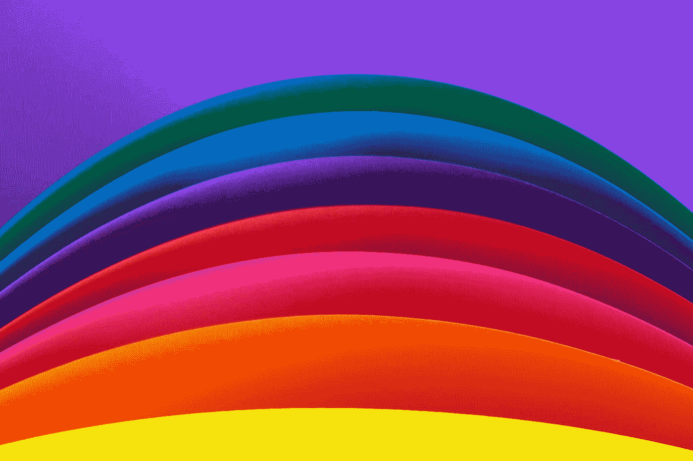
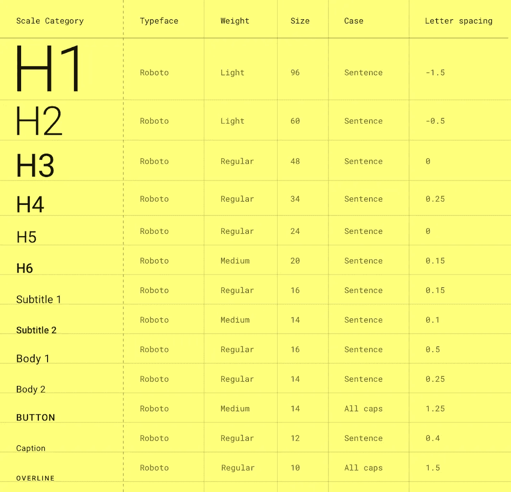

# Android 版 Jetpack 组合中的主题

> 原文：<https://betterprogramming.pub/theming-in-jetpack-compose-for-android-667d42b8279c>

## 处理颜色、版式和形状



丹尼尔·利维斯·佩鲁西在 [Unsplash](https://unsplash.com?utm_source=medium&utm_medium=referral) 拍摄的照片。

在本文中，您将了解如何为使用 [Jetpack Compose](https://developer.android.com/jetpack/compose) 构建的应用程序实现主题化。Compose 中的主题有三个主要方面:颜色、字体和形状。在本文结束时，您将学习如何创建和使用这三个工具。

*注意:Jetpack Compose 最近已转移到测试版。这意味着 API 结构将不再有任何剧烈的变化。因此，这将是学习如何使用下一代 UI 套件进行 Android 开发的大好时机。从主题开始是一个完美的起点，所以好好享受这篇文章吧。*

*需要安装 Android Studio Canary，北极狐(2020 . 3 . 1)***版本才能使用 Jetpack Compose Beta。**

# *介绍*

*在传统的 UI 套件(即基于视图/XML 的布局)中，我们通常使用`themes.xml`文件来设计主题。但是当涉及到 Jetpack Compose 时，一切都将在 Kotlin 文件中完成。*

*与传统主题相比，Jetpack 编写主题主要有两个优点。*

1.  *与传统方法相比，实现自定义主题或日夜主题选项要简单得多。*
2.  *Jetpack Compose 中的主题是基于材料设计的，所以我们在 Jetpack Compose 中使用主题时不再需要担心遵循材料设计准则。*

*如果你喜欢 Kotlin，那么你会喜欢在 Jetpack Compose 中使用主题。Kotlin 的命名参数、lambda 函数、默认参数值和其他很酷的特性使得在 Compose 中实现主题化变得很有趣。*

# *关键领域*

*当涉及到 Compose 中的主题化时，有三件重要的事情需要关注:颜色、字体和形状。每个区域都有其重要性，所以我们将学习如何一个一个地详细创建它们。最后，我们将在我们的作曲主题中使用它们。*

# *颜色；色彩；色调*

*说到主题，颜色是最需要关注的方面。在传统的主题化方法中，我们会在白天和夜晚的片段中维护一些颜色资源文件。这是一个不错的方法，但是在实现定制主题时，我们必须编写大量代码。*

*Compose 主要致力于使用来自`androidx.compose.material`库的`Colors`类以简洁的方式设计多个主题。*

## *如何定义颜色*

*我们可以使用来自`androidx.compose.UI.graphics`的`Color`在 Jetpack Compose 中定义一种颜色。看一看:*

```
*val *Purple200* = *Color*(0xFFBB86FC)*
```

*`0xFF`代表颜色的 alpha 状态，而`BB86FC`代表颜色的十六进制代码。*

*我们还可以使用 RGB 值来创建颜色:*

```
*val *redColor* = *Color*(red = 256, blue = 0, green = 0, alpha = 0xFF)*
```

## *设计调色板*

*为实现昼夜主题，作曲自带了`lightColors` 和`darkColors` 扩展了**`Colors`类。`Color`类有 12 个参数来定义在整个应用程序中所有可组合函数上使用的颜色。让我们看看`Colors`类的构造函数:***

***每个参数代表材质主题中使用的相应颜色。在本文中，我们将关注最重要和最常用的颜色，如`primary`、`primaryVariant`、`secondary`、`background`、`surface`和`onSurface`。首先，让我们了解一下这些颜色在材料主题中的含义:***

*   ***`primary`:应用程序屏幕和组件中最常显示的颜色。`primary`代表您在应用程序中的品牌颜色。***
*   ***`primary variant`:颜色`primary`的色调变化。***
*   ***`secondary`:用于表示应用中的二级品牌颜色。***
*   ***`background`:根和可滚动内容后面出现`background`颜色。***
*   ***`surface`:应用于卡片、菜单等表面组件的颜色。***
*   ***`onSurface`:在表面颜色之上绘制时，通过文本/图标可访问性指南的颜色。***

***在创建调色板之前，我们需要定义颜色。创建一个 Kotlin 文件并将其命名为`Colors`。在文件中，定义所有需要的颜色。可以把它想象成传统的昼夜颜色资源文件的组合。看看简单的颜色文件:***

***现在我们需要创建两个调色板: `LightColorPalette` 和`DarkColorPalette` *。首先，创建一个名为`Themes`的 Kotlin 文件，并在这里添加你的调色板*。*看看:****

# *排印*

*`Typography`是一个类，它提供了一种定义字体样式的方法，可以在整个应用程序中重用。它提供了应用不同样式方面的灵活性，如字体系列、字体粗细、行高、字体大小等等。默认情况下，材质主题具有以下值:*

**

*来源:[材料设计](https://material.io/blog/design-material-theme-type)*

*使用`Typography`类构造函数，我们可以将任何`textstyle`从`H1`更改为`overline`。我们也可以通过更新`fontFamily`属性在每个`textstyle`上使用不同的字体。*

*为了定义我们的排版，我们应该创建一个名为`AppTypography`的 Kotlin 文件，然后在一个排版对象中定义所有的文本样式:*

# *形状*

*您在应用程序中使用的任何形状都可以在一个`shapes`对象中定义，以便在不同的地方重用它。一个常见的用例是具有不同圆角半径或按钮形状的圆角布局。任何圆形、方形、三角形等。可以认为是一种形状。*

*与传统形状不同，在 Jetpack Compose 中创建形状非常简单。首先，我们需要创建一个 Kotlin 文件并将其命名为`Shapes`。在这个文件中，创建一个类型为`Shapes`的名为`AppShapes`的对象，然后定义应用程序中需要的所有形状。看一看:*

```
*val *AppShapes* = Shapes(
    small = *RoundedCornerShape*(4.*dp*),
    medium = *RoundedCornerShape*(6.*dp*),
    large = *RoundedCornerShape*(8.*dp*)
)*
```

*您可以根据自己的需求声明任何形状。为了简单起见，我们只使用了`RoundedCornerShape` *。我们已经完成了形状的定义。在下一节中，您将看到如何在`MaterialTheme`中使用它们。**

# *材料主题*

*我们已经完成了颜色、字体和形状的创建。现在是时候创建一个自定义`MaterialTheme`并使用我们创建的所有资源了。作为最佳实践，开发人员创建一个带有两个参数的可组合函数:`isDarkTheme`和`content`。*

1.  *`isDarkTheme`:布尔型参数，默认值为`isSystemInDarkTheme()`。从它的名字，你就能明白它的用途。*
2.  *`content`:这是一个需要通过应用材质主题来显示的可组合功能。*

*在函数内部，我们需要根据主题定义颜色(即暗模式或亮模式)。然后我们需要使用`MaterialTheme`对象来应用颜色、字体和形状。看一看:*

*我们已经完成了主题化部分。*

# *应用主题*

*要给任何组件充气，我们需要使用`setContent`函数。在函数内部，我们需要定义`AppTheme`并在`theme` lambda 中声明应用程序内容。为了更好地理解，请看一下代码:*

# *奖金*

*要了解有关 JetPack Compose 的更多信息，请查看以下文章:*

*   *[“Jetpack 合成组件(第 1 部分)”](/jetpack-compose-components-part-1-a80717dbfb59)*
*   *[“Jetpack Compose——一种在 Android 中创建素材 UI 的简单新方法”](https://medium.com/better-programming/jetpack-compose-a-new-and-simple-way-to-create-material-ui-in-android-f49c6fcb448b)*
*   *[“使用服务器驱动的用户界面构建 JetPack”](https://medium.com/android-dev-hacks/jetpack-compose-with-server-driven-ui-396a19f0a661)*
*   *[“Jetpack Compose:如何构建消息应用程序”](https://medium.com/better-programming/jetpack-compose-how-to-build-a-messaging-app-e2cdc828c00f)*

*目前就这些。希望你学到了有用的东西。感谢阅读。*