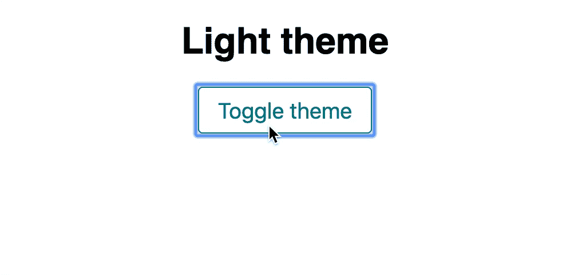

# 主题与 CSS 变量反应

> 原文：<https://betterprogramming.pub/theming-react-with-css-variables-bb9efd5f1918>

## 如何使用 CSS 自定义属性和钩子来主题化 React 应用程序


约翰·施诺布里奇在 [Unsplash](https://unsplash.com/search/photos/computer?utm_source=unsplash&utm_medium=referral&utm_content=creditCopyText) 上拍摄的照片

你可能认为你需要使用像 JS 中的 CSS 这样的库，或者像 [PostCSS](https://postcss.org/) 或 [SASS](https://sass-lang.com/) 这样的后处理器来为你的应用程序设置主题。感谢 CSS 变量，你没有！

CSS 变量在除 IE 11 之外的所有主流浏览器中都受[支持](https://caniuse.com/css-variables)。如果你需要支持 IE 11，你不应该在没有退路的情况下使用它们。在这种情况下，我建议使用 [PostCSS 自定义属性](https://github.com/postcss/postcss-custom-properties)，或者 JS 库中的 CSS，如 [styled-components](https://www.styled-components.com/) 或 [emotion](http://emotion.sh) 。

# 入门指南

一如既往，先从`create-react-app`说起。我们可以如下引导我们的新应用程序:

```
npx create-react-app css-theming
```

对于这个演示，我们不需要安装任何其他依赖项。`React`、`react-dom`、`react-scripts`就够了。

在您最喜欢的编辑器中打开新应用程序。

让我们从在`App.css`中声明一些 CSS 变量开始。

```
:root {
  --color-surface: white;
  --color-solid: black;
  --color-primary: teal;
}
```

接下来，我们为我们的应用程序创建一些基本样式。注意我们是如何使用语法`var(--variable-name)`消费变量的。如果您习惯于使用 [PostCSS 自定义属性](https://github.com/postcss/postcss-custom-properties)，您应该对此很熟悉。

最后，让我们修改我们的`App.js`来包含我们的按钮。

我们准备使用 JavaScript 来修改我们的自定义属性。

# 用 JavaScript 修改自定义属性

修改自定义属性的语法非常简单。

## 获取变量值

```
window
  .getComputedStyle(document.documentElement)
  .getPropertyValue("--color-surface");
```

## 设置变量值

```
document
  .documentElement.style.setProperty("--color-surface", "black");
```

现在我们知道了如何使用 JavaScript 操作 CSS 变量，让我们在应用程序中尝试一下吧！

我们首先创建两个包含主题属性名称和值的 JavaScript 对象。

接下来，我们使用`useState`修改应用程序的渲染功能来切换其主题。我们跟踪当前的主题，并在`onClick`处理程序中更新它。

然后我们创建一个函数来更新我们的 CSS 变量。

在这个函数中，我们使用 JavaScript 来更新我们的 CSS 自定义属性，以匹配相应的主题对象的值。

最后，我们在按钮的`onClick`处理程序中添加了对`applyTheme`函数的调用。

```
const onClick = () => {
  const nextTheme = currentTheme === "light" ? "dark" : "light";
  setTheme(nextTheme);
  applyTheme(nextTheme);
};
```

现在，我们已经创建了一个可以使用 JavaScript 配置的主题。让我们看看它的实际效果。



我可能不会因为这个设计获得任何奖项，但至少它像预期的那样工作。

# 添加测试

作为开发人员，我们的工作还没有完成，直到我们添加了足够的测试覆盖率。让我们开始用`[testing-library](https://github.com/testing-library/react-testing-library)`编写一些基本的测试。

在这里，我们测试当应用程序启动时，它默认为 light 主题，并在文档中显示文本“light theme”。

接下来，我们点击按钮来切换主题，并测试以确保我们的应用程序中的文本更新。

虽然这些测试很好，并且提供了一些价值，但是它们不能确保我们的 CSS 变量已经改变。

为了测试这一点，让我们模拟一个我们用来设置 CSS 变量的方法。

我们使用函数`document.documentElement.style.setProperty`并用一个`jest.fn()`模拟代替它。

在这里，我们测试以确保它被调用了三次。我们还进行了测试，以确保它是用我们的第一个 CSS 变量调用的。现在我们知道，当用户点击我们的*切换主题*按钮时，我们的应用程序将正确设置自定义属性。

# 结论

我们能够在几分钟内设置好主题，无需添加任何额外的依赖项，也无需更改我们的构建设置。

我们可以在整个 CSS 中使用这些变量，我们的 React 组件不需要知道它们。

最后，我们能够设置一些测试，让我们对应用程序的功能充满信心。

检查[代码沙箱](https://codesandbox.io/s/css-theming-pn0to)上的代码，查看它的运行情况。

[](https://codesandbox.io/s/css-theming-pn0to) [## CSS-主题化-代码沙盒

### 这个项目是用[Create React App](https://github . com/Facebook/Create-React-App)引导的。

codesandbox.io](https://codesandbox.io/s/css-theming-pn0to) 

感谢阅读！