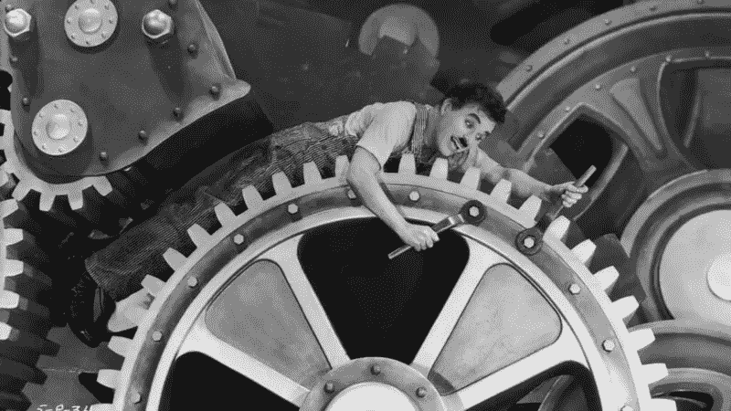

# 为什么系统思维很重要，工程经理应该关心它

> 原文：<https://betterprogramming.pub/there-is-always-a-system-16868e1e1a3f>

## 总有一个系统

我一直在[讨论如何在工程领导力](https://franciscomt.medium.com/leading-software-teams-with-systems-thinking-77e8e95055a6)中应用系统思维，作为其中的一部分，值得谈谈什么是系统思维，以及为什么它在软件开发中至关重要。

## 从头开始

系统思维是一个广泛的知识领域，通过理解所有部分如何相互联系和影响来解决问题。如果你是新手，可能没有比这里的[更好的起点了。](https://www.goodreads.com/book/show/3828902-thinking-in-systems)

这个理论并不新鲜，不同的行业已经应用了几十年。一个很好的例子是[丰田生产系统(TPS)](https://www.goodreads.com/book/show/376237.Toyota_Production_System) ，它重新定义了如何制造产品，专注于从采购到原材料的周期。

这在软件领域也是旧闻了。任何使用被认为是“敏捷”的工作方法的团队，比如 Scrum 或看板，都会受到相同思想的影响。至少理论上是这样。

总之，它几乎无处不在。不管是不是看得见，总有一个体系。每个执行常规活动的小组都将在特定的规则下工作。有些是正式的，被定义为过程，有些是非正式的，被定义为通过时间获得的习惯。包括你的团队。

## 我们都是机器上的齿轮吗？

即使这些概念已经影响了我们的工作，谈论它们也是有意义的，因为系统思维在技术领域名声不佳。这阻碍了经理们提高效率。

*对拉取请求进行最终更改*

人们通常担心透过系统镜头看会使工作失去人性。如果一切都是一个系统，我们是不是都只是做着相同日常工作的一部分？我们是否因为过度关注过程而扼杀了创新？

在现实中，通常会发生相反的情况。管理者无意中创造了无效的团队，因为他们没有将系统和流程作为团队中的头等大事，从而限制了每个人的工作。不管我们愿不愿意，大多数团队成员的个人表现都是由他们的系统决定的。

> “事实是，人们工作的系统和与人的互动可能占绩效的 90%或 95%。”(戴明)

不幸的是，对于管理者和团队来说，关注改善个人和他们的行为，而不关注产生结果的环境，这种情况仍然很普遍。这通常是浪费时间。

## 表现不佳的例子

在我的职业生涯中，一个非常熟悉的例子很好地说明了这一点:如何处理个人表现不佳的问题。

在许多情况下，当我开始管理团队时，我被警告个人表现不佳。在某些情况下，他们可能已经处于绩效管理过程中，这意味着这种情况已经影响了他们的职业生涯。

自然的行为是关注面临挑战的人。提供反馈并要求行为改变。但不幸的是，尽管这些态度可能会带来积极的结果，但它们通常不会持续很久。

我发现问自己和个人另一个问题更有益:“他们最初是怎么到这里来的？”他们的团队是如何工作的，他们在团队中是如何工作的？如果团队的目标是生产高质量的软件，他们从头到尾创建软件的系统是什么？

我找到的答案通常都很有趣。虽然并不总是这样，但在大多数情况下，还会有其他东西被破坏。例如，团队没有一个好的工作流程，较少终身任职的个人发现很难理解该做什么。或者团队没有很好地合作，留下了不太自信的工程师，因为他们不知道如何学习。

情况各不相同。令人兴奋的是，我可以通过围绕表现不佳的个人改进团队来提高个人表现。这是因为他们不是不正常的部分，但系统是。额外的好处是，这些变化也帮助了更广泛的团队。正如他们所说，双赢的局面。

## 经理们，关注系统

总之，注意你团队中的系统。作为一名领导者，你对工作如何运作有着个人贡献者所没有的观点。你有能力影响它，帮助每个人取得更好的成绩。

理解这些系统并不意味着你能够改变它们，或者你不能使它们适应你团队中的个人。但这确实意味着你将知道最好的杠杆，给你最好的成功机会。

*如果你觉得这个内容有趣，这篇文章是* [*领先软件团队与系统思维*](https://franciscomt.medium.com/leading-software-teams-with-systems-thinking-77e8e95055a6) *系列的一部分。更广泛的*、 [*我写的是关于领导有效的软件工程团队*](https://franciscomt.medium.com/) *。如果你对这个地区感兴趣，请跟我来。*